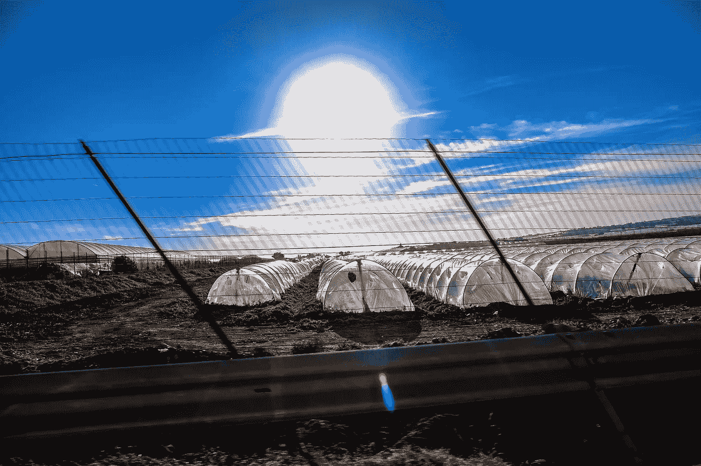

# 埃隆·马斯克的《太阳城》

> 原文：<https://medium.com/codex/elon-musks-solarcity-faa139ae137d?source=collection_archive---------7----------------------->

## 未来技术

## 这对特斯拉、世界和你意味着什么

弗朗西斯科·温加罗拍摄的照片:

# 埃隆·马斯克的《太阳城》

在大多数人的心目中，太阳能就是太阳能电池板的代名词。但远不止如此。这是未来能源如此重要的一部分，以至于它甚至被写进了科幻小说。