# EM 算法和高斯混合模型(GMM)

> 原文：<https://medium.com/codex/em-algorithm-and-gaussian-mixture-model-gmm-6ea5e0cf9d6e?source=collection_archive---------1----------------------->

## Python 中的示例实现

前言:本文旨在提供潜在主题的综合信息，不应被视为原创作品。这些信息和代码通过一些在线文章、研究论文、书籍和开源代码被重新利用。

# **简介**

期望最大化算法，简称 EM 算法，是一种在存在潜在变量的情况下进行最大似然估计的方法。EM 算法在 1977 年由 A. Dempster 和 D. Rubin 在《皇家统计学会杂志》上发表的一篇经典论文中被解释并命名。

**首先，让我们回忆一下聚类方法的类型:**

*   硬聚类:聚类不重叠(元素属于或不属于聚类)，例如 K-means、K-Medoid。
*   软聚类:聚类可能重叠(聚类和实例之间的关联强度)，例如使用期望最大化算法的混合模型。

GMM 聚类更灵活，但不一定比 K-means 更准确，因为您可以将其视为一种模糊或软聚类方法。软聚类方法为每个聚类的数据点分配一个分数。分值指示数据点与聚类的关联强度。与硬聚类方法相反，软聚类方法是灵活的，因为它们可以将一个数据点分配给多个聚类。当使用 GMMs 进行聚类时，得分是后验概率。

**混合车型:**

*   基于概率的软聚类方法
*   每个聚类:一个生成模型(高斯或多项式)
*   参数(例如，均值/协方差未知)

# GMM 在 Python 中的实现

完整的代码可以从 GitHub 上的 [Jupyter 笔记本中获得。](https://github.com/OksanaKalytenko/mediumposts/blob/main/EM_algorithm.ipynb)

让我们创建一个样本数据集，其中的点是从两个高斯过程之一生成的。第一个分布的平均值为 100，第二个分布的平均值为 90；我们分布的标准差分别是 5 和 2。

第一个流程我们会有 6 万分；第二个过程 50000 个点混合在一起。

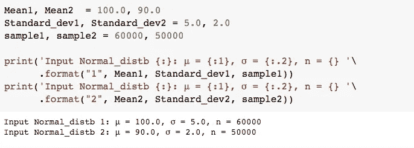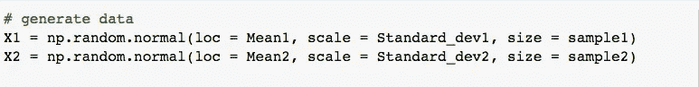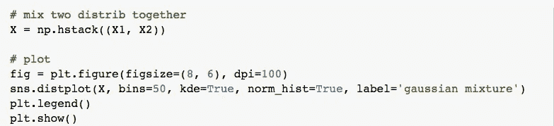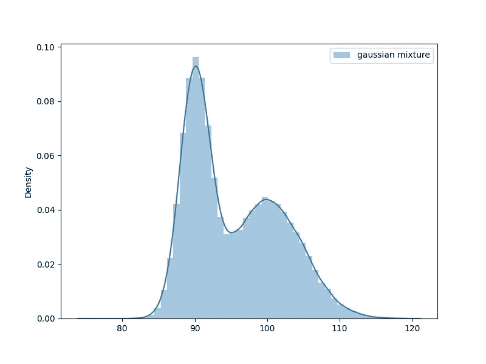

将这些过程混合在一起后，我们就有了我们在图上看到的数据集。我们可以注意到两个峰值:大约 90°和 100 °,但是对于峰值中间的许多点来说，它们来自哪个分布是不明确的。那么我们应该如何处理这个问题呢？

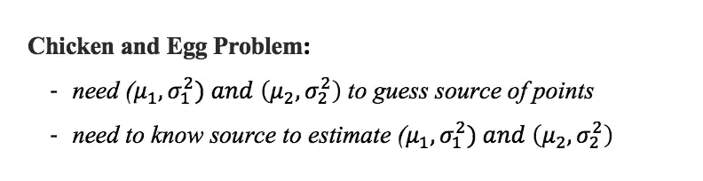

所以在这里，我们必须估计总共 5 个参数:

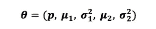

其中 p 是数据来自第一个高斯分布的概率，1-p 是数据来自第二个高斯分布的概率。

我们可以使用高斯混合模型，该模型将使用期望最大化算法(EM)来估计分布的参数。

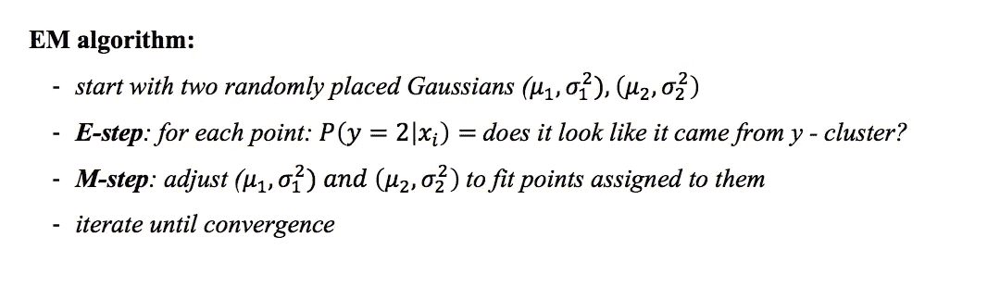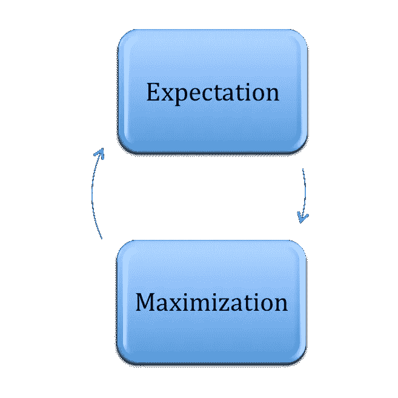

EM 在执行期望 E 步骤和最大化 M 步骤之间交替，期望 E 步骤通过包括潜在变量来计算可能性的期望，就像它们被观察到一样，最大化 M 步骤通过最大化在 E 步骤上找到的期望可能性来计算参数的最大可能性估计。在 M-step 上找到的参数然后被用于开始另一个 E-step，并且该过程被重复直到收敛。

在 sklearn 中，我们使用了 [GaussianMixture 类](https://scikit-learn.org/stable/modules/generated/sklearn.mixture.GaussianMixture.html)，它实现了 EM 算法来拟合混合高斯模型。

该类允许我们在定义模型时通过 *n_components* 参数来指定用于生成数据的潜在进程的可疑数量。我们将它设置为 2，因为我们有两个进程(或分布)。

如果流程的数量未知，可以测试一系列不同数量的组件，并选择最适合的模型，其中可以使用分数(如阿凯克或贝叶斯信息标准(AIC 或 BIC))来评估模型。

我们还可以通过许多方式来配置模型，以纳入我们可能知道的关于数据的其他信息，例如如何估计分布的初始值。在这种情况下，我们将通过将 *init_params* 参数设置为‘random’来随机猜测初始参数。

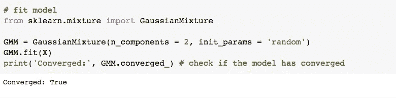

运行该示例将使用 EM 算法在准备好的数据集上拟合高斯混合模型。拟合后，该模型用于预测训练数据集中示例的潜在变量值。

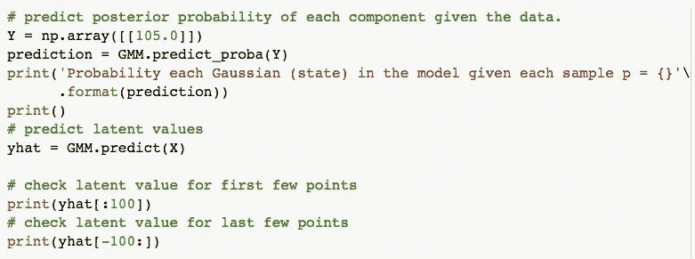

我们可以看到，至少对于数据集中的前几个和后几个示例，模型大多预测了潜在变量的正确值。方法 predict_proba()预测给定数据的每个分量的后验概率。在我们的例子中，点 105.0 属于每个高斯过程的概率是 0.501 和 0.499。

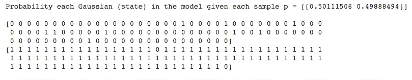

一般来说，k-means 和 EM 可能表现得更好或更差，这取决于我们想要聚类的数据的性质，以及我们定义好的聚类结果的标准。

对于多变量高斯分布，情况稍微复杂一些，如下所示:

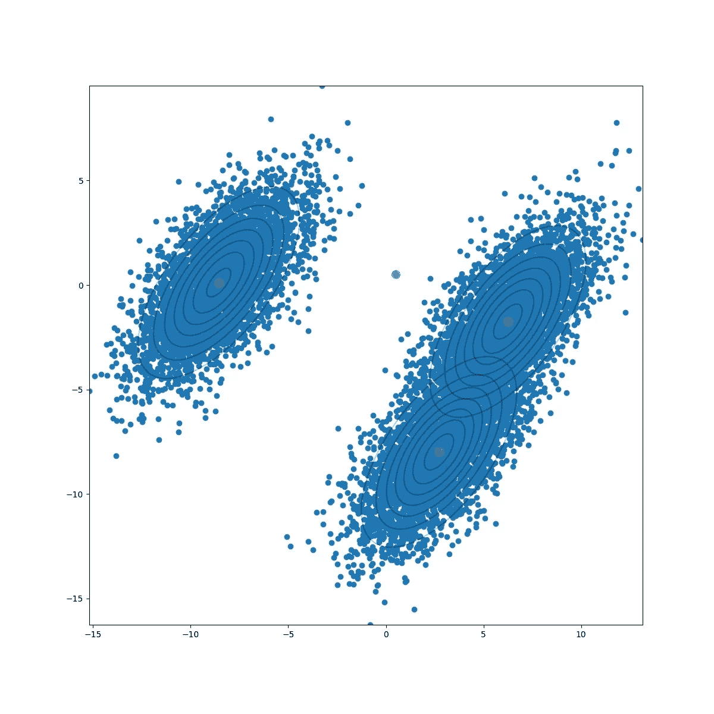

*   具有 *d* 属性的数据，来自 *k* 源
*   每个源 *c* 是一个高斯
*   迭代估计参数:

-之前来自来源 *c* 的实例百分比是多少？

- mean:来自源 *c* 的属性 *j* 的期望值

-协方差:源 *c* 中属性 *j* 和 *k* 的相关程度如何？

-基于:我们对每个实例来源的猜测

# EM 算法的应用

潜在变量模型在机器学习中有几个实际应用:

*   用于计算函数的**高斯密度**。
*   有助于在取样期间填写**缺失数据**。
*   用于寻找**潜变量**的值。
*   用于**医学和结构工程**领域的图像重建。
*   它在不同的领域有着广泛的用途，如自然语言处理、计算机视觉、计算机视觉等。
*   用于估计**隐马尔可夫模型**的参数，也用于其他一些混合模型，如**高斯混合模型**等。

# EM 算法的优缺点

**优点**

*   就实现而言，EM 算法的两个基本步骤，即 E 步骤和 M 步骤，对于许多机器学习问题来说通常是非常容易的。
*   M 步的解通常以封闭形式存在。
*   每次迭代后，可能性的值总是会增加。

**缺点**

*   它有**慢收敛**。
*   它对起点敏感，仅收敛于**局部最优**。
*   它不能发现 K(可能性随着聚类的数量而不断增长)
*   它同时考虑了向前和向后的概率。这与数值优化相反，数值优化只考虑**前向概率**。

# 参考资料:

期望最大化:工作原理——[https://youtu.be/iQoXFmbXRJA](https://youtu.be/iQoXFmbXRJA)

Python 中的计算统计学:期望最大化(EM)算法—[https://people.duke.edu/~ccc14/sta-663/EMAlgorithm.html](https://people.duke.edu/~ccc14/sta-663/EMAlgorithm.html)

无监督学习:聚类:高斯混合模型(GMM)——[https://www . python-course . eu/expectation _ maximization _ and _ Gaussian _ Mixture _ Models . PHP](https://www.python-course.eu/expectation_maximization_and_gaussian_mixture_models.php)

隐马尔可夫模型和贝叶斯网络简介—[http://mlg.eng.cam.ac.uk/zoubin/papers/ijprai.pdf](http://mlg.eng.cam.ac.uk/zoubin/papers/ijprai.pdf)

感谢阅读。*如果您有任何反馈，请随时对本文发表评论，在* [*LinkedIn*](https://www.linkedin.com/in/oksana-kalytenko-546515119/) *上给我发消息，或者给我发电子邮件【(oksanakalytenko@gmail.com】*