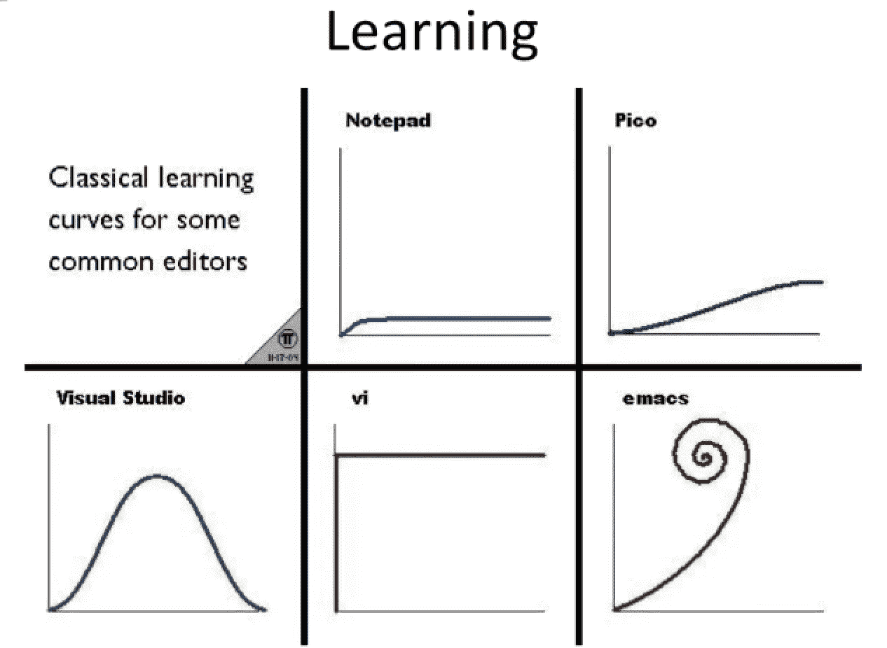

# Emacs Lisp

> 原文：<https://medium.com/codex/emacs-lisp-12b7afb286e9?source=collection_archive---------0----------------------->

## [法典](http://medium.com/codex)

图片来自 https://i.imgur.com/xjWucy4.png

# 概观

我在工作中使用 VSCode，在个人项目中使用 Neovim。很长一段时间，我一直在摆弄 Emacs 试用 [Spacemacs](https://www.spacemacs.org/) 、 [Doom Emacs](https://github.com/hlissner/doom-emacs) ，也从零开始定制配置点文件。

Emacs 不仅仅是一个文本/代码编辑器( [LSP](https://github.com/emacs-lsp/lsp-mode) ， [DAP](https://github.com/emacs-lsp/dap-mode) )。它是一个可扩展的计算环境，可以用作电子邮件客户端( [mu4e](https://www.emacswiki.org/emacs/mu4e) )、窗口管理器( [exwm](https://github.com/ch11ng/exwm) )…