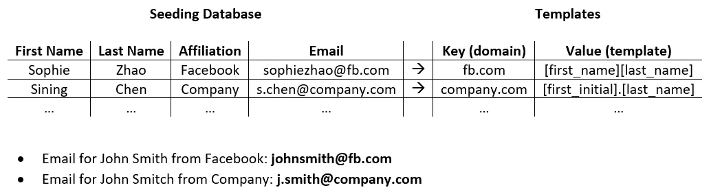

# 推断招聘和营销的电子邮件

> 原文：<https://medium.com/codex/email-tool-for-recruiters-and-marketers-25b7753938d5?source=collection_archive---------17----------------------->

## [法典](http://medium.com/codex)

导师:陈思宁


https://hipwallpaper.com/marketing-wallpapers/

# 介绍

Linkedin 允许招聘人员通过信息和电子邮件联系潜在的候选人。然而，这个工具不仅需要一个付费的招聘人员帐户，而且 Linkedin 上也不是每个人都提供他们的电子邮件。我想创建一个工具，从一个人的名字和隶属关系(公司/大学)推断出电子邮件地址。


【https://resources.workable.com/tutorial/recruiting-linkedin 

# 它是如何工作的

给定一个人的姓名和所属机构，我的工具将基于从已知电子邮件中获得的模板生成一封电子邮件。

例如，如果我是 sophiezhao@fb.com 脸书公司的一名员工，我的电子邮件看起来可能会像这样。我的 Python 代码会推断出[first_name][last_name]@fb.com 是脸书邮件的**模板**。然后，它将能够生成一封电子邮件的约翰史密斯作为 johnsmith@fb.com。注意邮件格式为 handle.domain(需要给我们公司的**域***fb.com*才能推导出**句柄** *johnsmith)。*

我们首先从已知的电子邮件(**播种电子邮件**)中推导出模板，这些模板保存在以我们个人联系人的电子邮件为起点的数据库中:



基于种子数据库从模板生成电子邮件的示例

为此，我使用了 Python 中的各种库和函数。首先，我使用了一个从 Gmail 下载的电子表格，其中包含了人们的姓名和电子邮件信息。这些数据需要在一个 **CSV** 文件中进行清理，以删除空条目和不存在的名称，如“通知”或“2293ef1a80fb00de1631299”接下来，我将这些数据保存到一个包含**个人资料**的字典中，该字典将每个人的信息映射到他们的电子邮件来自的**公司**。最后，Python 算法从这些配置文件中生成模板，并将它们映射到每个公司的电子邮件域。这些模板允许我假设一个人的电子邮件地址，只要我知道他们的名字和公司的域名。

# 正在清除种子数据库中的数据

Gmail 保存了我以前发过邮件的人的数据。通过将我的联系人导出到 Google CSV，我拥有了一个包含联系人姓名和电子邮件的电子表格。


从应用程序中导出 Gmail 联系人

但是，该文件没有每个用户的准确名称，许多条目是空的。原因有很多:谷歌没有所有人的所有可能信息，有些人会用化名，很多邮件来自销售或自动回复机。因此，**我需要清理数据，直到它只包含已知的全名、名、姓和电子邮件。**

我首先从 Gmail 中读取 CSV 文件中的原始数据。编码语句允许程序读取文件中的所有字符。

```
import csv
csv = csv.reader(open('Gmail-contacts', encoding='utf-8'))
```

我删除了数据的第一行，这是每一列的标签。然后，我编写了两个函数来检查 1)空条目和 2)非字母名称。

```
*#****checks if null value exists in row***def isNotNull():
    if row[0] != **''** and row[1] != **''** and row[2] != **''** and row[3] != 
    **''**:
        return True
    return False

*#****checks if first and last name are string***def rowIsString():
    if all(x.isalpha() or x.isspace() for x in row[0]) and
    row[1].isalpha() and row[2].isalpha():
        return True
    return False
```

为了删除别名或非真实姓名，我使用了 names_dataset 中的 NameDataset，它可以在下面的 github 页面中找到:【https://github.com/philipperemy/name-dataset

```
from names_dataset import NameDataset
n = NameDataset()
```

该数据集检查 Gmail 给出的名字和姓氏是否是现有的名字，而不是像“回复”或“通知”这样的词或像“2293ef1a80fb00de1631299”这样的随机字符串

```
#***checks if firstname is a known first name*** n.search_first_name(firstname)#***checks if lastname is a known last name*** n.search_last_name(lastname)
```

接下来，下面的代码使用这些清理函数在字典中生成人的配置文件。

```
profiles = [] #***list of dictionary of profiles*** domain_handle = {} #***dictionary that maps domains to handles***for row in csv: profile = {"name": row[0].lower(), "firstname": row[1].lower(), 
    "lastname": row[2].lower(), "email": row[3].lower(), "handle": 
    row[3].split("@")[0].lower(), "domain": row[3].split("@")
    [1].lower()} profiles.append(profile)
    domain = profile["domain"] #***mapping profiles to domains*** if domain in domain_handle.keys():
        domain_handle[domain].append(profile)
    else:
        domain_handle[domain] = [profile]
```

配置文件的示例:

```
#***dictionary containing a person's full name, first name, last name, and email information.***{"name": "sophie zhao",
"firstname": "sophie",
"lastname": "zhao",
"email": "sophiezhao@fb.com",
"handle": "sophiezhao",
"domain": "fb.com"}
```

以及 domain_handle 字典中的一个示例键值对:

```
#***mapping email domains to their profiles***{"fb.com":[{"name": "sophie zhao", "firstname": "sophie",
            "lastname": "zhao", "email": "sophiezhao@fb.com", 
            "handle": "sophiezhao", "domain": "fb.com"}, {"name": "sining chen", "firstname": "sining",
            "lastname": "chen", "email": "s.chen@company.com",
            "handle": "siningchen", "domain": "company.com"}]}
```

在将每个人的信息分类到这样的字典中之后，我可以继续为每个领域生成模板。

## 正在生成句柄模板

为了从每个电子邮件句柄生成一个模板，我按照字符类型来分隔句柄。这允许我根据句柄是字符串、特殊字符还是数字来分别识别句柄的每个部分。这使用 Python 的正则表达式(regex)库来分离不同类型的字符。

```
import redef chartype(char): #***checks if char is in the alphabet* **    if re.findall("[a-zA-Z]", char.lower()):
        return "string" #***checks if char is any of the listed special characters* **    elif char in "!#$%&'*+-/=?^_`{|}~.":
        return "special" #***otherwise, char is a number* **    else:
        return "num"
```

当我遍历句柄时，它会在两个相邻字符的字符类型不同的地方进行拆分。

```
split_handle = [] #***list of handle parts split by character type***for i in range(len(handle) - 1):
    if chartype(handle[i]) != chartype(handle[i + 1]):
        split_handle.append(handle_copy[start:i + 1])start = i + 1
split_handle.append(handle_copy[start:])
```

示例:

sophie.zhao → [“苏菲”，“.”，“赵”]

sophiezhao70 → ["sophiezhao "，" 70"]

我现在可以单独处理手柄的每个部分来创建模板。电子邮件句柄的每个部分可以是字符串、特殊字符或数字。

**案例一:手柄部分是一根绳子**

我假设句柄中的字符串是由这个人的名字、姓氏、两者或他们名字的一部分组成的。因此，模板需要反映每个名字在句柄中有多少个字符以及顺序。

苏菲·赵的例子:

Handle: **zsoph** →姓氏的 1 个字母，名字的 4 个字母

模板:[["姓氏"，1]，["名字"，4]]

句柄:**赵** →姓氏全称(使用长度 0)

模板:[["姓氏"，0]]

我用了两个函数来推导字符串的模板。

1. **num_match(haystack，needle)** 在一个较长的字符串 *haystack 中查找子字符串 *needle* 。*该函数将返回存在于句柄部分的名字的长度。我会发现在 *zsoph* 中有 4 个字母 *sophie* 。注意，这个函数假设我们只取干草堆的第一部分。我做这个假设是基于电子邮件通常不使用名字的中间或结尾作为句柄(更有可能是 *zsoph* 而不是 z *phie* )。

```
def num_match(haystack, needle):
    if needle[0] in haystack:
        for i in range(len(needle)+1):
            needle_part = needle[:len(needle)-i+1]
            start = haystack.find(needle_part)
            if start > -1:
                return len(needle_part)
    return 0
```

2. **matchname(string)** 最后将字符串的识别部分按顺序添加到模板中。

```
def matchname(string):
    template = []
    match_len = num_match(string, profile["firstname"])
    #***checks if the part of the first name identified comes 
    before or after the part of the last name* **    if string[:match_len] == profile["firstname"][:match_len]:
        template.append(["firstname", match_len])
        template.append(["lastname", len(string)-match_len])
    else:
        template.append(["lastname", len(string) - match_len])
        template.append(["firstname", match_len])
    return template
```

**情况 2:手柄部分是特殊字符**

对于特殊字符，模板的相应部分将只是该特殊字符。

示例:

sophie.zhao → [["firstname "，0]，" "，["姓氏"，0]]

**情况 3:手柄部分是一个数字**

在处理数字时，我用“num”来表示句柄中有多少个数字。在生成未来的电子邮件时，num 值将被替换为 0。这是因为程序无法推断出这些数字的来源。这些数字可以用来区分不同姓名的人，或者只是随机的。所以，我干脆用 0 做占位符。

示例:

sophiezhao70 → [["名字"，0]，["姓氏"，0]，["数字"，2]]

下面的代码将句柄的每个部分翻译成它们在模板中相应的位置。

```
for element in split_handle: if chartype(element[0]) == "string":
        for i in range(len(matchname(element))):
            template.append(matchname(element)[i]) elif element[0] in "!#$%&'*+-/=?^_`{|}~.":
        template.append(element) else:
        template.append(["num", len(element)])
```

**补充说明:**如果算法找不到一个名字的实例，那么它的长度将是 0，所以我把它们去掉了。此外，如果名字的一部分实际上是完整的名或姓，我将长度替换为 0，以表示应该使用完整的长度。

一旦每个句柄被转换成模板并映射到相应的域，我就可以使用这些模板来生成新的电子邮件地址。

## 生成新电子邮件


[https://marketingland.com/7-email-trends-die-2016-160925](https://marketingland.com/7-email-trends-die-2016-160925)

生成一封电子邮件的先决条件是要有这个人的名字，姓氏和公司的电子邮件域。假设我有一个域句柄的模板，我可以根据我所拥有的人名和域模板的信息简单地转换每个部分。

```
#***domain_template is a dictionary of templates mapped to domains***#***profile is where I would store the information of the person whom I'm generating an email for.***#***Generates all possible emails based on templates that exist for each domain***for template in domain_template[profile['domain']]: email_handle = "" for element in template:
        try:
            #***if part is a special character, simply add the 
            element to the handle*** email_handle = email_handle + element except:
            length = element[1]
            #***add 0s in instances of numbers* **            if element[0] == "num":
                email_handle = email_handle + "0"*length #***add full or parts of first and last names* **           elif length == 0:
                part = profile[element[0]]
                email_handle = email_handle + part else:
                part = profile[element[0]]
                email_handle = email_handle + part[:length] #***finally, add on given domain***
    email = email_handle + "@" + email_domain
```

全名约翰·史密斯的例子:

[["名字"，0]，" "，["姓氏"，0]]→john.smith@fb.com

[["姓氏"，2]，["名字"，4]，["数字"，2]]→smjohn00@fb.com

有了这个算法，我可以成功地根据人们的姓名和公司域名，生成他们的电子邮件地址的假设。

# 接通率

我的成功宣言中的关键词是“假设”。一路上，我做了许多假设，而且如果没有过多的信息和细节，我根本无法推断出电子邮件地址的因素。

我的电子邮件地址数据集包含 405 个可测试的电子邮件地址。我用这个数据集创建了模板，然后用相同的电子邮件地址测试模板，看看我是否能复制它们。

使用所有的邮件，我可以成功地复制出 **45.9%** 封邮件。

然后我只使用了以. edu 结尾的 131 封邮件，换句话说，我只测试了大学机构的邮件，这排除了带有 Gmail 和雅虎域名以及其他公司的个人邮件。

使用来自大学机构的电子邮件，成功率为 **48.1** %。


【https://clipartstation.com/steps-to-success-clipart-9/ 

虽然第二个成功率看起来差别不大，但它要准确得多。45.9%的第一成功率包括个人邮件。我的算法为每个域名存储了所有可能的模板，所以它为 Gmail 和 Yahoo 地址生成了许多模板。因此，虽然它可以成功地复制这些电子邮件，但正确的电子邮件将隐藏在十几个其他可能性中。另一方面。edu 的电子邮件格式较少变化，这使得成功率更有意义，在现实世界中可能更准确。

这导致我们进入我的程序的限制和假设。

# 限制和假设

虽然该程序可以成功地生成模板并复制不到 50%的电子邮件，但它存在以下假设和限制的缺陷。

## 1.多种可能性

如前所述，该程序根据我为每个域找到的模板为每个人生成可能的电子邮件。因此，我们实际上不知道哪个电子邮件是正确的。然而，如果你不介意通过电子邮件发送所有的可能性，这不是一个大问题，因为正确的可能就在其中。


[https://www.pngkey.com/detail/u2q8w7o0o0q8o0o0_dice-vector/](https://www.pngkey.com/detail/u2q8w7o0o0q8o0o0_dice-vector/)

## 2.任意数字

试图生成电子邮件的一个主要障碍是数字。由于确定一个人的电子邮件中数字的原因非常困难，有时甚至不可能，这就限制了模板。例如，如果约翰·史密斯的电子邮件是 johnsmith7@fb.com，数字 7 可能是随机的，约翰的偏好，或者基于生成脸书电子邮件的系统，但本质上我不知道 7 来自哪里。因此，成功率会因每个电子邮件模板而降低，包括需要用 0 替换的数字。

## 3.别名

尤其是对于私人邮件，一个人的邮箱地址也不一定反映他的真实姓名。这些案例包括像 magic.unicorn@gmail.com 这样的网络别名和像 j.m.smith@gmail.com 这样的名字变体，其中第一个“m”来自约翰的中间名，这一点没有被考虑在内。具体到我的数据，有很多邮件使用了一个人的本名，而 Gmail 只给了我他们的英文名。这些都是导致算法不准确的问题。

# 摘要

最终，对于那些电子邮件纯粹由一个人的名字、姓氏和特殊字符组成的公司和直觉来说，我的程序取得了巨大的成功。然而，由于电子邮件的复杂性，该计划的成功率下降。这个故事展示了我在 Linkedin 的招聘工具的启发下推断电子邮件的尝试。


[https://www.pngkey.com/detail/u2q8w7o0o0q8o0o0_dice-vector/](https://www.pinclipart.com/maxpin/TRxbT/)

# 后续步骤

理想情况下，一个 web 应用程序将接受一个人的全名和公司，并推断出他们的电子邮件。该应用程序必须由一个大型数据库支持，该数据库已经为必要的公司及其域推导出模板。

也许通过为该程序可以成功推断的电子邮件类型设置更多指导原则，该算法在关注某一类别的机构时会有更高的成功率。这是一个值得进一步研究的课题。

此外，这个故事中没有包括的一个因素是公司与其领域的联系。通常，我们知道某人的名字和公司，但是与他们公司相关的电子邮件域是什么？因此，一个额外的层将从公司的名称中得出公司的域名，这可能使用类似的策略，如正则表达式和字符串相似性。