# 使用 Google Drive 时，将 TensorBoard 嵌入到您的 Google Colab 窗口中，代码只有 2 行

> 原文：<https://medium.com/codex/embed-tensorboard-into-your-google-colab-window-when-using-google-drive-with-2-lines-of-code-a3e3320d9386?source=collection_archive---------5----------------------->


Google Colab 提供了一个嵌入式 Jupyter 笔记本，可以与您的 Google Drive 集成以访问文件。它的王牌是免费使用 GPU(图形处理单元),否则，如果在本地计算机上使用，将是一个非常昂贵的购买。它为你所有的机器学习/深度学习项目提供了一个完美的环境。

Tensorboard 是你经过训练的神经网络模型的“眼睛和耳朵”。它以图表形式显示经过训练的模型的精度和损失，从而使您可以在精度图和损失图中直观地看到结果。

我们将使用 YouTuber sendex 的关于 Tensorboard 模型分析的 DogvsCat 教程作为工作示例:[https://python programming . net/tensor board-analysis-deep-learning-python-tensor flow-keras/](https://pythonprogramming.net/tensorboard-analysis-deep-learning-python-tensorflow-keras/)

## 先决条件:

1.sendex 深度学习入门教程第 1 部分到第 5 部分

2.Google Drive 访问(需要 Google 帐户)

## 让我们开始吧:

打开 Google Colab，使用左侧的文件夹图标安装您的 Google Drive，然后单击最后一个文件夹安装您的 Google Drive:

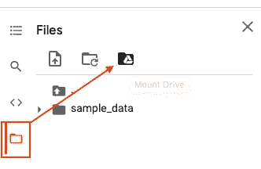

点击“连接到 GOOGLE DRIVE”


创建一个“日志文件”文件夹，并在其中创建一个“catvsdoglogs”文件夹:

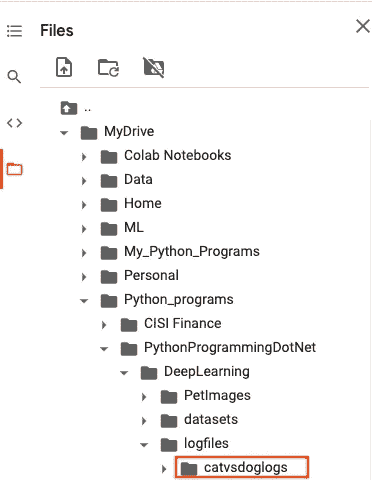

单击“日志文件”目录，单击鼠标右键，然后选择“复制路径”:

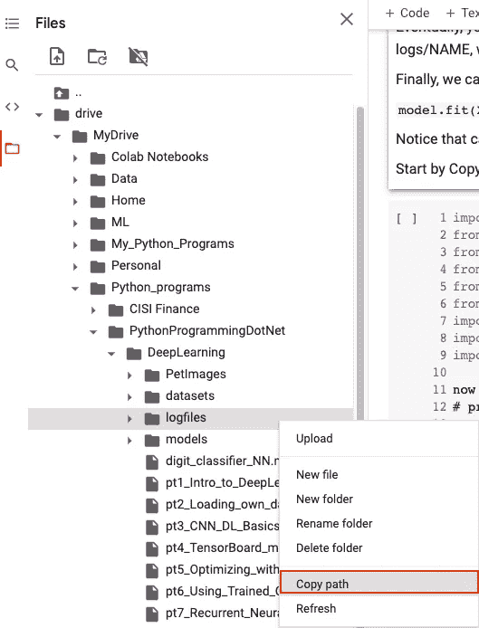

第一个代码单元包含导入语句和全局变量。将剪贴板内容粘贴到一个名为‘pathoflogsdir’的变量中，并等于 TensorBoard 的第一个参数；log_dir 到 pathoflogsdir + 'catvsdoglogs/{} '

执行代码单元格以确保名称变量正确显示:

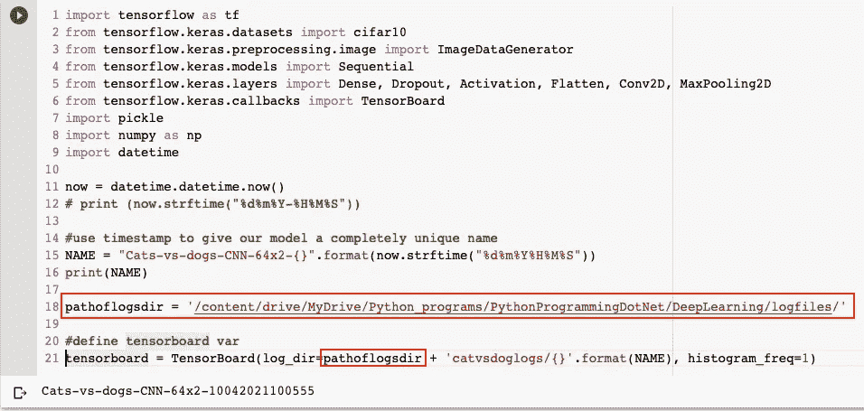

单击数据集文件夹，右键单击并选择“复制路径”:

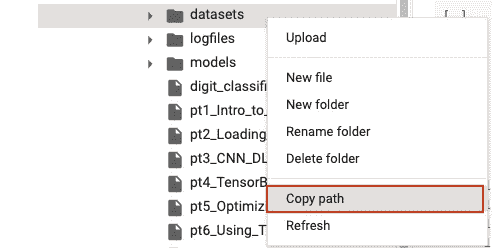

在第二个代码单元格中，粘贴剪贴板内容，并将它们赋给一个名为“path”的变量。运行代码单元格以确保变量 X 和 y 都属于 numpy.ndarray 类型。

注意:使用 np.asarray 函数将 y 从列表转换为 numpy 数组:

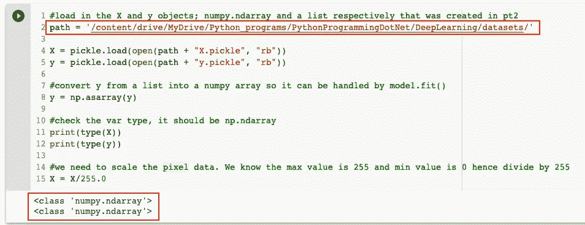

在第三个代码的最后一行，cell 确保最终参数显示

```
callbacks=[tensorboard]
```

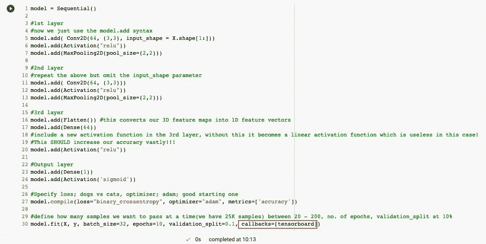

再次从左侧复制“catvsdoglogs”文件夹的路径:

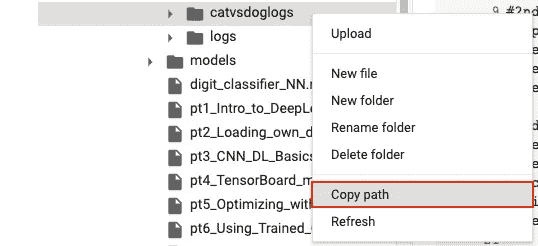

在最后一个代码单元中，第一行应该是%load_ext tensorboard。第二行应显示% tensor board–logdir = {从剪贴板粘贴文本}:

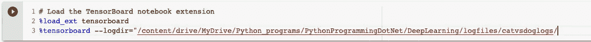

向后滚动到执行的第一个代码单元格，突出显示显示的名称，并将 name 变量复制到剪贴板:

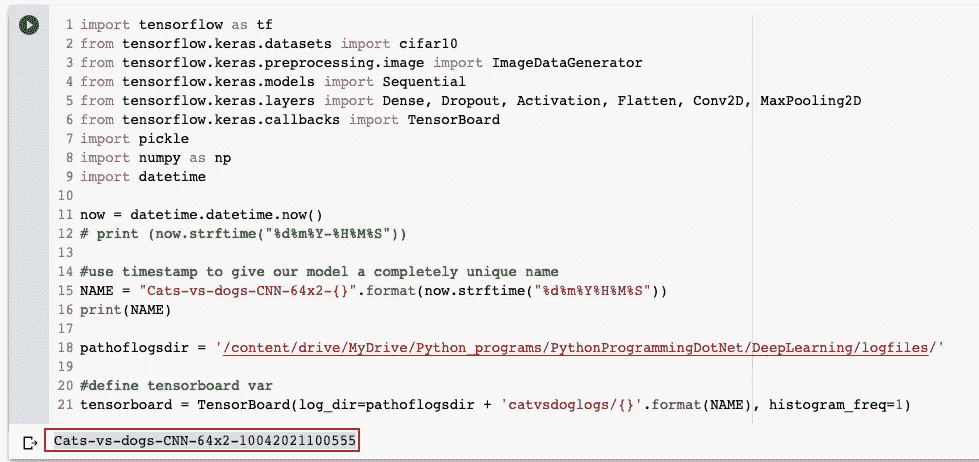

粘贴(Ctrl + V)剪贴板内容并插入双引号来封闭字符串值:

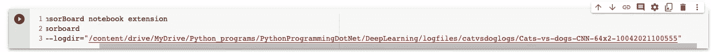

单击“运行时”并单击“更改运行时类型”:

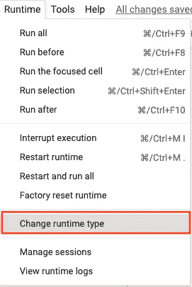

单击向下箭头，从下拉列表中选择“GPU”，然后单击“保存”:

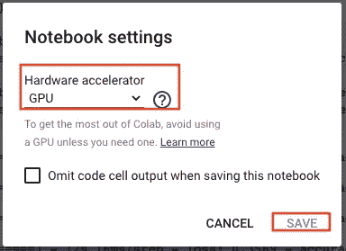

点击运行时间，然后点击“全部运行”:

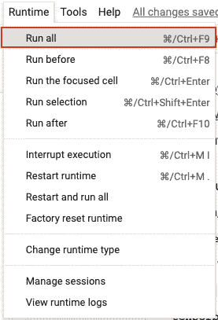

这将在当前浏览器选项卡中显示张量板结果:

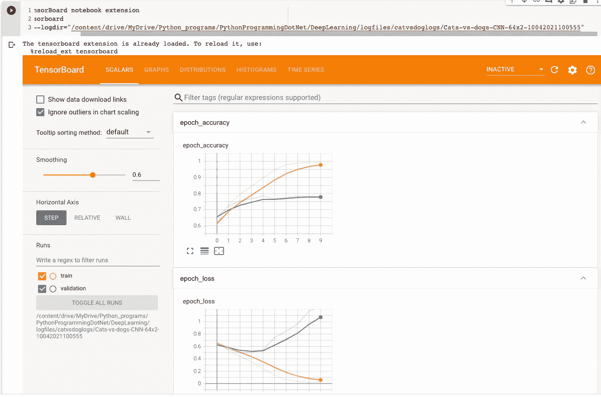

快乐的 Colab 编码和分析 tensorboard 中的结果！如果这篇文章对你有帮助，请留下掌声。