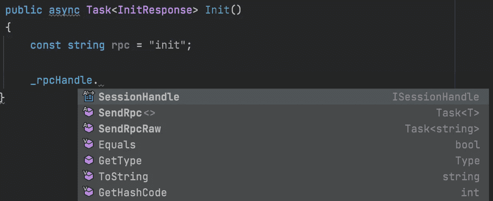
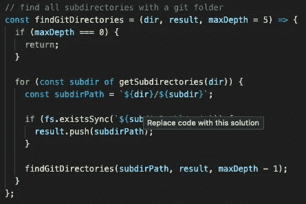
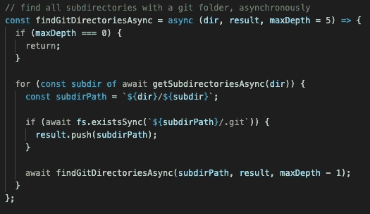
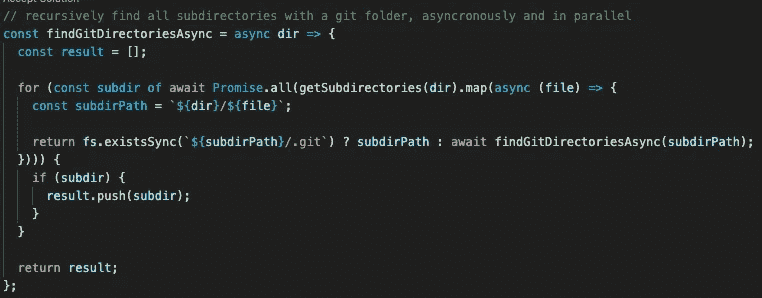

# 拥抱人工智能配对编程或灭亡

> 原文：<https://medium.com/codex/embrace-ai-pair-programming-or-perish-359a4c1a58c8?source=collection_archive---------2----------------------->

来自 [pxhere](https://pxhere.com/en/photo/1209766) 。

对你来说够可怕了吗？让我解释一下我来自哪里:对程序员和非程序员都一样。

我已经用了一个叫 [GitHub Copilot](https://copilot.github.com/) 的产品一个星期了。这个“免费”的程序([尽管在我的数据](https://docs.github.com/en/github/copilot/about-github-copilot-telemetry)中非常昂贵)被吹捧为“你友好的人工智能配对程序员”。

Octocat |经 https://github.com/logos[许可使用](https://github.com/logos)

而且为什么不应该叫友好！看看这个小朋友。多可爱啊。我没有权限使用实际的 Copilot 标志，所以 GitHub 的 Octocat 将不得不这样做。

当你写代码的时候，你的伙伴 Copilot 会弹出来，它会帮助你写下一个*接下来的*代码。

我们程序员习惯于在编程时到处弹出小块代码——我们使用的大多数开发工具都有一个叫做“自动完成”的特性，这在语法上有点像你的代码的。

这是现代自动完成的样子。

当我输入一个`.`时，会弹出一个小框，告诉我一些我可能想输入的东西。它通过分析我的代码来做到这一点，在这种情况下，它知道`_rpcHandle`是什么(因为我已经在代码中描述了它是什么)，所以它可以告诉我它做的事情，并在那个小灰框中使它们成为选项。这种类型的程序广为人知，每个程序员在他们职业生涯的某个阶段都使用过类似的东西。

这不是 GitHub Copilot 做的事情。这就是为什么我们不是朋友。

这个帖子就要出轨了。

量子素材|经 [MaxPixel](https://www.maxpixel.net/Particles-Quantum-Physics-Wave-Abstract-Physics-3488466) 许可使用。

# 量子飞跃

这很难用类比来解释。

自动完成对 GitHub Copilot 来说就像十亿分之一。它的数量级超过了其他任何东西。这个类比甚至都不准确，因为十亿人没有自我提升的能力。这是编程工作中的一次*量子飞跃*，而不是渐进式改进。

让我倒回去展示一些证据。我想给你们看一些我没有写的代码，并解释一下到底有多少是我没有写的。

我需要一些代码来浏览目录树，找到所有子目录，这些子目录本身包含一个名为`.git`的目录。这不是有史以来最复杂的问题，但也不简单。

我用英语写下了我想要的描述:

> //递归查找带有 git 文件夹的所有子目录

…这是 Copilot 为我写的代码:

那是…很多代码。这不是一个带有某些选项的下拉框。这不仅仅是一大堆代码:*这段代码有效。*另外，我们可爱的小伙伴决定引用我已经写在文件里的代码——就像`getSubdirectories`。这不是你可以谷歌的东西，这是一个只有我知道的东西，因为它只在我的个人代码中:*但它知道如何使用它*。

我决定我想推副驾驶，所以我在我的评论中添加了一个英文形容词:`asynchronously`。如果你不确定这个形容词的意思，不要关注它的特殊含义——重点是我在我的评论中添加了一个英语形容词。

你猜怎么着？它生成了一个奇怪的异步版本:

你们当中精明的人可能会注意到，虽然这不完全正确——`existsSync`应该只是`exists`，但它非常接近。它甚至为我添加了一个`maxDepth`，可以帮助防止各种类型的错误。如果我是手写的话，我会把它放在这段代码的未来版本中，而不是一开始就放进去。

我在我的评论末尾添加了更多的英语，再次强调，如果你不明白细节，不要担心。

它成功了。这段代码也不完全正确，但是非常接近。这是一个完整解决方案的框架。如果我要求异步、并行、递归的目录搜索， *99%的 js 程序员*也会给我不正确的代码——尽管很可能不会这么接近。这不是对 js 程序员的侮辱，这是对 AI 力量的证明。我并没有夸张:我已经采访了数百名工程师。

这是第一代工具的*技术预发布。*

经 [pixabay](https://pixabay.com/photos/lion-cub-baby-lion-young-lion-4781717/) 许可使用。

# 为什么我们不是朋友？

友谊不能正确地描述这种关系。

当你收养一只幼狮，慢慢地依赖它生存，然后它长大了，把你撕成碎片，这叫什么？在这种情况下，每个人都有幼狮，没有它们你真的没有竞争力。我很确定这有个德语词。

我不担心 AI 抢走我的工作——我已经接受了这一点，尽管我承认我可能已经在不同的时间线上工作到这一点。应用程序员坐在产品团队和计算机之间，在两者之间翻译，但是很快产品团队就不再需要翻译人员了，最终计算机也不再需要产品了。

我*不关心*当我们学习适应新工具时，现有编程社区将会释放出即将到来的遗忘浪潮。忘却一直是，也将永远是。在这一点上不要固执己见——要学会与野兽共事，而不是与之对抗。

我*不关心*为了培养下一代程序员而需要进行的教育变革。正规的编程培训从来都是一文不值的(我说了！)而最感兴趣的人会继续自学。

我*想知道*当人工智能基于其输入的重量编写代码时，新颖的架构模式将如何获得立足点。当 AI 被要求输出基于大量 React 解决方案的解决方案时，会有一个有趣的继任者来 React 吗？

我担心有一个好的竞争对手来竞争副驾驶是不可行的。已经打下了很多基础。谁有微软+ GitHub 那么多代码？我知道江恩存在，但除非我错过了什么，最引人注目的 GANN 将建立使用副驾驶。

我*am***关心人工智能编程对拥有大量外包发展经济的国家的影响。当开发劳动力可以外包给美国科技巨头的人工智能时，外包预算将不再流向这些国家，而是流向美国科技巨头。**

*然而，最让我不安的是这个不祥之兆——我以前曾抽象地思考过，但从未如此具体地思考过，有多少个人身份将被动摇。我们程序员中有多少人把一定程度的身份或自我价值与能够写出半途而废的代码联系在一起？我认为，这种情况以前也发生过，其他行业被自动化摧毁。想象一下，学习一台机器可以做你一直擅长的事情，除了比你更好，比你更快，比你更便宜。哦。*

**

*《沙虫壁画》| [梁朝伟](https://www.flickr.com/photos/gluetree/25343089454)*

# *上船吧*

*Copilot 在很长一段时间内只会是一个配对编程工具。在那之后，[就像挥舞着制造者钩子的弗雷曼人](https://dune.fandom.com/wiki/Wormriding)一样，我们将尽最大努力驾驭这个巨大的沙虫，但我们所能做的就是把它指向正确的方向。我很快就会成为副驾驶，然后最终成为乘客。*

*当我打开这篇文章时，我说了一些关于 Copilot 是编程的*辛劳*中的一个巨大飞跃。现在，我们别无选择，只能接受挑战，拥抱野兽，而不是在编程的*欢乐*中倒退一大步。*

*请上车。*