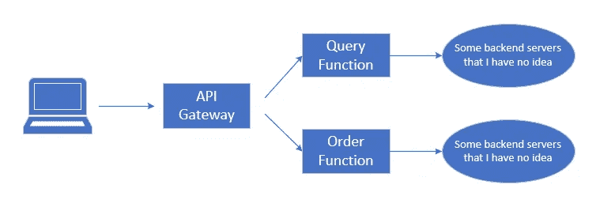

# 网络软件体系结构——新兴概念和方法

> 原文：<https://medium.com/codex/emerging-topics-in-application-architecture-fd256d74e63e?source=collection_archive---------2----------------------->

## [法典](http://medium.com/codex)

# 云原生应用

这是一种将您的应用程序分离为微服务的方法，每个微服务都有依赖关系，并打包到在特定容器编排系统上运行的容器中。具体来说，需要考虑不同的方面:

*   **微服务**:您的应用程序现在是由一组服务(从架构角度来看是微服务)协作构建的。你的团队中会有关于定义服务、实现服务的策略、在哪里部署服务等等的讨论。在设计阶段，您可能从一开始就有一些问题，“嘿，这可以是一个服务，但是既然它的功能现在很简单，我们能不能把它和服务 XYZ 放在一起，以后再把它分开？”，或者“我们应该对所有服务使用相同的数据库，还是每个服务都应该有自己的数据库？”，或者“日志呢，我们应该将所有日志保存到我们的数据库还是只将它们推送到 ABC 系统？”(通常这是其他团队正在管理的系统，比方说，跟踪问题，评估您的应用程序是否编码良好，没有错误或有 10000 个错误)，等等。Btw，说起微服务，需要提到 API，比如，API 的格式，认证，API 版本。
*   **监控(遥测和报告)**:一个服务故障会导致整个应用程序瘫痪。令人难以置信的是，如果作为最终用户所有请求的入口点的网关出现故障，情况会怎样？:)我们需要一种方法，让系统中的服务通知我们是否有任何异常情况。记录是你想到的第一件事。我们也有其他的东西，当然是基于日志数据，例如，从 Fluentd，LogStash，Kafka(是的，Apache Kafka)，到 CloudWatch，Prometheus 和 Grafana。如果你能在 Kubernetes 上部署一个“Hello World”示例作为微服务，并使用所有提到的工具，我愿意称你为学长。
*   弹性:你听说过混沌工程和混沌猴子吗？虽然不可能知道服务何时/如何/在哪里会失败，但是如果来自其他服务的输入不是它所期望的，即错误的格式、延迟、请求超时，所有服务都应该能够处理。

# 网络自动化

假设您现在有一个运行良好的网络，它可能有一天会出现一些问题。因此，网络自动化是一个在未来无需您干预的情况下保持网络良好运行的过程。我将网络自动化实施的所有方面总结如下:

*   **基于意图的网络:**从架构师的角度来看，如果你不知道底层网络设备的命令，那么 IBN 就出现了。具体来说，你只需要说出你想要什么(你的**意图**，就会有一些工具让它发生。这些工具应该理解你的想法，并有能力将你的意图翻译成网络设备的语法。
*   **API 和数据模型:**从工程师的角度来看，前者为你提供了一种传递你的意图或从你的意图中获得你所期望的东西的手段，后者则是你表达你的意图或期望结果的方式。换句话说，它需要了解网络设备，并通过 API(即 REST、RESTCONF、NETCONF)和数据模型(即 YANG)让设备理解自己。
*   **网络监控**:这是回答如何知道你的网络是否有问题/wright。您需要能够使用 SNMP(用于 IP 网络)来监控网络。在阅读相关书籍时，您可以听到很多关于 SNMP 的内容，但是请注意，有多种自定义协议在执行相同的任务。甚至不仅是 IP 网络，还需要监控光网络。
*   **数据分析:**能够分析收集的数据，为意向制定流程提供有用的输入。这里弹性栈(ElasticSearch，Kibana，LogStash)来图:)
*   **自动化框架:** Ansible 似乎是最著名的基础设施自动化框架。你也可能听说过其他工具，如厨师，木偶，盐栈。
*   **云原生**:开发网络服务，从更高的层面抽象网络，实现网络自动化流程，并以云原生方式部署。

# **无服务器计算**

假设你有一个由不同特性 A1 ( **MySQL 服务器**)、A2 ( **负载均衡器**)、A3 ( **防火墙**)、A4 ( **HTTP 服务器**)组成的 app **A(一个网站)**，你需要将它们全部安装，要么安装在同一台机器上(物理的、虚拟的、容器的，无论什么)，要么以分布式方式安装。有了无服务器计算，你只需要注册那些部署在你不需要关心(但要付费)的地方的功能。

同样，在回答任何详细问题时，您可能需要了解以下一些主题:

*   事件驱动的计算，功能即服务(您现在可以看到微服务架构的关键价值——一个具有大量功能供他人使用的系统)
*   因为你的祖母是一个好奇的家伙，她可能需要知道供应商如何设法为你提供这样的方法，那么这里有一个例子。

传统建筑的形态

示例商业网站的无服务器架构配置

# 服务网格

在微服务架构中，随着服务数量的增加，复合应用程序需要面对它们之间复杂的交互，包括监控服务健康、处理故障、身份验证等等。服务网格是一种解决方案，它有一个处理服务间通信的应用程序基础架构层，例如，该层可以进行健康监控，而不是您的应用程序或微服务本身。

要实现服务网格，您可以在服务旁边部署一个代理。这也被称为边车模式。为此，Envoy 和 Istio 是两个最受欢迎的平台。

image src:[https://istio . io/latest/docs/ops/deployment/architecture/arch . SVG](https://istio.io/latest/docs/ops/deployment/architecture/arch.svg)