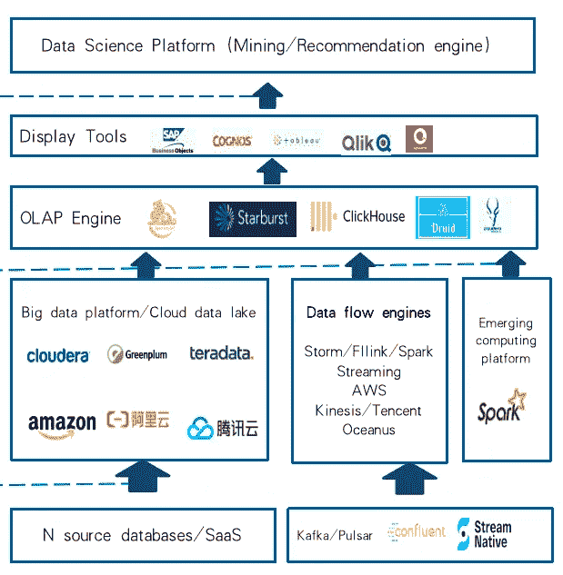
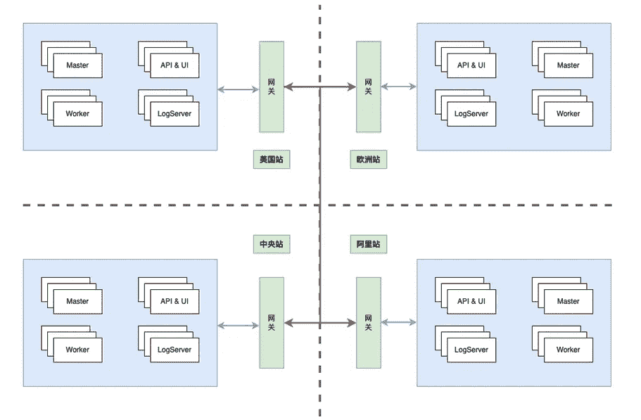

# 2022 年中美大数据技术的新兴趋势

> 原文：<https://medium.com/codex/emerging-trends-of-big-data-technology-in-china-and-the-u-s-in-2022-1e372e630e57?source=collection_archive---------1----------------------->

2022 年在见证全球数据技术飞速发展的同时，也是充满全球动荡的一年。在这一年里，中国新一代的互联网公司如抖音、SheIn、Shopee 等。在全球化方面取得了部分成果。美国硅谷的新一代数据技术栈 MDS(现代数据栈)蓬勃发展。云原生数据技术公司吸引了全球资本对 OLAP 引擎和 DataOps 引擎领域的关注。所有这些变化促进了数据技术全球化的趋势。

总的来看，从 Hadoop、Spark、数据平台(数据中台)到新一代数据技术栈，我们发现大数据实际上也进入了一个新的阶段。

# **大数据技术的早期阶段(2005–2015)**

以 Apache Hadoop、Apache Spark、Apache Oozie 为主导的大数据技术栈，已经逐渐取代了过去以 Teradata、Greenplum 为主导的商业数据仓库技术栈，并以其分布式、高性能、开源、免费模式的特点迅速占领了大部分市场。

当时的中国，正是百度、阿里巴巴、腾讯创业崛起的时期。受谷歌、亚马逊、美国在线在美国大量开源软件的成功见证鼓舞，国内互联网公司开始了大数据之旅。因此，中国大数据开源用户的快速增长加快了传统行业大数据平台的建设，主要旨在取代基于 Hadoop 和 Spark 的 ODS 层和非结构化数据存储和处理。

开放的代码、低成本的 X86 硬件支持、易用的 SQL 生态系统，让国内大部分中型互联网公司在 Hadoop/Spark 生态系统中继续使用这个系统进行大数据管理和挖掘。

# 基于云的大数据平台和数据中台时期(2010–2020)

随着互联网业务的发展，数据驱动的理念被广泛接受，越来越多的业务需求涌向大数据平台。目前，中国和美国在大数据方面已经走上了不同但有趣的方向。

目前，大量的大数据应用刺激了美国数据量的急剧增长。由于劳动力成本和物理机器的全球运维成本高，以亚马逊、网飞和硅谷 LinkedIn 为代表的互联网公司使用公共云作为公司的基础设施。美国公司在使用公有云虚拟机的同时，大数据全部放在云上，进入存储和计算分离的时代。数据不再存在于离线的 Hadoop 或 Spark 集群中，而是存在于 S3、GC 存储等公有云的廉价对象存储中，然后通过弹性公有云 EMR 动态处理相关数据，使用 Apache Azkaban 和 Apache Airflow 进行大数据任务调度。整个开源生态系统进一步拥抱了公共云时代。

随着公共云的蓬勃发展，2020 年美国公共云支出约占平均 IT 预算的 24%，私有云约占 5%(来自麦肯锡报告*中国公共云:大挑战，大潜力*)，整体来看，企业向云的大数据迁移已经完成了大部分数据迁移工作。

在中国，数据驱动也被深深接受。快手、今日头条、美团、JD.com 等新一代互联网公司在 Apache Hadoop/Spark 之外，开始采用更多开源的大数据技术来满足企业数据分析的需求，如 ClickHouse、Apache Doris、Presto 等，以进一步缩小业务用户与数据之间的差距。

同时，由于国内数据量巨大，原有的 Apache Airflow/Azkaban 等调度工具不足以满足需求。互联网公司已经开始构建他们的调度引擎或者使用新一代的调度分布式引擎 Apache DolphinScheduler 作为调度工具。

而且阿里巴巴提出了“数据中台”的概念，将多种大数据工具整合成一个数据平台系统，快速满足企业用户的需求。它代表了使数据更接近业务人员使用的进一步尝试。

当时中国和美国之间出现了一个关于技术道路的分水岭，前者继续在云上快速发展，而后者则更深地陷入私有化。

# 云-原生和新一代技术堆栈(现代数据堆栈)(2015 年至今)

2020 年后，随着云原生的发展，中美两国的技术栈已经开始以各自不同的特点向云原生时代进军。

在硅谷，新一代数据技术栈 MDS 的崛起进一步分化了原有的公共云服务:

*   **从以 IT 为中心到以业务为中心**

用无代码或低代码技术降低技术门槛，把数据处理和复杂流程变成服务让更多人可以使用；

借助云原生、公共云服务等简化数据团队。，让企业更专注于高价值的业务数据分析，而不是性能优化；

以数据技术自助服务为核心功能，数据技术专家成为整体数据驱动的推动者，而不是分析瓶颈。

*   **从集成的整体解决方案到产品和服务组合**

数据部署在云端而不是本地，按照使用的存储和计算分开计算，节省公司整体成本；

利用现代数据技术堆栈，通过使用开箱即用的工具(如 SaaS)快速解决数据操作/多操作的业务问题；

与中国提出的数据中间平台不同，硅谷的主流工具是将复杂的集成工具拆解成多种专业的产品和服务，并重新组合，实现轻量级和更专业的服务。

*   **data ops/MLOps 的兴起使分析师、工程师和数据科学家能够重用分析流程并更高效地开发**

a.相比数据中台和传统 ETL 相对复杂的开发流程，新一代数据技术栈集成了 DevOps 相关流程，使得开发更加高效和严谨

b.DataOps/MLOps 允许工程师将过去的一次性分析转变为可重用的数据分析和数据挖掘过程，提高整个企业的开发效率

c.DataOps/MLOps 使数据治理成为现代数据堆栈的核心元素

以 DBT、Fivetran、Airbyte、Airflow、DolphinScheduler、SeaTunnel、Perfecto 等工具为代表的下一代 MDS 工具集合。，简化了数据用户的使用。

在国内，抖音、SheIn、Shopee 等新一代全球互联网公司直接使用新一代云原生技术，在全球公有云上部署云原生 K8s 服务，如 AWS AKS、Google Cloud GKE 等，结合他们的 K8s 管理用类似 K8s 上的 Spark，K8s 上的 Flink，K8S 上的 DolphinScheduler 等工具。，全面构建云原生体系下的多云大数据混合云架构:

# 中美大数据技术的趋势

总而言之，纵观中美大数据技术十多年的发展历史，几个明显的行业趋势正在形成:

*   **云原生**

随着劳动力成本的上升和全球化的发展，没有特定行业合规要求的公司将逐渐选择基于云的大数据基础设施。但中国和美国以不同的顺序转向了这条道路:美国的公司选择先去公有云，然后在公有云环境下通过 MDS 切换到云原生系统；然而，中国的公司首先转移到云原生系统，并逐渐从本地系统切换到公共云原生系统。他们走的是不同的道路，却通向同一个目标，那就是最大化资源利用率和数据 R&D 效率。

*   **自助服务分析的兴起和数据能力的民主化**

越来越多的企业业务人员开始直接使用数据工具完成内部分析:面对新兴的数据引擎和技术，市场竞争加剧，内部数据工程师满足科学家、产品经理、运营人员频繁“提取数据”的需求越来越具有挑战性。更多的企业使用 Metabase、DolphinScheduler 等新一代工具来满足企业内部数据分析、数据提取、定时数据任务封装的需求，让企业中更多的人更高效地使用数据。

*   **开源生态商业化**

大数据生态系统经过十几年的发展，已经出现了数百种不同的技术和接口，并且发展迅速。过去传统的软件开发模式已经过时，无法适应新一代大数据技术的发展。在这种背景下，在大数据领域，一些基于新一代技术的开源商业公司在中国和美国都出现了。他们运营着优秀的开源技术社区，并同时以 SaaS 和商业订阅的形式为企业提供最新的云原生服务，如 DBT (DBTCore)、天文学家(Apache Airflow)、空气字节(Airbyte)等。在美国，还有 SphereEX (Apache ShardingSphere)和 whale ops(Apache dolphin scheduler，Apache SeaTunnel)等。在中国。

一方面，在开源社区运营过程中，这些公司基本上可以满足不断变化的新大数据和新技术接口迭代的需求。另一方面，他们提供基于开源版本的商业服务。通过不断增强开源社区，他们形成了积极的开源-商业飞轮效应。

数据技术仍在快速发展。我相信，在未来，量子计算、脑机接口、人工智能应用将为大数据技术拓宽发展空间，培育发展动力。

从用户的角度来看，这些是每种数据技术的相同目标:

*   **文明:**“去专业化”，不仅针对工程师，也允许更多内部用户使用数据；
*   **开始简单:**“去数据化中台”，让组织和用户从需要使用的组件开始，避免不必要的成本和复杂性；
*   **快速迭代:**“极速体验”，让用户第一时间看到数据运算的结果，而不是数天复杂的编程、调试、上线验证最终结果；
*   **性价比:**“按需使用”，无论是使用私有云原生技术还是公有云原生技术，庞大而闲置的大数据集群计算的日子已经一去不复返，可以按需使用的云原生大数据技术将取代企业现有的大数据计算系统。

这两年记得有很大的声音宣称“Hadoop 已死”，大数据技术发展停滞。但我想证明一个事实，即新一代数据技术堆栈(MDS)以云原生的方式快速定制大数据技术以适应企业的使用场景，这种方式更高效、更简单、更便宜。

大数据技术仍在快速发展。中国的 IT 管理者应该从全球的角度利用技术来实现全球化的目标。美国也在密切关注中国开发者大量涌现的新技术，以促进他们的发展。

虽然此时此刻世界仍处于动荡之中，但科技的发展往往会经历萌芽-发展-过热-平息-崛起-高潮的循环。我相信，经过这次动荡的洗礼，优秀的技术能够生存下来，并最终在下一个经济周期中接管高地！

# 加入社区

参与 DolphinScheduler 社区并为其做出贡献的方式有很多，包括:

**文件、翻译、Q & A、测试、代码、文章、主题演讲等。**

我们假设第一个 PR(文档、代码)是简单的，应该用来熟悉提交过程和社区协作风格。

所以社区整理了以下适合新手的问题列表:[https://github.com/apache/dolphinscheduler/issues/5689](https://github.com/apache/dolphinscheduler/issues/5689)

**非新手问题列表:**[https://github.com/apache/dolphinscheduler/issues?q = is % 3A open+is % 3A issue+label % 3A % 22 volunteer+wanted % 22](https://github.com/apache/dolphinscheduler/issues?q=is%3Aopen+is%3Aissue+label%3A%22volunteer+wanted%22)

**如何投稿:**

[https://dolphin scheduler . Apache . org/en-us/docs/dev/user _ doc/contribute/join/contribute . html](https://dolphinscheduler.apache.org/en-us/docs/dev/user_doc/contribute/join/contribute.html)

**GitHub 代码库:**【https://github.com/apache/dolphinscheduler】T4

**官方网站:**https://dolphinscheduler.apache.org/

邮件列表:dev@dolphinscheduler@apache.org

**推特:**@海豚时间表

YouTube:https://www.youtube.com/channel/UCmrPmeE7dVqo8DYhSLHa0vA

**懈怠:**https://s.apache.org/dolphinscheduler-slack

**投稿指南:**https://dolphin scheduler . Apache . org/en-us/community/index . html

你的项目之星很重要，不要犹豫，点亮阿帕奇海豚调度❤️之星