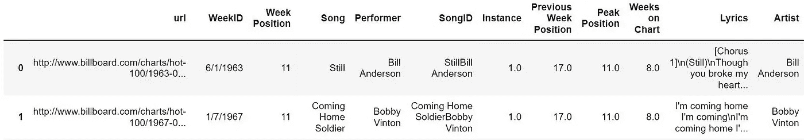
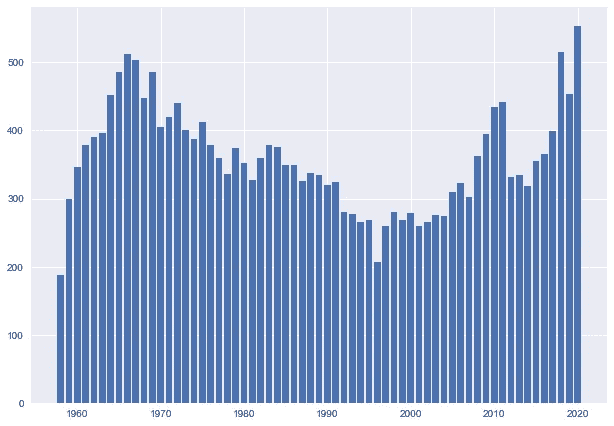
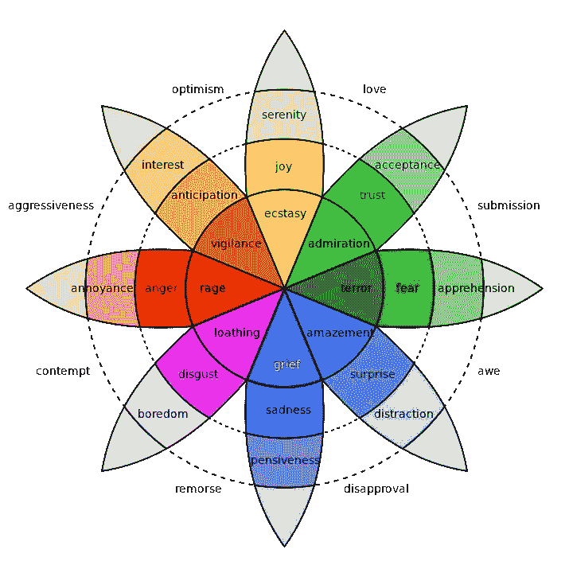
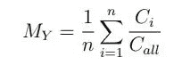
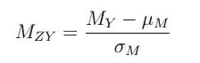
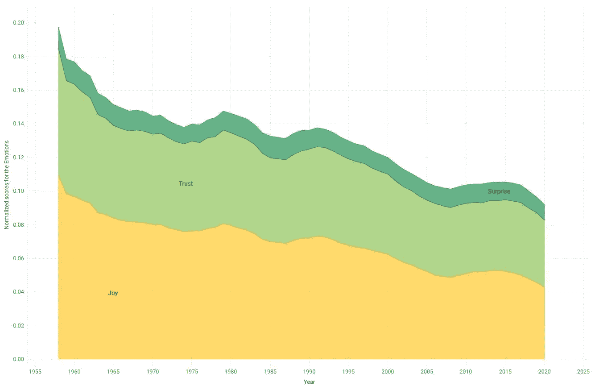
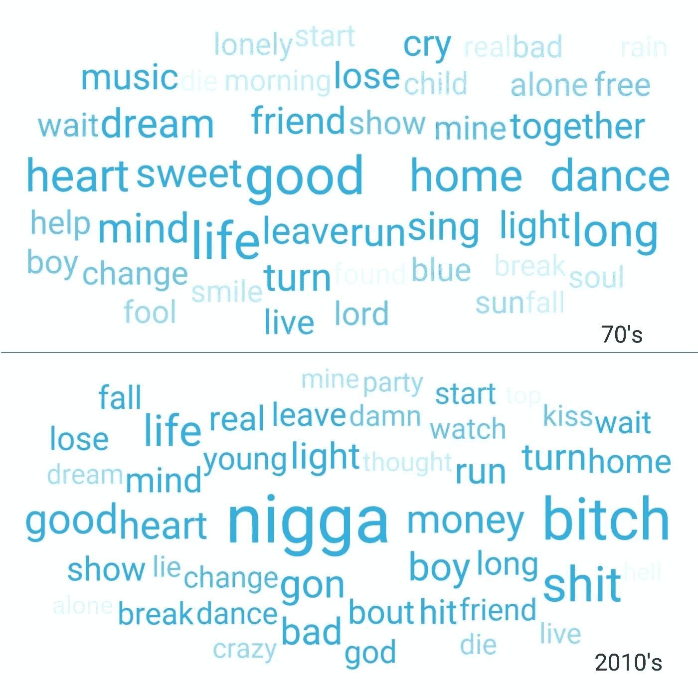
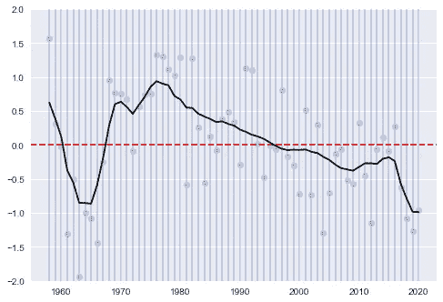
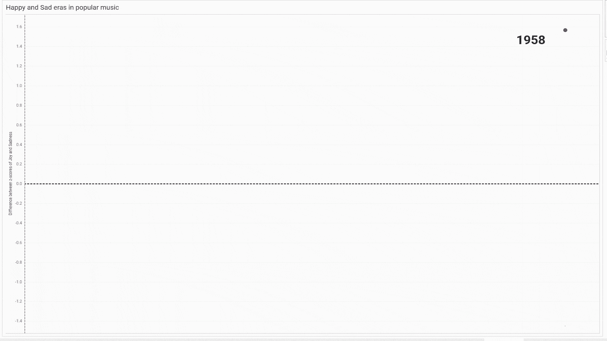

# 所有 Billboard 热门 100 首歌曲(1958-2020)的情感挖掘歌词

> 原文：<https://medium.com/codex/emotion-mining-lyrics-of-all-billboard-hot-100-songs-1958-2020-3007d6963115?source=collection_archive---------3----------------------->

## 将那个时代的情绪与流行音乐的情感联系起来。

流行音乐有多贴近我们的情感？我们难过的时候会听悲伤的歌吗？我们有，对吧？但是它也作为一个集体发生吗？直觉告诉我们，流行音乐应该总是与大众的情绪产生共鸣。多年来，像快乐、悲伤和愤怒这样的情绪可以而且已经通过歌曲表达出来。并且可以假设，一个时代最流行的歌曲是流行的；因为他们最能和那个时代的大众情绪产生共鸣。虽然声音和曲调有时候更重要，但是只看歌词也能说一个时代的心境吗？

我开始通过挖掘过去 60 年中最流行的歌曲来寻找这些问题的答案。退一步说，我找到的答案非常有趣。事实上，我在流行歌曲表达的情感中发现了对悲伤时代的反思，如越战、民权运动，甚至最近的疫情。让我尽可能地把它写在下面。(我不会给出每一步的代码块并解释它，我想过它，它会是一个太大的帖子。我将只解释项目中的步骤，并尽可能全面地展示结果。我会在这篇文章的底部添加 git repo 的链接。)

在 [Unsplash](https://unsplash.com?utm_source=medium&utm_medium=referral) 上由 [Mohammad Metri](https://unsplash.com/@mohammadmetri?utm_source=medium&utm_medium=referral) 拍摄的照片

# 数据和预处理

当然，流行音乐会因国家而异，没有一个确定的指标可以产生一个确定的列表。但是至少在美国，公告牌 100 首热门歌曲几乎可以作为流行歌曲的一个很好的指标。Billboard 在 1958 年推出了热门 100 名，所以我会有一个过去 60 年的明确名单。很自然，我做的第一件事就是整理了 1958 年以来进入 Billboard 热门 100 周排行榜的所有歌曲。在这样做的时候，我发现了这个惊人的[数据集](https://data.world/kcmillersean/billboard-hot-100-1958-2017)，其中有 325，695 首歌曲的名称和艺术家。其中有 29158 首歌曲是独一无二的。然后下一步是从这个列表中收集所有歌曲的歌词。为了做到这一点，我从天才那里搜集了所有的歌词。这是一个伟大的网站，提供了很多歌曲的歌词，最重要的是，这个网站还提供了一个 API，我可以很容易地抓取歌曲的歌词。最后，我下载了 26，450 首歌曲(网站上没有找到所有歌词)。

接下来，我需要清理数据集。第一步是检查是否所有下载的歌词实际上都是歌词。因为 Genius.com 还主持电影剧本，歌曲描述，自定义列表等。从数据集的初步看，我发现有一些非歌词下载。我清理过了。然后我用正则表达式清除了歌词中所有不必要的词，比如“合唱”、“独唱”或“吉他独奏”等等。我也删除了所有非英文歌曲，因为没有太多(总共大约 275 首)。我觉得不值得为这么小的样本发这么多不同语言的短信。然后我把歌词的所有单词都词条化了，以便后面更容易分析(词条化把单词转换成它们的基础形式，就像睡觉变成了睡觉，睡了也变成了睡觉)。在所有的清理和预处理之后，我得出了一个 22，600 首歌曲的数据集，这些歌曲有干净的歌词和所有单词的词条列表。以下是最终名单在各年间的分布情况。

历年数据集中歌曲数量的直方图

正如你所看到的，每年的歌曲数量没有极端的差异，但也不完全相等。所以所有的结果都要经过多年的归一化处理。

# 分析

现在来谈谈情感挖掘。歌词不完全是合适的正文。它不遵循语法句子结构。情绪是通过文字来传达的，但在大多数情况下，这些文字并不符合语法和语言句法。所以我认为关键词提取和情感与这些关键词的匹配可以告诉我们很多特定歌曲中表达的情感。为此，我建立了一个情绪分类器，它基本上利用了 NRC 情感强度词典，并给出了罗伯特·普卢奇克认为是基本或普遍的八种情绪的总分数:快乐、悲伤、愤怒、恐惧、信任、惊讶、厌恶和期待。我把这个分类器命名为情感。你可以在这里找到它[，并将其免费用于你的项目。](https://pypi.org/project/emotion-nrc-affect-lex/)

罗伯特·普卢奇克的情感之轮，作者机器精灵 1735——自有作品，公共领域，【https://commons.wikimedia.org/w/index.php?curid=13285286 

在我得到每首歌的情绪分数后，我首先用一首歌的总字数来标准化每首歌的分数。我根据这个公式进行了标准化:这里是某一年的情绪得分。Ci 是我们模块给第 *i* 首歌的情绪评分。C *all* 是每首歌所有词的计数。n 是特定年份的歌曲数量。

然后，为了有效地计算两种情绪之间的差异，我用以下公式将标准化的情绪分数转换为 z 分数:这里 *M* 和 *σM* 表示所有 63 年(1958-2020)中 M *Y* 的平均值和标准差

# 结果

现在所有的分析都完成了，让我们展示一些结果。我画的第一件事是:所有情感得分的面积图，一个在另一个之上，来显示这些年来在我们最流行的歌曲中情感的流动。让我们先来看看积极情绪的流动:快乐、信任和惊喜。

令人惊讶的是，所有的积极情绪都呈下降趋势。这意味着随着时间的推移，最流行的歌曲中传达这些情感的词语越来越少。现在让我们来看看负面情绪:悲伤、愤怒、厌恶和恐惧。

显而易见，尽管表达负面情绪的词语数量减少了，但它们的使用却在增加。尤其是看看恐惧、愤怒和厌恶的情感河流。它们开始时很窄，最后变得很大。当我们只看一下 70 年代和 2010 年代的歌曲中最常用的语气词的词云时，这种对比就变得更加明显。

作者图片

越大越亮的字，在那个十年里越重要。使用 tf-idf 计算单词的重要性。正如你所看到的，70 年代最重要的词，如*好，心，舞*其中显然是积极的词，在 2010 年代变得黯然失色。

现在让我向你们展示我在项目开始时提出的最重要问题的答案:我们真的能在一个时代的情绪和那个时代最受欢迎的歌曲所表达的情感之间建立联系吗？为了回答这个问题，我绘制了从歌词分析中得到的快乐和悲伤的标准化分数之间的差异。根据我们的分析，我们将试图了解哪个时期是快乐的或悲伤的。所以要理解下面的图:大于零的值通常表示“快乐”时期，小于零的值通常表示“悲伤”时期。使用弗里德曼的“超级平滑器”对数值进行平滑处理。

快乐和悲伤的 z 值差异

如果我们更深入地研究上面的图表，根据我们的假设，70 年代末是人们最快乐的时期。这一高峰始于 1969 年(恰好是伍德斯托克音乐节和登月音乐节的年份)，并于 80 年代初开始下降。虽然一直到 90 年代末。据 history.com 报道，

> “水门事件后，许多人完全退出了政治。他们转而求助于流行文化——在这样一个充满潮流、追逐时尚的十年里，这很容易做到。总的来说，到这个十年结束时，许多年轻人正在利用他们来之不易的自由做他们想做的事情:穿他们想穿的衣服，留长发，做爱，吸毒。换句话说，他们的解放是非常个人化的。”

除此之外，我们还可以看到两个悲伤的山峰。一次发生在 60 年代中期，正值越南战争抗议和民权运动的高潮。根据 history.com 的说法，

> 20 世纪 60 年代是世界历史上最动荡和分裂的十年之一，其标志是民权运动、越南战争和反战抗议、政治暗杀和正在出现的代沟

下一个最悲伤的高峰出现在 2019-20 年，考虑到民粹主义的崛起，美国比以往任何时候都更加分裂，当然还有疫情，这是非常可以理解的。

我还做了一个带注释的运动图来展示最终的结果。以下是之前显示的图表的未平滑版本。我在这张图表上标注了每十年的重要事件，以提醒观众这个时代。请注意，注释不是确切的年份，而是确切的十年。这些并不意味着传达因果关系。您可以在此[链接](https://public.tableau.com/app/profile/syed.mahir.tazwar/viz/PopularMusicovertheyears/Dashboard1)中查看 Tableau 中完整的可视化仪表盘。我放了一些过滤器和自定义按钮，以便更容易地对数据进行切片和仔细查看。

表示快乐和悲伤之间差异的注释运动图

所以，这是一个非常有趣的发现，流行音乐确实与大众的情绪相关。根据我们的分析，流行音乐中的情感忠实地追随了那个时代的情绪。这是一个有趣的项目，最重要的是，我建立了一个情感分类器，可以用来在未来做一些非常酷的事情。即席创作——基于来自分类器的歌曲情感分数的流派分类，或者可以使用分类器作为注释工具，稍后在 SVM 用于更大的歌曲数据集。这些可能是我接下来要写的话题。干杯！

*(有用链接:* [*项目代码库*](https://github.com/tazwar2700/Emotion-mining-billboard-hot-100-songs-)*[*ableau 仪表盘展示结果*](https://public.tableau.com/app/profile/syed.mahir.tazwar/viz/PopularMusicovertheyears/Dashboard1)*[*初始数据集*](https://data.world/kcmillersean/billboard-hot-100-1958-2017)*[*最终数据集*](https://data.world/tazwar2700/billboard-hot-100-with-lyrics-and-emotion-mined-scores)*[*情感 Pypi 链接*](https://pypi.org/project/emotion-nrc-affect-lex/)*)*****