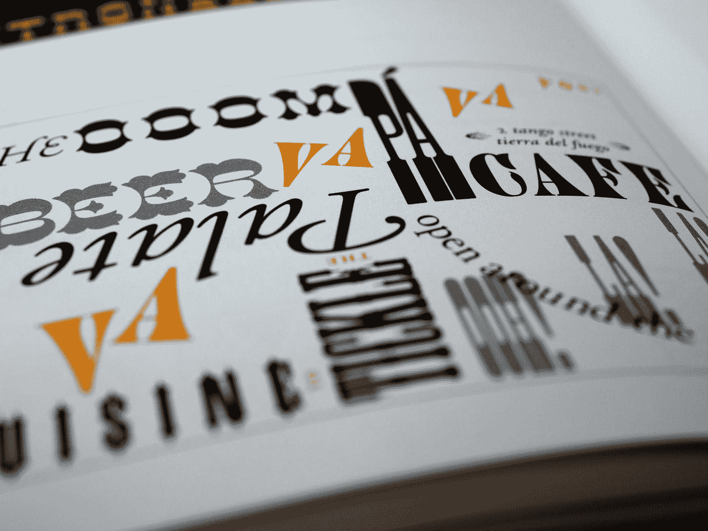

# 界面设计中的字体情感

> 原文：<https://medium.com/codex/emotions-of-typography-in-ui-design-923efb3f3393?source=collection_archive---------11----------------------->

## 字体设计在创造愉快的用户体验中的重要性！

布雷特·乔丹在 [Unsplash](https://unsplash.com?utm_source=medium&utm_medium=referral) 上的照片

当你为下一个移动应用程序设计新的用户界面时，一定要注意你选择的字体的效果。颜色、字体和排版心理学都会对用户体验产生深远的影响。为了让您的设计更加有效，请考虑如何…