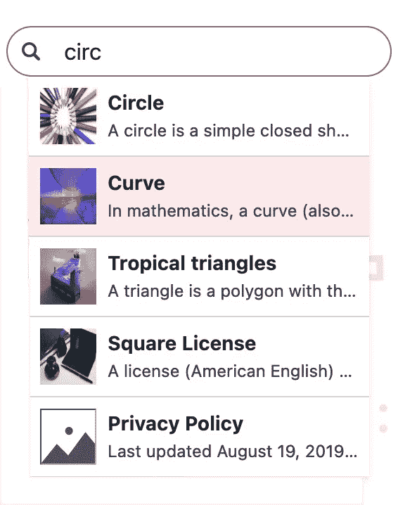

# 启用客户端搜索

> 原文：<https://medium.com/codex/enabling-client-side-search-7f6cc7837f86?source=collection_archive---------11----------------------->

## 免税品

## *出自* [*雨果在行动*](https://www.manning.com/books/hugo-in-action?utm_source=medium&utm_medium=organic&utm_campaign=book_jain_hugo_9_24_19) *出自阿提亚·贾恩*

*在本文中，我们将展示如何为 Jamstack 网站构建一个搜索小部件。*

在[manning.com](https://www.manning.com/?utm_source=medium&utm_medium=organic&utm_campaign=book_jain_hugo_9_24_19)结账时，将 **fccjain** 输入折扣代码框，即可享受 [*Hugo in Action*](https://www.manning.com/books/hugo-in-action?utm_source=medium&utm_medium=organic&utm_campaign=book_jain_hugo_9_24_19) 的六折优惠。

就像动态表单提交一样，在您输入时实时显示结果的搜索小部件需要 JavaScript。既然我们已经为网站准备好了 JS 代码和基于 JSON 的伪 API 的框架结构，我们可以使用它们来提供客户端搜索。

## **客户端搜索的概念**

在传统系统中，搜索是基于服务器的，客户端提供的关键字映射到搜索索引中的值，该索引为关键字提供最佳排名页面。客户端搜索的概念是，服务器向客户端提供这个索引(或者客户端动态构建它)，并且这个映射发生在客户端。

与基于服务器的搜索相比，客户端搜索有很多优势:

*   搜索索引像 Jamstack 中的其他东西一样是静态的。它可以分布在 CDN 上，并提供 CDN 必须提供的所有缓存和性能优势。
*   搜索索引被按需推送到客户端，甚至被预加载。因此，在向服务器发送击键时没有往返时间损失，并且搜索变得更快。
*   不需要额外的服务器来维护和保持与数据库的同步。用户的机器提供执行搜索所需的资源。
*   即使用户在加载初始网页后离线，搜索也可以工作。

客户端搜索的最大限制是索引的大小。如果我们有一个大范围的索引，那么搜索索引的预加载可能会被证明是带宽密集型的，没有任何实际用途。我们可以拆分索引并按需分部分加载，但是扩展这种方法会回到由服务器维护整个索引的世界。

对于大多数网站来说，从现代网络的角度来看，文本内容并不是非常庞大。2 MB 的数据可以存储 200 万个字符。对于基于文本的搜索索引来说，这个数字是相当可观的，但对于网页来说，这并不是一个巨大的开销，因为我们在网站上经常会有这样大小的图像。虽然我们可以在 Hugo 中创建一个更加优化和健壮的搜索索引，但是 Acme Corporation 网站中的数据量非常小，我们通过 JSON 伪 API 提供所有数据。我们甚至可以将搜索索引的创建转移到 JavaScript 上。

## **在标题中显示搜索框**

搜索小部件由一个输入框和一个结果下拉列表组成，用于显示部分查询的结果。我们将把它添加到网站标题。

**清单 1。要添加到网站标题的搜索表单。(AcmeTheme/layouts/_ default/base of . html)**

```
<header>
   ...
   <span id="search">                             ❶
     <input type="search" placeholder="Search">   ❷
     <div></div>                                  ❸
   </span>
   {{ partialCached "menu.html" ... }}
   ...
 </header>
```

❶ **包装器 div 包含搜索表单和结果列表。**

❷ **网站的实际搜索表单。**

搜索结果的❸ **占位符。**

这就是所需要的一切。JavaScript 将会自动激活这个搜索字段。

## **加载网站数据**

为了填充 JS 中的搜索结果，我们需要从 Pseudo API 加载网站内容并创建一个搜索索引。我们可以使用 JavasScript 的 fetch 函数将网站数据提取到一个变量中。([https://github . com/hugoin action/hugoin action/tree/chapter-10 resources/03](https://github.com/hugoinaction/hugoinaction/tree/chapter-10-resources/03))。

**清单 2。使用 JavaScript 中的 window.fetch 函数加载网站数据(AcmeTheme/assets/search . js)**

```
export default {
   async init() {
     try {
       const response = await window.fetch(          ❶
         "/index.json");
       if (!response.ok) {
         this.removeSearch();                        ❷
         return;
       }
       let data = await response.json();             ❸
       / Just for now.
       console.log(data);
     } catch(e) {
       this.removeSearch();
     }
   },

   removeSearch() {
     document.querySelector("#search")?.remove();
   }
 }
```

❶ **使用 fetch 函数下载包含所有网站内容的索引文件。**

❷ **如果出现错误，移除搜索框。**

❸从 JSON 获取作为对象的响应数据。

如果网站托管在 GitHub Pages 这样的子文件夹中，上面的代码会有一个问题，因为这些代码假设根`/index.json`是代码的 JSON 版本所在的位置。我们将把`site.BaseURL`作为另一个变量传递给`defines`来解决这个问题。这个值需要用引号括起来才是有效的 JavaScript(我们可以使用 params 代替 defines，后者没有这个限制)。

**清单 3。将 BaseURL 添加到定义参数(AcmeTheme/layouts/default/base of . html)**

```
{{ $defines := dict
   "REMOVE_FORM_ON_SUBMISSION" (default "false" (
     site.Param "RemoveFormOnSubmission"))
   "BASE_URL" (print "\"" site.BaseURL "\"") }}     ❶
```

❶用引号括起来，使它成为一个有效的 JavaScript 字符串。

我们还需要修复我们的 JS 代码。

**清单 4。添加 BASE_URL 以确保搜索总是从正确的端点开始(AcmeTheme/assets/search.js)**

```
const response = await window.fetch(
   BASE_URL + "/index.json");
```

我们将从索引中调用搜索表单的 init 方法。即使函数是异步的，如果我们不需要等待它返回一个有效值，我们也可以不使用`await`来调用它。

**清单 5。正在初始化搜索查询。(AcmeTheme/assets/index.js)**

```
import Search from "./search"

 function init() {
   ...
   Search.init();
 }
```

上面的代码应该在浏览器控制台中记录网站的全部内容。

代码检查点。在 https://chapter-10-05.hugoinaction.com 现场直播。

来源[https://github . com/hugoin action/hugoin action/tree/chapter-10-05](https://github.com/hugoinaction/hugoinaction/tree/chapter-10-05)

## **导入搜索库**

当网站上的数据很少时，我们可以使用正则表达式，在内容中循环查找结果。它可能会起作用，但是当我们需要像*模糊匹配*(允许使用部分术语和自动完成的结果)、搜索结果的适当加权评分这样的功能时，一个优秀的全文搜索库会很有帮助。JavaScript 生态系统有许多现成的库，它们维护得非常好，并且易于使用。

需要在机器上安装 *Node.js* (见[https://nodejs.org](https://nodejs.org/))来获取社区模块(我们可以使用任何版本)。一旦 node.js 可用，我们就可以使用 *npm* (节点包管理器)命令行。

在安装 node.js 依赖项之前，我们需要为我们的项目初始化 node.js。我们的网站上有多个项目，Acme 主题项目和 Acme 公司网站项目。由于搜索代码位于 Acme Theme 中并被共享，我们需要在 Acme Theme 项目中初始化 node.js。

为此，我们将运行`npm init and answering a small questionnaire to get a `package.json`文件，该文件可以列出我们基于 JavaScript 的依赖项。

**清单 6。初始化为 npm 存储库(在 AcmeTheme/)**

```
npm init
```

接下来，我们需要搜索并下载一个 node.js 模块来帮助用户使用`fuzzy search`。要使用`npm`查找库，您可以使用`npm search`命令。

**清单 7。在 npm 上搜索模糊搜索库**

```
npm search fuzzy search
```

清单 8。使用 npm 搜索模糊搜索的搜索结果。

```
❯ npm search fuzzy search
 NAME        | DESCRIPTION           | AUTHOR          | DATE
 fuse.js         | Lightweight…         | =krisk          | 2021-01-05|
 fastest-levenshtein | Fastest Levenshtein… | =ka-weihe       | 2020-08-07|
 fuzzy-search | Simple fuzzy search | =wouter2203|2020-02-20|
 feathers-mongodb-fuzzy-se | hook which adds…     | =arve0  | 2020-09-13|
 arch                          |                      |         |           |
 minisearch                | Tiny but powerful…   | =lucaong |2021-06-25|
 mongoose-fuzzy-searching|Mongoose fuzzy…| =vspallas|2020-11-03|
 fuzzy-tools     | Functions for fuzzy… | =axules | 2021-04-18|
 fuzzy     | small, standalone…   | =mattyork       | 2016-10-01|
 leven-match     | Return all word…     | =eklem          | 2021-06-11|
 fuzzysearch  | Tiny and…   | =bevacqua       | 2015-03-06|
 mongoose-fuzzy  | Mongoose fuzzy…   | =pabloc  | 2020-07-28|
 scored-fuzzysearch | Tiny and… | =jhudson        | 2020-07-31|
 neofuzzy  | Quick fuzzy search…  | =jeanno    | 2020-11-26|
 fuzzy-search-mongoose | Fuzzy sarch | =piotreksl  | 2020-09-28|
 vue-fuse  | A Vue.js pluggin…    | =shayneosulli… | 2021-07-02|
 liblevenshtein | Various utilities…   | =dylon.edwards  | 2015-07-04|
 fuzzy-pop  | Simple fuzzy search… | =yoshokatana | 2015-05-05|
 fast-fuzzy | Fast and tiny…       | =ethanrutherf… | 2021-05-19|
 react-fuzzy-picker  | Search through a…    | =1egoman  | 2019-09-29|
```

这里传递给`npm`的根命令是 search，我们正在搜索提供`fuzzy search`的库。国家预防机制的最高结果是`fuse.js`。在互联网上快速查看一下，我们发现 *`fuse.js`* 是 Apache 许可的，相当小(< 50kB)，没有其他依赖项，并且已经定期维护了近十年，定期发布，同时有许多下载和软件包依赖于它。

要添加依赖项，我们可以使用`npm install`命令。`--save-dev`标志将开发依赖关系保存在 package.json 中，这样如果我们在新机器上进行`npm install`操作，就可以使用它。开发依赖意味着它只在开发期间使用，在发布的网站中不需要。因为我们编译依赖项，所以在运行时不需要它们。

我会推荐使用 fuse.js 的 6 版。

**清单 9。添加 fuse.js 作为依赖项(在 AcmeTheme/)**

```
npm install --save-dev [fuse.js@6](mailto:fuse.js@6)
```

该命令将生成一个名为`package-lock.json`的文件和一个`node_modules`文件夹。`package-lock.json`相当于`go.sum`，保存校验和以确保我们的依赖关系的完整性。`node_modules`文件夹类似于`_vendor`文件夹，它存储我们的依赖关系。npm 不会为依赖项创建隐藏文件夹。

## **更新我们的构建系统以支持 npm**

除非归档`node_modules`文件夹对提交到源代码控制没有意义。把它挡在外面也不容易，因为我们需要在

AcmeTheme 模块获取其内容。在 AcmeTheme 模块中运行`npm install`可能是不可能的，因为 Hugo 默认将模块放在一个隐藏的文件夹中。

因此，我们需要一种方法将`fuse.js`依赖项暴露给顶级 AcmeCorporationWebsite 项目。为了执行这个任务，我们需要将 AcmeTheme 模块中的`package.json`重命名为`package.hugo.json`。如果 Hugo 模块中存在一个`package.hugo.json`文件，Hugo 知道这个模块依赖于 npm，并且 Hugo 被允许将其依赖项复制到顶层项目。

要将我们的依赖项转移到顶级 AcmeCorporationWebsite 项目，我们可以运行以下命令:

**清单 10。将所有模块包打包生成顶层 package.json(在网站根文件夹/)**

```
hugo mod npm pack
```

Hugo 会将顶级的 AcmeCorporation 网站初始化为基于 npm 的项目，并创建 package.hugo.json 和 package.json，现在我们在顶级的 AcmeCorporation website 项目运行`npm install`得到那个文件夹中的 node_modules 和 package-lock.json。AcmeTheme 项目中的是多余的，我们可以删除。如果一个新的依赖项被添加到 AcmeTheme 项目中，我们需要将它添加到`package.hugo.json`并再次运行`hugo mod npm pack`命令。

接下来，我们需要更新构建脚本来安装基于 npm 的依赖项。为此，我们需要在构建机器上安装`npm install`命令。Netlify 的构建机器预装了 npm，而对于 GitHub 动作，我们需要增加一个步骤。注意`npm i' is a shorthand to `npm install`。还有一个`npm ci`命令，确保依赖项与 package-lock.json 匹配。但它不会删除已经安装的 node_modules，这可能会导致构建时间更长。

请注意，由于我们通过`go.sum`获得了 Hugo 模块依赖关系的确切版本，Hugo 模块基于 npm 的依赖关系不能跨版本更改。因此，只有当我们更改模块并在源代码控制中签入 generate package.json 时，我们才能运行`hugo mod npm pack`。

## 更新网络寿命

要更新 Netlify 中的 build 命令，我们可以转到`Site settings > Build & deploy > Continuous deployment > Build command`来更新 build 命令。由于 Netlify UI 只接受一个用于构建命令的测试盒，我们可以使用`&&`操作符来传输命令，并确保两个命令都成功。

**清单 11。构建命令来设置基于 npm 的依赖项并构建 Hugo。**

```
npm i && hugo --minify --baseURL $DEPLOY_PRIME_URL
```

## 更新 GitHub 操作

对于 GitHub 页面，我们需要在`gh-pages.yml`中添加一组构建步骤来设置`node.js`，然后运行‘NPM I’。

**清单 12。更改 GitHub 操作以安装 npm 和基于 npm 的依赖项。(.github/workflows/。gh-pages.yml)**

```
jobs:
   deploy:
     steps:
       ...
       - name: Use Node.js
         uses: actions/setup-node@v1
         with:
           node-version: '16.x'

       - name: Install NPM Dependencies
         run: npm i
```

有了这些更改，我们就可以在 JavaScript 代码中使用 fuse.js 搜索库了。

## **创建搜索索引**

我们可以通过使用 JavaScript 中的`import`语句导入`fuse.js`。获取网站数据后，我们需要将其传递给`fuse.js`来创建搜索索引。我们将制作一个加权搜索索引，其中标题权重为`20`，标签得分为`5`，而内容权重为 1。这种评分允许给予标题中的单词比出现在网页内容中的单词高得多的值。

我们将索引存储为模块的局部变量。这样，模块中的所有方法都可以使用它。因为 search 不是一个类，我们只期望一个实例，所以模块的局部变量就像一个私有变量，在这个文件之外是不可访问的。

**清单 13。导入 fuse.js 库以在基于 JSON 的内容中执行搜索。fuse.js 提供了对模糊匹配、加权搜索的支持，以获得出色的搜索体验。在 JavaScript 中运行它可以使搜索响应更快。(AcmeTheme/assets/search.js)**

```
import Fuse from 'fuse.js'

 let index = null;                          ❶                            
 export default {
   init() {
     ...

     let data = await response.json();      ❷
     index= new Fuse(data, {
       keys: [{                             ❸
         name: 'title',
         weight: 20
       }, {
         name: 'tag',
         weight: 5
       }, {
         name: 'content'                    ❹
       }]
     });
     / Just to test. Do not leave in code.
     console.log(index.search('acme'));     ❺
   }
 }
```

❶ **创建一个模块变量来存储所有函数中使用的索引。**

❷ **创建 fuse.js 索引。**

❸ `title` **增加重量 20。**

❹ **如未提供，重量按**T6 处理。

❺ **在开发过程中，留下一个测试查询会有所帮助。我们将搜索结果记录到浏览器的控制台。**

代码检查点。在 https://chapter-10-06.hugoinaction.com 的现场直播。源代码在[https://github . com/hugoin action/hugoin action/tree/chapter-10-06](https://github.com/hugoinaction/hugoinaction/tree/chapter-10-06)

## **获取搜索输入并显示结果**

搜索输入框和搜索方法准备就绪后，下一步是将两者链接在一起。我们需要做的第一件事是监听搜索框上的输入事件。只要用户在搜索框中输入一个字符，并在结果 div 中显示结果页面的标题，我们就会运行搜索查询。如果用户按下回车键，我们将导航到第一个搜索结果。我们也将限制搜索结果的数量到一个合理的数量。

我们还需要在用户关注搜索框时显示搜索结果下拉列表，并在用户单击外部时移除它。更改后的完整文件在章节资源(

[https://github . com/hugoin action/hugoin action/tree/chapter-10 resources/05](https://github.com/hugoinaction/hugoinaction/tree/chapter-10-resources/05)

**清单 14。通过下拉菜单显示搜索结果相对简单。我们使用输入事件来获取键盘和上下文菜单条目。(AcmeTheme/assets/search.js)**

```
import Fuse from 'fuse.js'

 let index = null;
 const MAX_SEARCH_RESULTS = 5;

 export default {
   init() {
     ...
     document.addEventListener("input", this.showResults);    ❶
   }

   showResults(event) {
     const searchBox = document.querySelector(
       "#search input");
     if (event.target !== searchBox) {
       return;
     }
     const result = document.querySelector(
       "#search div");
     result.style.display = "block";
     if (searchBox.value.length > 0) {
       const results = index.search(searchBox.value);
       result.innerHTML = results                             ❷
         .slice(0, MAX_SEARCH_RESULTS)                        ❸
         .map(x => `<a href="${
           x.item.url}">
           
           <h3>${x.item.title}</h3>
           <span>${x.item.content.substr(
             0,40)}</span>
         </a>`)                                               ❹
         .join("");
     } else {
       result.innerHTML = '';
     }
   },
   ...
 }
```

❶ **输入事件对文本框来说是最好的，因为它处理不常见的情况，比如通过鼠标和常规键盘按压进行复制粘贴。**

❷**innerhtml 用来替换下拉列表的内容。注意，如果性能是个大问题，我们可以更新现有的 DOM 元素。**

❸ **将搜索结果的数量限制为 MAX_SEARCH_RESULTS**

❹ **提供丰富的下拉体验，带有图像和伴随的文本。**

请注意，变量 MAX_SEARCH_RESULTS 可能来自 Hugo 配置，如 define 或 param。

随着这些变化，我们在网站中有了一个工作搜索框，帮助用户浏览整个内容。



图一。使用 Acme Corporation 网站中显示的下拉结果进行搜索。可以在基于 Jamstack 的网站中添加搜索，使用伪 API 获取所有内容，并使用 JavaScript 进行过滤。

**代码检查点。住在**[**https://chapter-10-07.hugoinaction.com**](https://chapter-10-07.hugoinaction.com/)**。源代码位于**[**https://github . com/hugoin action/hugoin action/tree/chapter-10-07**](https://github.com/hugoinaction/hugoinaction/tree/chapter-10-07)

带有 npm 变更的 GitHub Pages 存储库出现在[https://github.com/](https://github.com/hugoinaction/GitHubPagesNpm)[hugoinaction/GitHubPagesNpm](https://github.com/hugoinaction/GitHubPagesNpm)上。

## **通过 JavaScript 使用 Hugo 模块**

虽然 npm 使用起来很简单，但是我们可以继续使用 Hugo 模块来加载依赖项。Hugo 模块允许依赖关系提供模板代码、捆绑内容和其他 Hugo 特有的数据以及 JavaScript。Hugo 模块中的 assets 文件夹充当 node.js 中的`node_modules`文件夹。

我们没有在搜索处理程序中添加任何键盘处理。我们将导入 Hugo 模块 AcmeSearchSupport(

[https://github.com/hugoinaction/hugoinaction/tree/](https://github.com/hugoinaction/hugoinaction/tree/chapter-10-resources/06)[第十章【资源】/06](https://github.com/hugoinaction/hugoinaction/tree/chapter-10-resources/06) 来执行这个任务。

我们首先将它作为一个依赖项添加到 AcmeTheme 中。

**清单 15。将 AcmeSearchSupport 作为依赖项添加到 AcmeTheme(AcmeTheme/config . YAML)**

```
module:
   ...
   imports:
     ...
     - path: github.com/hugoinaction/AcmeSearchSupport
```

接下来，我们加载这个模块我们的`search.js`,并在初始化期间调用它。

**清单 16。从 Hugo 模块加载 js 代码，由 JS 编译。构建(AcmeTheme/assets/search.js)**

```
import AcmeSearchSupport from "SearchSupport"
 ...
 export default {
   async init() {
   ...
     try {
       ...
       AcmeSearchSupport();
     } catch (e) {
       this.removeSearch();
     }
   },
   ...
 }
```

本文到此为止。如果你想了解这本书的更多信息，可以在曼宁的 liveBook 平台[这里](https://livebook.manning.com/book/hugo-in-action?origin=product-look-inside&utm_source=medium&utm_medium=organic&utm_campaign=book_jain_hugo_9_24_19)查看。