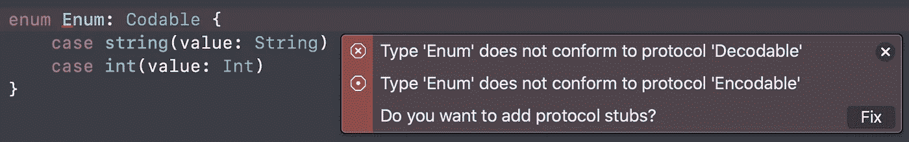

# 使用“withUnsafeBytes”用最少的样板文件对笨拙的类型进行编码

> 原文：<https://medium.com/codex/encoding-awkward-types-with-minimal-boilerplate-using-withunsafebytes-4032dd861d9f?source=collection_archive---------19----------------------->

图片来自[费伦茨·阿尔马西](https://unsplash.com/@flowforfrank)

# 历史

多年来，编码和解码 Swift 类型到`JSON`的首选方式一直是`Codable`协议。

这提供了一种比它的前身`JSONSerialization`更安全的处理 json 的方式，后者产生了`[String: Any]`字典。相反的，`Codable`提前处理转换，处理所有的类型转换，如果对象不能成功转换则失败。

`Codable`的另一个优点是，如果许多对象只包含其他`Codable`或简单类型，那么它们的一致性可以被合成。

综合可编码一致性

# 问题是

一个常见的不能合成一致性的地方是使用带有关联值的枚举。编译器会告诉我们类型不符合`Decodable`或者`Encodable`。

不可合成的可编码一致性

有许多方法可以解决这个问题，最常见的是使用`Decodable`或`Encodable`协议的定制实现。一个实现可能看起来像这样:

尽管这增加了大量的样板代码，但它也是不可重用的。如果我们有另一个不同格式的枚举，我们将不得不全部重写。

[提议](https://forums.swift.org/t/codable-synthesis-for-enums-with-associated-values/41493)将`Codable`合成添加到具有相关值的枚举中，但截至目前，Swift 语言中尚未添加任何内容。

# 解决方案:`withUnsafeBytes`来救援！

解决不同类型的可重用一致性问题的一个简单解决方案是使用`withUnsafeBytes`。这允许我们访问 Swift 对象的底层内存。然后，我们可以直接使用底层内存，或者将其作为更大的 JSON 对象的一部分。下面是一个简单(且可重用)的协议，它为我们完成了编码:

应该注意的是，这并不是一种可靠的序列化数据的方法，只是一种非常简单的方法。理想情况下，这些数据不应写入磁盘或在设备之间传输，因为 Swift 版本之间或不同设备之间的数据格式可能会发生变化。话虽如此，具有 ABI 稳定性的新版 Swift 可能会在一定程度上缓解这种担忧。

我将使用这种方法在我的单元测试和我的应用程序之间传输数据，以便在不同的启动条件下进行测试。我认为这相对安全，因为设备类型和 Swift 版本总是匹配的。