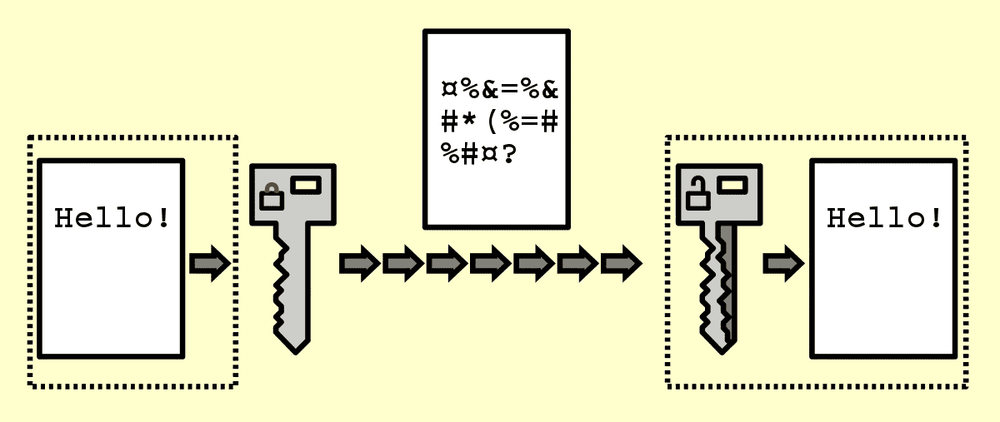

# 使用 Spark 加密数据—大数据(带可插拔代码)

> 原文：<https://medium.com/codex/encrypting-data-with-spark-big-data-with-pluggable-code-bd70175c98e2?source=collection_archive---------8----------------------->

图片来自[维基百科](https://upload.wikimedia.org/wikipedia/commons/thumb/7/70/Public_key_encryption_keys.svg/600px-Public_key_encryption_keys.svg.png)

数据加密将数据转换成另一种形式或代码，这样只有拥有密钥(正式称为解密密钥)或密码的人才能读取它。目前，加密是组织使用的最流行和最有效的数据安全方法之一。存在两种主要类型的数据加密——非对称加密，也称为公钥加密，和对称…