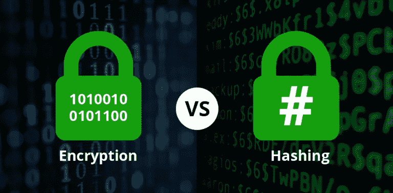
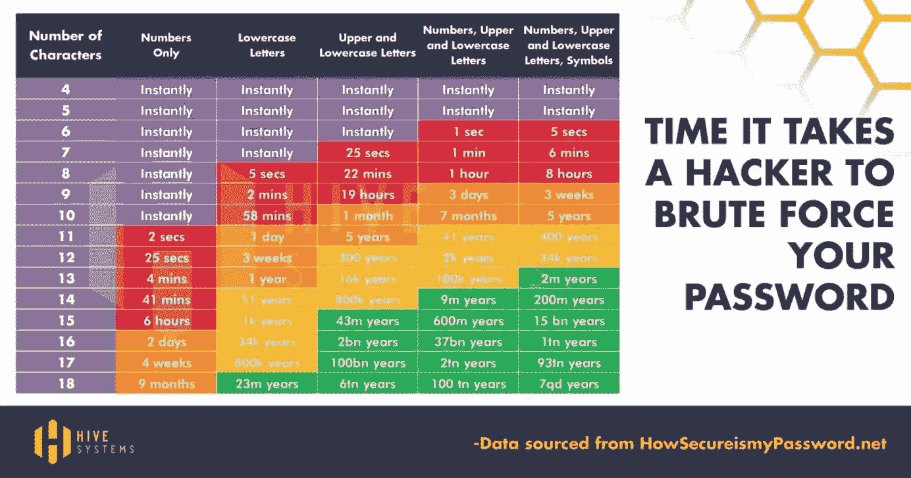

# 加密与哈希

> 原文：<https://medium.com/codex/encryption-vs-hashing-7a7f048d4162?source=collection_archive---------16----------------------->

## 有什么相同点和不同点？

加密与哈希

在编程世界中，有一些术语，比如**加密**和**散列**。那些是什么东西？它只是通过将原始数据转换为编码数据来使数据更加安全的一种方式。例如:

1.  从“abc”到“dhfhoiee”。
2.  从“123kd”到“shfkjdf”。
3.  等等。

## **加密**

加密只是一种双方达成某种协议的信息。一个加密的例子是**凯撒密码**。它是很久以前由尤利乌斯·凯撒(罗马将军)创造的。当他想与其他将军交流时，他用它，他想确保消息不会被第三方或敌人截获，所以他把消息变成了密码。这意味着如果有人得到了它，他们就无法破解，除非他们知道它是如何加密的。

凯撒密码的例子:

***双方一致:shift 键= 2***

1.  朱利叶斯发了一条信息:“你好，世界”
2.  加密后的数据会是:“Jgnnq Yqtnf”因为每个字都会前移 2 (H 变成 J，e 变成 g，等等)。
3.  这条“Jgnnq Yqtnf”消息随后被发送给其他将军。

因此，当朱利叶斯·凯撒的其他将军收到加密消息(密码)时，**他们将能够解密加密消息** **，因为他们知道消息是如何加密的(移位 2)** 。

1.  将军收到消息:“Jgnnq Yqtnf”
2.  解密的数据将是:“Hello World”，因为每个单词都将向后移动 2 (J 变成 H，g 变成 e，等等)。

shift 键并不总是必须是 2，它可以由双方讨论，以选择什么样的协议将最好地保护他们的消息。

## 散列法

另一方面，散列与加密非常相似，但有几个显著的区别。

1.  哈希基本上是一个数学公式，允许我们通过使用一些函数/工具将消息转换为哈希代码(随机字符)。
2.  与加密不同，哈希结果要复杂得多，也可能更长。
3.  当我们使用同一个散列函数时，无论您将什么消息放入该函数，它都将得到具有相同字符数的输出。
4.  当我们的消息改变时，散列也将改变。
5.  哈希是一个单向函数。您无法将哈希解密回其原始数据。

怎么可能呢？为什么我们不能把一个散列解密回它的原始数据？这里有一个非常简单的例子:

1.  把 hash 想象成数字的一个因子。
2.  2 乘以 4 等于 8。
3.  所以我们知道 2 加 4 是 8 的因数。很简单，因为还是个小数字。
4.  现在给定数字 989438。如果我们想知道 989438 的因子是什么，我们应该检查 989438 下面的所有数字，看它是否是因子。而且真的很难，需要很长时间。

因此，基本上，当我们遍历所有数字并将其相乘以寻找因子时，几乎就像是**从消息中创建散列**。最后的结果是散列。

但是如果我们想从散列值回到它的原始信息。你得用蛮力。我们必须将它除以给定数以下的每一个数，这对我们人类来说需要很多时间，对计算机来说需要很多能量和计算能力。尤其是当我们处理大量数据的时候。

在现实世界中，哈希使用数百位数字。所以事实是，**用了 900 年**的计算能力才找到一个 240 位数的数的因子。更多信息见下文

试试凯撒密码，这里。

试试哈希，[这里](https://passwordsgenerator.net/sha256-hash-generator/)。

就是这样。以上是**加密**和**哈希**的异同。希望这有帮助！