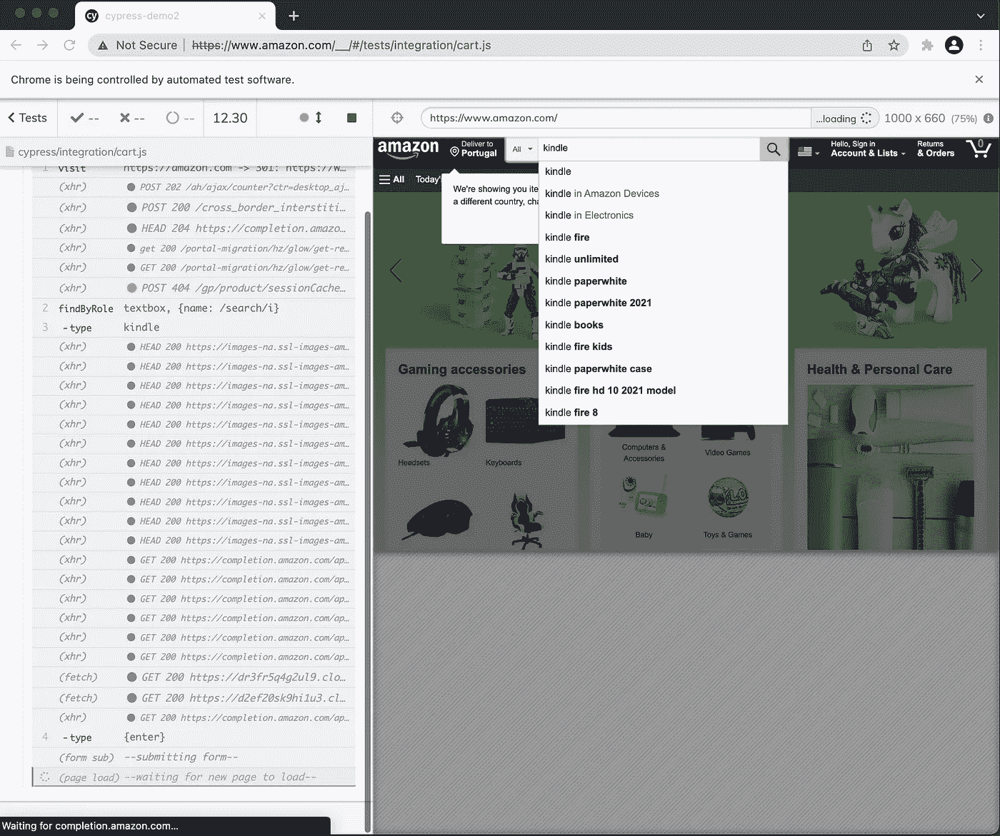

# 使用 Cypress 进行端到端测试，测试库

> 原文：<https://medium.com/codex/end-to-end-testing-with-cypress-testing-library-80339f104957?source=collection_archive---------11----------------------->

## 如果你想用 Cypress(一种基于节点的方法，Selenium 的替代方案)测试 web 用户界面，这里是你应该知道的最基本的东西。

# 1.新项目

在一个新文件夹中，运行`npm init`并按照步骤操作(有疑问时只需按回车键)。

我的建议是启动一个新的 git 存储库(`git init`)，这样你就可以在需要的时候撤销它。每一步都是跑一个`git commit`的好时机。从这个`[.gitignore](https://git-scm.com/docs/gitignore)` [文件](https://git-scm.com/docs/gitignore)开始:

```
/node_modules
.vscode
.idea
```

# 2.添加柏树

1.  运行命令:`npm install cypress --save-dev`
2.  在`package.json`，将命令(在`"scripts"`下)更改为`"test": "cypress run --browser chrome --headed"`
3.  在项目的根目录下，为 Cypress 配置创建一个名为`cypress.json`的空文件，内容为:`{ "video": false }`
4.  现在我们需要一个模拟测试来证明目前为止一切正常。用名为`amazonCart.js`的文件创建文件夹结构`cypress/integration`。内容应该是:

```
describe('Amazon cart test', () => {
    it('adds to cart', () => {
        expect(true).to.equal(true);
    })
})
```

现在，用`npm test`(或者仅仅是`npm t`)运行测试。您应该看到:`✔ All specs passed!`

# 3.添加测试库

对我来说，[测试库](https://testing-library.com/)是测试 web 应用或网站时必备的。一方面，它促进了[测试与 HTML 细节的完全分离，比如 id 和类](/codex/decoupling-tests-from-the-implementation-interfaces-5842380f9656)(这是一个[反模式，只是为了测试](/codex/anti-patterns-of-automated-software-testing-b396283a4cb6)。另一方面，它有助于编写有利于[可访问性](https://en.wikipedia.org/wiki/Web_accessibility)和 [SEO](https://en.wikipedia.org/wiki/Search_engine_optimization) 的[语义 HTML](https://en.wikipedia.org/wiki/Semantic_HTML) 。如果你不能很容易地找到某样东西，用户怎么可能做到呢？屏幕阅读器如何处理糟糕的 HTML？内置选择器像用户一样查找元素。

让我们用`npm install @testing-library/cypress --save-dev`添加 Cypress 版本的测试库

将此行添加到项目的`cypress/support/commands.js`:

```
import '@testing-library/cypress/add-commands';
```

让我们通过改变`cypress/integration/amazonCart.js`来试验一下用于测试库的 [Cypress:](https://testing-library.com/docs/cypress-testing-library/intro/)

```
describe('Amazon cart test', () => {
    it('adds to cart', () => {
        cy.visit("https://amazon.com")
        cy.findByRole('textbox', {name: /search/i})
          .type("kindle").type("{enter}")
    })
})
```

`findByRole`是测试库的一个例子。由于这个文本框没有标签，我们不得不求助于角色方法。我推荐阅读关于测试库查询的官方页面。

现在，用`npm t`再次运行测试，看看结果:



**✔所有规格通过！**