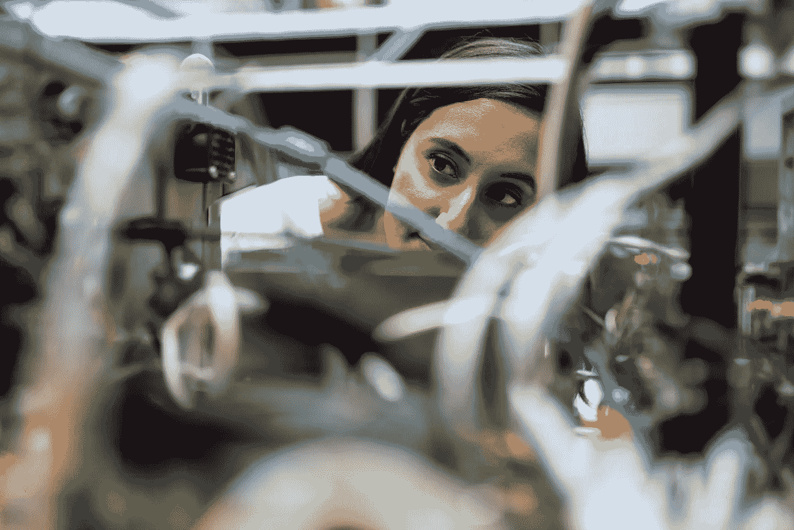

# 工程师作为数据科学家？

> 原文：<https://medium.com/codex/engineers-as-data-scientists-a07112667b18?source=collection_archive---------29----------------------->

## 如何将物联网和大数据的趋势联系起来

在 [Unsplash](https://unsplash.com/s/photos/engineering?utm_source=unsplash&utm_medium=referral&utm_content=creditCopyText) 上拍摄的 [ThisisEngineering RAEng](https://unsplash.com/@thisisengineering?utm_source=unsplash&utm_medium=referral&utm_content=creditCopyText)

在许多领域，来自各种企业部门的员工正在接受 It 和数据亲和力方面的培训，这已经是一个现实。可以自动化的活动正在被淘汰，员工正在承担更多的任务，例如在数据分析领域。在工程领域也可以观察到这种趋势。