# 用 CNN-VGG16 增强黑色素瘤分类器模型

> 原文：<https://medium.com/codex/enhanced-melanoma-model-classifier-with-cnn-vgg16-c82e236fd3f0?source=collection_archive---------5----------------------->

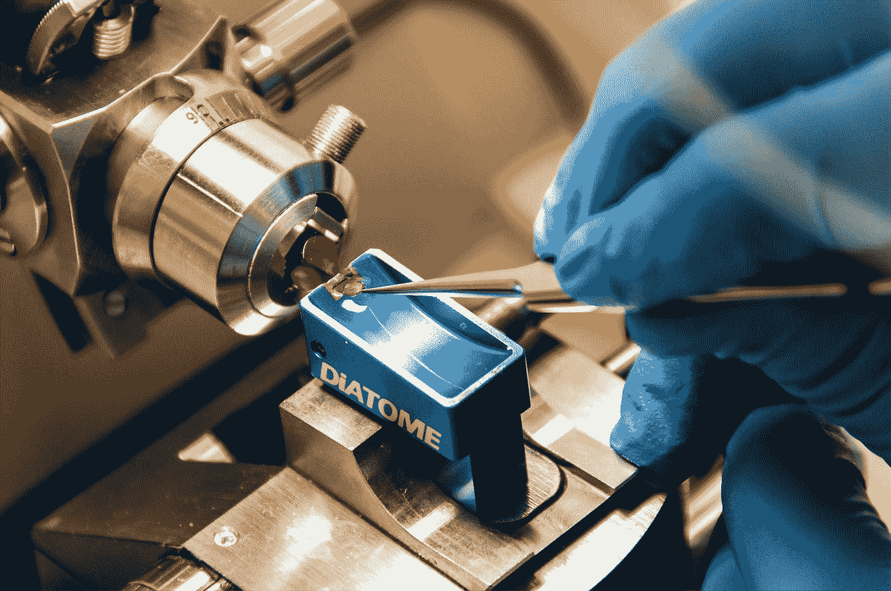

[国立癌症研究所](https://unsplash.com/@nci?utm_source=medium&utm_medium=referral)在 [Unsplash](https://unsplash.com?utm_source=medium&utm_medium=referral) 拍摄的照片

从上一个[帖子](https://maryadewunmi.medium.com/build-a-melanoma-image-classification-model-with-convolutional-neural-network-cnn-d96a61b9e639)开始承诺增加模型精度，我做了进一步的研究。除了通过增强增加图像数据集的图像大小之外，在用 CNN 训练模型之前用 VGG16 预处理图像可以给出更高的准确性。在寻找提高精度的方法时，我遇到了 Keras 预处理函数，它特定于 VGG16 模型`keras.applications.vgg16.preprocess_input`，并通过从原始 ImageNet 训练集中减去平均 RGB 通道值来执行额外的步骤。

在这个项目中，我们提出了一个基于深度神经网络(DNN)的黑色素瘤分类器模型，该模型由具有 16 层的视觉几何组-vgg 16(Simon Yan，k .，& Zisserman，A. (2014)提出。首先，我们将样本预处理为字节图，其中每个字节代表一个灰度像素。使用在 ImageNet 数据集上预先训练的 VGG16 的卷积层，我们通过扣除原始图像网的平均 RGB 通道值来提取滤波器激活图(也称为瓶颈特征),并调整训练集图像。

完整的代码可以在[这里](https://github.com/MaryAdewunmi/Preprocess-Image-with-VGG16/blob/main/Melanoma_Classifier_Model_with_VGG16_CNN.ipynb)找到。

# 🌱该项目的目标

这是为了增加黑色素瘤分类器模型的准确性。

# 🌱**本项目使用的框架**

这只是说明了我们如何达到一个更快的模型，高精度地训练黑色素瘤图像。

*   在此整理[的数据集](https://www.kaggle.com/c/siim-isic-melanoma-classification/data)
*   用 VGG16 对图像进行预处理，提取特征和标签
*   为 CNN 模型设置参数或微调图像和环境
*   用 CNN 训练图像
*   以准确性作为衡量标准评估模型

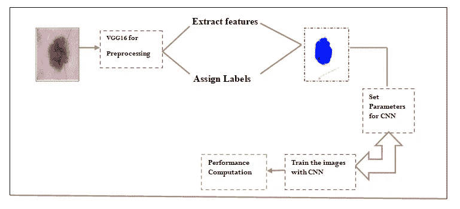

**vgg 16 预处理模型的架构—作者**

# 🌱**代码** **实现**

导入必要的库，特别是 Keras 和张量流，使用准确度、精确度和召回率作为衡量标准。

# 🌱**加载数据集**

通过使用已经拆分的数据集加载数据集，使用图像数据生成器库，2239 个图像用于训练和有效数据集批次，118 个图像用于测试批次数据集。

我们使用 TensorFlow-Keras，vgg16 图像数据生成器，更多信息请点击[这里](https://www.tensorflow.org/api_docs/python/tf/keras/preprocessing/image/ImageDataGenerator)

> 📍请注意，这是使用 VGG16 对图像进行预处理的地方。

👉**查看图像，您能发现输入数据集中的差异吗？**

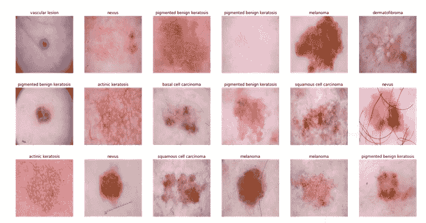

[原始图像](https://www.kaggle.com/c/siim-isic-melanoma-classification/data)

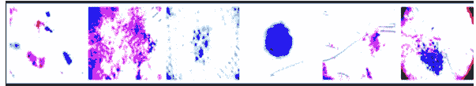

VGG16 预处理病变图像—作者

# 🌱**用 CNN 训练图像**

在过去的十年中，卷积神经网络在一系列模式识别领域取得了突破，从图像处理到语音识别。CNN 的最大优点是减少了 ANN 中的参数数量。这一成就激励了学者和开发人员考虑使用更大的模型来执行挑战性的任务，这些任务在以前用传统的人工神经网络是不可能解决的；关于 CNN 解决的问题，最重要的假设是它们不应该包含空间相关的属性。换句话说，在人脸检测应用中，我们不需要担心人脸在照片中的位置(S. Albawi 等人)。

我们使用了具有卷积 2D、内核大小(3，3)、relu 激活、零填充、池大小、2，2、学习速率、Adam 优化器的顺序模型，以准确性作为衡量标准。

该层的激活功能称为“激活”使用激活函数的模型可以解释非线性关系。当预测患者的糖尿病时，为了澄清，预测 9 种病变类型中的一种病变图像类型是非线性模型，我们将使用 ReLU 或校正的线性激活作为我们的激活函数。尽管它由两个线性部分组成，但它已被证明在神经网络中有效地运行。

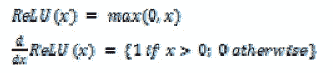

[来源](https://ieeexplore.ieee.org/abstract/document/8308186)

填充等于“相同”,在减小图像尺寸以适应 CNN 模型要求后，通过向其他中的图像添加零来提高图像质量。

优化器和损耗参数用于编译模型。
学习率由优化器控制。作为一个优化器，我们将使用“adam”在整个训练过程中，adam 优化器会调整学习率。学习率控制着模型最优权重的计算速度。较慢的学习率 0.0001，是的，它可能需要更长的时间来计算权重，但它可以导致更准确的权重。

在图像处理领域，池对于降低分辨率和复杂性是有用的。过滤器的数量不受池化的影响。最常见的联营策略形式之一是最大联营。它将图像分成子区域矩形，只返回每个子区域内的最大值。最大池中最常用的区域大小之一是 2×2。步幅为 2。此外，池化可以与非相等的过滤器和步长一起使用，以提高效率(D. Stutz 和 L. Beyer(2014))

模型看起来像这样👇

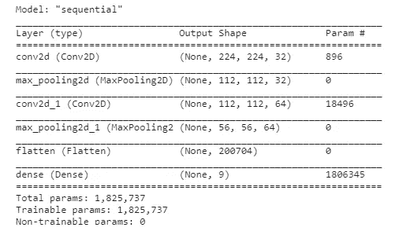

模型摘要

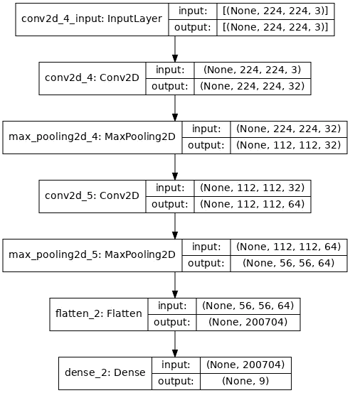

# 🌱编译模型

时期和详细时期的数量决定了模型在数据上循环的次数。在某种程度上，随着我们运行更多的纪元，该模型将会不断改进。此后，该模型将不再随着每个时代而改进。此外，模型的历元越多，运行的时间就越长。

```
history = model.fit(x=train_batches,
    steps_per_epoch=len(train_batches),
    validation_data=valid_batches,
    validation_steps=len(valid_batches),
    epochs=10,
    verbose=2
)
```

# 🌱**性能计算**

获得了 93%的曲线下面积(AUC)度量，这表明黑色素瘤分类器的准确度非常高。结果还表明，没有过度拟合，因为训练和验证损失在下降，而不是增加，或者有一个看起来奇怪的准确性图表😂。

```
result_batch = model.predict(test_batches)labels_batch = label_names[np.argmax(result_batch, axis=-1)]
labels_batch
```

**🎯结果👇**

记住，在使用图像数据生成器代码分割数据集之后，我们有 118 个测试图像来测试我们的分类器模型。

你和我想的一样吗🤔

> 👌**因此，该模型实际上可以用于对除黑色素瘤以外的其他类型的皮肤癌进行分类，如基底细胞癌、皮肤纤维瘤、痣、鳞状细胞癌等。**

```
array(['Basal Cell Carcinoma', 'Basal Cell Carcinoma', 'Nevus',
       'Basal Cell Carcinoma', 'Melanoma', 'Basal Cell Carcinoma',
       'Pigmented Benign Keratosis', 'Dermatofibroma', 'Nevus', Nevus',
       'Nevus', 'Squamous Cell Carcinoma', 'Nevus',
       'Pigmented Benign Keratosis', 'Pigmented Benign Keratosis',
       'Nevus', 'Nevus', 'Nevus', 'Nevus', 'Basal Cell Carcinoma',
       'Pigmented Benign Keratosis', 'Melanoma', 'Basal Cell Carcinoma',
       'Melanoma', 'Pigmented Benign Keratosis', 'Melanoma',
       'Basal Cell Carcinoma', 'Basal Cell Carcinoma',
       'Pigmented Benign Keratosis', 'Pigmented Benign Keratosis',
       'Basal Cell Carcinoma', 'Nevus', 'Squamous Cell Carcinoma',
       'Basal Cell Carcinoma', 'Pigmented Benign Keratosis', 'Nevus',
       'Melanoma', 'Nevus', 'Nevus', 'Basal Cell Carcinoma', 'Nevus',
       'Melanoma', 'Melanoma', 'Nevus', 'Vascular Lesion', 'Nevus',
       'Nevus', 'Melanoma', 'Nevus', 'Pigmented Benign Keratosis',
       'Basal Cell Carcinoma', 'Pigmented Benign Keratosis', 'Nevus',
       'Pigmented Benign Keratosis', 'Nevus', 'Nevus', 'Nevus',
       'Melanoma', 'Basal Cell Carcinoma', 'Nevus', 'Nevus', 'Melanoma',
       'Nevus', 'Melanoma', 'Basal Cell Carcinoma',
       'Pigmented Benign Keratosis', 'Pigmented Benign Keratosis',
       'Nevus', 'Nevus', 'Pigmented Benign Keratosis', 'Melanoma',
       'Nevus', 'Nevus', 'Nevus', 'Basal Cell Carcinoma',
       'Pigmented Benign Keratosis', 'Pigmented Benign Keratosis',
       'Nevus', 'Pigmented Benign Keratosis', 'Squamous Cell Carcinoma',
       'Basal Cell Carcinoma', 'Melanoma', 'Pigmented Benign Keratosis',
       'Nevus', 'Pigmented Benign Keratosis', 'Melanoma',
       'Vascular Lesion', 'Melanoma', 'Melanoma', 'Melanoma',
       'Pigmented Benign Keratosis', 'Nevus',
       'Pigmented Benign Keratosis', 'Pigmented Benign Keratosis',
       'Melanoma', 'Nevus', 'Melanoma', 'Pigmented Benign Keratosis',
       'Melanoma', 'Nevus', 'Basal Cell Carcinoma', 'Vascular Lesion',
       'Pigmented Benign Keratosis', 'Pigmented Benign Keratosis',
       'Basal Cell Carcinoma', 'Melanoma', 'Nevus',
       'Pigmented Benign Keratosis', 'Pigmented Benign Keratosis',
       'Nevus', 'Squamous Cell Carcinoma', 'Pigmented Benign Keratosis',
       'Nevus', 'Nevus', 'Melanoma', 'Basal Cell Carcinoma',
       'Pigmented Benign Keratosis', 'Nevus'], dtype='<U26')
```

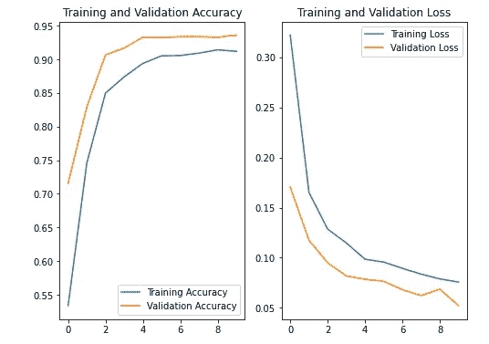

该分类器还实现了 1 的精确度、0.5 的召回率和 0.67 的 f 1 分数。

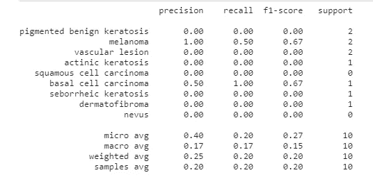

# 🌱**保存分类器模型和结果预测**

我们使用下面这个简单的代码保存了黑色素瘤模型，以便将来重用和转移学习。

```
saved_model = model.save("melanoma_model")
```

**🎯结果预测**

请记住，数据集在测试目录下已被分为黑色素瘤和其他类型的病变图像。所以，你可以一个接一个地挑选图像来分类它是否是黑色素瘤。如果是黑色素瘤，那么需要采取紧急行动，否则，可以进行进一步的调查。

```
from keras.preprocessing import image
img = image.load_img('../input/skin-cancer9-classesisic/Skin cancer ISIC The International Skin Imaging Collaboration/Test/dermatofibroma/ISIC_0001114.jpg',target_size=(224,224))
img = np.asarray(img)
plt.imshow(img)
img = np.expand_dims(img, axis=0)from keras.models import load_model
saved_model = load_model("melanoma_model")
output = saved_model.predict(img)
if output[0][0] > output[0][1]:
    print("melanoma")
else:
    print('not melanoma')
```

图像的黑色素瘤分类器 ISIC_0000002(黑色素瘤)、ISIC _ 0000004.jpg(黑色素瘤)和 ISIC_0001114.jpg(非黑色素瘤)

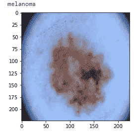

ISIC_0000002.jpg

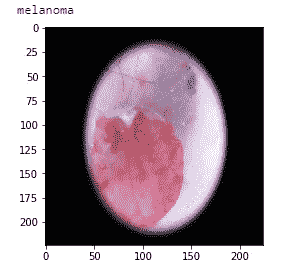

ISIC_0000004.jpg

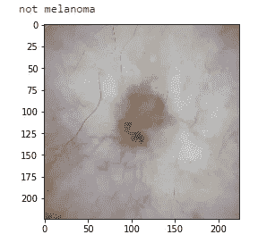

ISIC_0001114.jpg

# 🌱结论

通过 VGG16 对黑色素瘤图像进行预处理，该黑色素瘤分类器的准确率达到 93%，精度为 1%，召回率为 0.5%。这表明，在训练图像可以在深度学习模型上训练之前，需要对它们进行调整，特别是当目标是更高的性能准确性时。

完整的代码可以在我的[这里找到](https://github.com/MaryAdewunmi/Preprocess-Image-with-VGG16/blob/main/Melanoma_Classifier_Model_with_VGG16_CNN.ipynb)

对于研究人员，请使用此链接[参考并引用 https://www.scienceopen.com/document/read?的工作 id = bbdc 162 f-242 b-41d 4-a07a-6df 03110 f0bd](https://www.scienceopen.com/document/read?id=bbdc162f-242b-41d4-a07a-6df03110f0bd)

🌱**参考文献**

📌Rotemberg，v .，Kurtansky，n .，Betz-Stablein，b .，Caffery，l .，Chousakos，e .，Codella，n .，Combalia，m .，Dusza，s .，Guitera，p .，& Gutman，D. (2021)。一个以患者为中心的图像和元数据数据集，用于使用临床背景识别黑色素瘤。*科学数据*， *8* (1)，1–8。

📌Simonyan 和 a . zisser man(2014 年)。用于大规模图像识别的非常深的卷积网络。 *arXiv 预印本 arXiv:1409.1556* 。

📌[https://www . ka ggle . com/c/siim-ISIC-黑色素瘤-分类/数据](https://www.kaggle.com/c/siim-isic-melanoma-classification/data)

📌S. Albawi，T. A. Mohammed 和 S. Al-Zawi，“对卷积神经网络的理解”， *2017 年国际工程与技术会议(ICET)* ，2017，第 1–6 页，doi:10.1109/icengtechnol . 2017 . 20138600107

📌D. Stutz 和 L. Beyer，“理解卷积神经网络”，2014 年。

📌[https://www . tensor flow . org/API _ docs/python/TF/keras/preprocessing/image/imagedata generator](https://www.tensorflow.org/api_docs/python/tf/keras/preprocessing/image/ImageDataGenerator)

恭喜你。现在，您正在使用 VGG16-CNN 构建黑色素瘤癌症分类器👏👏

为了便于参考和引用，关于这项工作的科学海报可以在[这里](https://www.scienceopen.com/document/read?id=bbdc162f-242b-41d4-a07a-6df03110f0bd)找到

本教程的 Github 库可以在这里找到[。](https://github.com/MaryAdewunmi/Preprocess-Image-with-VGG16/blob/main/Melanoma_Classifier_Model_with_VGG16_CNN.ipynb)

感谢阅读！

快乐编码😘