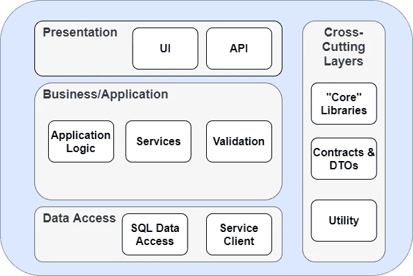

# 企业软件模式:第 1 部分

> 原文：<https://medium.com/codex/enterprise-software-patterns-part-1-b2da0247929e?source=collection_archive---------8----------------------->

在 [Unsplash](https://unsplash.com?utm_source=medium&utm_medium=referral) 上由[海拉戈斯蒂奇](https://unsplash.com/@heylagostechie?utm_source=medium&utm_medium=referral)拍摄的照片

如今，软件世界中有如此多的细微差别。如果你是一名新的开发人员，当你得到第一份工作时，理解如何将东西组合在一起可能是压倒性的。尤其是这么多人经历新兵训练营和其他快速培训课程，一些最重要的东西被忽略了。在这个系列中，我们将探索一些最基本和最常见的企业模式和实践，努力使它们对新老软件开发人员来说更容易理解。在第一版中，我们将探讨什么是 N 层架构，以及它可能由哪些组件组成。在以后的文章中，我们将分解这些组件，看看如何最好地使用它们。

# 什么是 N 层架构？

n 层架构，或者更常见的 3 层架构，是最常见的软件设计模式之一。您可能猜到了，它通常由三层组成:表示层、业务层和数据层。除了这些层之外，您通常会发现不计入层数的交叉部分，因为它们由一个或多个层共享。顾名思义，这些系统通常可以有 3 个以上的公共层，尽管一般来说，附加层只是高级业务逻辑的各种形式。我们将进一步分解这些，但是首先，让我们讨论横切层通常由什么组成。

# 交叉？更像是迷惑！

交叉层有时会令人困惑，尤其是刚开始的时候。不过，请放心，它们并没有那么可怕，它们的存在是为了让生活变得更容易(至少通常是这样)。交叉型层的典型示例有:

*   公用事业项目
*   共享“核心”功能
*   dto(数据传输对象)和其他模型
*   服务*

**服务几乎总是以业务逻辑为中心，在这里并不存在，但在某些情况下可能与横切风格层更紧密地结合在一起。*

既然我们已经确定了可能的层，我们将探索上面的每一个具体项目可能由什么组成。

根据应用程序的不同，实用程序和共享“核心”层通常非常相似，所以我们将一起讨论它们。这些类型的项目通常是您想要放置所有通用共享代码的地方，包括扩展方法之类的东西；日志、响应工厂等的公共接口。；和其他可能被多个层访问的基础级代码。您通常会在这些类型的层中找到其他系统范围的抽象。

数据传输对象和模型项目由简单的对象、契约和模型组成，*通常*不包含业务逻辑(尽管这将根据您的应用程序和其他设计选择而有所不同)。根据您所选择的语言，您可能会听到 POCOs(普通 C#对象)或 POJOs(普通 Java 对象)。这些类型的类几乎总是在不同的层之间传递，以简化事情。随着这些 d to 开始专门化，有时它们在其他层可能会更好，也就是说，与通用项目相比，数据库实体与您的数据层项目紧密结合可能更有意义。

# 是读作 Data 还是 Data？

从底层开始，数据层是围绕数据源的抽象。通常遵循存储库模式(我们将在以后的文章中探讨这一点)，特别是如果直接使用数据库作为底层数据存储，这些项目会混淆任何有关如何存储和检索数据的特定逻辑，以便简化您的业务逻辑。最佳实践是将数据存储和检索逻辑与应用程序的其余部分隔离开来，这样数据存储就可以很容易地交换，同时也是为了一般的可伸缩性和可维护性。根据系统的不同，数据层可能返回共享模型，也可能直接返回数据库实体。在这种情况下，实体通常会非常紧密地映射到底层数据结构，即使不是完全映射。如果期望或想要的数据格式在可能的数据源之间是一致的，那么这些就特别有用(也很常见)。

现在您可能也想知道，如果我的数据层不直接与数据库接口，它会做什么？在一个日益关注微服务的世界中，数据层可能只是另一个服务风格的层，它通过对其他服务进行 API 调用来交互和聚合数据，以满足更专业的业务逻辑需求。如果您正在使用 PaaS 或存储即服务产品，如 Azure Blob Storage 或 AWS S3 或其他类似技术，您也可能会发现类似的情况。

概括地说，数据层项目的重点实际上是从应用程序的其余部分中抽象出和混淆特定于数据存储的逻辑。

# 我们在做生意！

那么现在我们已经得到了数据，我们要用它做什么呢？这就是您的业务层发挥作用的地方。业务逻辑，通常也称为应用程序或领域逻辑，是大多数应用程序的主体。这是开发人员花费最多时间的地方，因为它通常是任何系统中最复杂的部分，通常是出于需要。让我们用一个非常简单的例子来说明:有一个 API 允许您提供一个 ID 和一个格式字符串，作为响应，它返回一个客户的格式化全名。在数据库中，每个客户都是单独存储的，他们的所有属性都是单独存储的，即 CustomerFirstName、CustomerLastName、CustomerCity 等。这里，数据层将知道如何根据提供的 ID 从数据库中检索这个实体。您可能会问“如果我有这些单独的字段，如何让 API 返回客户的全名？”—这就是应用程序逻辑的用武之地。您的业务层了解如何使用上述客户实体，以及如何通过基于所提供的格式连接 CustomerFirstName 和 CustomerLastName 字段，将各个字段转换为全名。当然，这是一个虚构的例子，但是它展示了业务层在更大的应用程序中的角色。

您可能在业务层中发现的一些其他类型的东西包括:服务、工厂、命令、查询、验证器、管理器、编排器等等。在下一篇文章中了解更多。

 [## 企业软件模式:第 2 部分

### 欢迎回到我们的企业编码模式系列！如今，软件世界中有如此多的细微差别…

medium.com](/codex/enterprise-software-patterns-part-2-5d374ee000db) 

# 还剩下什么要呈现？

数据已经被底层获取和操作，但是现在它需要以某种方式显示在某个地方。这就是表示层发挥作用的地方。这通常是系统变化最大的地方，也是它们最有创造力的地方。您可能正在使用一个微服务，其中的“表示”只不过是 API 控制器和端点。或者，您可能正在使用一个单页面应用程序(SPA)、一个. NET MVC/Razor 应用程序、一个桌面应用程序，或者以上所有应用程序的组合。在特别大的(单片)应用程序中，在应用层中看到多个项目是相当常见的，因为这些项目通常同时托管一个 API 和另一个 UI 类型的项目，即使它们是单独部署的。

这一层中项目的复杂性通常与业务逻辑的复杂性成比例。随着该层中存在更多的规则，UI 或 API 通常会变得更加复杂。然而，如果遵循我们在本文中探索的一些概念以及一些未来的概念，仅仅因为 UI 更复杂，并不一定意味着从长远来看它的可伸缩性或可维护性更差。

# 下一步是什么？

接下来，我们将深入探讨我们在此强调的一些概念，以及其他更高级的主题。

想看一些具体的东西吗？留言评论！