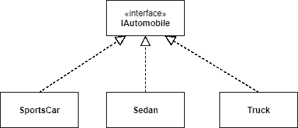
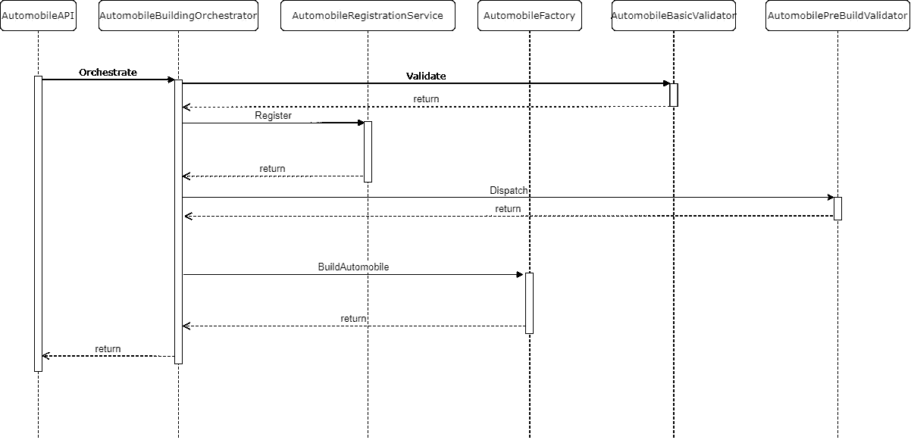

# 企业软件模式:第 2 部分

> 原文：<https://medium.com/codex/enterprise-software-patterns-part-2-5d374ee000db?source=collection_archive---------6----------------------->

弗洛里安·奥利佛在 [Unsplash](https://unsplash.com?utm_source=medium&utm_medium=referral) 上拍摄的照片

欢迎回到我们的企业编码模式系列！如今，软件世界中有如此多的细微差别。如果你是一名新的开发人员，当你得到第一份工作时，理解如何将东西组合在一起可能是压倒性的。随着这么多人经历新兵训练营和其他快速培训课程，一些最重要的东西被忽略了。在下一版中，我们将深入探讨[业务层](/codex/enterprise-software-patterns-part-1-b2da0247929e)的一些最常见的组件:服务、工厂、命令、查询、验证器和编排器。

 [## 企业软件模式:第 1 部分

### 如今，软件世界中有如此多的细微差别。如果你是一个新的开发人员，它可以压倒…

medium.com](/codex/enterprise-software-patterns-part-1-b2da0247929e) 

# 很高兴为您服务

服务是任何应用程序最基本的方面之一。为什么？因为他们太全能了！当然，它们有时最终会成为模糊相关功能的总括型组件，但这通常是它们如此伟大的原因。如果您在一个严格限定范围的领域中处理大量常见的复杂逻辑，服务组件可能正是您所需要的。您还会经常在抽象或包装外部功能的地方看到服务。不管该功能是否存在于您的应用程序中，您都希望确保用于与之交互的接口是通用的——您可能会发现，即使您从系统中的该功能开始，随着应用程序其余部分的增长，将其移出可能更有意义。

让我们看一个关于 PDF 操作的例子。有各种各样的网络服务，你可以提供 PDF 和必要的说明，他们可以做简单的事情，如合并，分割等。也有几乎每种语言的库，提供类似的功能，而不需要进行 web 调用。根据您的应用程序的性质，其中一个可能更好。这是创建足够通用的 IPdfService 接口的好时机，这样您就可以轻松地交换底层实现。将此类内容与服务区分开来的另一个方面是，*通常(但不总是)，*服务不直接进行数据访问，而是简单地为应用程序的其余部分提供黑盒风格的服务。

# 我做了一个！

你有没有发现自己一遍又一遍地写同一个对象初始化代码？或者创建多个从同一个接口派生的不同对象？那你可能要考虑工厂了。就像现实世界中的工厂一样，它们旨在帮助简化对象的创建/初始化。让我们看一个关于汽车的例子。

一个简单的以汽车为中心的例子

所以我们有一个 *IAutomobile* 接口，由三种不同类型实现:**跑车、轿车、**和**卡车**。现在，所有这三个实例可能共享许多公共组件，对吗？每辆车的细节可能会有所不同，但从高层次来看，每辆车都有 4 个轮子、窗户、门、引擎、变速器等。为了更容易在代码中构建这些，我们将使用类似于 **AutomobileFactory** 的东西，我们可以提供一些细节，以便简化创建这些之间的大量共享代码。第二好的部分？您不需要搜索所有创建轿车实例的地方，因为它们都集中在一个地方。

# 去拿吧

命令和查询通常被视为称为 CQRS 的更广泛概念的一部分，该概念代表命令查询责任分离。我们将在以后的文章中探讨更广泛的概念，但是现在，只需要理解这两个组件是主要的焦点。两者本身都不复杂——命令用于*做*而查询用于*得到*。换句话说，如果你需要执行一个动作，你可以写一个命令来实现它；或者，如果您需要从系统中检索一些数据，您可以编写一个查询。正如模式名所暗示的，最好将这两件事分开，即不要从查询中调用命令，反之亦然。

继续我们汽车工厂的主题，您可能在命令/查询世界中看到的一些东西可能是这样的: *RegisterCarCommand、GetCarRegistrationQuery、CreateCarCommand* (可能会使用前面的 *IAutomobileFactory* )等等。请注意，这些通常也是尽可能集中的，并且通常只做一件事，以帮助减少开销——然而，这不是一个要求，只是一个最佳实践。

# 我这样做对吗？

验证是任何应用程序的重要组成部分——它不仅有助于确保数据完整性，还有助于实施应用程序的某些要求和期望。您还可能看到验证发生在应用程序的多个层，通常是 web/表示层和业务层。在这种情况下，您可能会看到在 API 级别进行非常高级别的验证，只是为了确保数据足够好，可以进入系统。在进一步操作之后，您可能希望在业务层的某个地方再次进行验证，以确保您的需求仍然得到满足。在某些情况下，对于完全相同的数据，在 API 和业务层执行的验证可能是相同的——这是一个很好的实践，以防您最终从不同的地方调用某些方法，即使这在某些路径上是多余的。验证也可能发生在离数据层更近的地方，但这并不常见，通常只在极其复杂的特定于数据源的场景中出现。

回到我们的汽车主题，让我们假设有一个 API 来创建一辆新车，它接受非常基本的项目，如类型、装饰、内部颜色和外部颜色。您的 API 将首先验证所提供的选项是否可用。例如，假设您只有黑色和米色的内饰颜色选项，而请求是红色的内饰—您希望让用户知道红色不是可用的选项(如果使用 HTTP，通常通过 400 状态代码，但这超出了本文的范围)。接下来，假设所提供的参数在最顶层都是有效的，并且汽车已经通过了几个额外的阶段，您可能还想验证其余的必要组件&文书工作是否存在。想象这一切看起来像一条装配线，你有一个最终的*buildcar 命令*，该命令将验证你有一个有效的注册，所有可用的零件和任何其他你需要确保在你实际建造车辆之前。

# 如何把它放在一起

到现在为止，您可能想知道所有这些东西是如何协同工作的。现在，有多种方法可以做到这一点，但更常见的做法之一是 Orchestrator 模式。Orchestrate 的意思是按照特定的顺序将事情放在一起，这正是 Orchestrator 类型的类在软件中所做的事情。您可以使用它将多个验证链串在一起，或者以特定的顺序调用一些服务。它甚至可能比这更复杂，因为制造一辆汽车是一个相当复杂的场景，一个管弦乐队在这里会有很大的帮助。

汽车编排序列图

正如我们在上面的图表中看到的，orchestrator 负责大部分工作，而其余的组件非常专注于做一件特定的事情——orchestrator 也是，但是它的重点是组织而不是做。首先，orchestrator 由 API 调用。接下来，就像我们之前讨论的那样，我们将希望使用 AutomobileBasicValidator 来验证初始提供的值，以检查颜色、修剪等。假设所有这些都通过了，我们将希望确保我们可以注册汽车，因此我们将调用 AutomobileRegistrationService 来完成这项工作。接下来，我们希望确保我们拥有实际生产所需汽车所需的所有零件，因此我们调用 AutomobilePreBuildValidator 来检查零件、成功注册等。最后，我们称汽车工厂为真正生产汽车的工厂。之后可能还会有额外的步骤，其中可能包括更多的验证或安装选项。希望到现在为止，你可以看到管弦乐队在大局中扮演的角色有多重要。

# 摘要

我们探索了各种业务组件，包括服务、工厂、命令、查询、验证器和编排器。我们了解了服务组件与其他组件的区别，何时使用工厂以及如何进行验证。我们还谈到了来自 CQRS 的命令和查询，以及将它们联系在一起的 orchestrator 模式。

# 下一步是什么？

接下来，我们将深入探讨我们在此强调的一些概念，以及其他更高级的主题。

想看一些具体的东西吗？留言评论！