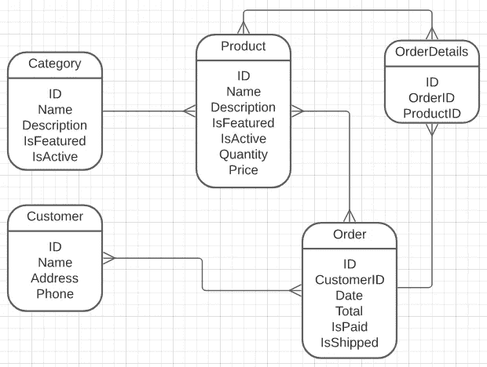

# 实体关系图(ERD) 101

> 原文：<https://medium.com/codex/entity-relationship-diagram-erd-101-11a12bf9a227?source=collection_archive---------10----------------------->

## ERD 是什么，实体关系图的类型:概念的、逻辑的、物理的

你好。在本文中，我将讲述实体关系图，也就是我们所知道的实体关系图。

照片由[叶小开·克里斯托弗·古特瓦尔德](https://unsplash.com/@project2204?utm_source=unsplash&utm_medium=referral&utm_content=creditCopyText)在 [Unsplash](https://unsplash.com/s/photos/database?utm_source=unsplash&utm_medium=referral&utm_content=creditCopyText) 上拍摄

实体关系图是数据库设计的图形表示。有三种类型的 ERD。

*   概念设计
*   逻辑设计
*   结构设计

实体关系图帮助我们找出数据库模式和逻辑。此外，他们帮助我们记录我们的数据库。

# 眼角皱纹

鱼尾纹是我们在实体关系图中使用的一种符号。在本文中，为了简单起见，我将使用不带基数符号的符号。但是，知道有符号描述基数级别可能会有所帮助。

鱼尾纹基本上表明，如果关系上有 3 条线，它表示 3 条线的一侧是多(多)类型的关系(例如，类别可以有多个产品)。如果关系中只有一条线，则它是单一类型关系。

# 概念设计

概念设计提供了系统的高级图，重点是系统中涉及的业务对象。在这一级，数据库表不是设计出来的。

概念设计

# 逻辑设计

在逻辑设计中，业务对象或实体具有属性(列)。这些属性开始详细描述构成最终数据库表中单个记录(或行)的信息。然而，仍然没有为属性定义 RDBMS 特定类型。这种级别的设计为业务涉众提供了一个单一记录中的内容点。

逻辑设计

# 结构设计

这个设计级别是我们为每个属性定义 RDBMS 特定数据类型的级别。此外，我们在定义数据类型时需要注意，因为特定 RDBMS 的构造、约定或限制可能会有所不同。

物理设计(MySQL 的数据类型)

# 最后

希望这篇文章能帮助你理解什么是 ERD，什么是 ERD 类型。有时我们认为这些理论上的东西并不重要。然而，一旦你理解了它们的目的和它们解决的问题，以及它们如何帮助我们开发项目，你就会把它们放进你的工具箱。

问候