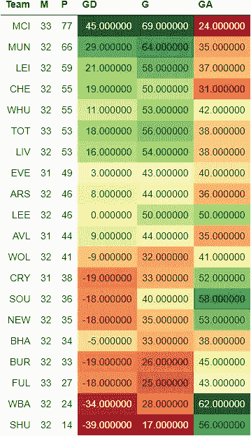
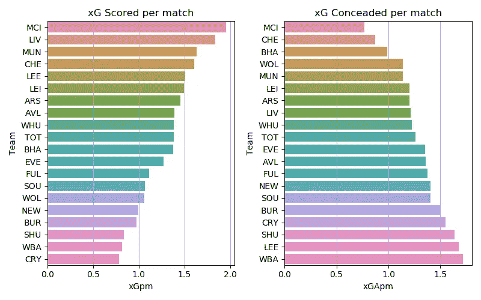
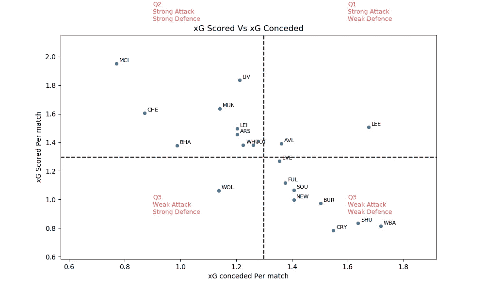
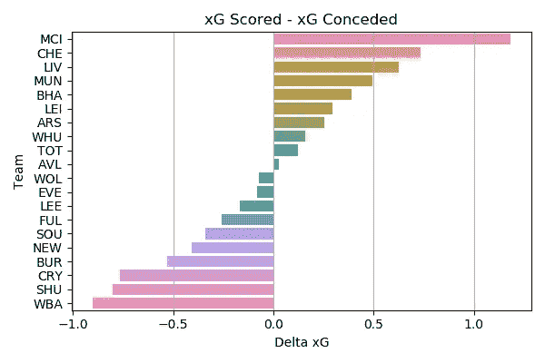
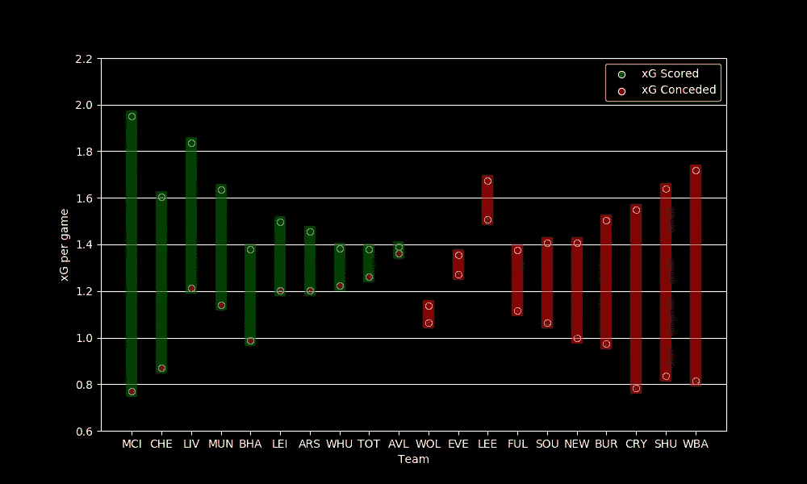
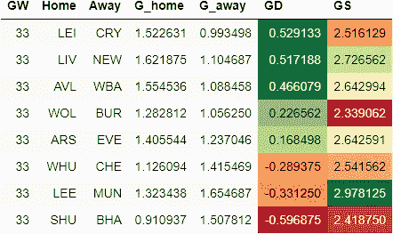
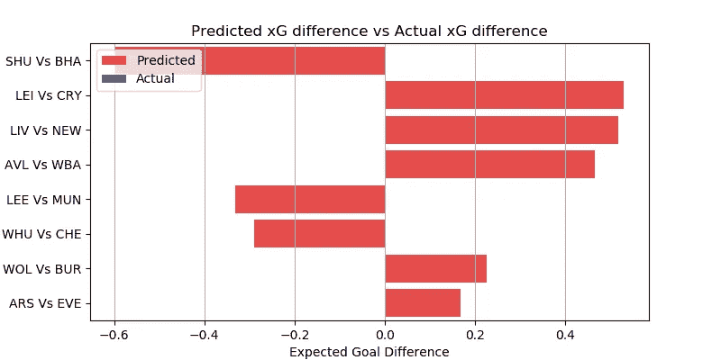
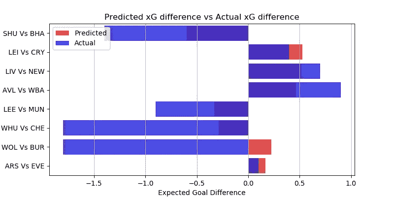

# EPL 分析和 GW 33 预测

> 原文：<https://medium.com/codex/epl-analysis-and-gw-33-prediction-42239e5206cc?source=collection_archive---------4----------------------->

## 使用 xG 统计数据预测英超联赛结果的数据驱动尝试

这是我的 EPL 预测系列的一篇文章。你可以看看对第 32 周比赛的预测，以及它与实际表现的对比。

[预期目标或 xG](/@abhijithchandradas/xg-xplained-27b1dbafa943) 是用于预测的参数。如果你对理解预测算法感兴趣，我推荐你去看看[这篇文章，里面有详细的解释](https://towardsdatascience.com/epl-2020-21-season-analysis-and-prediction-5502e20dce26)。

 [## xG 解释！

### 如果你关注足球，你不可能从未遇到过“预期目标”(缩写为 xG)这个术语。xG…

abhijithchandradas.medium.com](https://abhijithchandradas.medium.com/xg-xplained-27b1dbafa943) 

数据提供:[足球参考](https://fbref.com)

# 截至第 32 周比赛的分析

第 32 周比赛非常多事，这要归功于球场外的大量戏剧性事件，何塞·穆里尼奥被托特纳姆管理层解雇，以及欧洲超级联赛公告和相关事件的争议。

Gameweek 32 见证了前 3 名球队在各自的比赛中赢得冠军联赛席位。曼城以 77 分处于领先位置，轻松领先第二名的同城对手 11 分。莱斯特城队在国王权力体育场狂轰滥炸，在不失球的情况下，以三个进球击败了保级对手麻雀队。

争夺前四名位置的战斗正在升温，4 支球队仅相差两分。排在第四位的铁锤帮意外败给了正为保级而战的喜鹊。然而，蓝军没能利用这一点，因为他们不得不满足于与海鸥的零比零平局。然而，由于他们出色的净胜球，他们已经上升到第四位。红军和热刺同积 53 分，他们有机会进入前四，然而，两队都因平局而丢分。

在降级区，刀片队和麻雀队分别输给了莱斯特队和狼队。与此同时，在令人心碎的第 97 分钟扳平比分后，富勒姆不得不在与枪手的比赛中只得到了一分。战胜铁锤帮的喜鹊已经接近安全了。伯恩利在 1 比 3 输给红魔后，已经领先危险区 6 分。布莱顿在斯坦福桥获得了一分，现在排在第 16 位，比伯恩利高出一分。

在 32 个比赛周之后，曼城统治了进攻和防守，因为它拥有最高的 xG 得分和最低的 xG 失球率。红军在 xG 得分上排名第二。紧随其后的是场均得分超过 1.5 xG 的蓝军和红魔。

水晶宫是每场比赛 xG 得分最少的球队。垫底的两支球队在前场也缺乏创造力。伯恩利和纽卡斯尔也发现很难创造进球机会。

曼城场均失球约 0.75 xG，尽管在最近的比赛中丢了几个球，但似乎是最好的防守单位。图切尔的切尔西紧随其后，位居第二。海鸥是另一支每场比赛失球少于 1 xG 的球队。

大多数球队每场比赛承认 1 到 1.5 xG。西布朗、谢菲尔德联队、利兹联和皇宫队未能阻止他们的对手创造进球机会，每场比赛失球超过 1.5 克。

根据 xG 得分和 xG 失球，球队可以分为 4 个象限，如上图所示。
水平虚线表示每场比赛的平均 xG 得分。水平虚线上方的球队是强攻方，下方的球队是弱攻方。
垂直虚线显示每场比赛的平均 xG 失球。左边的队伍防守强，右边的队伍防守弱。

曼城在 delta xG 方面遥遥领先于其他球队，xG 得分和 xG 失球之间的差距超过 1。利物浦和切尔西是仅有的另外两支 delta xG 高于 0.5 的球队。另一方面，西布朗在球场的两端苦苦挣扎，进攻最弱，防守漏洞百出。水晶宫、谢联、伯恩利在达美 xG 下排名也很靠后。

Delta xG(图片由作者提供)

利兹联队在每场比赛创造的 xG 中名列前茅。然而，球队的 delta xG 是负的，因为对手发现很容易穿透利兹的防守，这是贝尔萨必须立即研究的问题。
另一方面，狼队是一支防守不错的球队，但由于劳尔·吉米内兹的受伤，他们缺乏攻击力。

布莱顿按照 delta-xG 排名表排在第 5 位，然而他们在联赛中排在第 16 位，因为他们缺乏高质量的前锋。

# 游戏第 33 周预测

在进行预测之前，让我澄清一下，这是一个非常简单的算法，只是基于过去的 xG，所以只能预期基线性能。该算法也不能预测高得分游戏。该模型也没有考虑球队的选择，球员因受伤/停赛而缺席，阵型，战术变化等。

然而，该模型在预测比赛的势头方面表现得相当好。你可以在下面看看实际表现如何与前一周的预测相比较。

 [## EPL 分析和 GW 32 预测

### 使用 xG 统计数据预测英超联赛结果的数据驱动尝试

medium.com](/nerd-for-tech/epl-analysis-and-gw-32-prediction-d2930bad217) 

下表提供了对第 32 周比赛的预测。
GD 的绝对值显示了比赛的竞争力。该值越高，预计匹配越偏向一侧，预测的准确性也越高。GD 值越低，这场比赛就越可能是任何人的游戏。GD 的正值表示主场胜，负值表示客场胜。

预测结果(图片由作者提供)

GW 33 只有八场比赛。热刺、曼城、富勒姆和南安普顿本周都没有比赛。

已经从主办海鸥的联盟降级的刀片队预计将是本周比赛中最一边倒的比赛，客队预计将从比赛中获得三分。
莱斯特、利物浦和维拉有望轻松赢得主场比赛，预计净胜球将超过 0.40。

红魔对埃兰路的访问预计将是一场高得分的比赛。该算法预测奥莱的人会胜过贝尔萨的小伙子。西汉姆联对切尔西是周末最令人期待的比赛，两家伦敦俱乐部都在争夺冠军联赛的席位。该算法预测蓝军将比东道主有优势。

Delta xG 预测值(图片由作者提供)

狼 vs 伯恩利预计是一场得分较低的比赛，狼获胜的几率较高。枪手主场迎战太妃糖预计将是本周比赛中竞争最激烈的比赛，太妃糖比枪手略胜一筹。

# 预测结果与实际结果的对比将在第 33 周游戏结束后更新

# 更新:实际结果与预测

预测与实际结果(图片由作者提供)

该算法能够正确预测本周 8 场比赛中的 7 场比赛的结果，准确率为 87.5%。

与预测相反的比赛是狼队和伯恩利队之间的比赛，客队以 0 比 4 大败东道主队。

## 成为会员

我希望你喜欢这篇文章，我强烈推荐 [**注册*中级会员***](https://abhijithchandradas.medium.com/membership) 来阅读更多我写的文章或成千上万其他作者写的各种主题的故事。
[你的会员费直接支持我和你看的其他作家。你还可以完全访问媒体上的每个故事。](https://abhijithchandradas.medium.com/membership)

您可能喜欢的其他文章:

 [## 使用事件数据开始足球分析

### 演练如何使用 stats bomby 包从 stats bomby 获得免费的足球赛事数据

medium.com](/mlearning-ai/getting-started-with-soccer-analytics-with-event-data-6ecd3143e78)  [## 用 Python 可视化期权交易策略

### 如何使用 python 中的 opstrat 包绘制期权收益图

medium.datadriveninvestor.com](https://medium.datadriveninvestor.com/visualizing-option-trading-strategies-in-python-35bfa61151d9)  [## 使用 Mplfinance 的股票市场数据可视化

### 如何获得股票市场数据和创建可视化(烛台，OHLC，PnF 等)。)在 Python 中使用 mplfinance…

medium.com](/mlearning-ai/stock-market-data-visualization-using-mplfinance-1d35a8d48e4) 

托马斯·塞勒在 [Unsplash](https://unsplash.com?utm_source=medium&utm_medium=referral) 上的照片