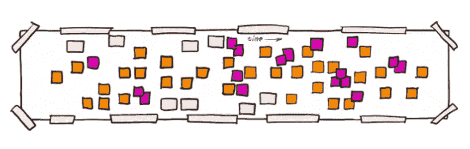

# 软件设计论文集——为什么？

> 原文：<https://medium.com/codex/essays-on-software-design-the-why-cc21fc08634c?source=collection_archive---------3----------------------->

## 为什么软件设计很重要？

这是关于软件设计系列文章的第一篇:

*   软件设计论文集——为什么？
*   **多少钱？**

# *我们为什么要设计？*

## *几乎任何事情之前的一个问题！*

*“为什么？”我喜欢对几乎任何事情问“为什么”,因为它的答案总是揭示主题背后的意图以及我们真正想要解决的问题。这让我对这个问题的本质有了更深的理解，并为我自己的思考打下了基础，也许还能找到新的或更好的解决方法。*

*问题“为什么？”这里有时表现为其他形式，如“值得麻烦吗？”或者“我为什么要学这些设计的东西？”或者“我们为什么不直接编码”。*

*虽然大多数软件工程师知道做设计很重要，但是在做工作之前做这个成本效益分析也是合理的，也是健康的，特别是像软件设计这样重要的工作。*

*“为什么我们需要软件设计？”这是一个简单的问题，但回答起来并不容易，要回答这个问题，首先需要一些思考和知识。*

# *软件开发的本质*

*回到基础，我们需要一些坚实的事实来为我们的案例提供依据，还有什么比科学更好呢！*

## *软件进化的法则*

*软件进化定律指的是雷曼和贝拉蒂从 1974 年开始制定的一系列定律。*

*简单来说:*

*   *软件将会改变或者变得不令人满意，除非努力去控制这种改变。*
*   *除非努力降低软件的复杂性，否则它将会增加。*
*   *给软件项目增加更多的人力资源不会改变交付的速度。*
*   *所有相关人员(在我们的例子中是开发人员)必须掌握正在开发的系统，否则他们会不知所措。*
*   *软件系统将继续发展。*
*   *除非严格适应环境的变化，否则系统的质量将会下降。*

*查看[雷曼的软件进化法则](https://en.wikipedia.org/wiki/Lehman%27s_laws_of_software_evolution)进行进一步阅读。*

## *经济学*

*软件项目失败了，当他们失败时，那是由于过程、团队结构、技能水平，或者糟糕的系统设计。*

*一个糟糕的软件设计会使开发陷入瘫痪，以至于添加一个单一的特性会非常痛苦，可能需要几个月的开发时间。*

*Martin Fowler 有一篇关于这个主题的很棒的文章“[设计耐力假说](https://martinfowler.com/bliki/DesignStaminaHypothesis.html)”。*

*正如你所注意到的，这里的主题是软件系统中的熵是非常昂贵和危险的，除非努力去阻止它，否则熵会进入你的系统，因此"**系统可维护性是你的系统最重要的品质**"或者换句话说"**熵是你的敌人！**”。*

**一旦你认识到这一点，你的开发方法将会改变，你不再只是想写代码来提供一个特性，而是更多地写别人可以期待和容易理解的代码，你是在为可持续性而开发，而不仅仅是为了交付！**

# *软件设计有什么帮助？*

## *什么是软件设计？*

***设计**这个词是用来指制定计划并可能执行这个计划的**认知活动。***

> *软件设计是一个过程，通过该过程，代理使用一组原始组件并受约束来创建旨在实现目标的软件工件的规范。— [维基百科](https://en.wikipedia.org/wiki/Software_design)*

*更简单地说，软件设计是计划如何在一组约束条件(如语言、架构、库等)内开发软件的过程。*

*而如果**“熵是敌人！”**设计就是规划，那么软件设计的主要目标之一就是**规划如何在软件中对抗熵**。*

# *什么是好的设计？*

*根据我们目前的发现，一个好的设计可能包含很多东西，但是一个好的设计的主要目标之一是它是可维护的。*

## *TL；博士；医生*

> *可维护性是大多数软件设计原则、模式和最佳实践的主要关注点之一。*

## *坚实的原则*

*s:单责任原则
O:开闭原则
L:利斯科夫替代原则
I:接口分离原则
D:依赖倒置原则*

*所有这些都是为了开发一个可维护的系统，一个可以以尽可能小的熵来管理的系统！*

## *设计模式*

*拥有一个模式(在 OOP 领域几乎是众所周知的)会让每个人更容易快速理解，从而更容易维护它。*

## *干燥的*

*不要重复你自己，目标是代码可重用性，为你的系统提供的每一个功能都有一个单一的改变点，以减少你将来维护系统的努力。*

## *YAGNI*

*你不需要它，除非对你的系统有必要，否则不引入任何新代码，因为你也必须维护它。*

## *吻*

*保持简单，愚蠢，这意味着应该避免不必要的复杂性(因为这将使其他人更难理解系统，因此，维护它)。*

## *童子军规则*

*“总是让露营地比你发现它的时候更干净”，这里的“更干净”通常意味着其他人更容易理解这个系统并使用它。*

# *结论*

*熵对于一个软件系统来说是非常昂贵和危险的，它将会进入你的系统，除非你努力去阻止它。*

*为了保护你的系统不受熵的影响，你需要计划如何构建它，因此**软件设计**最重要的一个方面就是计划如何对抗**熵和复杂性**，因此如果你的设计更容易理解和维护，你就是一个好的设计者。*

*关于以下主题的进一步写作正在进行中，完成后请跟我来获取:*

*   *多少设计才算好？*
*   *什么被认为是某种设计的正当理由？*