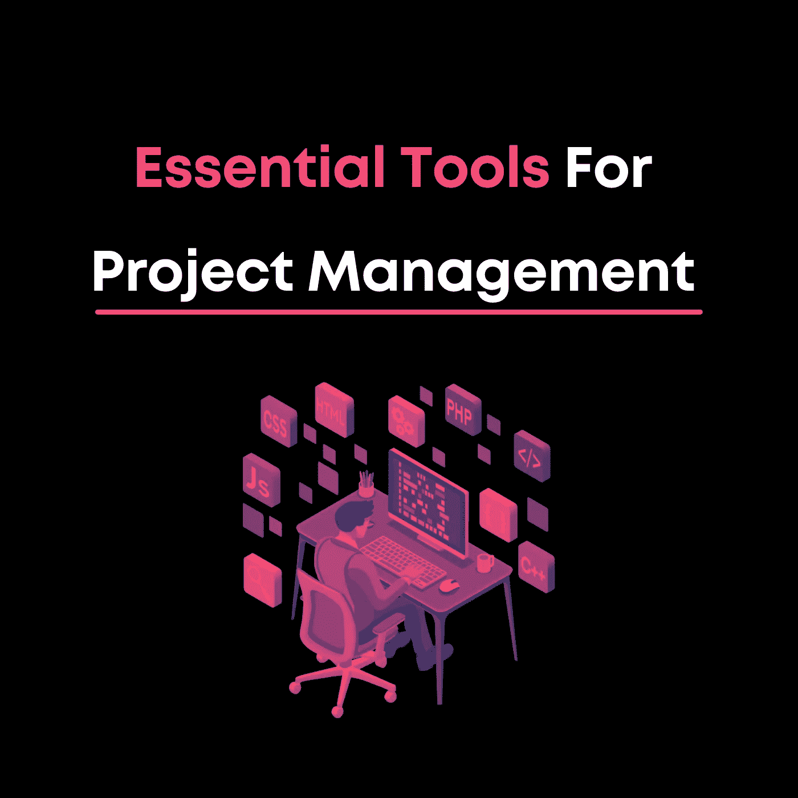

# 项目管理的基本工具

> 原文：<https://medium.com/codex/essential-tools-for-project-management-2f185fe43a5?source=collection_archive---------13----------------------->

跟踪你的团队成员和他们的进展有时会是一个误解的迷宫。你不能仅仅将整个公司的议程上传到一个文档或电子表格中。项目经理需要各种在线工具来帮助产生想法、安排时间表和跟踪进度。以下是我们在 Prajix 使用的一些最受欢迎的工具，用于保持组织有序和有效沟通，而且是免费的。

特雷罗

Trello 是一个工作管理程序，用于分享想法、项目协作、组织时间表以及保持日常运营整洁有序。看板风格的应用程序允许您做笔记，将它们组织成有序的列表，并跟踪季度进度。

**观念**

作为我们个人的最爱，idea 通过其组织模板使每周的任务变得简单而没有压力。通过其易于使用的类别布局，从构思到发布跟踪您的作品。观念对于你的项目的营销方面尤其重要，因为它让新想法的合作变得天衣无缝，毫无压力。

**米罗**

Miro 是一款创新的规划/演示工具，可以作为一个数字白板，您可以在其中绘制出公司/项目任何部门的项目、活动、数据和见解。用它来展示你下一个六个月的计划，或者用图形工具演示编码中的新概念，这些图形工具足够简单，任何人都可以创建清晰而深入的计划/大纲。

**松弛**

近年来，Slack 因其在商业沟通中的有效性而越来越受欢迎。您可以创建公司范围的群聊、私人聊天室，并直接向人们发送消息，以简化沟通。

**吉拉**

Scrum 板、看板板、路线图和敏捷报告使吉拉成为任何灵巧的开发团队的必备工具。吉拉让向投资者和利益相关者展示进展变得特别容易。

**什么是 Prajix？**

对你来说，掌握编码世界的最好方法是把这个世界放在你的指尖。我们的使命是让世界各地的开发者通过在线协作来彻底改变我们希望拥有的未来。

我们允许开发人员在我们的平台上创建或加入项目想法，他们可以在我们的协作室中找到志同道合的个人进行团队合作。

我们正努力将全世界最有价值的程序员、编码员和开发人员的网络集中到一个地方，创建一个技术发电站，帮助全球的个人和社区。

如果你对此感兴趣或者想了解更多，请访问我们的网站:[https://www.prajix.com](https://www.prajix.com)