# 使用 Python 在 Lambda 和 EC2 之间建立连接

> 原文：<https://medium.com/codex/establishing-a-connection-between-lambda-and-ec2-using-python-2da2c3edd64a?source=collection_archive---------7----------------------->


达莎·乌尔瓦乔娃在 [Unsplash](https://unsplash.com?utm_source=medium&utm_medium=referral) 上的照片

你有没有想过如何从 Lambda 安全地到达 EC2？嗯，这篇文章将是一种方式，这只是为初学者，因为这只是基本的东西。

AWS Lambda 是一种无服务器计算服务，允许您运行代码，而无需配置或管理服务器、创建工作负载感知集群扩展逻辑、维护事件集成或管理运行时。有了 Lambda，你可以为几乎任何类型的应用程序或后端服务运行代码——所有这些都无需管理。只需将您的代码上传为 ZIP 文件或容器图像，Lambda 就会自动精确地分配计算执行能力，并根据传入的请求或事件运行您的代码，适用于任何规模的流量。您可以设置您的代码从 140 AWS 服务自动触发，或者直接从任何 web 或移动应用程序调用它。您可以用自己喜欢的语言(Node.js、Python、Go、Java 等)编写 Lambda 函数，并使用无服务器和容器工具(如 AWS SAM 或 Docker CLI)来构建、测试和部署您的函数。要了解更多信息，请访问下面的。

[](https://aws.amazon.com/lambda/) [## AWS Lambda -无服务器计算-亚马逊网络服务

### 运行代码时无需考虑服务器或集群。只为你使用的东西付费。AWS Lambda 是一种无服务器计算…

aws.amazon.com](https://aws.amazon.com/lambda/) 

现在，如果你想从 EC2 中的 Lambda 运行一个脚本或命令。我们必须完成以下步骤。

1.  安全管理您的私钥。在这里，我将使用 [AWS 秘密经理服务](https://aws.amazon.com/secrets-manager/)和 [KMS](https://aws.amazon.com/kms/) 的组合来实现它。

[](https://aws.amazon.com/secrets-manager/) [## AWS 机密管理器|旋转、管理、检索机密| Amazon Web Services (AWS)

### 在数据库凭证、API 密钥和其他机密的整个生命周期中，轻松地轮换、管理和检索它们…

aws.amazon.com](https://aws.amazon.com/secrets-manager/) [](https://aws.amazon.com/kms/) [## 密钥管理服务-亚马逊网络服务(AWS)

### 轻松创建和控制用于加密或数字签名数据的密钥 AWS 密钥管理服务(KMS)使…

aws.amazon.com](https://aws.amazon.com/kms/) 

2.我将使用 base 64 对我的密钥进行编码，然后将它存储为一个秘密，而不是直接在 AWS Secret Manager 中上传私钥。为了让它更安全，只有我会是秘密的管理员，我会在关键用户中添加我的 Lambda 角色来使用它。

3.由于我们的密钥驻留在秘密管理器中，我们应该找到一种方法，通过从秘密管理器中获取密钥并正确解码以使用它来规范化我们的密钥。

4.Lambda 必须和一个 VPC、两个子网(我们的实例驻留在其中)一起创建。]，以及一个安全组。通常，一个子网就足够了，但是为了获得更高的可用性，我选择了两个子网。

5.我们将使用 [Paramiko](http://www.paramiko.org/) 模块在 Lambda 和 Ec2 之间建立连接。

让我们详细看看所有的步骤。

首先，在 VPC 内部启动一个实例[最好是你自己的 VPC]，这样你就可以完全控制它了。知道如何去做。[参观这里](https://docs.aws.amazon.com/quickstarts/latest/vmlaunch/step-1-launch-instance.html#:~:text=To%20launch%20an%20EC2%20instance&text=Open%20the%20Amazon%20EC2%20console%20by%20choosing%20EC2%20under%20Compute.&text=From%20the%20Amazon%20EC2%20dashboard,as%20templates%20for%20your%20instance.)。然后下载密钥对并妥善保管。它会在。pem 格式。因此，我启动了一个实例，这是 aws 提供的我的私钥。

```
-rw-r — r — @ 1 sagopal staff 1700 Apr 22 07:53 Sas-key.pem
```

接下来，让我们使用 base64 对私钥进行编码，我们将使用它上传到 Secret Manager 中。

```
bash-3.2$ base64 Sas-key.pem > sas-key-encodedbash-3.2$ ls -lrt sas-key-en*-rw-r — r — 1 sagopal staff 2269 Apr 22 07:59 sas-key-encoded
```

现在，去 KMS 并遵循以下内容:

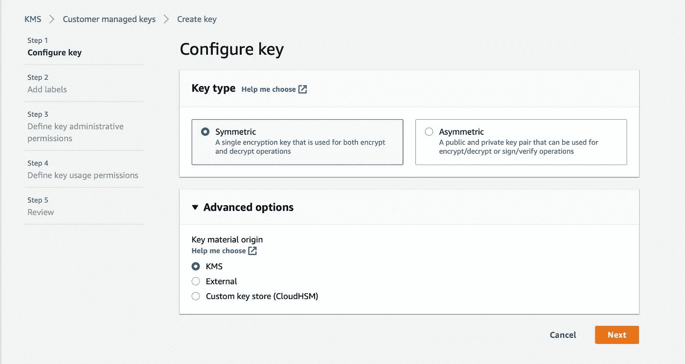

我用对称和原点作为 KMS。

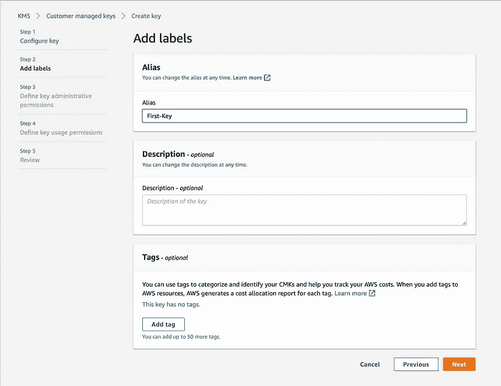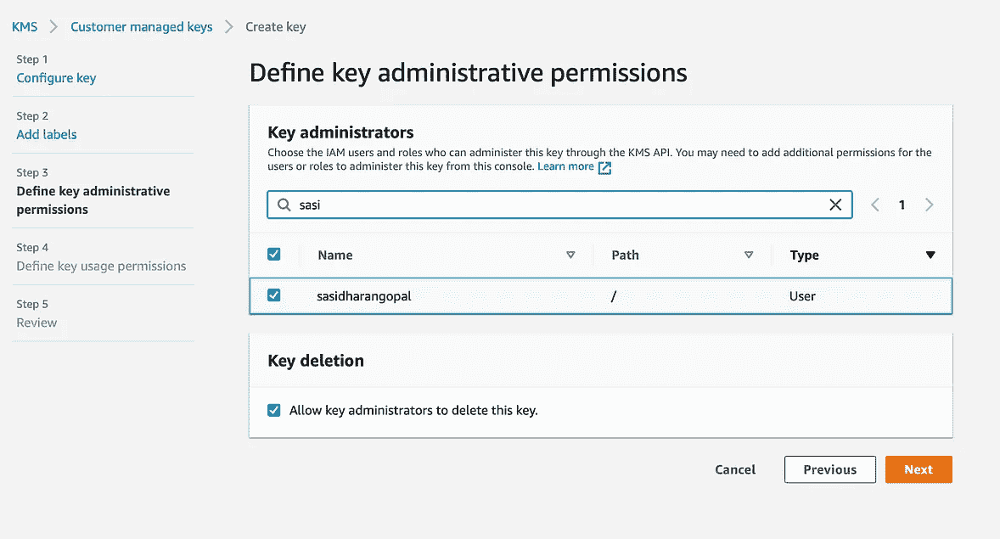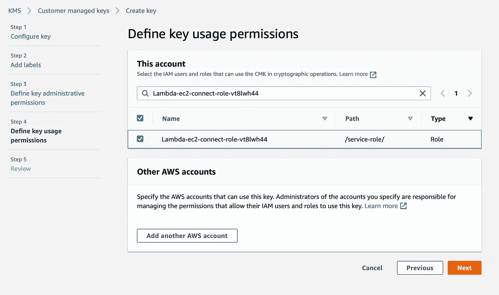

查看它，然后在下一个窗口中单击“create”

一旦创建了密钥，它看起来就像这样，因为我已经创建了 lambda，所以我知道我已经为其提供了权限的角色。如果您没有马上拥有它，即使在密钥创建之后也不用担心，您可以向它添加用户。参见下面的快照

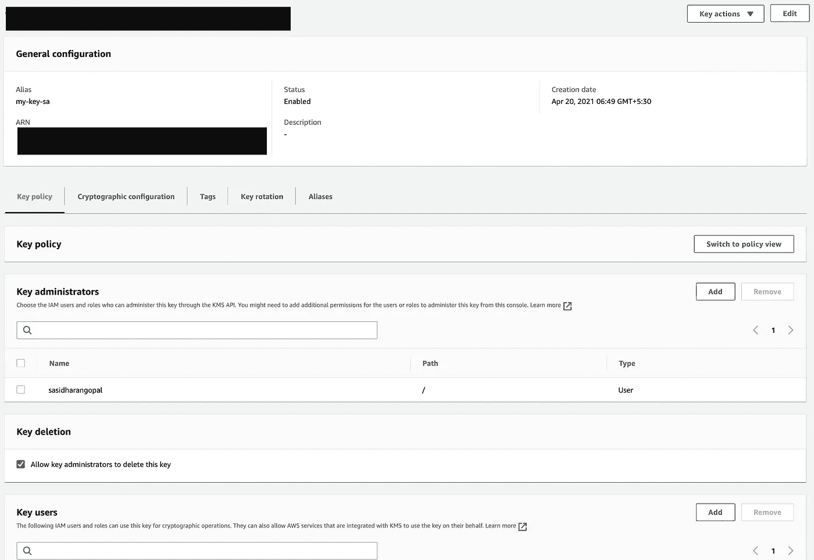

现在，去[秘密经理](https://console.aws.amazon.com/secretsmanager/)。遵循以下步骤。

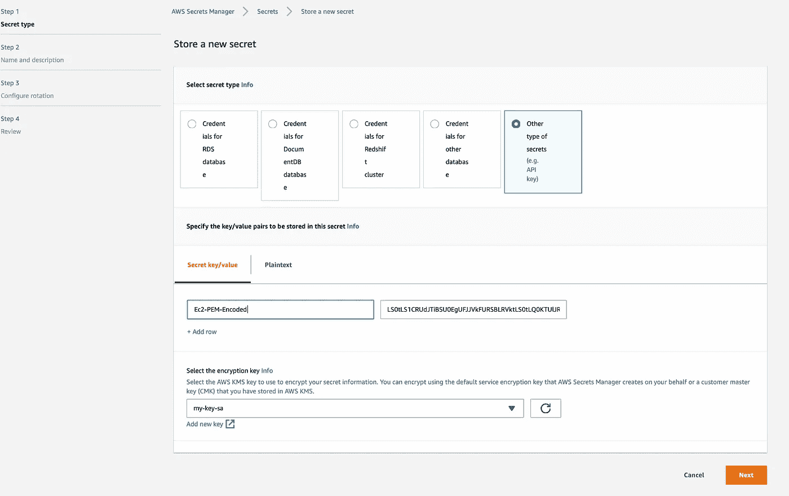

复制我们之前创建的编码文件的内容，并将其粘贴到这里，如上所示，并选择加密密钥作为我们在上一步中创建的密钥。

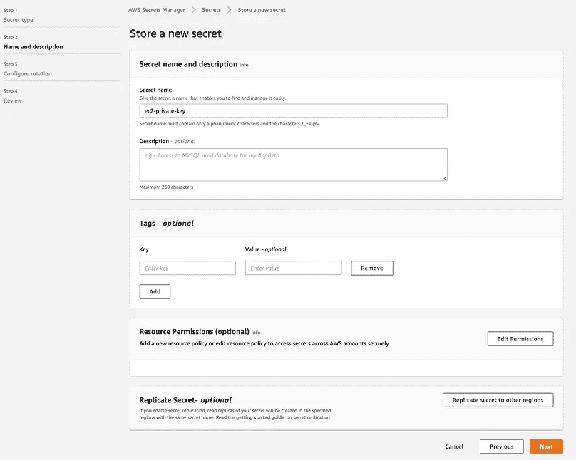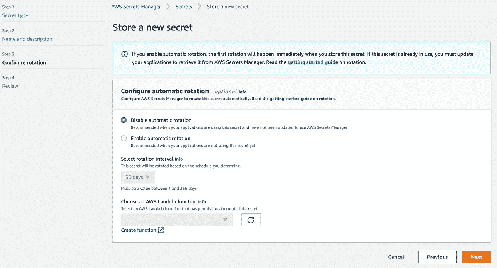

查看它，然后在下一个窗口中单击“create”。

有许多选项，如提供资源许可，在另一个区域复制它，并通过 lambda 函数启用自动旋转密钥等。现在，为了简单起见，我们将忽略这些，只进行基本的操作。

现在，我们已经准备好了我们的密钥。让我们转到λ配置

按照以下步骤创建一个 lambda 函数。

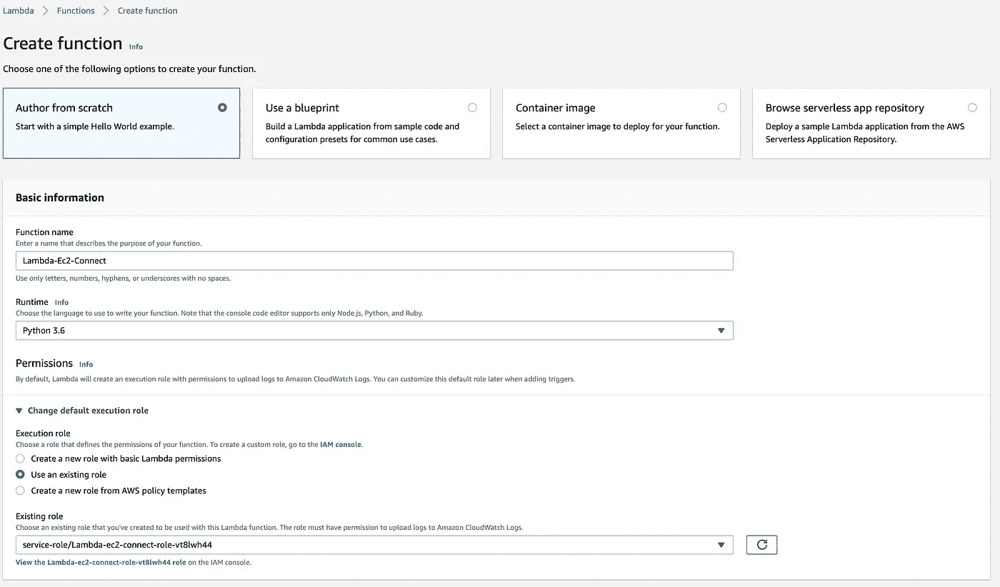

因为我已经有了所需的角色，所以我选择了它。以下是附加到指定角色的策略，请创建相同的策略。

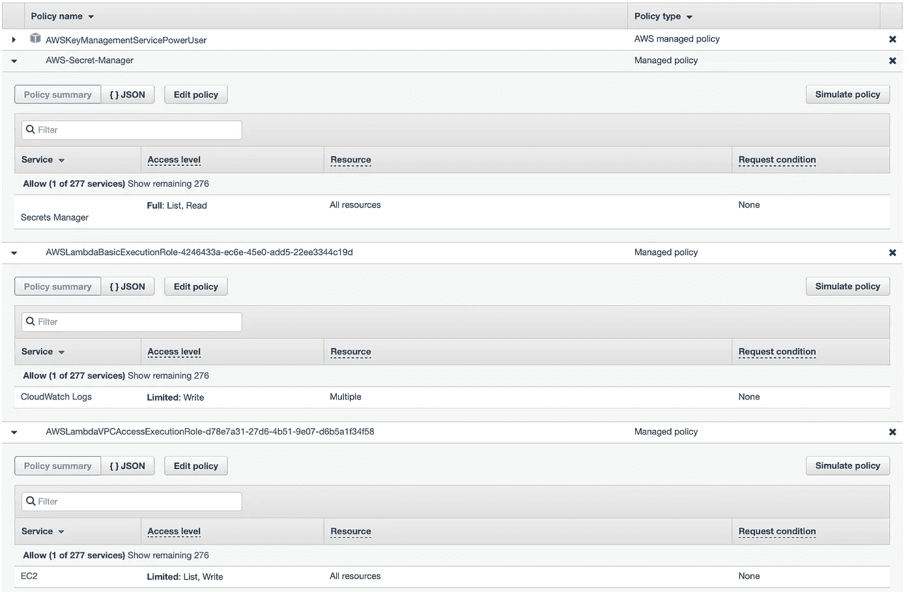

现在，在高级设置中，我们将提供我们的 VPC 细节。

选择允许端口 22 连接到我们机器的 VPC、子网和安全组。

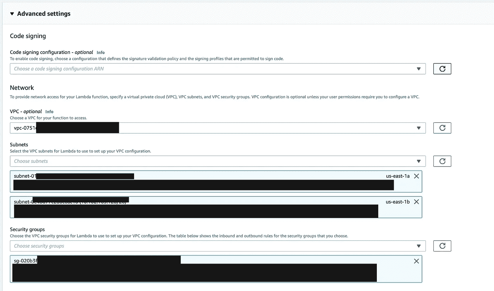

一旦一切都被选中，点击创建功能。这将需要一分钟左右的时间来创建它，因为我们是在 VPC 内部创建的，所以它已经创建了一个网卡和其他东西。

如前所述，我们将在 Python 中使用 Paramiko 来建立与 Lambda 的连接。因此，默认情况下 Paramiko 包在 lambda 中是不可用的，我们要么必须先用 Paramiko 创建一个层，要么我们可以将整个代码部署到一个包含所有必需包的 zip 文件中。敬请查看此页面并了解如何创建 lambda python 部署包。您可以从下面获得 lambda 函数的代码，

[](https://github.com/Sasidharan3094/Sasi_Repo/blob/main/Lambda-Ec2.py) [## Sasidharan3094/Sasi_Repo

### 在 GitHub 上创建一个帐户，为 Sasidharan3094/Sasi_Repo 开发做贡献。

github.com](https://github.com/Sasidharan3094/Sasi_Repo/blob/main/Lambda-Ec2.py) 

如果你看一下代码，我会选择/tmp mount 来从秘密管理器中检索我的秘密，对于解码部分，我也会将我解码的 pem 文件存储在/tmp mount 中，因为在 Lambda 中，除了/tmp mount 之外，其余的都是只读的，只有/tmp 是读/写的挂载。

现在，我们已经上传了函数。考验的时候到了。

我忘了说 lambda 的默认超时设置只有 3 秒。我们需要再增加一点。在这里，我已经将其更改为 7 分钟，这完全取决于您的环境，如果需要，也可以为此增加/减少 RAM。该设置将位于配置\常规配置下。

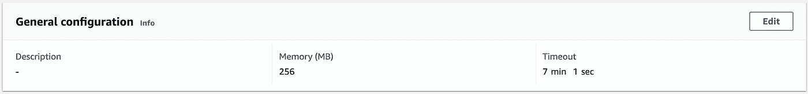

最后，当您测试我们的 lambda 函数时，它会给出如下预期的输出。[pwd(工作目录的路径)，ls 和日期的输出]

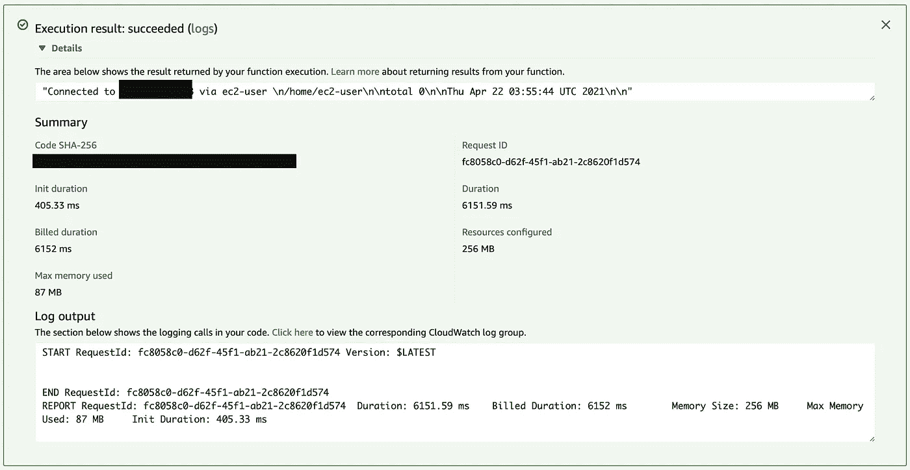

**结论**

现在，我们已经学会了如何去做。我们实际上可以在日常工作中使用它来获取 Java、heap 和其他转储，只要我们获得高内存或数据库转储来获取长时间运行的查询，因为这些都是时间关键的转储，我们需要在它被破坏时立即获取。不用手动取，我们可以这样实现。此外，根据个人需要，还有更多的用例，这只是一个例子。

1.  我们都有不同的监控工具，如 Nagios、Checkmk、Grafana、Sumologic 等，它们会在主机/服务/lb/rds 等出现故障时提醒我们。有问题，它会根据我们的配置通知我们。
2.  在我的工作环境中，我们引导他们使用票务工具和 slack。
3.  我们的票务工具具有更高级的功能，例如，如果我们配置了一个票证(使用票证/用户提供的数据),它可以调用 Lambda 并相应地处理它。
4.  如果你没有这个选择。您必须想办法从您的监控/警报源触发 lambda 功能。

我希望你喜欢它。这对#Devops、#CloudEngineers 和#Monitoring 团队都很有用。这只是一个基本功能。我尽量保持简单，这样就容易理解了。在现实世界中，函数要复杂得多。

如果你有任何澄清，请在下面评论，我很高兴与你分享，如果你有时间，请分享你的反馈，这肯定会促进我做更多这样的事情。不断激励他人！再见。