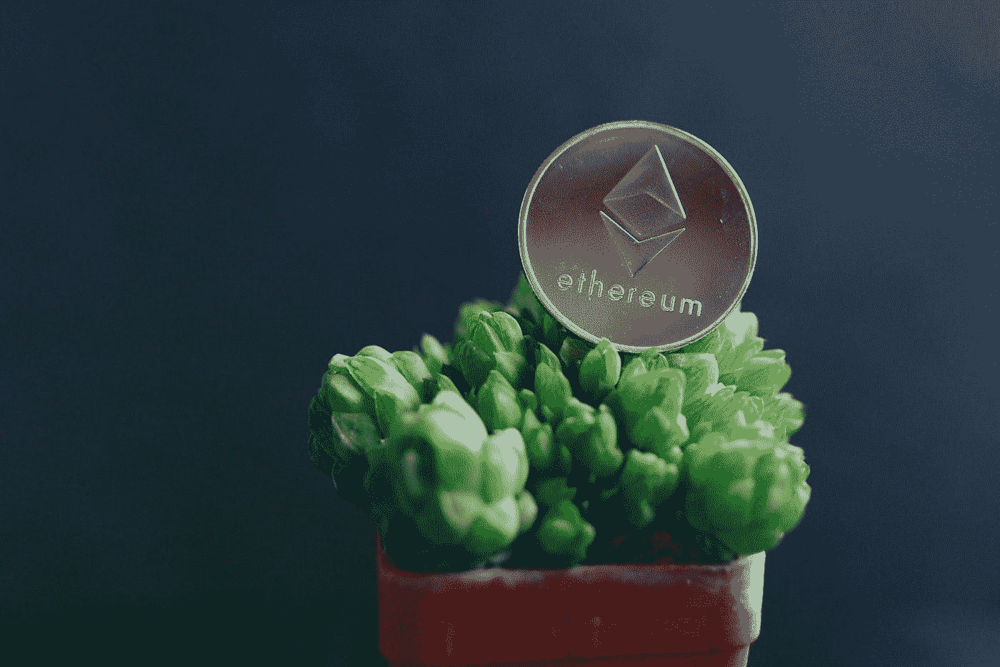

# 以太坊完成了

> 原文：<https://medium.com/codex/ethereum-is-finished-8f78fe9b4046?source=collection_archive---------0----------------------->

图片来自 [Unsplash](https://unsplash.com?utm_source=medium&utm_medium=referral) 上的 [Twitter @ethmessages](https://unsplash.com/@moneyphotos?utm_source=medium&utm_medium=referral)

以太坊为什么受欢迎？我一直相信以太坊受欢迎是因为智能合约。当然，比特币是第一种加密货币，所以很明显，它将是最大的一种。以太坊是第一个拥有智能合约的公司。所以很明显它也会很大。

当然，其他加密货币也有智能合约，但以太坊更大，正因为如此，它比其他加密货币更受欢迎。