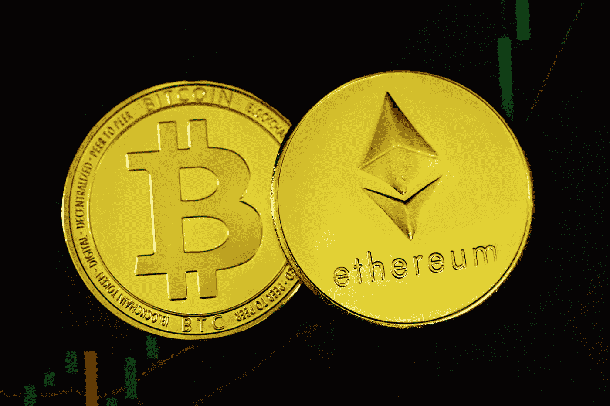
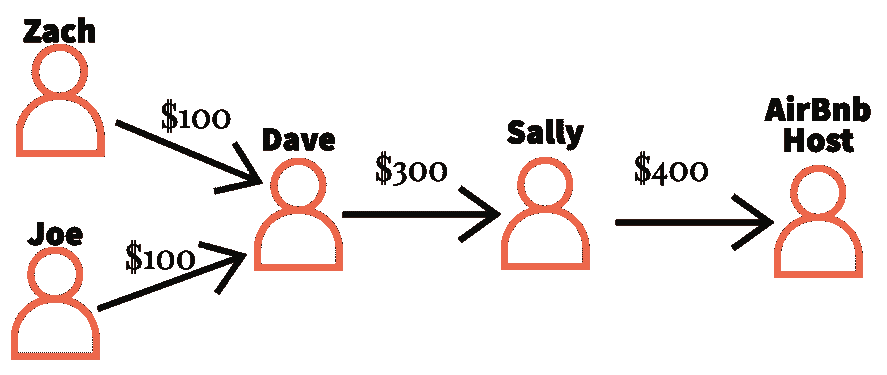
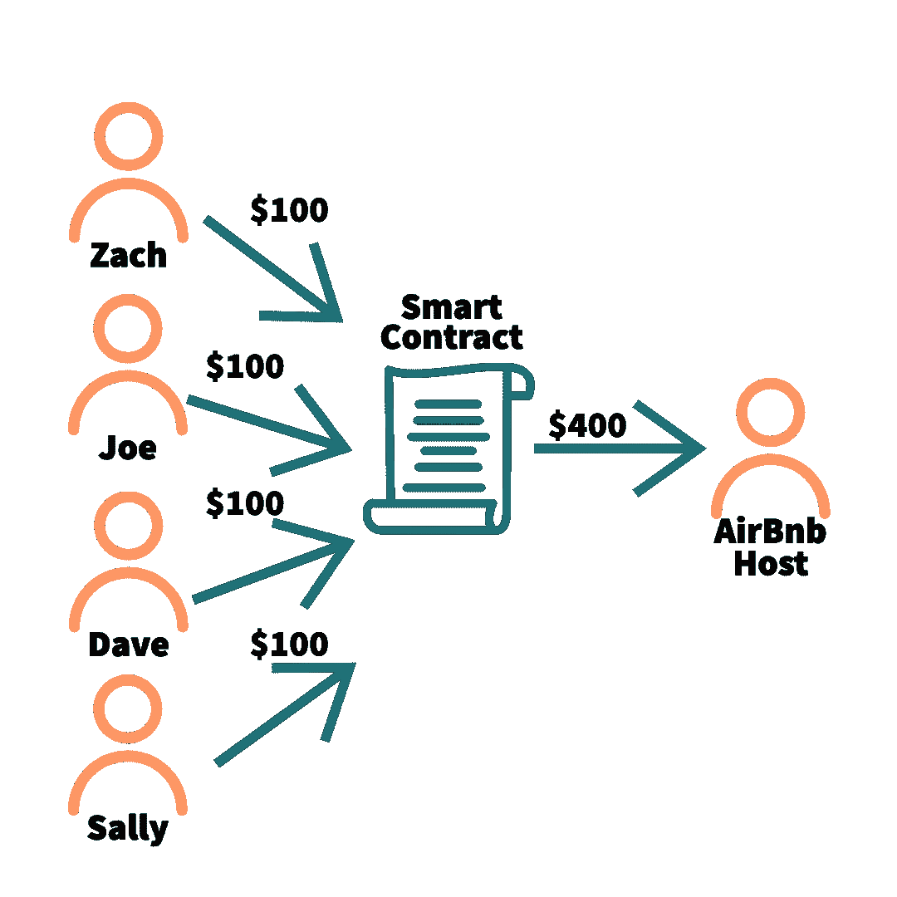
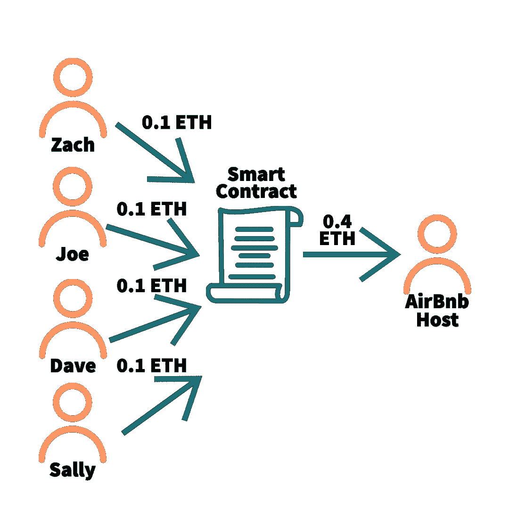

# 以太坊和智能合约| Web3 解释

> 原文：<https://medium.com/codex/ethereum-smart-contracts-web3-explained-fe2522195e2b?source=collection_archive---------10----------------------->

到目前为止，在 Web3 讲解系列中，我们已经了解了什么是区块链、谁使用它们以及如何保护它们的基本知识。在最近的文章中，我们提到了用**加密货币**作为对他们工作的一种支付形式来奖励矿工和验票员的概念。一些区块链项目，如比特币，是为了提供一个没有政府干预的**去中心化的价值存储**。把这些项目想象成与法定货币竞争的“数字美元”。其他区块链项目的存在是为了提供一个编写和执行程序的平台。在这篇文章中，我们将**了解以太坊**，这是一种区块链技术，它是一种**价值分散存储**，一种**全球交易系统**，以及一个在其上**构建应用程序的平台**。

> [法定货币](https://www.britannica.com/topic/fiat-money) —发音就像汽车公司，法定货币是由管理机构宣布的任何货币，通常没有黄金或白银等商品的支持。

来源:[https://unsplash.com/photos/fx9JkS10u3g?utm_source=unsplash&UTM _ medium = referral&UTM _ content = creditShareLink](https://unsplash.com/photos/fx9JkS10u3g?utm_source=unsplash&utm_medium=referral&utm_content=creditShareLink)

# 以太坊快速历史

虽然以太坊还不到十年，但它是 Web3 中领先的区块链技术。我想给你一个以太坊项目到目前为止的成功和失败的高层次观点。如果术语和缩写是外来概念，请不要担心，我将在本系列中进一步解释它们。

*   **2013**——受比特币成功的启发，一位名叫**维塔利克·布特林**的开发者开始着手区块链的一个项目。Vitalik 的目标不是完全复制比特币，而是创造一个更通用的区块链，而不仅仅是价值储存库。
*   **2015** —以太坊推出，创造了 7200 万**以太(ETH)代币**(以太坊的原生加密货币)，分发给早期投资者。
*   **2016**—**智能合约**中的一个安全漏洞导致**DAO**遭到黑客攻击，导致价值 6000 万美元的 ETH 令牌丢失。几周后，这些资金通过区块链的一个分支机构被追回。
*   **2017**——一款名为 [CryptoKitties](https://www.cryptokitties.co/) (非常类似于[电子鸡的](https://tamagotchi.com/))的收藏游戏获得了巨大成功，展示了以太坊在区块链上托管**去中心化应用**(通常简称为 **dApps** )的潜力。在高峰期，CryptoKitties 售价高达 20 万美元。
*   **2018**—“**ICO 夏**之年”。首次发行硬币(**ico**)类似于首次公开发行(IPO)，即公司的股票首次可供购买，除了 ico 是针对加密货币而不是股票。仅在 2018 年，就有 [3，804 个 ico 筹集了超过 115 亿美元](https://icobench.com/reports/ICO_Market_Analysis_2018.pdf)。
*   2020 年——这是**“不毛之夏”**的一年。分散金融提供与集中金融相同的服务(比如银行、经纪公司等)。)就像**借贷和投资**一样，但是使用智能合同而不是中间人。在撰写本文时，以太坊上的 DeFi 目前有超过 400 亿美元被锁定。
*   **2021**——**NFT 热**的一年，卡通猴子的图片售价高达数百万。不可替代的代币，NFT，是代表一些数字资产的智能合约。在撰写本文时，一个名为 [**的 NFT 热门项目无聊猿游艇俱乐部**](https://opensea.io/collection/boredapeyachtclub) ，以 1 万只卡通猿的头像风格图片为特色，其 [**市值为 10.2 亿美元。**](https://www.coingecko.com/en/nft/bored-ape-yacht-club)

无聊猿游艇俱乐部# 2805:[https://open sea . io/assets/ether eum/0 xbc 4 ca 0 EDA 7647 A8 ab 7 c 2061 C2 e 118 a 18 a 936 f 13d/2805](https://opensea.io/assets/ethereum/0xbc4ca0eda7647a8ab7c2061c2e118a18a936f13d/2805)

# 智能合同

上面所有的组织和应用程序都是建立在以太坊区块链之上的。[在本系列的第一篇文章](/codex/blockchains-web3-explained-cc1e8e5a2e20)中，我告诉过你，区块链只是一系列连接在一起的交易，并分布在公众中。虽然这对于比特币来说更准确，但对于以太坊来说也是如此(*这次我没有撒谎！*)，然而以太坊还提供了一种叫做**以太坊虚拟机(EVM)** 的东西。我们不会深入 EVM 到底在做什么，但简单来说，它允许世界上的每个人编写程序或应用程序，并在以太坊上执行它们。这意味着开发者可以**将他们的程序部署到以太坊**上，让世界上的任何人都可以访问它，而不是建立一个网站，开发一个移动应用程序，或者维护桌面软件。我们称这些程序为智能合同。

按日期排列的以太坊区块链上部署的已验证智能合约的数量。

## 示例时间

让我们重温一下来自[区块链| Web3 解释](/codex/blockchains-web3-explained-cc1e8e5a2e20)的夏季旅行示例。在这个例子中，我们有几个朋友需要互相转账，最终支付 AirBnb 的主人他们的夏季旅行费用。虽然我们确实利用了区块链技术的透明度来证明谁支付了他们的公平份额，但这仍然给了戴夫或萨利恶意占有资金的机会。

来源:[https://medium . com/codex/区块链-web 3-explained-cc 1e 8 E5 a2 e 20](/codex/blockchains-web3-explained-cc1e8e5a2e20)

我们可以使用智能合约来解决这个问题，并提供更好的用户体验。AirBnb 可以编写一份智能合同，接受给定日期的付款，一旦付款金额被存入，资金就会自动转移到 AirBnb 主机。大多数 AirBnb 使用某种数字键盘锁或数字锁箱来存放家里的钥匙。为了更进一步，在资金通过智能合同转移到主机的同时，键盘锁的代码可以加密发送回 Zach、Joe、Dave 和 Sally。

我们的夏季旅行示例，但这次是通过智能合同而不是第三方促成的。

这听起来真的很酷，但为什么有人会走这条路，而不是让 AirBnb 来处理这一切呢？简而言之，AirBnb 不再需要**来促成这笔交易。该说的都说了，该做的都做了，要么付款，要么不付款。如果我们的朋友将资金发送到智能合同，他们将 100%的时间**收到财产**的钥匙，因为**交易是用代码**和**编写的，不依赖于第三方** (AirBnb)的相应操作。如果存款不足，这些资金将返还给适当的发送者，而无需 Zach、Joe、Dave 或 Sally 花一个小时致电客户支持部门。此外，主机也受益，因为他们不再需要支付服务费或处理费。**

随着我们进入 Web3 时代，这是消费者思维过程中的一个重要转变。

# 以太币

许多人想知道**为什么数字货币**像比特币(BTC)和以太(ETH)**有任何价值**。毕竟，这只是数字货币，难道就不能有人赚更多吗？首先，我从美国美联储发给他们这张图表，向他们展示他们如何一直“赚更多”钱。BTC 的价值是最容易理解的:供应是有限的，开采新 BTC 的难度只会成倍增加，既有有限的供应，又有高需求。

 [## 弗雷德图

### 编辑描述

fred.stlouisfed.org](https://fred.stlouisfed.org/graph/graph-landing.php?g=RqTa&width=670&height=475) 

ETH 是一个不同的、更有趣的场景。要点是 **ETH 不仅仅是钱，**它也是在以太坊区块链上执行一个交易所需的**燃料。还记得我说过，智能合约可以部署在区块链，世界上任何人都可以使用吗？好吧，执行智能契约需要一些计算资源，无论大小。为了资金，或者权力，交易时你还必须送上一些，*通常是*，少量乙醚到智能合同。我们称这种少量的乙醚为气体。这些天然气费用的一部分支付给矿工(很快会有验证者)以奖励他们的工作，其余的则被永久销毁或烧毁。**

## 示例时间，再次…

让我们再一次快速回顾一下我们的夏季旅行示例。我们实际上不能在以太坊区块链传送美元。相反，我们需要将 ETH 发送到智能合约。一旦我们向智能合约发送了足够的 ETH，它将燃烧少量的 ETH，以查看是否满足向主机发送资金的条件，并向我们传输键盘上的代码。假设条件已经满足，主机接收 0.4 ETH ( [撰写](https://www.coindesk.com/price/ethereum/)时 ETH 目前徘徊在 1000 美元/ ETH 左右)。

我们的夏季旅行示例由智能合约提供支持，该合约用更准确的以太坊加密货币取代了美元货币。

**ETH 为什么有价值？**它不像 BTC 等其他加密货币那样直截了当，但它结合了以下几点:

1.  **它的供应量有限。**
2.  人们购买它是为了在智能合约中使用。
3.  人们购买黄金持有，希望价格上涨。

# 汽油费

我之前提到过以太坊从来没有倒下或者崩溃过。这部分是因为汽油费。天然气费支付给矿工和验证者，作为执行和验证交易的激励，他们每秒只能处理这么多交易。在使用率极高的时候，处理您的交易所需的气体会增加，因为矿工和验证人员会从他们的工作中寻求更高的回报。这可能会导致一些非常惊人的天然气费用，就像你在下面看到的峰值。

> 上面的煤气费单位是卫。卫在技术上是以太坊最小的计量单位，它的值是 1 ETH = 10 ⁸卫。

# 结论

在本文中，我们深入探讨了以太坊和智能合约。我们讲述了以太坊项目的简史，并了解了它与其他区块链技术的不同之处。为什么是智能合约打下坚实的基础非常重要，因为 Web3 中正在进行的革命性工作就植根于此。在下一篇文章中，我将介绍如何创建一个 Web3 钱包。Web3 钱包对于购买、出售和存储加密货币至关重要。一般来说，在 DeFi、NFTs 和智能合约中，钱包也需要使用您的加密。你已经学习了基础知识，现在是时候接触 Web3 的世界了。

# 社会

推特:[https://twitter.com/altozachmo](https://twitter.com/altozachmo)

领英:[https://www.linkedin.com/in/zachary-bloss/](https://www.linkedin.com/in/zachary-bloss/)

ETH/BTC/DOGE/LTC/SOL—[block-ops . ETH](https://metamask.app.link/send/pay-block-ops.eth@1?value=5e16)

block-ops . XYZ:[https://block-ops . XYZ](https://block-ops.xyz/)