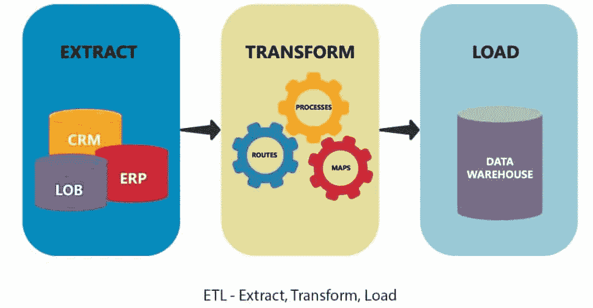

# ETL 去神秘化

> 原文：<https://medium.com/codex/etl-demystified-409ed1168345?source=collection_archive---------9----------------------->

ETL 用几句话解释了



在这篇文章中，我试图用简单的语言和一些 Python 代码来解释 ETL 过程。

# 什么是 ETL？

在计算中，ETL 代表提取、转换、加载。它是将数据从一个或多个源复制到目标系统的一般过程，目标系统以不同于源的方式或在不同于源的上下文中表示数据。

# ETL 是如何工作的？

## 在这里，我们将逐步了解 ETL 过程是如何工作的:

## 步骤 1)提取

数据从源系统中提取出来，并在提取过程中放置在临时区域中。如果需要任何转换，它们都在临时区域中执行，这样就不会损害源系统的性能。如果损坏的数据直接从源转移到数据仓库数据库，回滚将会很困难。在将提取的数据移入数据仓库之前，可以在临时区域对其进行验证。

数据仓库可以将具有不同硬件、数据库管理系统、操作系统和通信协议的系统结合起来。数据仓库必须将具有不同 DBMS、硬件、操作系统和通信协议的系统结合起来。来源可能包括遗留程序，如大型机、定制应用程序、接触点设备(如 ATM 和呼叫交换机)、文本文件、电子表格、ERP、来自供应商和合作伙伴的数据等。

因此，在提取数据并物理加载它之前，需要一个逻辑数据映射。此数据图中显示了源数据和目标数据之间的联系。

## 三种数据提取方法:

> **部分提取** —如果源系统在记录被修改时提醒您，这是获取数据的最简单方式。
> 
> **部分提取(无更新通知)** —并非所有系统都能在更新发生时发送通知；但是，它们可以指出已更改的记录，并提供这些记录的摘录。
> 
> **完整提取** —某些系统根本无法确定哪些数据发生了变化。在这种情况下，从系统中获取数据的唯一方法是执行完全提取。这种方法要求手头有一份
> 相同格式的先前摘录的备份，以便识别已经完成的更改。

无论采用哪种方法，提取都不应该对源系统的性能或响应时间产生影响。这些是实时生产数据库。任何放缓或锁定都可能对公司的底线产生影响。

## 步骤 2)转型

从源服务器检索的数据是原始的，在其原始状态下不可用。因此，必须对其进行清理、映射和转换。实际上，这是 ETL 过程增加价值和转换数据以产生有意义的 BI 报告的关键步骤。

这是一个关键的 ETL 概念，其中您将一组函数应用于提取的数据。**直接移动**或**通过 dat** a 是不需要任何转换的数据类型。

您可以在转换步骤中对数据执行定制操作。例如，假设客户想要数据库中不存在的销售收入总额。或者如果表中的名字和姓氏在不同的列中。在加载之前，可以将它们连接起来。

以下是数据完整性问题的一些示例:

> 同一个人的不同拼法，如 Prashant，Parshant 等。
> 
> 一个公司名称有很多种表示方式，比如 Google，Google Inc。
> 
> 使用了各种名称，如克里弗兰和克利夫兰。
> 
> 对于同一个客户，不同的应用程序可能会产生多个帐号。
> 
> 一些需要数据的文件是空白的。

## 步骤 3)装载

ETL 过程的最后一步是将数据加载到目标数据仓库数据库中。在典型的数据仓库中，大量数据在相对较短的时间内被加载。因此，加载过程应该针对性能进行优化。

在发生加载故障时，应准备好恢复程序，以便操作可以从故障点重新开始，而不会损害数据完整性。数据仓库管理员必须根据服务器性能监控、继续和停止负载。

## 装载类型:

> **初始加载** —填充所有的
> 数据仓库表
> 
> **增量负载** —根据需要定期实施持续的
> 修改
> 
> **完全刷新** —清除一个或多个表格的内容
> 并用新数据重新加载它们

## 负载验证

> 检查关键字段数据是否缺失或为空。
> 
> 应该测试基于目标表的建模视图。
> 
> 检查组合值 3 和计算值。
> 
> 维度和历史表中的数据检查。
> 
> 检查加载的事实和维度表上的 BI 报告。

# 使用 PythonScript 设置 ETL

因此，您必须执行从几个数据库到一个数据仓库的基本提取转换加载(ETL ),以便为商业智能进行数据聚合。有几个可用的 ETL 包，您认为对于您的基本用例来说太多了。

我将向您展示如何从 MySQL、SQL-server 中提取数据。使用 Python 3.6，转换数据并将其加载到 SQL-server(数据仓库)中。

首先，我们必须为我们的项目创建一个目录:

```
python_etl
    |__main.py
    |__db_credentials.py
    |__variables.py
    |__sql_queries.py
    |__etl.py
```

**要使用 Python 设置 ETL，您需要在项目目录中生成以下文件**。

*   **db_credentials.py:** 应该拥有连接到所有数据库所需的所有信息。如数据库密码、端口号等。
*   **sql_queries.py:** 所有提取和加载字符串格式数据的常用数据库查询都应该可用。
*   **etl.py:** 连接到数据库，通过执行所有必要的过程来执行所需的查询。
*   **main.py:** 负责管理操作流程，按照指定的顺序执行必要的操作。

在 sql_queries.py 的这个部分中，这是我们将要存储所有 sql 查询的地方，这些查询用于从源数据库中提取并导入到我们的目标数据库(数据仓库)中

*   Python 到 MySQL 的连接器: [MySQL-connector-python](https://dev.mysql.com/doc/connector-python/en/connector-python-introduction.html)
*   Python 到 Microsoft SQL Server 的连接器: [pyodbc](https://github.com/mkleehammer/pyodbc/wiki)

# 设置数据库身份证明和变量

在 variables.py 中，创建一个变量来记录数据仓库数据库的名称。

```
datawarehouse_name = 'your_datawarehouse_name'
```

在 db_credentials.py 中配置所有源和目标数据库连接字符串和凭证，如下所示。将配置保存为一个列表，以便我们可以在以后需要时通过许多数据库迭代它。

```
from variables import datawarehouse_name
datawarehouse_name = 'your_datawarehouse_name'
# sql-server (target db, datawarehouse)
datawarehouse_db_config = {
  'Trusted_Connection': 'yes',
  'driver': '{SQL Server}',
  'server': 'datawarehouse_sql_server',
  'database': '{}'.format(datawarehouse_name),
  'user': 'your_db_username',
  'password': 'your_db_password',
  'autocommit': True,
}
# sql-server (source db)
sqlserver_db_config = [
  {
    'Trusted_Connection': 'yes',
    'driver': '{SQL Server}',
    'server': 'your_sql_server',
    'database': 'db1',
    'user': 'your_db_username',
    'password': 'your_db_password',
    'autocommit': True,
  }
]
# mysql (source db)
mysql_db_config = [
  {
    'user': 'your_user_1',
    'password': 'your_password_1',
    'host': 'db_connection_string_1',
    'database': 'db_1',
  },
  {
    'user': 'your_user_2',
    'password': 'your_password_2',
    'host': 'db_connection_string_2',
    'database': 'db_2',
  },
]
# firebird (source db)
fdb_db_config = [
  {
    'dsn': "/your/path/to/source.db",
    'user': "your_username",
    'password': "your_password",
  }
]
```

# SQL 查询

在 sql_queries.py 的这个部分中，这是我们将要存储所有 sql 查询的地方，这些查询用于从源数据库中提取并导入到我们的目标数据库(数据仓库)中。

我们必须为每个数据库实现不同的语法，因为我们正在与多个数据平台合作。我们可以通过基于数据库类型分离查询来做到这一点。

```
# example queries, will be different across different db platform
firebird_extract = ('''
  SELECT fbd_column_1, fbd_column_2, fbd_column_3
  FROM fbd_table;
''')
firebird_insert = ('''
  INSERT INTO table (column_1, column_2, column_3)
  VALUES (?, ?, ?)  
''')
firebird_extract_2 = ('''
  SELECT fbd_column_1, fbd_column_2, fbd_column_3
  FROM fbd_table_2;
''')
firebird_insert_2 = ('''
  INSERT INTO table_2 (column_1, column_2, column_3)
  VALUES (?, ?, ?)  
''')
sqlserver_extract = ('''
  SELECT sqlserver_column_1, sqlserver_column_2, sqlserver_column_3
  FROM sqlserver_table
''')
sqlserver_insert = ('''
  INSERT INTO table (column_1, column_2, column_3)
  VALUES (?, ?, ?)  
''')
mysql_extract = ('''
  SELECT mysql_column_1, mysql_column_2, mysql_column_3
  FROM mysql_table
''')
mysql_insert = ('''
  INSERT INTO table (column_1, column_2, column_3)
  VALUES (?, ?, ?)  
''')
# exporting queries
class SqlQuery:
  def __init__(self, extract_query, load_query):
    self.extract_query = extract_query
    self.load_query = load_query
# create instances for SqlQuery class
fbd_query = SqlQuery(firebird_extract, firebird_insert)
fbd_query_2 = SqlQuery(firebird_extract_2, firebird_insert_2)
sqlserver_query = SqlQuery(sqlserver_extract, sqlserver_insert)
mysql_query = SqlQuery(mysql_extract, mysql_insert)
# store as list for iteration
fbd_queries = [fbdquery, fbd_query_2]
sqlserver_queries = [sqlserver_query]
mysql_queries = [mysql_query]
```

# 提取转换负载

要使用 Python 为上述数据源设置 ETL，您需要以下模块:

```
# python modules
 import mysql.connector
 import pyodbc
 import fdb
# variables
 from variables import datawarehouse_name
```

我们可以使用两种技术:etl()和 etl_process()。

etl_process()是建立数据库源连接并基于数据库平台调用 etl()方法的过程。

第二种方法是 etl()方法，它首先运行提取查询，然后将 SQL 数据存储在变量数据中，并将其插入到目标数据库中，这就是我们的数据仓库。数据转换可以通过改变类型元组的数据变量来完成。

```
def etl(query, source_cnx, target_cnx):
  # extract data from source db
  source_cursor = source_cnx.cursor()
  source_cursor.execute(query.extract_query)
  data = source_cursor.fetchall()
  source_cursor.close()
  # load data into warehouse db
  if data:
    target_cursor = target_cnx.cursor()
    target_cursor.execute("USE {}".format(datawarehouse_name))
    target_cursor.executemany(query.load_query, data)
    print('data loaded to warehouse db')
    target_cursor.close()
  else:
    print('data is empty')
def etl_process(queries, target_cnx, source_db_config, db_platform):
  # establish source db connection
  if db_platform == 'mysql':
    source_cnx = mysql.connector.connect(**source_db_config)
  elif db_platform == 'sqlserver':
    source_cnx = pyodbc.connect(**source_db_config)
  elif db_platform == 'firebird':
    source_cnx = fdb.connect(**source_db_config)
  else:
    return 'Error! unrecognised db platform'
  # loop through sql queries
  for query in queries:
    etl(query, source_cnx, target_cnx)
  # close the source db connection
  source_cnx.close()
```

# 把所有东西放在一起

现在，在下一步中，我们可以遍历 main.py 中的所有凭证，并对所有数据库执行 etl。

为此，我们必须导入所有必需的变量和方法:

```
# variables
  from db_credentials import datawarehouse_db_config, 
  sqlserver_db_config, mysql_db_config, fbd_db_config
  from sql_queries import fbd_queries, sqlserver_queries, mysql_queries
  from variables import *
 # methods
  from etl import etl_process
```

这个文件中的代码负责遍历凭证，以便连接到数据库并使用 Python 操作执行必要的 ETL。

```
def main():
  print('starting etl')
  # establish connection for target database (sql-server)
  target_cnx = pyodbc.connect(**datawarehouse_db_config)
  # loop through credentials
  # mysql
  for config in mysql_db_config: 
    try:
      print("loading db: " + config['database'])
      etl_process(mysql_queries, target_cnx, config, 'mysql')
    except Exception as error:
      print("etl for {} has error".format(config['database']))
      print('error message: {}'.format(error))
      continue
  # sql-server
  for config in sqlserver_db_config: 
    try:
      print("loading db: " + config['database'])
      etl_process(sqlserver_queries, target_cnx, config, 'sqlserver')
    except Exception as error:
      print("etl for {} has error".format(config['database']))
      print('error message: {}'.format(error))
      continue
  # firebird
  for config in fbd_db_config: 
    try:
      print("loading db: " + config['database'])
      etl_process(fbd_queries, target_cnx, config, 'firebird')
    except Exception as error:
      print("etl for {} has error".format(config['database']))
      print('error message: {}'.format(error))
      continue
  target_cnx.close()
if __name__ == "__main__":
  main()
```

在您的终端中，键入 python main.py，您就已经使用纯 python 脚本创建了一个 ETL。

# 最后的想法

我希望这篇文章对您有所帮助，让您对 ETL 有一个全新的认识，同时使您能够更好地理解它，并在今后更有效地使用它。如果能听到您关于您最喜欢的 ETL 工具以及您看到的占据数据仓库中心舞台的解决方案的消息，那将是非常好的。