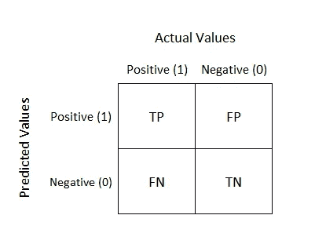
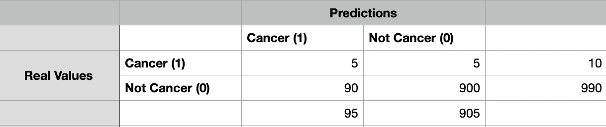

# 评估分类模型、混淆矩阵

> 原文：<https://medium.com/codex/evaluating-classification-models-confusion-matrix-47f498d93d4a?source=collection_archive---------6----------------------->

在分类问题中，模型的准确性在许多情况下可以是主要的性能指标。但是有些情况下精确度不足以评价一个模型的性能。

当您处理的数据不平衡时，准确度分数可能会产生误导。混淆矩阵在这些情况下很有用。

**混淆矩阵**

混淆矩阵

混淆矩阵显示 4 种情况；TP，FP，FN，TN。

真正值(T.P ):正确预测的正值。

假阳性(F.P):预测为阳性(1)的阴性(0)值

假阴性(F.N):阳性(1)值预测为阴性(0)

真负值(T.N):正确预测的负值。

可以看出，分类错误有两种类型:假阳性和假阴性。

**假阳性**:I 型错误，不太严重。例如:模型预测交易为欺诈，但它不是欺诈。在这种情况下，简单的道歉就足够了。

**假阴性:**II 型错误，危急。例如:模型预测交易不是欺诈，但它实际上是欺诈。在这种情况下，你的公司/银行**会**损失金钱、信誉等。

**评估分数**

**准确性**:数据中正确预测值的比率。

*(临时温度+临时温度)/(临时温度+临时温度+临时温度+临时温度)*

**精度**:正确预测值占正预测值的比例。当预测为正时，衡量模型的好坏。

*(温度)/(温度+压力)*

**回忆**:数据正类中正确预测值的比率。衡量模型正确预测正类的能力。

*(时间)/(时间+频率)*

**F1-得分**:加权平均值。精确度和回忆分数。

*2*(精度*召回)/(精度+召回)*

当数据不平衡时(例如:900 为负，50 为正)，准确性分数可能会产生误导。因为该模型可能擅长预测负值，但不擅长预测正值。

还建议检查每个分类模型中的精确度、召回率和 F1 分数，不管数据是平衡的还是不平衡的。

**例如:**

一个数据集包含 1000 名患者的信息。该模型的目标是预测患者是否患有癌症。其中 990 人没有癌症，10 人有癌症。

让我们想象输出如下所示:

示例配置。[数]矩阵

从上面可以看出，模型将其中 95 个分类为癌症，905 个分类为非癌症。

精度:(5 + 900) / (1000) = 0.905

准确率很高。模型看起来很准确，但这是一个不平衡的数据集。让我们进一步调查；

精度:T.P / (T.P + F.P) = 5 / 95: 0.053

回忆:T.P / (T.P + F.N) = 5 / 10: 0.5

看起来这个模型并不擅长预测正值。检查所有指标很重要。

感谢阅读。

bar Cengiz