# 评估指标

> 原文：<https://medium.com/codex/evaluation-metrics-7f21615ab5df?source=collection_archive---------5----------------------->

欢迎阅读这篇关于评估度量的文章，我假设您在这里是因为您在学习分类模型时遇到了这个概念，并且您正在寻找额外的解释或修订。

在任何机器学习问题中，一旦我们得到一个结果，我们就想衡量我们的模型有多准确。在回归问题中，精确度通常用实际值和预测值之间的差异来衡量。为此，我们使用 R 平方得分、调整后的 R 平方、均方误差等指标。

但是……分类问题呢？我们如何判断算法是否变得更好，以及它们总体表现如何？衡量分类模型可信度的标准是什么？

在分类问题中，使用所生成的混淆矩阵来测量模型的可信度，即预测真阳性和真阴性的准确程度。用于此目的的不同指标有:

*   准确(性)
*   回忆
*   精确
*   F1 分数
*   特征
*   受试者操作者特征
*   曲线下面积

# 混淆矩阵

为了理解上述指标，我们必须回忆一下混淆矩阵。典型的混淆矩阵如下所示:

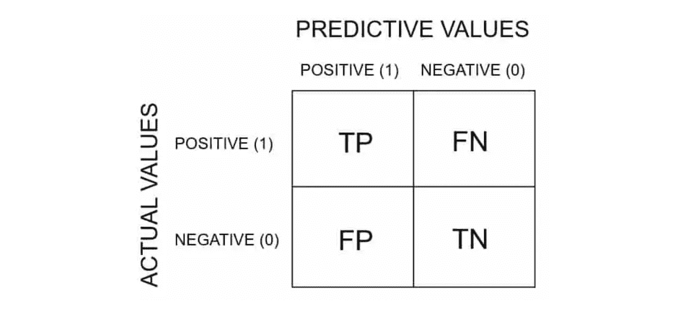

混淆矩阵可能会令许多初学者感到困惑，因此得名。但以下是它告诉我们的一切:

*   **真阳性(TP):** 当结果被预测为阳性而它确实是阳性时。
*   **真阴性(TN):** 当结果被预测为阴性而实际上是阴性时。
*   **假阳性(FP):** 当结果被预测为阳性而实际上是阴性时(…模型被混淆)
*   **假阴性(FN):** 当结果被预测为阴性而实际上是阳性时(…模型再次被混淆)

# 示例:

***假设*** 我们对新冠肺炎·聚合酶链式反应测试有如下混淆矩阵:

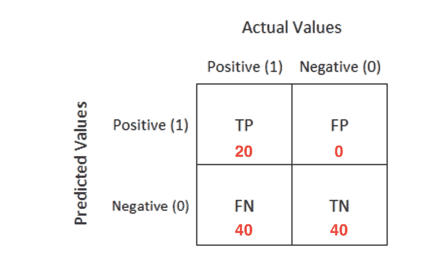

我们说:

*   **真阳性(TP):** 针对患有新冠肺炎且检测呈阳性的人。
*   **真阴性(TN):** 适用于未患新冠肺炎病且检测结果为阴性的人。
*   **假阳性(FP):** 针对未感染新冠肺炎但检测呈阳性的人。
*   **假阴性(FN):** 针对患有新冠肺炎但检测结果为阴性的人。

# 准确(性)

它是被正确识别为其类别成员的数据点(项目)的数量除以所有其他项目的数量。它描述为下面的公式:

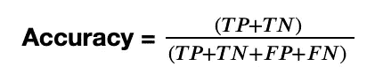

在我们之前的新冠肺炎例子中:

*𝑇𝑃=20、𝑇𝑁=40、𝐹𝑃=0、𝐹𝑁=40*

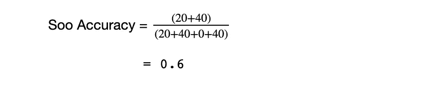

准确度是一个很好的度量标准，但是它有一些缺点，对于分类问题来说，它是一个很好的选择，这些分类问题是平衡的，没有偏斜或者没有类不平衡。

# 回忆还是敏感

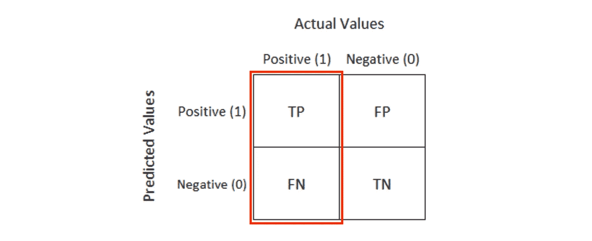

它告诉我们从数据集中召回了多少阳性。

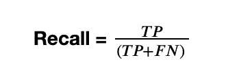

在我们之前的新冠肺炎例子中:

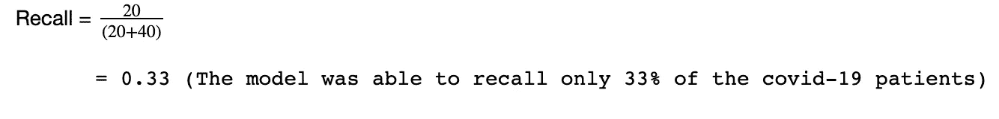

# 精确

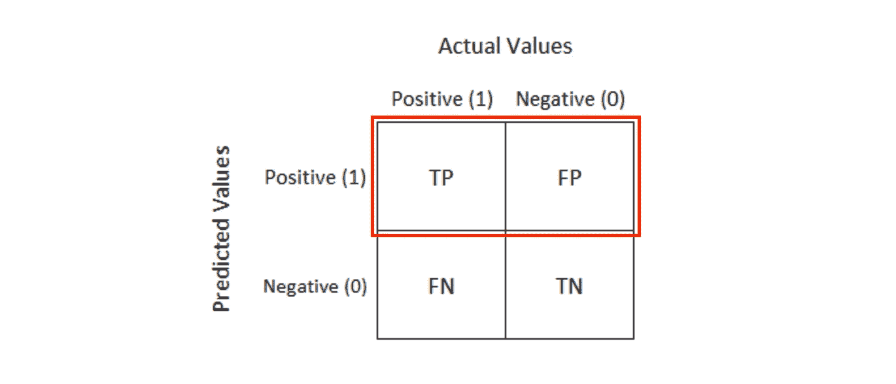

顾名思义，就是模型有多精确。有多少项被标记为阳性，而实际上却是阳性的。

例如，在我们的新冠肺炎测试示例中，精确度是我们的算法预测新冠肺炎感染者而此人实际上患有新冠肺炎的比率。

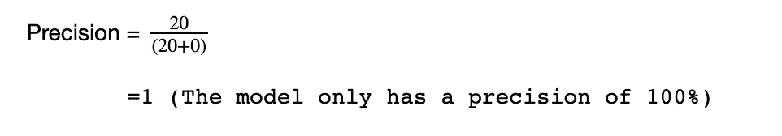

# F1 分数

从前面的例子可以清楚地看出，我们需要一个同时考虑精确度和召回率的指标来评估一个模型。一个这样的指标是 F1 分数。

F1 分数被定义为精确度和召回率的调和平均值。

数学公式是:

# 特异性或真阴性率

这代表了模型在预测真正的负面因素时有多具体。数学上，

# 受试者操作者特征

它代表不同阈值的不同混淆矩阵。每个黑点是一个混淆矩阵。ROC 曲线回答了分类问题选择哪个阈值的问题。

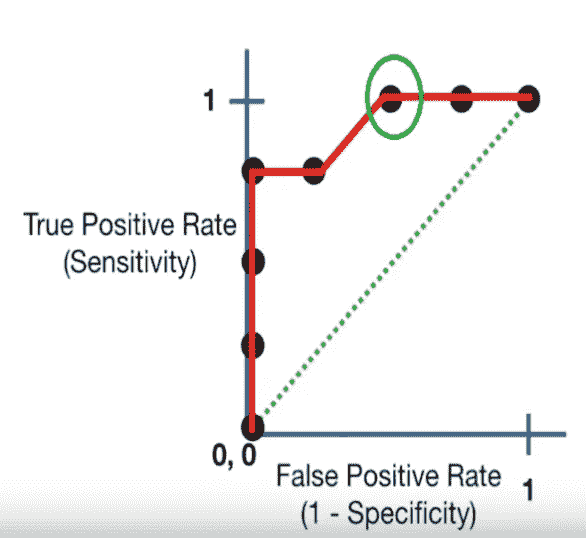

*   绿色虚线表示真阳性率等于假阳性率的情况。
*   当我们从最右边的点向左移动时，在某个阈值之后，假阳性率降低。
*   一段时间后，假阳性率变为零。
*   用绿色圈出的点是最好的点，因为它正确地预测了所有的值，并使假阳性最小。

# 曲线下面积

AUC 有助于在我们绘制 ROC 曲线的其他模型中选择正确的模型，最好的模型是面积最大的模型。

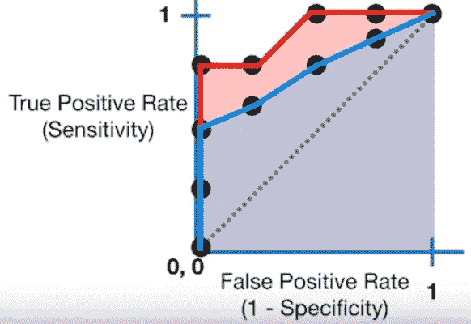

在此图中，在两条曲线中，应该选择导致红色曲线的模型，因为它明显比蓝色曲线覆盖了更多的区域

# 选择正确的指标？

取决于你想让你的机器学习算法做什么，在许多情况下，你更关心特定的结果。例如，在我们的新冠肺炎测试中，我们更关心感染者是否被真正检测出来，即使这意味着我们偶尔会容忍一些假阳性，而不是让患有新冠肺炎的人认为他没有。这对他自己和他周围的人的健康可能是灾难性的。

在这种情况下，您的评估度量标准对一种类型的错误有不同的偏好。因此，这实际上取决于业务需求。

从前面预测新冠肺炎的例子中可以明显看出，该模型具有很高的精度，但在召回率方面表现不佳。我们真正需要的是 100 %的召回。

但假设我们在预测一个人是否无辜，那么我们需要 100%的精度。

通过选择合适的度量标准，您可以将您的算法调整到您希望的最佳状态:)