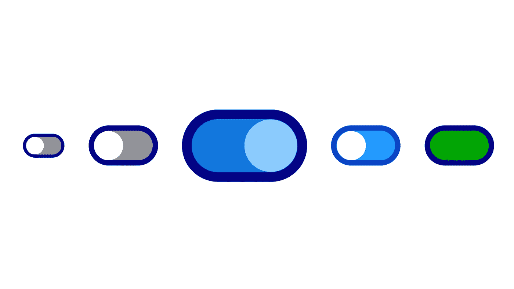

# 样式更好的 HTML/CSS 复选框

> 原文：<https://medium.com/codex/even-better-styled-html-css-checkboxes-7e9345b5bffd?source=collection_archive---------1----------------------->

******警告***本文的早期版本基于关于 Safari 需要浏览器前缀的错误信息，并假设 Safari 没有使用不完整且无意义的复选框实现，它将在生成的内容周围应用不能关闭的边距。我已经重写了演示，使用子元素的绝对定位来修复 Safari 支持。***