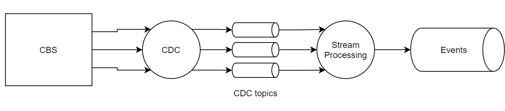
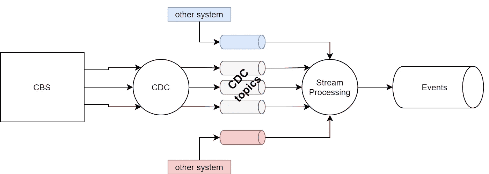

# 事件驱动架构(2) —变更数据捕获

> 原文：<https://medium.com/codex/event-driven-architecture-2-change-data-capture-af2acd3fd664?source=collection_archive---------2----------------------->

我决定写变更数据捕获(CDC)这个主题的原因，在某种程度上与事件驱动架构的故事紧密相关。以我的经验，这个问题经常会冒出来。如何从非事件系统中提取数据，如何将非事件系统(数据)转换为基于事件的系统，这是每个开始向以事件为中心的组织转变的组织在最开始时都会问自己的问题。

当您有一个大型(可能是旧的)核心单片系统，没有事件流功能时，就会发生这种情况，改变这种功能既缓慢又昂贵。速度慢、成本高意味着很难添加新功能、与新服务集成或为客户增加新价值。并且您希望保持竞争优势并改进产品交付—缩短上市时间，提高交付团队的灵活性和自主性—因此您最终会寻找新的架构和技术来帮助您完成任务。

我们都知道，客户期望和卓越的用户体验是变革的主要驱动力。我们需要更快、更有效、成本更低地对此做出回应。事件驱动的架构概念和原则将为我们的组织带来这些能力，但也有一些折衷。

# 巨石柱

通常，这是您的核心遗留系统，它已经存在了一段时间，有一大批开发人员、工程师和业务分析师在为这个系统服务。这个系统已经在战斗中得到验证，它包含了一个基础设施，并且完成了任务。阿门。但是它维护起来很昂贵，很难改进，并且几乎不可能成为您组织中的创新源。

胡尔基·奥莰·塔巴克在 [Unsplash](https://unsplash.com?utm_source=medium&utm_medium=referral) 上拍摄的照片

几个模式描述了如何从整体架构转移到微服务架构。当迁移到事件驱动的系统时，你会从一个问题开始:我如何从我的整体系统中提取事件并公开发布？这里的主要目标是您希望让您的数据对其他系统(微服务)开放，以便能够使用它们并围绕它们构建您的新功能。这样，你就为现代分离架构打下了基础。如果你成功了，每个人都会为你鼓掌。

CDC 工具作为一种从数据库中提取数据的手段，可以有多种使用方式，这取决于您的应用程序的工作方式——取决于数据库如何保存您的域实体的记录(EDA 与 DDD 密切相关，它被建模为提供有界上下文之间的解耦)。

简单 CDC——在自然环境中非常少见，有一个特点，它的数据库结构简单，整个实体在一个表中。如果您的 CDC 工具在数据库中发出变更，它们可以被有效地解释为您的实体上的命令/事件。

简单 CDC

# CDC 和流处理

通常，您会遇到这样的情况:您的域实体(比如说，customer，作为一个公共域)数据跨越了几个表，并且业务逻辑以某种方式更改了这些表中的记录(通常没有人知道是如何更改的)。这意味着 CDC 工具将发出这些更改，因为它们被一些后端过程更改时会从表中发出行。在这种情况下，您需要知道您的应用程序是如何工作的，以及它是如何写入您的数据库的，以便您可以捕获它们并将它们转换成有意义的事件。

每个表发布一个主题

*CDC 工具捕获核心系统数据库中的变更，并将这些变更发布到 CDC 主题的流集成解决方案中，例如，每个主题从一个表中流出变更。流处理组件使用这些流，并从流数据中创建事件。流处理组件可以是 microservice、Kafka streams、Flink、Spark…流处理组件的结果是发布在流集成解决方案上的事件。*

流处理组件负责消费这些数据流，并将它们组合成与业务相关的事件—域事件。该组件可以开发为微服务、Flink 作业、Spark 或其他流处理技术。

**复杂的 CDC** 解决方案将涉及来自各种来源以及 CDC 主题的流处理。当您的域事件源自不同有界上下文的实体(例如微服务)时，就是这种情况。这些“其他”系统必须具有事件流功能，或者应用了一种 CDC 技术。

*CDC 工具捕获核心系统数据库中的更改，并将这些更改作为 CDC 主题发布到流集成解决方案，例如，每个主题从一个表中获取流更改。流处理组件消耗这些流* ***以及来自其他系统*** *的流，并从流数据创建事件。*

*流处理组件可以是 microservice、Kafka streams、Flink、Spark…流处理组件的结果是发布在流集成解决方案上的事件。*

这种类型的 CDC 架构(或景观)非常类似于 CEP——复杂事件处理，因为它要求您“动态”处理事件。

您需要哪种模式将取决于您的用例、数据库技术，当然还有您的事件流能力。最后，您的实现可能在模式和架构上有所不同。如果有，欢迎分享！