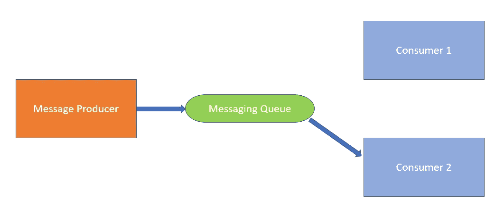
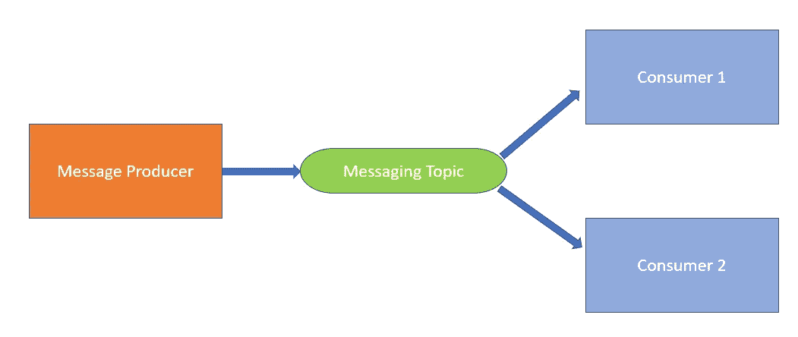
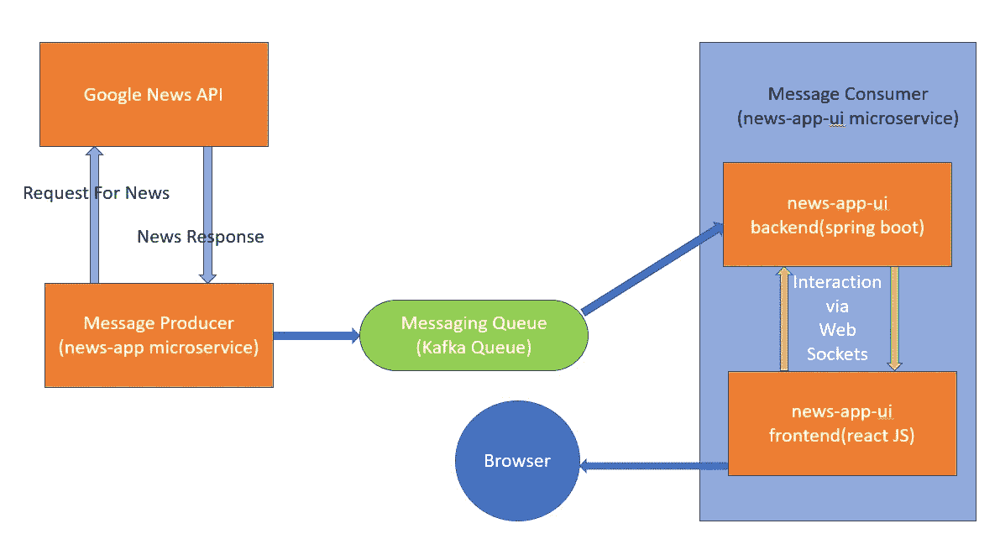

# 使用 Spring Cloud Stream 和 Web Sockets 的事件驱动微服务

> 原文：<https://medium.com/codex/event-driven-microservices-using-spring-cloud-stream-and-web-sockets-ee7c8921aa4f?source=collection_archive---------5----------------------->

## 第 1 部分:基本概念

作为一名编程爱好者，我们都非常热衷于新技术，这些新技术似乎每天都层出不穷，其中一个热门话题是 ***事件驱动的微服务*** ，它可以确保您的系统更加去耦，微服务更加独立。这听起来很酷，但是实现它并理解它是一件非常痛苦的事情。因此，我使用这个概念创建了一个简单的全栈应用程序，为您提供实时新闻，由于 Spring 和 React JS 提供了漂亮的库，我的工作变得轻松了。

这些是我将在这篇文章中谈论的主要内容:

*   微服务
*   事件驱动架构
*   队列和主题
*   码头基础知识
*   春云流
*   使用 STOMP(简单面向文本的消息协议)的 Web 套接字

我的主要目标是为微服务之间的通信建立一个事件驱动的架构，为此我将使用 Spring Boot 和 React JS，我假设你对 Spring Boot 有很好的了解，对 React JS 有一点了解就足够了。

# 微服务

据[维基百科](https://en.wikipedia.org/wiki/Microservices):

> 微服务不是单一应用程序中的一层(例如，web 控制器或后端对前端)。相反，它是一个独立的业务功能，具有清晰的接口，并且可以通过自己的内部组件实现分层架构。从战略角度来看，微服务架构本质上遵循“做一件事并把它做好”的 Unix 哲学。

微服务的主要优势是:

*   微服务是高度可维护的
*   很容易被测试
*   微服务是松散耦合的，因为它们是独立的服务，致力于执行单个明确定义的任务，并且每个微服务都可以独立部署。

使用微服务不仅可以确保复杂应用程序的交付在几次迭代中非常顺利和快速，还可以确保应用程序保持技术独立，从一个技术堆栈更改到另一个不会成为一场噩梦，这有助于应用程序始终保持最新。

# 事件驱动架构

根据[维基百科](https://en.wikipedia.org/wiki/Event-driven_architecture):

> E **事件驱动架构** ( **EDA** )是一种[软件架构](https://en.wikipedia.org/wiki/Software_architecture)范例，促进[事件](https://en.wikipedia.org/wiki/Event_(computing))的产生、检测、消费和反应。

简单来说，当我们谈论 EDA 时，我们可以想到这样一幅画面，其中我们有多个微服务需要相互通信，它们通过使用一种叫做 ***事件*** 的东西来实现这一点。

现在什么是 ***事件*** ？

事件可以被定义为状态变化的指示器。因此，微服务根据它从另一个微服务接收到的变化进行操作。例如，当您单击一个按钮时，会执行一个操作，因此单击可以被视为一个事件。

根据 [RedHat](https://www.redhat.com/en/topics/integration/what-is-event-driven-architecture) 的说法，事件驱动架构的好处是:

> 事件驱动的架构可以帮助组织实现灵活的系统，能够适应变化并实时做出决策。实时态势感知意味着可以使用反映系统当前状态的所有可用数据来做出业务决策，无论是手动决策还是自动决策。

*在我完成下一个主题后，我会提供一个可视化的图表。*

# 队列和主题

消息队列和主题基本上是我们可以放入一些消息和从中读取消息的组件。他们在特征上有一些根本的不同。

让我们想象一下:

放入队列的消息只能由单个消费者读取

因此，在队列的情况下，当消息生产者将一些消息放入队列时，只有一个消费者可以读取该消息，并且消息队列中只能有一个订户。

放入队列的消息只能由多个使用者读取

另一方面，生产者放在主题上的消息可以被几个消费者读取，因为多个消费者可以订阅单个主题。

# 事件驱动的微服务的全貌

现在，我们有了事件的概念，以及如何在事件驱动架构范例中使用它，还有队列和主题的基本概念。

如果我们回想一下，在 ***事件驱动的微服务*** 中，一个微服务产生一个事件，当被期望的微服务接收时，接收微服务执行一些操作，并可能进一步产生一个事件或不产生一个事件，这是事件驱动架构范例中交互的基本法则。

因此，我们使用队列和主题来实现微服务之间的事件交换，由于微服务订阅了队列和主题，因此每当消息服务上出现事件时，微服务都会立即得到通知，并执行所需的活动，而无需任何外部调用。

现在，根据 [RedHat](https://www.redhat.com/en/topics/integration/what-is-event-driven-architecture) ，EDA 可能基于发布/订阅模型或事件流模型，但是在项目中我们遵循发布/订阅模型，让我们可视化 EDA 的发布/订阅模型(我们将要构建的 ***印度新闻*** 应用程序):

基于事件驱动架构的印度新闻应用

因此，现在我们将进一步深入应用程序的工作原理，这应该是讨论 docker、spring cloud stream 和 web sockets 基础知识的好时机。

# 码头工人

Docker 可以被认为是你的 app 的操作系统的版本控制系统。使用 Docker，您可以在笔记本电脑上运行您的应用程序，运行环境与应用程序将在生产中运行的服务器配置相同。

由于我本人对这种技术相当陌生，我将以初学者的理解来谈论，并记住这一点，我们可以简单地认为，当我们想要在安装了所有依赖项的隔离环境中部署应用程序或工具时，我们可以使用 docker，而不必费心在本地环境中设置依赖项。

请注意，阿帕奇卡夫卡既是一个主题也是一个队列，更多细节请查看 Abhishek Gupta 撰写的 [***这篇精彩文章***](https://abhishek1987.medium.com/kafka-is-it-a-topic-or-a-queue-30c85386afd6) 。

***在我的例子中，由于我的应用程序需要运行 Kafka 主题，使用 Docker 有助于在隔离环境中运行服务器来托管 Kafka 主题，而无需在我的系统中设置任何配置。***

所以，我相信你能理解我为什么要在我的项目中使用 docker。

在开始使用 Docker 之前，有必要了解一下 Docker 对象:

*   容器图像
*   容器

## 容器图像

根据码头工人的[文件](https://www.docker.com/resources/what-container):

> Docker 容器映像是一个轻量级的、独立的、可执行的软件包，包括运行应用程序所需的一切:代码、运行时、系统工具、系统库和设置。

一个 ***容器映像*** 基本上是一个模板，它提供了软件、配置工具等的所有细节。并且可以执行该映像来开发隔离的文件系统。

## 容器

根据码头工人的[文件](https://www.docker.com/resources/what-container):

> 容器是一个标准的软件单元，它将代码及其所有依赖项打包，以便应用程序能够快速可靠地从一个计算环境运行到另一个计算环境。

一个 ***容器*** 仅仅是你机器中的另一个进程，它与你机器中的所有其他进程相隔离。

可用于 Linux 和基于 Windows 的应用程序，容器化的软件将总是运行相同的，不管基础设施如何。容器将软件从它的环境中隔离出来，并确保它统一地工作，尽管存在差异，例如在开发和阶段之间。

## 容器与容器意象的关系

这些定义虽然很可靠，但很难理解，当你了解它们之间的关系时，理解它们就变得简单多了。

当运行一个 ***容器*** 时，它使用一个隔离的文件系统。这个定制文件系统由一个 ***容器镜像*** 提供。因为映像包含容器的文件系统，所以它必须包含运行应用程序所需的一切——所有的依赖项、配置、脚本、二进制文件等。该映像还包含容器的其他配置，如环境变量、要运行的默认命令和其他元数据。

我用以下三点来联系 ***图像*** 和 ***容器*** :

*   一个 ***图像*** 是一个只读模板，带有创建 Docker ***容器的指令。***
*   一个 ***容器*** 是一个 ***映像*** 的可运行实例。
*   ***图片*** 在运行时变成 ***容器*** 而在 Docker ***容器*** — ***图片*** 在 [***Docker 引擎***](https://www.docker.com/products/container-runtime) **上运行时变成 ***容器*** **

***请注意:*** 术语*容器图像*和*图像*可以互换使用，但两者代表同一事物。

## Docker 撰写

虽然我们可以构建容器并一次运行一个命令，但最简单的方法是使用 ***docker compose*** 就像这样，我们只需要创建一个 YAML 文件，然后用一个命令就可以创建整个环境并关闭它。

优势在于您对环境的所有需求都记录在一个文件中，其他人也可以对此做出贡献。

现在，我们已经了解了 docker 的基础知识，但由于这篇文章更侧重于解释事件驱动架构，我将不深究 docker 的设置，解释 docker 的 YAML 文件等。，当我在这篇文章的第二部分解释代码时，如果你不能理解这些概念，请在这篇文章中自由地评论你的想法和疑问。

# 春云流

根据[春季文件](https://spring.io/projects/spring-cloud-stream):

> Spring Cloud Stream 是一个框架，用于构建与共享消息传递系统相连的高度可伸缩的事件驱动的微服务。
> 
> 该框架提供了一个灵活的编程模型，它建立在已经建立和熟悉的 Spring 习惯用法和最佳实践之上，包括对持久发布/订阅语义、消费者组和有状态分区的支持。

为了简单了解《春云流》(SCSt)，Oleg Zhurakousky 在他的 [*博客*](https://spring.io/blog/2019/10/14/spring-cloud-stream-demystified-and-simplified) 中做了很好的总结:

> SCSt 一直是关于纯粹的微服务，并将它们绑定到数据的*源*和*目标*(即消息传递系统)。就这么简单。
> 
> 如果您对 SCSt 的内部知识了解得足够深入，您会很快意识到它实际上是一个绑定和激活框架。它将一段代码(由用户提供)绑定到由绑定器公开的数据的源/目标，并根据绑定器实现(例如，消息到达等)激活这样的代码。差不多就是这样。

因此，SCSt 基本上是 spring 提供的一个框架，它抽象出 boiler plate 代码来设置消息传递服务，这样用户就可以只关注业务逻辑，并将其放在队列/主题中，或者从队列/主题中读取，而无需编写太多代码来设置消息传递系统。因此，SCSt 是一个灵活的消息传递抽象，它负责复杂的消息传递平台集成，因此您可以专注于编写简单清晰的业务逻辑。

Spring Cloud Stream 的核心构件是:

*   ***目的地绑定器*** :负责提供与外部消息传递系统集成的组件。
*   ***目的地绑定*** :外部消息传递系统和最终用户提供的应用程序代码(生产者/消费者)之间的桥梁。
*   ***消息*** :生产者和消费者用来与*目的绑定器*(以及其他通过外部消息传递系统的应用程序)通信的规范数据结构。

我们将在应用程序中使用***Apache Kafka Binder***与队列进行交互。

# 使用 STOMP 的 Web 套接字

spring 提供的 Web Sockets 是 Web 浏览器和服务器之间的一种 ***全双工、双向持久通信方案*** 。由 web 套接字建立的通信管道保持连接，直到客户端或服务器决定关闭连接。

WebSocket 是 TCP 之上的一个轻薄层，它适合使用 ***子协议*** 来嵌入消息。我们将用来建立双向连接的子协议之一是 [STOMP](https://en.wikipedia.org/wiki/Streaming_Text_Oriented_Messaging_Protocol) 。

根据[春季文件](https://docs.spring.io/spring-framework/docs/4.3.x/spring-framework-reference/html/websocket.html#websocket-stomp-overview):

> [STOMP](https://stomp.github.io/stomp-specification-1.2.html#Abstract) 是一个简单的面向文本的消息传递协议，最初是为 Ruby、Python 和 Perl 等脚本语言创建的，用于连接企业消息代理。它旨在解决常用消息传递模式的一个子集。STOMP 可用于任何可靠的双向流网络协议，如 TCP 和 WebSocket。虽然 STOMP 是面向文本的协议，但是消息的有效负载可以是文本或二进制的。

你可以从 [Spring 文档](https://docs.spring.io/spring-framework/docs/4.3.x/spring-framework-reference/html/websocket.html#websocket-stomp-overview)中了解更多关于 WebSockets 和 STOMP 的信息。

# 第 1 部分结束

这一部分主要关注我将用来构建应用程序的基本概念，因为即使是简单的基础知识也有很多需要解释，所以我决定专门为此写一篇文章。如果您发现任何差异或您的想法，请随时评论。

[***转到 Part2。***](https://attyuttam.medium.com/event-driven-microservices-using-spring-cloud-stream-and-web-sockets-e93fe5fbe7d4)