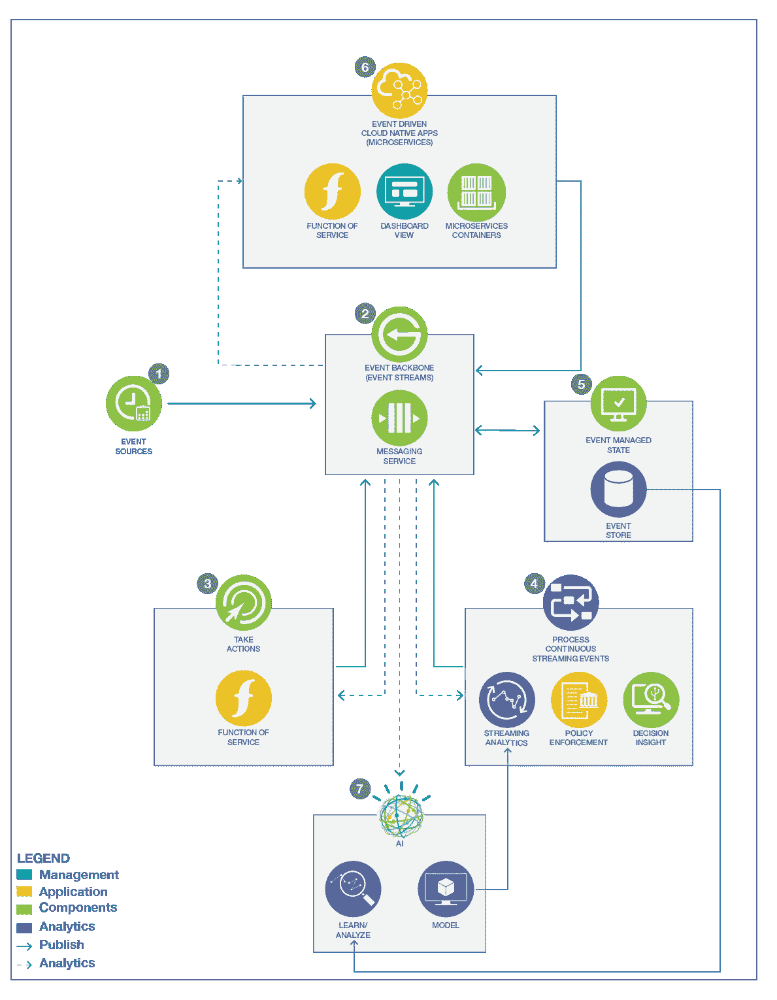

# 事件驱动的解决方案仍然是一个热门话题

> 原文：<https://medium.com/codex/event-driven-solution-is-still-a-hot-topic-15632a8130ef?source=collection_archive---------12----------------------->

最近，我不得不解释为什么事件驱动架构仍然是当前市场上的热门话题:当我与金融、医疗保健或零售行业的许多公司合作时，我看到松散耦合、事件驱动的微服务解决方案得到了大力采用，新的数据管道用于将数据注入现代数据湖，以及 Apache Kafka 或 Apache Pulsar 等事件主干技术的采用。

与我的团队一起，我们正在研究参考架构、参考实施和基于事件驱动实施的首款解决方案。在过去的一年里，随着无服务器、knative eventing、云原生技术、microprofile 3.x 消息传递的采用，这个领域发生了很大的变化...

在这篇博客中，我想介绍我们的 EDA 工作，并参考一些您可能能够在自己的项目中利用的资产。我将在以后的博客中更详细地介绍我们为客户服务开发的一些资产和最佳实践。

事件驱动架构(EDA)是一种架构模式，它促进事件的产生、检测、消费和反应。它支持组件之间的异步通信，并且大多数情况下支持发布/订阅编程模型。微服务的采用带来了一些有趣的挑战，如数据一致性、契约耦合和可伸缩性，EDA 有助于解决这些挑战。

从业务价值的角度来看，采用这种体系结构有助于根据工作负载扩展业务应用程序，并通过随着时间的推移添加新的组件来支持轻松扩展，这些组件可以随时生成或消费整个系统中已经存在的事件。我们可以开发出以前无法开发的新的实时数据流应用程序。

**主要用例**

在高层次上，使用基于事件的解决方案的主要业务动机是在数据创建或修改发生时实时响应它们，这意味着评估那些变化是什么，提供响应性的客户体验，或者评估业务风险和机会。

人工智能和预测评分的采用也可以集成到实时数据管道中，以构建更智能的应用程序。

在技术层面，我们可以看到事件驱动解决方案的三种应用:

*   **现代数据管道**将提取、转换和加载作业的传统批处理转移到实时接收，数据在中央消息主干中持续可见。数据源可以是数据库、队列或特定的生产者应用程序，而消费者可以是应用程序、流、长存储桶、队列、数据库…
*   采用**异步方式，云原生微服务之间的发布-订阅通信**有助于扩展和解耦:采用微服务来开发业务应用有助于解决维护和可扩展性问题，但纯 RESTful 或基于 SOAP 的解决方案带来了集成和耦合挑战，抑制了微服务架构所承诺的敏捷性。发布/订阅有助于改善解耦，但是良好的设计实践非常重要。(我将在以后的博客中详细阐述)
*   **实时分析**:这包括纯分析计算，如数据流上的聚合，也包括复杂的事件处理、基于时间窗口的推理或数据流上的人工智能评分集成。

**参考架构**

有了这些主要驱动因素，我们已经定义了参考架构，以评估这种事件驱动的解决方案中涉及哪些通用组件。在 IBM，我们已经开发了两个架构图，但我在我的大多数客户项目中使用的是[扩展图](https://www.ibm.com/cloud/architecture/architectures/eventDrivenArchitecture/reference-architecture)，因为它包括如何利用事件主干中的数据来开发 AI 模型，我认为这是一个重要的采用模式。

我鼓励您从[这个网站](https://www.ibm.com/cloud/architecture/architectures/eventDrivenArchitecture/reference-architecture)上阅读更多关于这些组件和功能的信息。

**事件驱动模式**

随着事件驱动解决方案的采用，开发人员和架构师需要评估我们工具箱中的不同设计模式，如[Event Sourcing】](https://www.ibm.com/cloud/architecture/architectures/event-driven-event-sourcing-pattern)将业务实体的状态持久化为一系列状态改变事件，[命令查询责任分离(CQRS)](https://www.ibm.com/cloud/architecture/architectures/event-driven-cqrs-pattern) 将写与读模型和 API 分离， [SAGA](https://www.ibm.com/cloud/architecture/architectures/event-driven-saga-pattern) 支持跨多个微服务的长时间运行的事务，并带有补偿流程，[事务发件箱](https://microservices.io/patterns/data/transactional-outbox.html)从数据库表中获取数据并将消息发送到主题或队列，以及

这些模式有助于更好地设计事件驱动的微服务，但是选择这样的模式需要常识。我们已经完成了这些模式的不同实现，为您自己的实现获得了一些起始代码和实践:

*   [CQRS 为海外运送货物的订单管理服务](https://github.com/ibm-cloud-architecture/refarch-kc-order-ms)。
*   [Saga 支持装运订单，包括船只分配和冷藏集装箱分配](https://ibm-cloud-architecture.github.io/refarch-kc/implementation/saga-patterns/)。
*   [交易发件箱](https://github.com/ibm-cloud-architecture/vaccine-order-mgr-pg)在另一个订单管理服务上:这是 covid 19 疫苗订单。它使用 Quarkus Debezium 插件，Postgresql 和 Kafka 连接器。

**如何入门？**

从方法论的角度来看，事件风暴法是由 Alberto Brandolini 在“[介绍事件风暴书](https://www.eventstorming.com/book/)”中介绍和公布的，用于快速捕获解决方案设计和提高团队对领域的理解。我们扩展了研讨会，以评估事件关系和来自数据流的见解:这将有助于设计持续处理事件流的智能代理。

我们将精益启动与敏捷开发实践、事件风暴和领域驱动的设计实践结合起来，帮助我们为任何事件驱动的解决方案打下良好的基础。这不是一个简单的练习，很容易出错。但是，当我们发现主要的实现问题时，如服务或事件模式的耦合等，能够改变、重构和调整微服务的边界是很重要的

在本文的[中，我们将结合](https://ibm-cloud-architecture.github.io/refarch-eda/methodology/event-storming/)[领域驱动的设计概念和构造](https://ibm-cloud-architecture.github.io/refarch-eda/methodology/domain-driven-design/)的快速总结，详细介绍如何举办一个事件风暴研讨会。

从开发人员的角度来看，我想提供一些基于相同微服务范围的简单示例代码:订单管理服务，但使用不同的语言，并通过使用域驱动的设计和元素，如异步 API、Avro 模式…

[eda-quickstarts](https://github.com/ibm-cloud-architecture/eda-quickstarts) github 库包括 Quarkus 2.x Kafka 生产者和消费者，以及 Spring 云项目:这个 github 库仍在工作中，我欢迎贡献者。

**技术趋势**

Apache Kafka 是支持我们参考架构的事件主干组件的当前选择，我们进行了广泛的研究，以总结实施生产者和消费者应用的关键概念和最佳实践，并辅以大量的动手实验。

如果 Kafka 运行在 Kubernetes 上，那么部署和管理 Kafka 将会非常方便，为了获得最佳的部署方法，请使用可以从 OpenShift Operator Hub 使用的 [Strimzi 操作符](https://strimzi.io/docs/operators/latest/using.html)。IBM Event Streams 也是基于这个操作符。

作为 Kafka 的一个很好的竞争对手，是 Apache Pulsar(T14 ),它用更多有趣的特性解决了所有预期的事件主干特性。

Kafka 领域的一个新玩家是来自矢量化的“ [Redpanda ”,它提供了许多非常好的功能，与 Kafka 兼容。](https://vectorized.io)

当你想要实现流逻辑时，Kafka 使用 Kafka Streams API 或 kSQL 来支持它。它们与 Kafka 紧密集成，即使它们解决了大多数流处理需求，也有替代方案。2021 年，我想采用 [Apache Flink](https://flink.apache.org/) 作为你的分析工具，独立于 Kafka 进行扩展。

Flink 有很多特性可以帮助你处理数据流用例，同时也支持 SQL 和复杂的事件处理。

将事件主干和数据流与人工智能结合起来是一条出路，我们需要在所有这些方面提升我们的技能。

**重要 EDA 链接**

*   [IBM 事件驱动参考架构](https://www.ibm.com/cloud/architecture/architectures/eventDrivenArchitecture/overview)
*   [EDA 现场指南](https://www.ibm.com/cloud/architecture/content/field-guide/event-driven-field-guide/)
*   我们的[事件驱动架构知识体系](https://ibm-cloud-architecture.github.io/refarch-eda/)(始终在进行中)
*   [事件风暴方法](https://ibm-cloud-architecture.github.io/refarch-eda/methodology/event-storming/)
*   [卡夫卡基础](https://developer.ibm.com/articles/event-streams-kafka-fundamentals)和一些[其他最佳实践](https://ibm-cloud-architecture.github.io/refarch-eda/technology/kafka-producers-consumers/)。