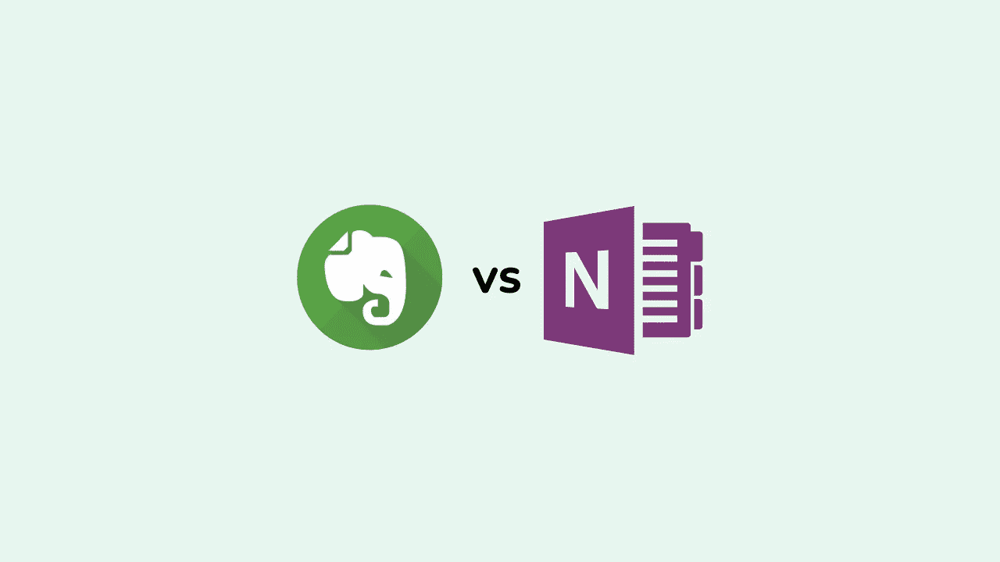
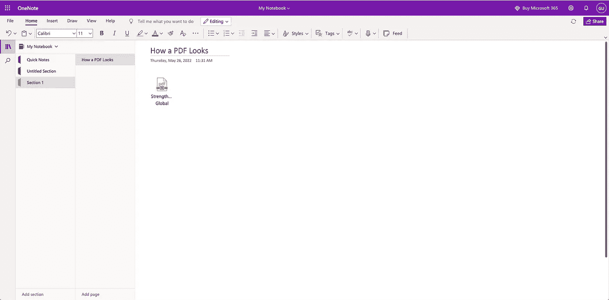
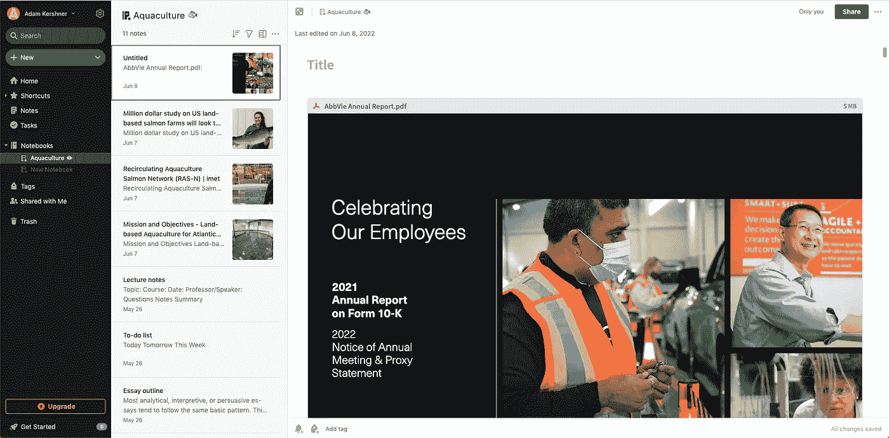
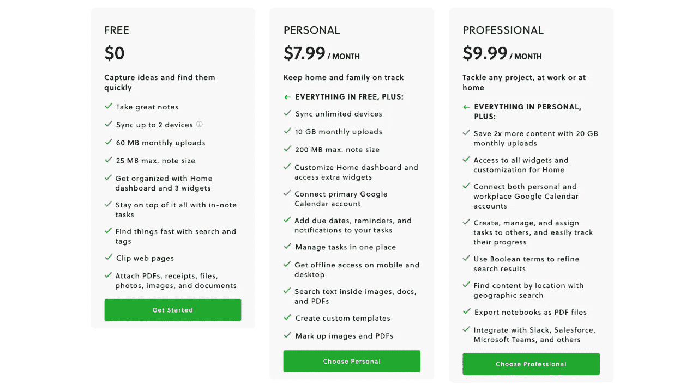
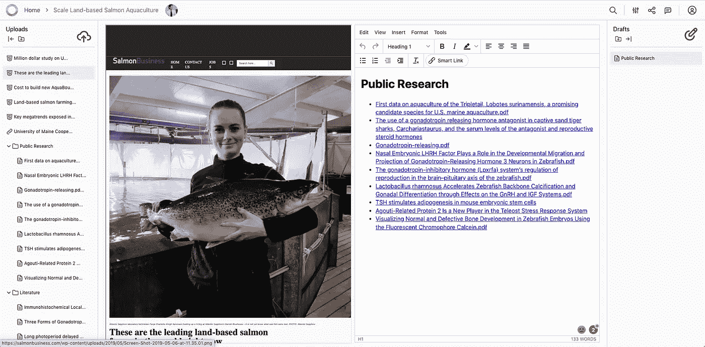

# 2022 年 Evernote vs OneNote

> 原文：<https://medium.com/codex/evernote-vs-onenote-12709f5b1e1f?source=collection_archive---------1----------------------->

Evernote vs OneNote？这是一个简单而复杂的问题，自互联网出现以来一直困扰着人类——让我们追根究底。在这篇文章中，我们涵盖了特性、相似性、差异、定价，以及一些其他选项，如果你认为*和*都不是😫

Evernote vs OneNote

# Evernote 与 OneNote——一点背景知识

这两个应用程序如此相似，你可能想知道为什么你需要两个…

如你所知，我们确实做了研究(事实上超过 72 小时)。比任何人花在分析 Evernote 和 OneNote 上的时间都多。

我们花了 72 个小时研究 Evernote 和 OneNote，并制作了一个关于我们发现的 YouTube 视频

# 快速笔记

Evernote 是一个为快速笔记服务的工具，OneNote 也是。

对于任何类型的音符，您都可以使用它们中的任何一种。无论你是快速记下你的购物清单，还是写下你下一个大项目的细节，这两款应用都能帮你完成任务。

# 手写笔记

OneNote 支持手写笔记，Evernote 也支持。两者都支持智能手写笔，可以记录并转换你的手写笔记为文本。在 OneNote 中，您还可以使用 Word 或 Outlook 中的[光学字符识别(OCR)](https://support.microsoft.com/en-au/office/copy-text-from-pictures-and-file-printouts-using-ocr-in-onenote-93a70a2f-ebcd-42dc-9f0b-19b09fd775b4) 功能将手写内容转换为文本。

这两款笔记应用还允许你在各自笔记本中存储的图片上画画。

# 数字笔记

虽然数字笔记在 Evernote 和 OneNote 中都很容易访问、共享和搜索，但这两种笔记都不能很好地帮助你并排阅读和书写所有材料的笔记。好消息是，你仍然可以通过一点点努力让你的数字笔记更有效率。

*   按主题或项目创建文件夹
*   使用标签来跟踪特定信息
*   在笔记中使用关键词

# 个人笔记

个人笔记是记录你需要记住的事情的好方法。Evernote、OneNote、Apple Notes 和 [Kahana](https://kahana.co/) 都是不错的选择。Moleskine 有几款智能笔记本，可以与你的手机或电脑配合使用，充当数字记事本。他们还为他们的笔记本专门设计了一套笔，这样你就可以在屏幕上自然地写笔记。

# 移动版本

Evernote 和 OneNote 都可以在移动设备上使用，所以你可以从手机或平板电脑上记笔记，但是，有一个问题。OneNote 比 Evernote 更容易做到这一点:它可以在你想要的任何设备上免费使用，而在多台设备上使用 Evernote 是一项付费功能。除非你是付费用户，否则你无法将 Evernote 从手机同步到桌面。

Evernote 确实为苹果和谷歌手机开发了自己的笔记应用，但它没有 OneNote(或 Kahana)的系统集成那么精致或直观。

如果你想在手机上使用第三方笔记应用程序，Kahana 是你的最佳选择，因为它的设计与其他应用程序相似，同时可以跨浏览器和设备使用。

# 桌面应用程序

OneNote 在所有平台上都可用。如果您有 Windows 电脑、Macbook 或任何其他可以运行 Microsoft Office 的设备，那么您可以使用 OneNote。

桌面 OneNote

Evernote 也可以在所有桌面平台上使用。你可以下载该应用程序，并从手机或平板电脑上查看你的笔记。

桌面版 Evernote

# 版本历史

Evernote 支持笔记的版本历史，这意味着您可以轻松查看和恢复笔记的以前版本。您还可以恢复已删除或已废弃的笔记，以及特定日期和时间的版本。此功能需要高级版、个人版、专业版或团队版订阅。

根据这篇 GroovyPost 文章，该功能目前在 OneNote 桌面应用程序中可用，但不包括 OneNote for Windows。

1.  打开 OneNote 并选择要查看的笔记本。
2.  转到**历史**选项卡(仅在支持的 OneNote 版本上可见)。
3.  点击功能区中的**最近编辑**。在出现的下拉列表中，选择时间范围。你可以选择像今天、昨天或过去几天或几个月这样的选项。

# 高级版本

笔记本是在 OneNote 中组织笔记的最基本方式。Evernote 没有笔记本的对等物，但是你可以使用标签和笔记本以类似的方式组织你的笔记。

Evernote 提供了一个高级版本，可以让你在多个设备上同步笔记，更快地搜索笔记，并通过电子邮件或 Twitter 和脸书等其他平台与他人分享。

高级版本也比免费版本允许更多的存储空间(15 GB 而不是 2 GB)。

然而，如果你想从免费版升级到高级版，Evernote 将每月收费 7.99 美元，如果按年付费，则每年收费 69.99 美元。

**OneNote 没有 Evernote 那样的付费服务；相反，它通过 Office 365 订阅提供该服务，该服务包括访问微软的所有生产力应用程序，包括 Word 和 Excel，以及 OneDrive(以前称为 SkyDrive)上的 1 TB 存储空间。**

# 定价方案

Evernote 提供三种定价方案:

*   免费(限量版)
*   个人每月 6.99 美元
*   团队每月 14.99 美元(协作)

Evernote 定价

OneNote 的定价是免费的，但要解锁高级功能，您需要购买 Microsoft 365，起价为每月 6.99 美元。

# 结论

我们希望这个分析对您有所帮助。我们非常希望收到您的反馈，所以请给我们留下您对这两款应用的看法，并告诉我们是否有我们遗漏或出错的地方🙈

如果你还在考虑 Evernote vs Onenote，我们推荐你看看这篇令人惊叹的 [Evernote vs OneNote 的文章，它的主题严谨](https://rigorousthemes.com/blog/evernote-vs-onenote-which-one-is-better/)，启发了我们的研究！

或者，如果你对 Evernote 和 OneNote 不确定，你可以随时[免费注册 Kahana](https://kahana.co/signup)，因为它提供了跨所有设备的无限协作🙃

卡哈纳免费提供所有设备上的无限上传、文件和合作者

如果你对其他应用程序的具体功能或特点感兴趣，我们很乐意做更多的研究，并在未来撰写相关文章，请留下评论并让我们知道。

如果你是一个技术发烧友，对 Kahana 或了解其他云协作应用程序感到好奇，[请查看我们的 hub，它提供了从 Evernote 到 OneNote，到 opinion，到 Coda 以及更多内容的完整分类。](https://app.kahana.co/hub/SsWWjZNEmW8ofwqRqthA)

***相关文章:***

*   [Evernote 替代品](/@kahana/evernote-alternative-an-exhaustive-list-of-note-taking-tools-to-pick-from-5da900bc0d68)
*   [OneNote 备选方案](https://kahana.medium.com/onenote-alternatives-44702c9b178b)
*   [印象笔记 vs 观念](https://kahana.medium.com/evernote-vs-notion-vs-microsoft-loop-2d5d4ea42bb0)