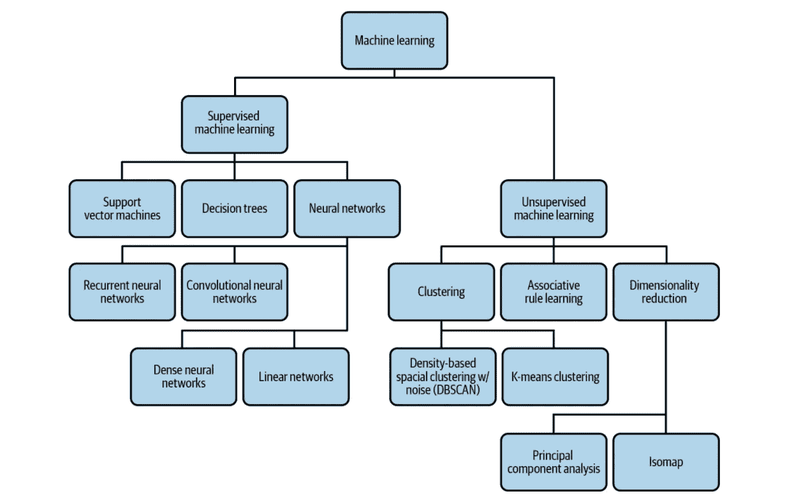
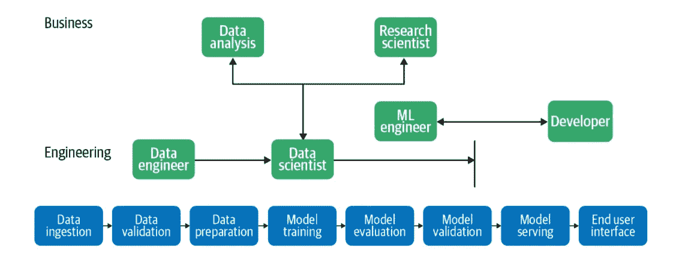
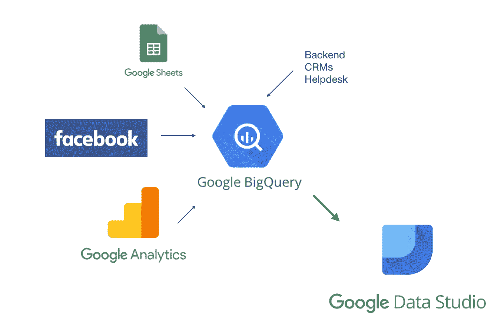
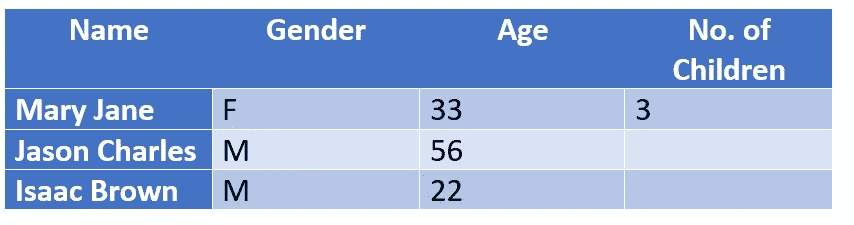
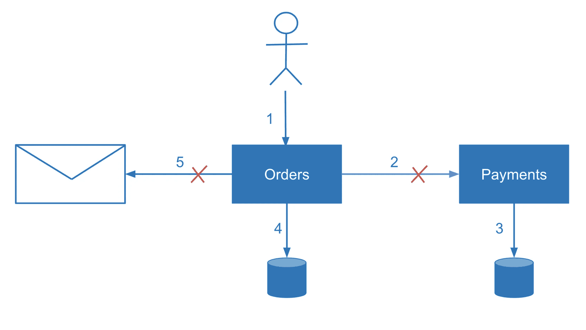
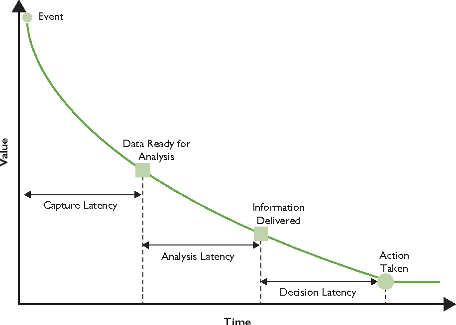
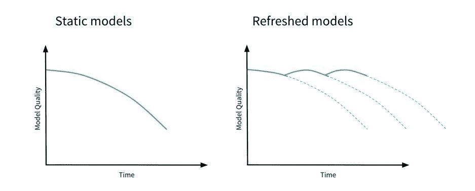

# 机器学习中的日常挑战

> 原文：<https://medium.com/codex/everyday-challenges-in-machine-learning-d6f0b4da9e1a?source=collection_archive---------13----------------------->

# 介绍

机器学习是建立从数据中学习的模型的过程。它有一套应用于数据的算法。然而，传统方法也可以通过应用显式规则，用最小的变量集来解决问题。但是，当变量数量增加时，事情就变得复杂了。机器学习模型，尽管它们是如何可视化表示的，但它们是数学函数，因此可以使用数值软件包从头开始实现。

图 1:不同类型的机器学习

机器学习持续变得更加可用，一个有趣的发展是机器学习模型的可用性。数据是任何机器学习问题的本质。数据用于模型的训练、验证和测试。机器学习模型的性能报告需要基于独立的测试数据进行计算，而不是训练或验证测试。还要注意的是，数据以这样的方式分割，即所有三个数据集，如训练、测试、验证，都具有相关的统计特征。

标准机器学习工作流的第一步是训练——将训练数据传递给模型的方法，以便它可以学习识别模式。训练之后，流程中的下一步是测试模型如何处理训练集之外的数据。这被认为是模型评估。它可能会多次运行培训和评估，交付额外的功能工程和调整模型架构。一旦模型在评估过程中表现良好，就可以使用该模型，以便其他人可以访问它来进行预测。

图 2:机器学习模型开发过程

作为一名数据科学家，将产品团队的需求转化为模型的环境是很重要的，因为假阴性的成本是假阳性的五倍。因此，在设计模型时，应该针对查全率和查准率进行优化，以满足这一要求。在产品团队优化精度的目标和最小化模型损失的目标之间找到平衡也很重要。

# 数据和模型工具

有各种产品提供了解决数据和机器学习问题的工具。以下是一些工具:

## **BigQuery**

这是一个企业数据仓库，旨在使用 SQL 快速分析大型数据集。BigQuery 中的数据是按数据集组织的，一个数据集可以有多个表。

图:大查询

## **BigQuery ML**

BigQuery ML 是一个从存储在 BigQuery 中的数据构建模型的工具。通过 BigQuery ML，我们可以使用 SQL 对我们的模型进行训练、评估和生成预测。它支持分类和回归模型，以及无监督聚类模型。还可以将之前训练的 TensorFlow 模型导入到 BigQuery ML 中进行预测。

图:大查询 ML

# 机器学习的挑战

构建 ML 系统的过程提供了许多影响 ML 架构设计的不同挑战。可以消除对这些挑战的识别。

以下是机器学习中的一些重要挑战:

## 数据质量

机器学习模型只有经过训练和推广才是可靠的。它既不应该过分合身，也不应该不够合身。对于任何模型的可靠性来说，数据都是一个非常重要的因素。如果模型是基于有缺陷的数据集、具有不良选择特征的数据或无法使用模型准确解释总体的数据进行训练的，则模型的预测将是这些数据的直接插补。数据应该有质量，其质量应该基于准确性、完整性、一致性和及时性。

**数据精度**

数据准确性既属于训练数据的特征，也属于符合这些特征的重要真值标签。如果机器学习模型是基于有缺陷的数据集、具有不适当选择的特征的数据或不能准确表示使用该模型的总体的数据来训练的，则该模型的预测将是该数据的直接反映。因此，模型要么过拟合，要么欠拟合。

图 3:欠拟合和过拟合

例如，训练数据集中的重复可能导致 ML 模型不准确地将更多权重分配给这些数据点。

为保持数据质量而执行的操作:

*   了解数据的来源以及数据收集步骤中的任何潜在错误有助于确保要素的准确性。
*   错别字分析屏幕。
*   重复条目的标识。
*   表格数据不一致性的度量。
*   分析缺失的特征。
*   识别可能影响数据质量的任何其他错误。

准确的数据标注与要素准确性同样重要。因此，错误标记的训练示例会产生误导性的模型准确性。该模型仅依赖于训练数据中的地面真实标签来更新其权重并最小化损失。

示例:

让我们举一个例子，你正在开发一个情感分析模型，而你的“正面”训练样本中有 25%被错误地标注为“负面”你的模型会对什么应该算作负面情绪有一个错误的描述，这将直接反映在它的预测中。

**数据完整性**

举个例子就很容易理解数据完整性。

图 4:不完整的数据

让我们以一个正在被训练以识别猫品种的模型为例。

你在一个大型的猫图像数据集上训练该模型，得到的模型能够将图像分类为 10 种可能的猫中的一种，如孟加拉猫、暹罗猫等。准确率高达 99%。

现在将这个模型部署到生产中，这样您会发现，在上传猫的照片进行分类的兴趣中，您的许多用户正在上传狗的照片，并且对模型的结果感到失望。

因为这个模型被训练来识别 10 种不同的猫。无论你输入什么样的模型，你都可以预见它属于这 10 类中的一类。对于一张看起来一点也不像猫的图像，它甚至可以做到这一点。如果这些数据和标签没有包含在训练数据集中，就不能说“不是猫”。

数据完整性的一个重要方面是确保训练数据应该包含每个标签的不同展示。例如，如果您正在开发一个模型来预测某个特定城市的房地产价格，但该模型只涵盖面积大于 3，000 平方英尺的房屋的训练示例，那么您生成的模型将不适用于较小的房屋。

**数据一致性**

可以在数据要素和标注中观察到数据不一致。应该有标准来帮助确保数据集之间的一致性。让我们举一个例子。

假设政府正在从温度传感器收集大气数据。如果每个传感器都按照不同的标准校准，这将导致不准确和欺骗性的模型预测。这个数据有以下欺骗性:

*   度量单位的不同，如英里和公里。
*   位置数据中的一个问题是，有些人可能会将完整的街道地址写成“Main Street”，而其他人可能会将其缩写成“Main St”

图 5:数据不一致

**数据时效性**

数据的及时性属于事件发生和事件被添加到数据库之间的延迟。

例如，对于捕获信用卡交易的数据集，从交易发生到在系统中报告可能需要一天的时间。为了处理时间性，尽可能多地记录有关特定数据点的信息是有帮助的，并且确保在将数据更改为机器学习模型的特征时显示这些信息。

图 6:数据的及时性

## 数据再现性

机器学习模型具有不可或缺的随机性。训练时，用随机值初始化 ML 模型权重。然后，随着模型迭代并从数据中学习，这些权重在训练期间收敛。因此，给定相同训练数据的相同模型代码将在训练运行中产生显著不同的结果。这就带来了再现性的挑战。如果您将模型训练到 98.1%的准确度，则重复的训练运行不能保证达到相同的结果。这使得跨实验进行测量变得困难。

在解决这种重复性困境的过程中，通常设置模型使用的随机种子值，以保证每次运行训练时应用相同的随机性。

遵循训练 ML 模型所涉及的需要固定以确保再现性的方法:

*   使用的数据
*   用于为训练和验证生成数据集的拆分机制
*   数据准备和模型超参数
*   应用批量大小等变量
*   学习率计划

## 数据漂移

机器学习模型主要表示输入和输出之间的静态连接，数据可能会随着时间的推移而发生显著变化。数据漂移导致难以确保机器学习模型保持相关，并且模型预测是使用它们的环境的准确表示。

示例:

让我们有一个模型被训练来分类新闻标题，像“政治”、“商业”和“技术”因此，如果你在 20 世纪的历史新闻文章上训练和评估你的模型，它可能不会在当前数据上表现得那么好。今天已知一篇标题中带有“智能手机”字样的文章，大概是关于技术的。根据历史数据训练的模型不会知道这个词。这是数据漂移。

解决数据漂移的解决方案:

*   不断更新您的训练数据集
*   再训练模型
*   修改分配给特定输入数据组的模型权重

图 7:有数据漂移的模型

## 规模

当接收和开发机器学习模型的数据时，数据集的大小将提供解决方案所需的工具。数据工程师的工作通常是构建可以扩展以处理数百万行数据集的数据管道。

对于模型培训，ML 工程师负责管理特定培训工作所需的基础设施。根据数据集的类型和大小，模型训练可能非常耗时且计算成本高昂，需要专门为 ML 工作负载设计的基础架构(如 GPU)。例如，图像模型通常比完全基于表格数据训练的模型需要更多的训练基础设施。

缺少缩放还会影响 L1 或 L2 正则化的效果，因为特征的权重大小取决于该特征的值的大小，因此不同的特征会受到正则化的不同影响。通过将所有特征缩放到[–1，1]之间，我们保证不同特征的相对大小没有太大差异。

开发人员和 ML 工程师通常负责处理与模型部署和服务预测请求相关的扩展挑战。

缩放可以进一步分类:

*   线性缩放
*   非线性变换

# 摘要

设计、构建和部署机器学习系统是重要的步骤。构建生产机器学习模型经常成为一个工程系统，利用已经在研究环境中建立的 ML 方法，并将它们应用于商业问题。随着机器学习变得越来越主流，从业者必须利用久经考验的方法来解决反复出现的问题。我们很幸运能够与 TensorFlow、Keras、BigQuery ML、TPU 和云人工智能平台团队合作，这些团队正在推动机器学习研究和基础设施的民主化。一旦收集了数据集并发现了模型的要素，数据验证就是计算数据统计数据、了解方案并评估数据集以识别漂移和训练服务偏差等问题的过程。任何机器学习模型的核心都是一个数学函数，它被定义为只对特定类型的数据起作用。类似地，现实世界的机器学习模型需要在可能无法直接插入数学函数的数据上运行。大多数最现代的大规模机器学习模型，如随机森林、支持向量机、神经网络等。处理数值，因此如果我们的输入是数值，我们可以一致地将其传递给模型。衡量最大似然模型很重要，因为一些机器学习算法和技术对数据不同特征的相对大小非常敏感。例如，使用欧几里德距离作为其接近度度量的 k-means 聚类算法最终将大量依赖于具有较大幅度的特征。