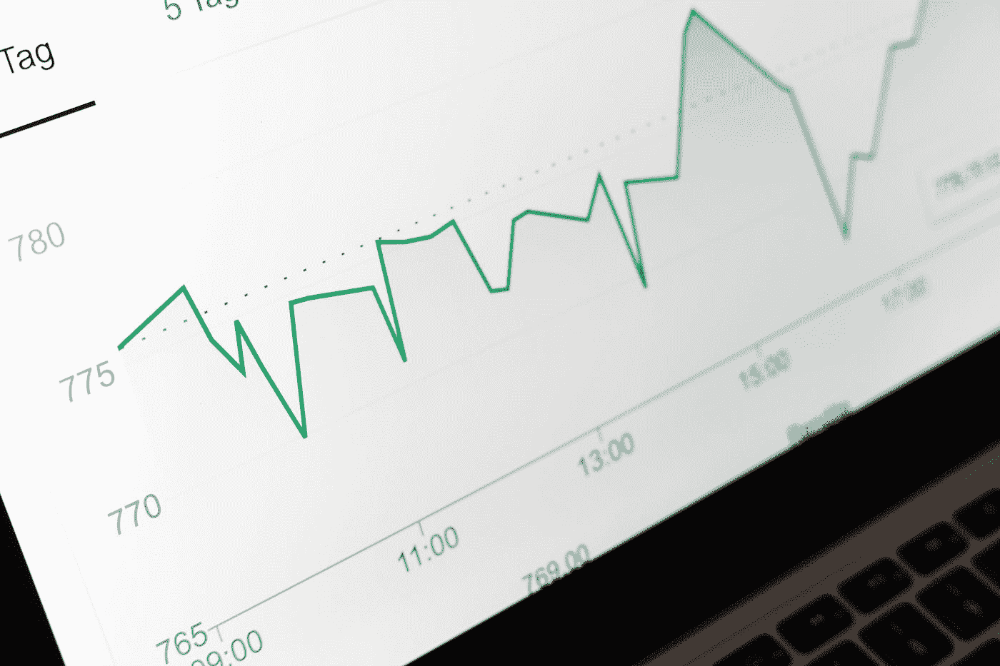

# 日常使用数据科学来改善生活

> 原文：<https://medium.com/codex/everyday-usage-of-data-science-to-improve-lives-9f3660c7fd5d?source=collection_archive---------6----------------------->

## 这实际上是每个人都可以使用的东西。

马库斯·温克勒在 [Unsplash](https://unsplash.com?utm_source=medium&utm_medium=referral) 上的照片

计算机科学和软件工程领域最大的子领域之一是数据科学。数据科学涉及使用数据(通常是大量数据)来获得洞察力和做出决策。虽然这是政府和公司使用的东西，但我相信普通公民也可以…