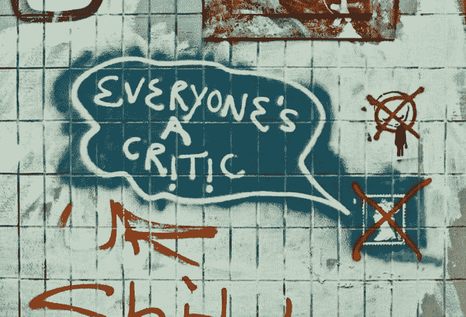

# 每个人都是(Perl)评论家，你也可以！

> 原文：<https://medium.com/codex/everyones-a-perl-critic-and-you-can-be-too-b19c9cd7e8db?source=collection_archive---------14----------------------->

*封面图片:* [*《每个人的一记暴击 ic —曼彻斯特曼彻斯特之路下的 graifit ti》*](https://www.flickr.com/photos/56278705@N05/7859287174)*BY*[*Alex pepper hill*](https://www.flickr.com/photos/56278705@N05)*被许可在*[*CC BY-ND 2.0*](https://creativecommons.org/licenses/by-nd/2.0/?ref=ccsearch&atype=rich)

根据[的描述](https://metacpan.org/dist/Perl-Critic/view/bin/perlcritic#DESCRIPTION)，工具通常是你抵御“代码中晦涩、难读、易错或无意义的结构”的第一道防线。这是他的程序系列的一部分，我称之为 [lin ters](https://en.wikipedia.org/wiki/Lint_(software)) ，之所以这么叫是因为它就像干衣机的棉绒捕捉器一样，可以“检测出影响重大的小错误”(另一个这样的链接是`[perltidy](http://perltidy.sourceforge.net/)`，我在…