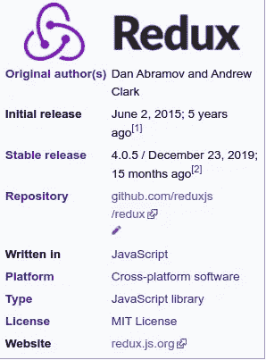

# 关于 Redux 的一切

> 原文：<https://medium.com/codex/everything-about-redux-ccfe3c93ec85?source=collection_archive---------10----------------------->

## 这是什么？Redux 是如何工作的？什么时候用 Redux？更多


图片由 Sandro Katalina 在 Unsplash 上提供



**Redux** 是一个用于管理**应用状态**的*开源* **JavaScript 库**。它通常与库一起使用，如 *React* 或 *Angular* ，用于构建*用户界面(UI)* 。类似于(并受到)脸书的通量建筑，它是由丹阿布拉莫夫和安德鲁克拉克。

{ [维基百科](https://wikipedia.org/wiki/Redux_(JavaScript_library)) }

**Redux** 是一个 ***可预测状态容器*** ，旨在帮助您编写跨*客户端*、*服务器*和*本地环境*表现一致且易于测试的 JavaScript 应用。

虽然它主要是作为一个状态管理工具与 **ReactJs** 一起使用，但您可以将它与任何其他 JavaScript 框架或库一起使用，如[](https://angular.io/)****、** [**Vue.js**](https://vuejs.org/) 和……**。**它是轻量级的， *2KB* (包括依赖项)，所以你不必担心它会使你的应用程序的资产规模变大。
使用 Redux，应用程序的状态保存在一个存储中，每个组件可以从这个存储中访问它需要的任何状态。**

# **为什么要用 Redux(Redux 解决什么问题)？**

**对于 JavaScript 开发人员来说，学习什么是一个难以回答的问题。通过一次学习一件事，专注于你在工作中发现的问题，有助于缩小选择范围。 **Redux** 是**管理应用状态**的模式。如果您在状态管理方面没有问题，您可能会发现 Redux 的好处更难理解。有些 **UI 库**(比如 React)有自己的状态管理系统。如果您正在使用其中一个库，特别是如果您刚刚开始学习使用它们，我们鼓励您首先学习这个内置系统的功能。这可能是构建应用程序所需的全部内容。如果您的应用程序变得如此复杂，以至于您不知道状态存储在哪里或者状态如何变化，那么这是 Redux 出现的好时机。**

> **我们建议大多数新手应该首先专注于学习 React，等到你已经熟悉 React 之后再学习 Redux。**“Redux doc”****

# **Redux 使状态可预测**

**在 Redux 中，状态总是**可预测的**。如果同样的状态和动作传递给一个**减速器**，总会产生同样的结果，因为减速器是**纯函数(**如果你不了解纯函数，推荐你阅读[这篇文章](/technofunnel/working-with-react-pure-components-166ded26ae48) **)** 。状态也是不可变的(从不改变)。这使得实现像无限撤销和重做这样的艰巨任务成为可能。**

# **使用 Redux 轻松调试**

**Redux 使调试应用程序变得容易。通过记录操作和状态，很容易理解编码错误、网络错误和生产过程中可能出现的其他形式的错误。
对于**中型**和**大型**应用，调试比实际开发功能花费更多的时间。 **Redux DevTools** 使得利用 Redux 提供的所有功能变得容易。**

# **易于测试**

**测试 Redux 应用程序很容易，因为函数用来改变纯函数的状态。**

# **服务器端渲染**

**Redux 也可以用于**服务器端**渲染。使用它，您可以通过将应用程序的状态及其对服务器请求的响应发送到服务器来处理应用程序的初始呈现。然后，所需的组件被呈现在 **HTML** 中并发送给用户。**

# **社区和生态系统**

**无论你何时学习或使用任何库或框架，这都是一个巨大的优势。Redux 背后有一个社区，这使得它更有吸引力。**

# **什么时候用什么时候不用 Redux？**

****

**照片由[贾维尔·阿莱格·巴罗斯](https://unsplash.com/@soymeraki?utm_source=unsplash&utm_medium=referral&utm_content=creditCopyText)在 [Unsplash](https://unsplash.com/?utm_source=unsplash&utm_medium=referral&utm_content=creditCopyText) 上拍摄**

****所有 app 都不需要 Redux。redux 不一定适用于每个项目。了解您正在构建的应用程序的类型、解决它所需的问题的类型，以及什么工具可以最好地解决您所面临的问题，这一点很重要。****

**Redux 帮助您处理共享状态管理，但是像任何工具一样，它也有权衡。它不是被设计成最快或最短的写代码的方式。它旨在帮助回答问题**“状态的某个片段何时改变，数据从何而来？”**，行为可预测。有更多的代码要写，有更多的概念要学。它还为您的代码增加了一些间接性，并要求您遵守某些限制。这是**短期**和**长期**生产力之间的权衡。**

> **你会知道什么时候需要焊剂。如果你不确定你是否需要它，你就不需要它。***皮特·亨特*****
> 
> *****我想修改一下:不要用 Redux，除非你对 vanilla React 有问题。*丹·阿布拉莫夫*(Redux 的创造者之一)*****

********

****Jo Szczepanska 在 [Unsplash](https://unsplash.com/s/photos/management?utm_source=unsplash&utm_medium=referral&utm_content=creditCopyText) 拍摄的照片****

# ****Redux 中的状态管理是什么？****

****状态管理本质上是一种促进跨**组件**的通信和数据共享的方式。它创建了一个有形的数据结构来表示您的应用程序的状态，您可以从中读取和写入。这样，在使用它们时，您可以看到原本看不见的状态。****

****大多数库，如**反应**、**角度**等。为组件提供了一种在内部管理其状态的方式，而不需要任何外部库或工具。它适用于组件很少的应用程序，但是随着应用程序越来越大，管理跨组件共享的状态就变得很麻烦。****

****在组件之间共享数据的应用程序中，实际知道一个状态应该位于何处可能会令人困惑。理想情况下，组件中的数据应该只存在于一个组件中，因此在兄弟组件之间共享数据变得很困难。****

****例如，在 React 中，为了在兄弟组件之间共享数据，状态必须存在于父组件中。更新该状态的方法由父组件提供，并作为**道具**传递给这些兄弟组件。****

# ****Redux 如何工作****

****Redux 的工作方式很简单。有一个**中央存储**，它保存应用程序的整个状态。每个组件都可以 ***访问*** 存储的状态，而不必将**道具**从一个组件发送到另一个组件。
有三个构建部分:**动作**、**存储**和**减速器**。下面简单讨论一下他们各自是做什么的。这很重要，因为它们可以帮助您了解 Redux 的优势以及如何使用它。我们将实现一个类似于上面登录组件的例子，但是这次是在 Redux 中。****

****让我告诉你它们各自的功能。****

# ****行动****

****简而言之，动作就是事件。动作将数据从应用程序(用户交互、内部事件，如 API 调用和表单提交)发送到存储。商店只从行动中获取信息。内部动作是简单的 JavaScript 对象，具有一个`type`属性(通常是常量)，描述了动作的类型和发送到存储的信息的有效负载。****

```
**{
    type: Signin_FORM_SUBMIT,
    payload: {username: ‘jacob’, password: ‘1234’}
}**
```

****动作是由动作创建者创建的。听起来很明显。它们是返回动作的函数。****

```
**function UserAuth(form) {
    return {
        type: Signin_FORM_SUBMIT,
        payload: form
    }
}**
```

****在应用程序的任何地方调用动作，然后使用`**dispatch**`方法，就像这样:****

```
**dispatch(UserAuth(form));**
```

# ****还原剂****

****它基于[数组归约方法](https://developer.mozilla.org/en-US/docs/Web/JavaScript/Reference/Global_Objects/Array/Reduce)，在这里它接受一个回调(归约器)并让你从整数的和、多个值或值流的累积中得到一个值。在 **Redux** 中，reducers 是**纯函数**，它获取应用程序和动作的当前状态，然后返回新状态。下面是一个非常简单的缩减器，它将当前状态和一个动作作为参数，然后返回下一个状态:****

```
**function Auth(state, action) {
    return _.assign({}, state, {
        auth: action.payload
    });
}**
```

****对于更复杂的应用程序，使用 Redux 提供的`combineReducers()`工具是可能的(事实上，推荐使用)。它将应用程序中的所有缩减器合并为一个索引缩减器。每个缩减器负责应用程序状态中属于自己的部分，每个缩减器的状态参数都不同。`combineReducers()`实用程序使得文件结构更容易维护。****

****如果一个对象只改变了一些值，Redux 创建一个新的对象，没有改变的值将引用旧的对象，只创建新的值。这对性能非常有利。****

```
**const rootReducer = combineReducers({
    handleAuth: handAuth,
    editProfile: editProfile,
    ResetPassword: ResetPassword
});**
```

# ****商店****

****Store 是保存应用程序状态的对象，它提供了一些帮助方法来让**访问状态**、**分派动作**和**注册监听器**。整个状态是 ***由单个商店表示*** 。任何动作都会通过 reducers 返回一个新的状态。这使得 Redux 变得简单且可预测。****

```
**import { createStore } from ‘redux’;
    let store = createStore(rootReducer);
    let authInfo = {username: ‘jacob’, password: ‘1234’};
    store.dispatch(UserAuth(authInfo));**
```

# ****我需要一个特殊的构建工具来使用 Redux 吗？****

****Redux 最初写在 ES6 中，而*用 **Webpack** 和 **Babel** 传输*用于制作成 ES5。不管您的 JavaScript 构建过程如何，您都应该能够使用它。Redux 还提供了一个 ***UMD*** 构建，可以直接使用，根本不需要任何构建过程。****

# ****Redux 只能和 React 一起用吗？****

****Redux 可以用作任何 UI 层的数据存储。最常见的用法是使用 **React** 和 **React Native** ，但是也有绑定可用于 **Angular** 、 **Vue** 等等。Redux 只是提供了一个订阅机制，任何其他代码都可以使用。也就是说，当与可以从状态变化推断 UI 更新的声明性视图实现结合时，它是最有用的，比如 React 或可用的类似库之一。****

# ****摘要****

****最后，Redux 是一个很棒的库，它非常适合管理应用程序的状态。像 ***优步、可汗学院、Twitter、*** 这样的顶级公司都在使用它，它获得了很大的吸引力，有一些很好的理由使用它，但也有一些理由你可能不想使用它。对您的工具做出明智的决策，并理解每个决策中涉及的权衡。****

## ****祝你好运:)****