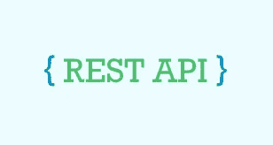

# 关于 Rest API 的一切

> 原文：<https://medium.com/codex/everything-about-rest-api-4ab4ee9ea2c8?source=collection_archive---------14----------------------->


克里斯里德在 [Unsplash](https://unsplash.com?utm_source=medium&utm_medium=referral) 上的照片



在本教程中，我们将学习什么是 REST API，并学习创建一个 REST API 用于我们的项目。

让我们从基础开始，看看 API。应用程序编程接口可以被看作是客户端和服务器之间通信的桥梁。它是一个软件中介，允许两个应用程序相互对话。API 就像一个酒店的服务员，通过提供必要的菜肴或食物来服务客户的请求，在这种情况下，客户提出请求，通过 API 提供响应。事实上，这是一个古老的场景。

今天的现代应用程序使用 REST API 的概念，REST API 只不过是通过不同的 Restful Web 服务访问资源的架构风格。如今，REST API 使用了几乎所有类型的应用程序，即 Web 应用程序和本地应用程序。

现在，我们来看看 REST API 的一些**重要方法。**

## 1.HTTP GET 方法

GET 方法，通常用于获取或提取 web 服务器中的所有或特定资源。这种方法通常用于向客户端显示数据。

## 2.HTTP POST 方法

POST 方法主要用于将数据从客户端传递到服务器。假设一个用户在任何一个(REST API 技术实现的网站)上用他/她的凭证填写了一个表单，然后这些数据将在 POST 方法的帮助下进一步保存在数据库中。

## 3.HTTP PUT 方法

PUT 方法是更新数据库中数据的方法，在这里，该方法通常可用于更改保存到数据库中的值。

## 4.HTTP 删除方法

顾名思义，我们使用 HTTP DELETE 方法删除数据库中的特定或所有资源。

现在，让我们深入了解如何**使用 Node JS 和 Express 创建一个 Restful API-**

在继续之前，我们需要一些要求:

1.  NPM(或纱)安装-创建一个节点应用程序。
2.  Postman——Postman 基本上是一个 HTTP 客户端软件，帮助创建和测试其余的 API 服务。

现在，在 C 驱动器中创建一个名为 nodeAPI 的目录，浏览这个目录，并键入:

```
code .
```

这个命令将打开 VS 代码，通过那个特定的文件夹-

现在，键入如下内容:

```
npm init
```

这个命令可以创建一个 Package.json 文件。现在，使用下面的代码将 Express JS 安装到我们的应用程序中。

```
npm i --save express nodemon
```

这个命令将在我们的应用程序中打开 node_modules 文件夹。nodemon 是一个包，用于在每次看到代码更新时重新加载服务器。

现在，是时候在我们的根目录中创建一个 index.js 文件了。

我们的文件夹如下所示:

```
node_API           - node_modules
          - index.js
          - package.json
          - package-lock.json
```

现在，复制更多的代码并将其粘贴到 index.js 文件中:

```
const express = require('expres');const app = express();app.use(express.json());//HTTP GET Method, to fetch the data from Server to Client.app.get("/",(req,res) => {res.send("Hello Developers!")})app.listen(9000,() => { return "Server starts..."})
```

现在，让我们运行服务器并检查我们是否在正确的路径上。

```
nodemon
```

这个命令运行服务器，现在，让我们打开 Postman 来检查我们的 API 是否正常工作。

一旦我们进入 Postman，我们将转到 URL 部分并键入以下内容:

```
http://localhost:9000
```

注意—我们必须使用相同的端口号，该端口号在代码中指定。

一旦我们输入了上面的 URL 并点击发送按钮，我们就会看到一条消息——“你好，开发者！”。这是因为我们已经向“/”发送了一个字符串响应，假设用户调用该 API。

这实际上是一个 GET API，但是现在我们将学习如何从 API 获取数据。

# **获取 API**

为了获取数据，我们需要信息，所以我们使用这个对象数组。

```
const users = [{ "username" : "Sundar Pichai", "id" : 1},{ "username" : "Elon Musk", "id" : 2},{ "username" : "Jeff Bezos", "id" : 3},{ "username" : "Bill Gates", "id" : 4},]
```

另外，创建一个 API 路由-

```
app.get("/api/users", (req,res) => {res.send(users);})
```

现在，如果我们使用 Postman 测试这个 API，我们可能会得到数组中存在的所有对象。

# **发布 API**

在 POST API 调用中，我们将从客户端获取用户名。该代码可以指定如下:

```
app.post("/api/users/post" , (req,res) => {username = req.body.usernameif(username){res.send({msg:"Success"})}return res.send({msg:"Error"})})
```

在 Postman 内部，首先，我们需要将 GET 方法切换到 POST 方法，还需要将主体转换为 JSON 格式，并添加以下代码:

```
{"username" : "Smith"}
```

如果这返回一个成功的响应，那么我们的 POST API 工作得很好。

# **放 API**

PUT API 可用于更新数据库中的数据。这里，我们从客户端向服务器传递两个参数，因为我们需要更新表中的特定行，因此我们要求客户端输入(username) id 和 new-username 来更新旧数据。

```
app.put("/api/user-update/:id" , (req,res) => {const input_id = req.params.id;const input_username = req.params.username;const userUpdate = users.find(n => n.id === parseInt(input_id))if(!userUpdate){res.send("ID Invalid")}const {Error} = {msg:"Error"};if(Error){res.send({msg:"Error"})}else{users.username = input_username;res.send({msg:"Success"})}})
```

现在，当您从 Postman 发送请求时，您必须添加一个 id 参数，并传递一个新的用户名作为 JSON 有效负载来更新数据。

# 删除 API

```
app.delete("/api/delete-user/:id", (req,res) => {const input_id = users.find(n => n.id === parseInt(req.params.id))if(!input_id){res.send("ID Invalid!")}const index = users.indexOf(users)users.splice(index,1)res.send(input_id)})
```

在这种情况下，我们必须将 id 作为一个参数通过 Postman 传递，它直接从 DB 中删除一个记录。

这里的指回购[。](https://github.com/balram1402/NodeJS_API.git)

这可能是 Restful API 变得简单易用的最大原因。这种 API 用于日常的现代 web 应用程序中，因为它们可以快速呈现内容，并且在编码方面也不那么方便。

在这里，我们将以这一章结束。

谢谢大家！