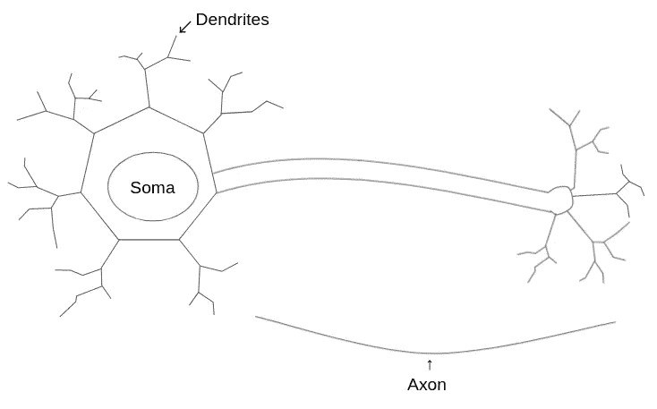
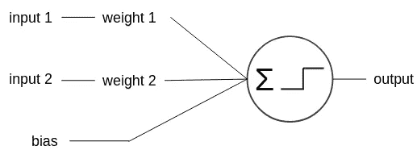
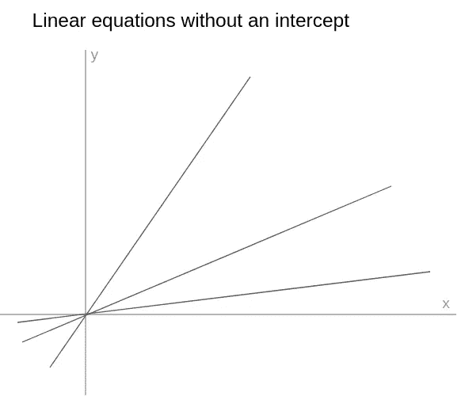
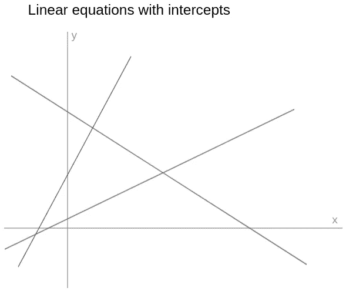
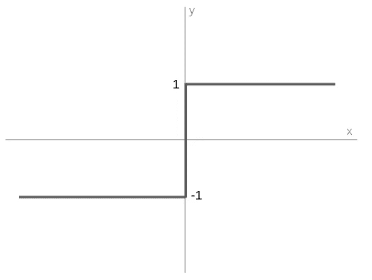
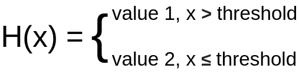
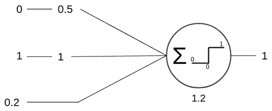
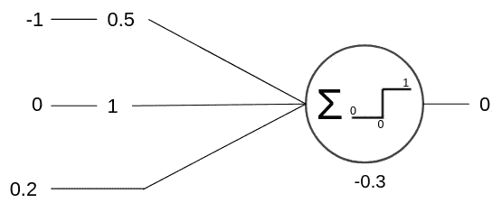

# 感知器的一切，但没有复杂的数学

> 原文：<https://medium.com/codex/everything-about-the-perceptron-but-without-complicated-math-f72212c58c1a?source=collection_archive---------7----------------------->

## 它的基本结构、工作原理及其局限性

> ***TL；***
> 博士——最基本的人工神经网络是感知器
> ——感知器接受输入，用唯一的权重乘以输入，计算输入的总和×权重+偏差，并应用阶跃函数产生二进制输出
> ——因为感知器只能产生线性边界，它不能识别复杂的模式

当你想到机器学习和深度学习时，它们听起来很迷人。感觉他们有能力解决所有问题。但是你知道它们是如何工作的吗？如果你不知道答案，你就在一个完美的地方。但是在我们谈论它们如何在计算机上工作之前，让我们简单地看一下生物学方面。

# 生物神经元是如何工作的？

生物神经元的简单视觉表示

如图所示，一个生物神经元有 3 个主要组成部分:树突、胞体、轴突。其中，树突接收外界的信号，胞体处理信号，轴突发出处理结果。生物神经元一起工作，将信息从一端传递到另一端。人工神经元采用这一过程来实现类似的效果。

# 将这一概念引入人工神经网络

最基本的人工神经网络之一是感知器。与生物神经元类似，它接受输入，处理输入，并输出处理后的结果。区别在于偏向神经元、权重以及感知器处理信息的方式。

感知器的图形表示

如上图所示，除偏差外，每个输入都与一个唯一的权重相关联。感知器的 soma 部分包含 sigma 和阶跃函数。通过生物神经元的这些调整，感知器通过以下步骤产生二进制输出。

> 1.将每个输入乘以一个关联权重
> 
> 2.计算所有相乘值和偏差的总和
> 
> 3.对计算结果应用阶跃函数以产生二进制输出

你可能有几个关于偏置神经元、阶跃函数和适当权重值的问题。让我们逐一回答。

# 什么是偏向神经元，我们为什么需要它

想象一个 y=ax+b 的线性方程，看起来不就像输出=sum(权重 **×** 输入)+bias 吗？如果你在两者之间建立了视觉联系，你可能是对的。感知器的偏差作为线性方程的截距，因此感知器可以更加灵活。考虑下面的图表。

因为没有截距的线性方程要经过原点，所以不能移位。它能做的就是旋转。因此，它没有右图所示截距的线性方程灵活。这意味着有截距的线性方程比没有截距的更有可能找到更好的拟合。从数学上来说，它的工作方式不同，但是对于感知器中的偏差，总体思想是相同的。偏差会发生变化，并帮助模型找到更好的拟合。

# 什么是阶跃函数，它是如何工作的

step 函数的名称来自于它看起来像一个步骤的视觉效果。从数字上来说，这意味着一定范围的 x 值共享相同的 y 值。例如，在下图中，所有大于 0 的 x 值的 y 值都为 1，但当 x 值小于 0 时，y 值为-1。

输出-1 或 1 的阶跃函数示例

感知器使用这个阶跃函数，根据输入的加权和加上偏差产生一个二进制输出。最常用的阶跃函数是亥维赛阶跃函数，其结构如下。

亥维赛阶梯函数的结构

如等式所示，如果加权和大于阈值，则它将观察分类为值 1，但是如果它小于或等于阈值，则分类为值 2。

例如，假设我们有一个感知器，阈值为 0，除以 0 和 1，两个权重为 0.5 和 1，偏差值为 0.2。如果我们将(0，1)传递给感知器，一个加权和就是 *0×0.5+1×1+0.2=1.2* 。因为 1.2 大于阈值，所以该输入将被分类为 1。另一方面，如果给定(-1，0)，其加权和为 *-0.3* 。因此，它将被归类为 0。

输入为(0，1)和(-1，0)的感知器的两个例子

为简单起见，示例演示了具有 2 个输入的情况，但是当输入数量增加时，同样的概念也适用。

# 感知器是如何被训练的

现在你知道感知器如何使用它的权重来计算它的输出。但是你可能想知道感知器如何找到合适的权重值。给你一个提示，这是通过一个重复的过程来完成的。

> 1.随机初始化权重
> 
> 2.计算一个训练样本的输出
> 
> 3.更新重量以加强正确的连接
> 
> 4.对每个训练样本重复步骤 2 和 3
> 
> ([链接到数学解释](https://towardsdatascience.com/perceptron-learning-algorithm-d5db0deab975))

从整个过程来看，随机初始化权重是至关重要的。如果它们被初始化为相同的值，那么感知器将对每个权重应用相同的变化以减少误差。当这种情况发生时，使用多个连接就没有意义了，因为它们的行为都是一样的。

# 限制

感知器最迫切的限制是它只能形成一个线性边界。因此，如果两个类不是线性可分的，感知器即使遍历所有训练样本也无法收敛。此外，它无法识别复杂的模式。最重要的是，由于感知器基于硬阈值做出决策，它输出类别标签，而不是观察值属于不同类别的概率。因此，人们通常更喜欢逻辑分类器，因为它提供了更多关于输出的信息。

尽管有这些限制，如果你愿意，你仍然可以使用感知器。你只需要增加更多层神经元。但这是下一篇文章的主题。

# 参考

[1]布莱斯(未注明日期)。*神经网络简介*。IBM 开发人员。检索于 2021 年 9 月 29 日，发自 https://developer.ibm.com/articles/l-neural/.

[2]布拉索富尔特。(2015 年 2 月 17 日)。*epoch、batch 和 minibatch 有什么区别？*交叉验证。2021 年 9 月 29 日检索，来自[https://stats . stack exchange . com/questions/117919/what-is-the-differences-between-epoch-batch-mini batch。](https://stats.stackexchange.com/questions/117919/what-are-the-differences-between-epoch-batch-and-minibatch.)

[3]杰龙，A. (2017)。*使用 Scikit-Learn、Keras 和 TensorFlow 进行动手机器学习:构建智能系统的概念、工具和技术*。奥赖利。

[4] Mhatre，S. (2020 年 6 月 6 日)。*人工神经元和生物神经元有什么关系？*中等。2021 年 9 月 29 日检索，来自[https://smhatre 59 . medium . com/what-is-the-relation-between-artificial-and-biological-neuron-18b 05831036。](https://smhatre59.medium.com/what-is-the-relation-between-artificial-and-biological-neuron-18b05831036.)

[5] Shrutiparna。(2019 年 5 月 26 日)。*神经网络中偏差的作用*。Intellipaat 社区。2021 年 9 月 29 日检索，来自[https://intelli paat . com/community/253/role-of-Bias-in-neural-networks #:~:text = Bias % 20 is % 20 just % 20 like % 20 an，to %要么% 20right % 20or 要么%20left。](https://intellipaat.com/community/253/role-of-bias-in-neural-networks#:~:text=Bias%20is%20just%20like%20an,to%20either%20right%20or%20left.)