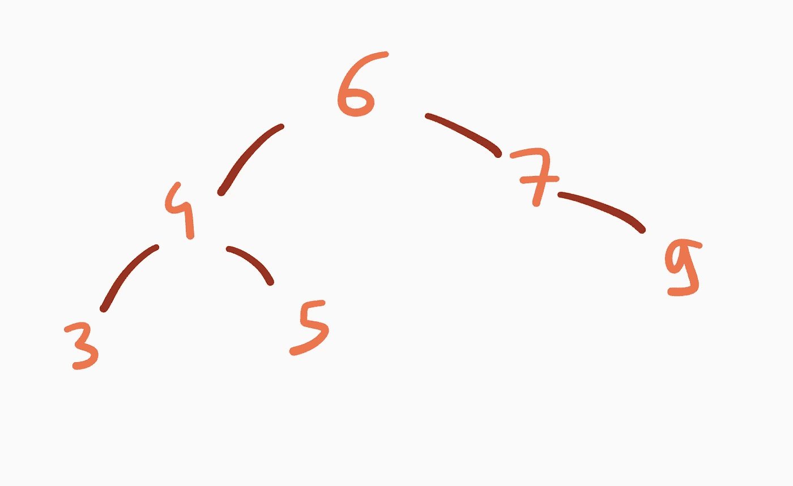

# 关于二分搜索法树你需要知道的一切

> 原文：<https://medium.com/codex/everything-you-need-to-know-about-binary-search-trees-e53760ff1f1c?source=collection_archive---------16----------------------->

## 定义、操作以及如何从头开始实现它们。

二分搜索法树(简称 BST)是一种基本的数据结构。它们能够存储和组织可订购的价值。它们有大量的应用，可以用来实现像动态集合、字典和优先级队列这样的数据结构。

这篇文章展示了我们如何定义和实现二分搜索法树及其操作。

[马修·史密斯](https://unsplash.com/@whale?utm_source=medium&utm_medium=referral)在 [Unsplash](https://unsplash.com?utm_source=medium&utm_medium=referral) 上拍照

# 定义和术语

设( *X* ，≤)为全序集。

我们从使用两个公理归纳定义二叉查找树的节点的概念开始:

**(1)** 存在一个空节点，记为`Null`；

**(2)** 一个四元组 *N* = ( *P* ， *x* ， *L* ， *R* )这样:

*   *x* 属于 *X* ，
*   *P* 、 *L* 和 *R* 为节点，
*   二进制搜索树属性得到满足(我们稍后会谈到它)

是一个节点。 *x* 称为节点的键， *P* 称为父节点， *L* 为左子节点， *R* 为右子节点。

我们可能还想在每个节点中存储一个辅助值，但这不会改变我们实现操作的方式。

## 树叶、树木、深度、高度和祖先

如果左孩子和右孩子都是空的，那么 *T* 称为**叶**。如果父节点为空，则称为根节点。

**A 二叉查找树** *B* 可以为空，或者由根节点 *R* 来表征。我们说 *R* 属于 *B* 并且一个节点属于 *B* 正好当它的父节点属于时。如果 *N* 是一个节点，我们就把根节点为 *N* 的树简称为 *N* 。在本文的其余部分，我们将假设键在树中是惟一的。

树中节点的深度是它到根的距离。形式上，根的深度是 0，如果一个节点( *p* ， *v* ， *L* ， *R* )有深度 *x* ， *L* 和 *R* 有深度( *x* + 1)。

我们将一棵树的**高度**定义为其最深叶子的深度，即所有叶子深度的最大值。

最后，我们说节点 *N* 是节点 *M* 的祖先如果 *N* = *M* 或 *N* 是 M 的祖先的父节点如果 *N* 是 *M* 和 *N* 的祖先我们说 *N* 是 *M* 的适当祖先

这允许将树的类型定义为有区别的联合:

## 二分搜索法的财产

二进制搜索属性允许根据键的顺序来组织节点。给定一个非空节点( *P* ， *x* ， *L* ， *R* )，说明对于树 *L* 中的所有节点ℓ和树*r*中的所有节点 *R* ，Key(ℓ) ≤ *x* 和 *x* ≤ Key( *r 【T42*

例如，下图显示了一个二叉查找树。它的根有 4 个键。它的叶子有调 1，5 和 11。

但是下面的二叉树不是二叉查找树:

这是因为根的右子树包含一个 key -1 的节点，它小于根的键。

# 操作

二分搜索法采油树支持以下作业:

*   *行走，*
*   *插入，*
*   *搜索，*
*   正在搜索，
*   *最小查询*和*最大查询*，
*   *删除。*

## 步行

*走*或*遍历*一棵树意味着以某种顺序访问所有节点，并将它们传递给某个函数。

行走算法有三种:按序、前序、后序。按序遍历访问一个节点( *P* ， *x* ， *L* ， *R* )，方法是按序递归遍历它的左子树 *L* ，然后打印(或做任何你想做的事情)键 *x* ，最后按序递归遍历 *R* 。它的实现如下:

*   有序遍历按排序顺序打印二叉查找树的所有节点。它相对于树中的节点数在θ(N)时间内运行。
*   `walk_in_order`可以使用连续函数进行尾递归。
*   类似地，前序和后序遍历分别在遍历子树之前和之后打印当前键。

## 插入

*将关键字*v 插入 BST 包括以产生新二叉查找树的方式插入带有关键字 *v* 的节点。

我们用来执行这个操作的过程创建了一个新的带有关键字 *v* 的叶子 N。为了找到 N 的父节点，我们从根到叶子访问树，选择适当的分支来维护二叉搜索树的属性。当我们找到一片叶子(我们称之为 *M* )时， *M* 成为 *N* 的父节点。如果 *v* ≤ Key( *M* )(或 Key(*M*)<*v*)，我们将 *M* 的左子(或右子)设置为 *N.*

下面是一个递归实现:

子例程`findParent`递归调用自己，直到它到达一个空节点。这意味着前一个节点是一个叶子，而不仅仅是一个叶子:新节点的未来父节点。

一旦我们获得了父类，我们只需要执行一些处理。我们创建了树叶 *N* 并且我们决定它是它的父节点的左子节点还是右子节点。

使前面的函数迭代并不难:

相对于树的高度，插入运行时间为θ(*H*)次。

## 搜索

二分搜索法树允许我们根据树的高度在线性时间内搜索给定关键字的节点，如下面的伪代码所示。

实现非常简单。我们检查当前节点是否包含目标键(在这种情况下，我们返回`true`)，如果目标键比当前节点的键小，则递归调用左边的子树，如果目标键比当前节点的键大，则递归调用右边的子树。如果我们在终止之前到达一个空节点，那么目标键不属于 BST。

同样的想法可以迭代实现:

## 最小和最大查询

查找树中的最小(或最大)键类似于搜索。我们需要知道的就是走向最左边(或最右边)的子树，直到我们到达一个空节点。

我们实现`find-min`如下:

`find-max`类似。

## 查找节点的后继节点

给定一棵树 *R* 中的一个节点 *N* = ( *p* ， *v* ， *L* ， *R* )，我们将 *R* 中 *N* 的后继节点定义为那些 key 严格大于 *v* 的节点中 key 最小的节点。这样的节点不一定存在。

如果 *R* 非空，那么 *N* 的后继者是*R*的最小值

如果 *R* 为空， *N* 可能还有后继:它是其最近的右祖先，即左子树包含 *N* 的最近祖先。

例如，下面画的树中 5 的后继者是 6: 4 是 5 的右祖先，因为 5 在它的右子树中，所以我们向上移动到 6，它是 5 的左祖先。

更正式地说:

> 如果 N 有一个非空的右孩子，那么 N 的后继者是 N 的右孩子的最小值。
> 
> 如果 N 的右子代为空，那么 N 有后继当且仅当它有右祖先(在这种情况下，N 的后继是它最近的右祖先)。
> 
> **证明大纲:**
> 
> 如果 R 是非空的，设 m 是 R 的最小值。如果 N 是其父节点的左节点，那么根据二叉搜索树的性质，m 小于 N 的所有祖先，因此它一定是 N 的后继节点。如果 N 是其父节点的右节点，那么每个祖先都小于它，所以 m 是后继节点。
> 
> 现在假设 R 为空。设 m 表示 N 的最近的右祖先，如果它存在的话。那么根据右祖先的定义和 BST 属性，m 大于 N。如果 m 在其父的左子树中，那么没有 m 的祖先比它小。因为 m 是 N 的*最近*的右祖先，所以不是 m 的祖先的 N 的任何合适的祖先是 N 的左祖先，因此小于它。这足以证明 m 是 n 的后继。
> 
> 最后，假设 R 为空，N 没有右祖先。R 的所有子代都小于它(通过 BST 属性)。所有祖先都是左祖先，因此也小于 N。这证明 N 没有后继者。

这允许我们编写以下实现:

如果`tree`没有后继者，则返回`NULL`。

运行时间为 O( *H* )，最坏情况下为θ(*H*)。

## 删除节点

我们讨论的最后一个操作比前几个更棘手。给定一个二叉查找树 *R* 和一个节点 *N* ，目标是生成一个新的二叉查找树*R’*，它包含除 *N* 之外的 *R* 的所有节点。

## 重新移植

我们做的第一件事是声明一个过程`repot`，用一个节点替换另一个节点。

第 2 行到第 6 行要求`next`的父母忘记他们的孩子(我们将在适当的时候给`next`提供新的父母)。

如果`previous`没有父节点(即`tree`的根节点)，那么我们只需将`next`赋值给`tree`。

否则，`previous`的父节点将成为`next`的父节点(第 12 行)，我们将`next`分配给`previous`的适当子节点(第 13 到 17 行)。

## 删除

如果 *N* 的两个子节点中至少有一个为空，那么我们调用`repot N C`，其中 *C* 是 *N* 的左子节点，如果它的右子节点为空，则它的右子节点为空。

考虑下面的例子，我们想要删除节点 *y* 。

满足`delete`(第 2 行)的第一个条件。当我们调用`repot y NULL`时，条件行 13 满足，那么 *y* 的父代的左子代，即 *x* 。右，变为空。然后我们可以从记忆中抹去 *y* 。更新后的树如下所示:

假设现在 N 有两个非空的孩子。在这种情况下，我们将节点 *N* 替换为它的后继节点。例如，假设下图表示输入树，我们想要删除带有键 17 的节点。

目标是用它的后继者 20 代替 17。

第一步是使用函数`repot`连接 20 到 23 的右子树。这给出了以下临时树:

然后我们将 17 的右子树连接到 20:我们设置了`20.Right <- 17.Right`和`20.Right.Parent <- 20`。

20 现在有了合适的右子树。我们需要设置它的左子树和它的父树。为此，我们调用`repot 17 20`，然后将 17 的左子树连接到 20: `20.Left <- 17.Left`和`20.Left.Parent <- 20`。

注意，如果我们想要删除的节点 *N* 的后继节点 *S* 是它的右子节点，那么我们只需要将 *S* 重新移植到 *N* 中。

下面是最终的实现:

# 结论:高度上的一句话

我们讨论的大多数操作的运行时复杂性与树的高度成正比。具有 *n* 个节点的树的高度渐近地在 log *n* 和 *n* 之间。如果我们按照排序的顺序插入节点，我们会得到一个一元树:节点的高度是θ(*n*)，所以使用树而不是列表没有任何好处。假设现在您有一组 *n* 键，并通过以随机顺序插入所有键来构建 BST。恰好树的期望高度是最优的:O(log_2 (n))。还存在自平衡二分搜索法树，当我们插入和删除节点时，它保持它们的高度最小。红黑树是自平衡二分搜索法树的一个例子。它们将是未来文章的主题。

# 支持我！

如果您觉得这篇文章很有帮助，请考虑关注我，帮助我达到继续加入中型合作伙伴计划所需的 100 名关注者的门槛。这是免费的，真的很有帮助。

也可以使用我的推荐链接订阅 Medium: [成为会员](/plans?subscribeToUserId=b705ec524bd3&source=entity_driven_subscription-b705ec524bd3------------------------------------)。你可以访问 Medium 上所有会员专用的文章，你的会员费将直接支持我。

🐙