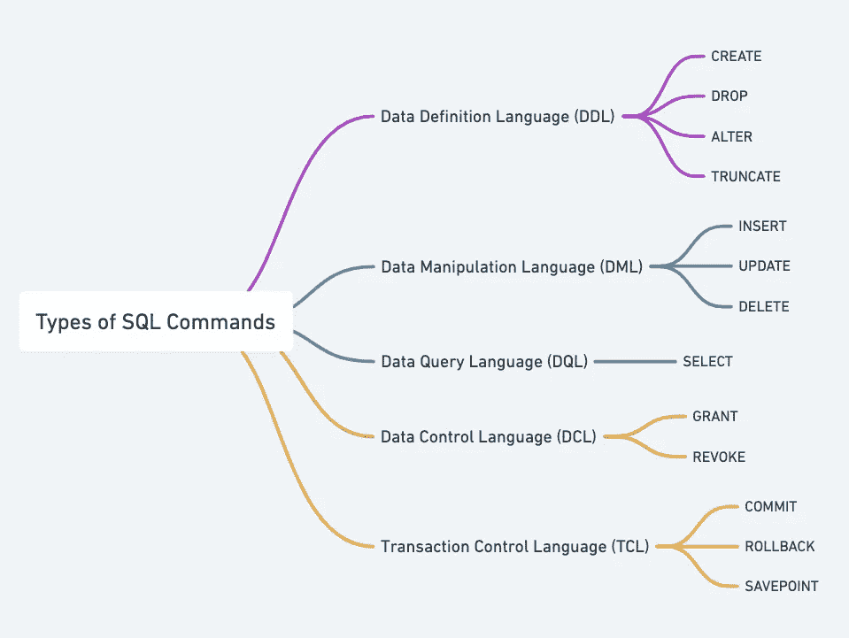
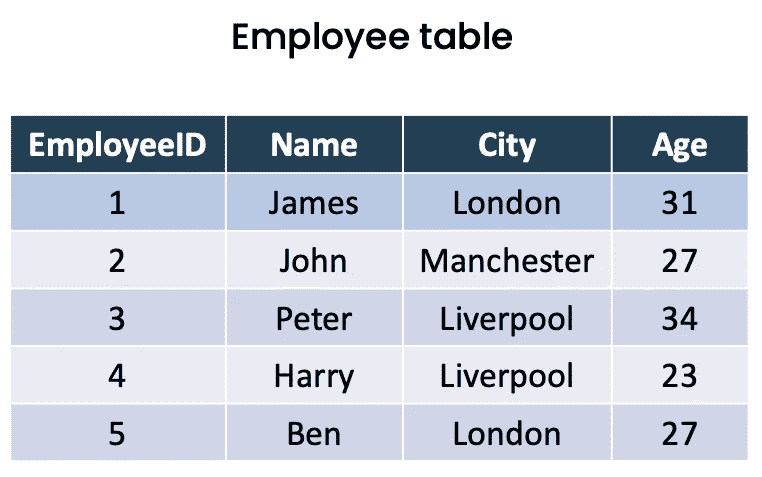
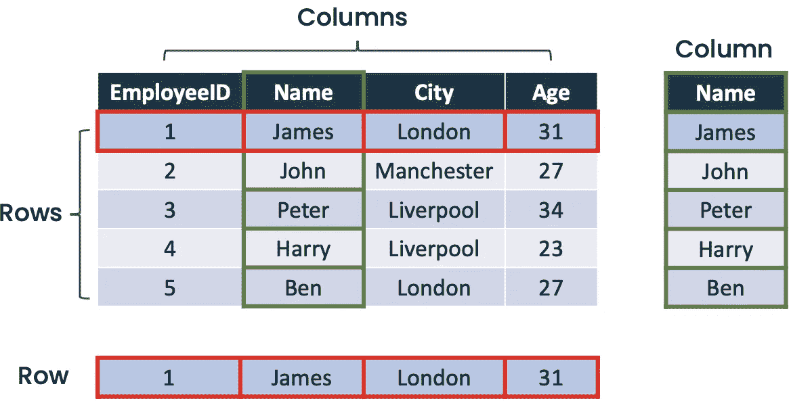
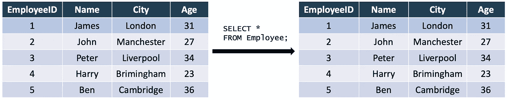
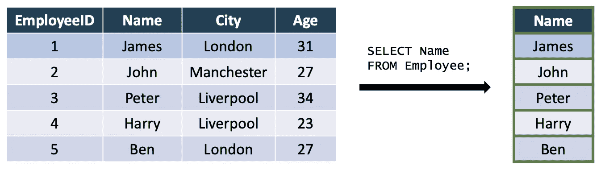
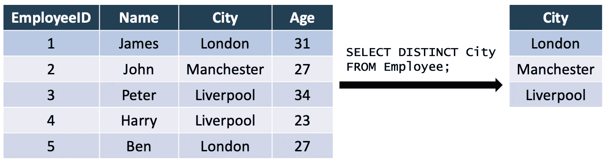
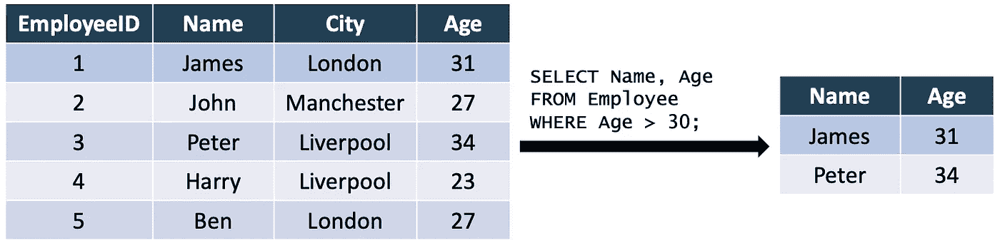
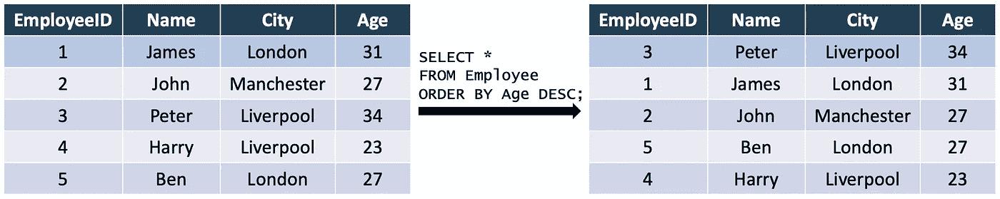

# 学习数据科学需要了解的关于 SQL 的一切:第 1 部分

> 原文：<https://medium.com/codex/everything-you-need-to-know-about-sql-for-learning-data-science-part-1-f980d65f5efd?source=collection_archive---------11----------------------->


马丁·桑切斯在 [Unsplash](https://unsplash.com/s/photos/stack?utm_source=unsplash&utm_medium=referral&utm_content=creditCopyText) 上的照片

# **简介**

在过去的几年里，也许你在任何地方都听说过人工智能、数据科学、机器学习，就像人们经常谈论的那样(我稍后会谈论这些话题之间的差异，insyaa Allah)。今天我给大家分享一下数据科学中的 SQL。我们开始吧！

# 目录

1.  **什么是数据科学？**
2.  **SQL 到底是什么意思？**
3.  **关系数据库管理系统**
4.  **带有 MySQL 命令的 SQL**

# **什么是数据科学？**

数据科学结合了多个领域，包括编程、科学方法、统计学、线性代数和数据分析，以从数据中提取价值。为了分析数据库中的数据，我们需要提取数据。这就是 SQL 浮出水面的地方。

# SQL 到底是什么意思？

SQL 代表顺序查询语言，用于与数据库通信。根据 [Terence Shin 的文章，](https://towardsdatascience.com/the-most-in-demand-skills-for-data-scientists-in-2021-4b2a808f4005) SQL 是仅次于 Python 的 2021 年第二大需求技能，也是 2019-2021 年第三大成长技能。这向我们展示了 SQL 技能在数据科学领域的重要性。“你为什么从 SQL over Python 开始？你刚刚说 Python 是 2021 年最受欢迎的技能之一。”对我来说，SQL 比 Python 容易学，入门简单，初学者友好。所以，从简单的事情开始。

# **关系数据库管理系统**

在我们进入 SQL 命令之前，让我们从 RDBMS 开始。RDBMS 是一个软件系统，它使用户能够根据关系模型定义、创建、维护和访问数据库。世界上有几种类型的 RDBMS，包括:

*   MySQL 和 MariaDB
*   一种数据库系统
*   SQLite
*   Oracle 数据库
*   Microsoft SQL Server
*   IBM DB2
*   Microsoft Azure SQL 数据库

每个 RDBMS 上的 SQL 命令有一些差异，但不是很显著，不要太担心。这一次，我们将把重点放在 MySQL 命令上(因为目前我只知道 MySQL 命令)。

# 带有 MySQL 命令的 SQL

其实我发现的 SQL 语句/命令有很多种，比如数据定义语言(DDL)、数据操作语言(DML)、数据查询语言(DQL)、数据控制语言(DCL)、事务控制语言(TCL)。下图是 SQL 语句/命令类型的分布:



作者创建的图像

从许多资源来看，DQL、DDL 和 DML 对于数据科学来说已经足够了。借此机会，我将首先介绍数据查询语言(DQL)。

## 表格、列和行

当我们进入关系数据库的世界时，我们无法逃离表、列和行。也许，你们中的一些人对这些事情非常了解。我们再来复习一下。



作者创建的图像

看看雇员表。



作者创建的图像

*   列是表格中一系列垂直的单元格
*   行是表格中一系列水平的单元格

## 选择和从

```
SELECT *
FROM table_name;
```

或者

```
SELECT column1, column2, column3, ...
FROM table_name;
```

当您查询表格时，`SELECT`和`FROM`将是您最好的朋友。为什么？因为这两个命令是必不可少的。您将需要`SELECT`和`FROM`来从表中检索数据。

*   `SELECT`命令用于从数据库中选择数据，后跟列名。我们可以使用星号(*)检索包含所有列的数据。
*   `SELECT`与`FROM`语句成对出现。`FROM`定义将使用哪个表。

为了进一步理解，请看下面的例子:

```
SELECT *
FROM Employee;
```



作者创建的图像

我们使用该命令选择了 Employee 表(左侧)中的所有列。结果在右边。我们可以检索一列甚至多列:

```
SELECT Name
FROM Employee;
```



作者创建的图像

## 选择不同

```
SELECT DISTINCT column1, column2, column3, ...
FROM table_name;
```

`SELECT DISTINCT`只是在`SELECT`语句中添加了`DISTINCT`命令。当一列中有多个值时，使用`DISTINCT`命令和`SELECT`命令只能返回不同的值。例如:

```
SELECT DISTINCT City
FROM Employee;
```



之后，结果只返回不同的值。

## 在哪里

```
SELECT column1, column2, ...
FROM table_name 
WHERE condition;
```

有时，我们需要在查询中指定一个条件。`WHERE`语句在其中有作用。`WHERE`是一条 SQL 语句，用于过滤我们的记录。以下 SQL 语句从年龄大于 30 中选择姓名和年龄列:

```
SELECT Name, Age
FROM Employee
WHERE Age > 30;
```



正如我们所看到的，该表只返回指定的条件。

## 以...排序

```
SELECT column1, column2, ...
FROM table_name
ORDER BY column1, column2, ... ASC|DESC;
```

你想知道，你们公司年龄最大或者工资最高的员工是谁吗？下面是`ORDER BY`命令。`ORDER BY`出色地完成了用于排序记录的工作。有两种类型的排序，降序或升序。默认情况下，`ORDER BY`按升序对记录进行排序。以下 SQL 语句从 Employee 表中选择所有雇员，并按年龄降序排序:

```
SELECT *
FROM Employee
ORDER BY Age DESC;
```



作者创建的图像

该表按年龄降序返回。如果该列中有多个值，首先出现的数据将首先返回。在表格中，约翰比本先出现，所以约翰会先返回。

## 感谢阅读！

现在您已经了解了基本的 SQL 命令是如何工作的。其实我把这个系列分成几个部分。所以，关注我，敬请期待！

## 艾哈迈德·里夫基

*   在 [LinkedIn](https://www.linkedin.com/in/achmad-rifki-raihansyah-bagja/) 上和我连线吧！
*   关注[我的 Github 账号](https://github.com/achmadrrb)。