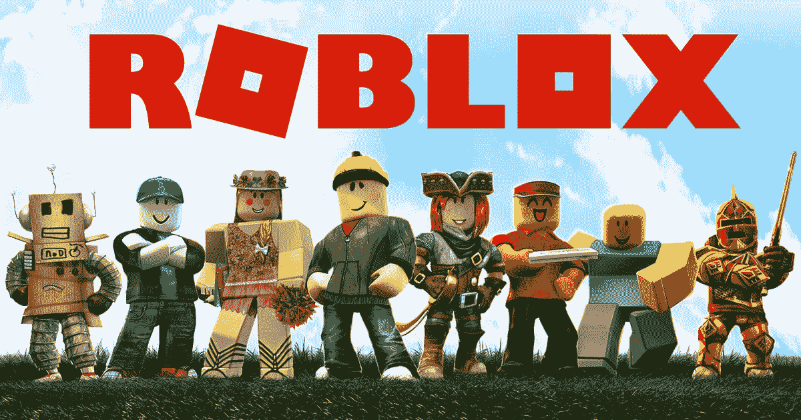
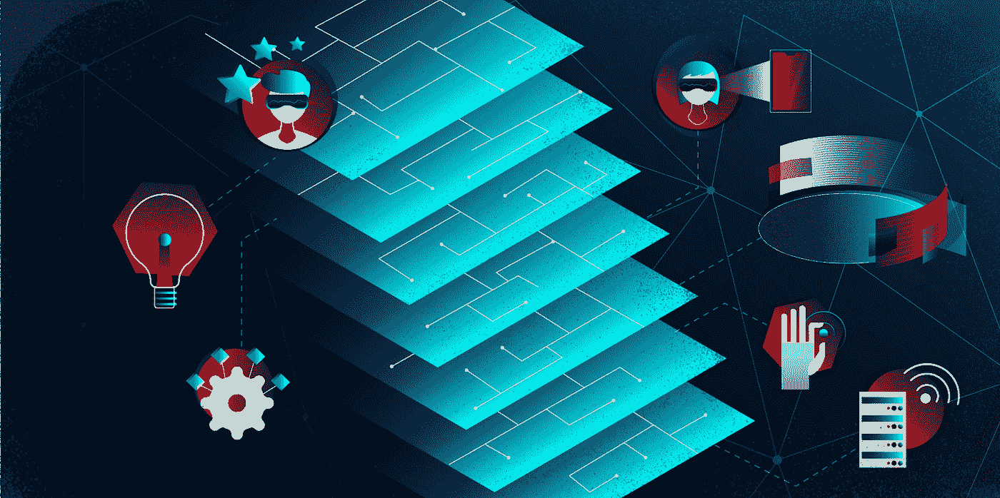
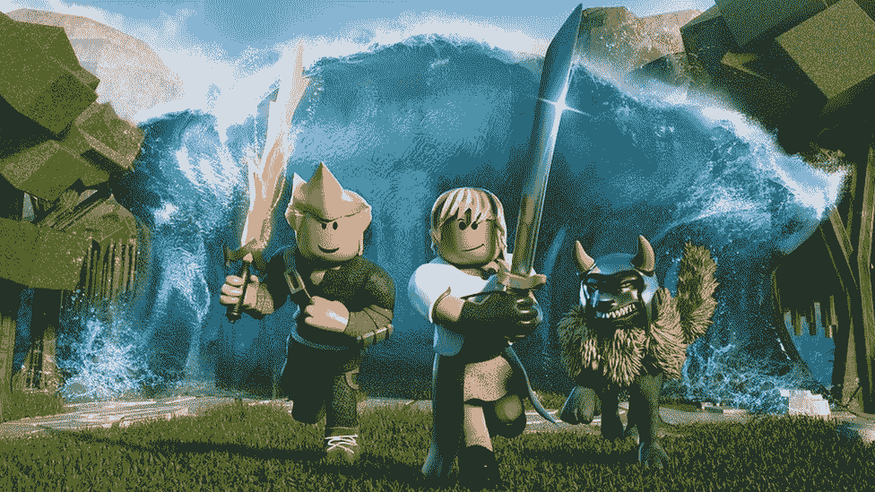
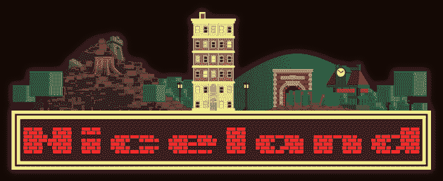
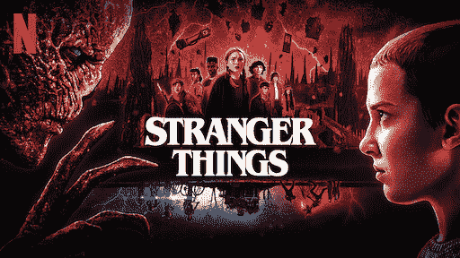
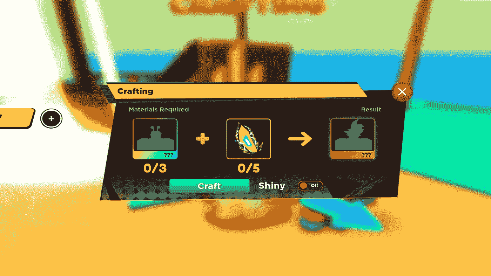
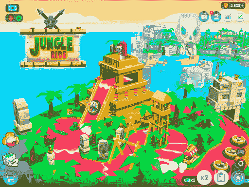
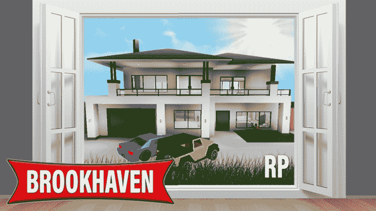

# 罗伯特·元宇宙:你需要知道的一切。

> 原文：<https://medium.com/codex/everything-you-need-to-know-about-the-roblox-metaverse-928e9531e693?source=collection_archive---------4----------------------->

罗布洛克斯·元宇宙

本文重点介绍了一些最著名的 Roblox 元宇宙游戏，同时也探索了 Roblox 元宇宙。

机器人元宇宙的未来潜力也被考虑在内。

Roblox 元宇宙是元宇宙和游戏领域的突破性创新。当 Roblox 去年上市时，在第一个交易日结束时，其市值为 380 亿美元。

许多 Z 世代人将通过 Roblox 元宇宙首次了解元宇宙。

# 但是到底是什么呢？

本文重点介绍了一些最著名的 Roblox 元宇宙游戏，同时也探索了 Roblox 元宇宙。

机器人元宇宙的未来潜力也被考虑在内。

# 什么是机器人元宇宙？

从这一点上了解了元宇宙的基本原理及其一些用途后，你需要学习下一个项目，即 Roblox 元宇宙。Roblox 元宇宙是一种扩展现象，用户可以在 Roblox 上创建自己的游戏，并玩其他人创建的游戏。

Roblox 发展迅猛。每天有 4700 万活跃用户参与该平台。

Roblox 的主要目标是利用当前的游戏技术和平台来创建一个身临其境的虚拟环境。这些游戏宣传真实世界的机会或公司。

此外，Roblox 技术可以用于推广即将推出的电视节目和电影，甚至为娱乐领域以外的现有品牌做广告。比如更奇怪的东西和耐克。Roblox 如何通过与受欢迎的公司合作将自己转变为受欢迎的品牌的一个显著例子。

# 元宇宙层

最好的 Roblox 元宇宙加密帐户可以向您详细展示 Roblox 如何适应元宇宙。在学习 Roblox 之前，详细了解一下不同的元宇宙层是很重要的。对不同层次的了解可以帮助你理解 Roblox 如何成为一个元宇宙平台。

**以下是元宇宙各图层相关任务的概述。**

*   体育、社交、购物、电影、电竞等体验。
*   搜索元素，如广告网络、社交术语、代理和商店。
*   有设计工具、资产市场、商业和工作流程促进的生产者经济。
*   利用 3D 引擎、多任务用户界面、地理空间制图和 VR/AR/XR 技术进行空间计算。
*   通过利用区块链、人工智能代理、边缘计算和微服务架构实现去中心化。
*   人机界面，即前端，用户通过它访问元宇宙，如智能手机、可穿戴设备、神经和语音处理设备。
*   基础设施包括运行和访问元宇宙所需的连接技术和硬件。

# 是什么让 Roblox 独一无二？

Roblox 丰富的体验和定制的虚拟形象系统之间的相互作用使其在行业中脱颖而出。当用户进入特定的 Roblox 区域时，他们并不控制上下文相关的角色，例如 Sonic 或 Mario，而是用户创建一个化身。这是你的虚拟版本，无论你决定做什么。

此外，已经发展到支持这种身份表达的游戏经济包括各种用户生成的服装、发型、配件和皮肤，可以在该平台的虚拟形象商店购买，因此是数字设计师，并为独立卖家提供了机会。去玩。

# Roblox 受欢迎的原因是什么？

自 2019 年以来，Roblox 元宇宙的月活跃用户数量急剧增加。Gen-Z 提升品牌认知度的能力非同寻常。但是为什么呢？

这是因为元宇宙不是一个单一的程序、框架或游戏。

另一方面，它是自然和虚拟世界的交汇点。Roblox 正朝着这个方向前进，它具有巨大的创造性灵活性和有希望的结果。你可以在 Roblox 元宇宙发现特定的、独立的生态系统和创造者。此外，Roblox 元宇宙不仅仅是一款游戏；它就像一个社区或论坛。

每天大约有 4700 万游戏玩家使用 Roblox 元宇宙。使用 Roblox 作为游戏平台的一个主要好处是游戏效果。通过仔细观察 Roblox 元宇宙用户群的人口统计数据，可以找到更多信息。

超过 14%的 Roblox 用户年龄超过 25 岁。另一方面，只有大约 67%的 Roblox 用户超过 16 岁。因此，我们可以说 Roblox 的青春正在推动元宇宙游戏和元宇宙的未来发展，它的火爆和对 [**游戏开发服务**](https://www.quytech.com/game-development-company.php) **的需求是有原因的。**

# Roblox 元宇宙上提供的游戏

# 尼斯兰

耐克和 Roblox 建立了合作关系，在 Roblox 上为这家服装公司做广告。

以体育为主题的视频游戏 Nikeland 的玩家需要参加一系列活动。通过实现这些目标，玩家可以使用特殊的 Nike 物品为他们的 Roblox 化身配备他们在游戏中获得的品牌服装。这可能是该平台在同步品牌方面最明显的尝试。

# 奇怪的事情

2020 年，在网飞完成“陌生人事物”第三季后，这种独特的 Roblox 体验变得可用。

玩家可以探索带有前几集和知名节目标题的商店位置，同时将主题头饰和配件放在一起。理论上，这可以让更多的人加入 Roblox 社区，并使该平台更值得公众信任。

# 动漫格斗模拟器

动漫题材的电子游戏很好玩。

玩家通过一个高度风格化的虚拟环境和一系列的战斗人员。解锁每张地图上的星星会显示更多的战士。游戏的风格是它最有趣的特点之一。

“动漫格斗模拟器”的名字强调了模拟动漫格斗的概念这不是一款格斗游戏，而是具有类似神奇宝贝功能的 Roblox 游戏之一。玩家战略性地使用自己解锁的动漫战士，而不是直接作为动漫战士战斗。在 Roblox 游戏中，玩家与不同类型的敌人战斗。玩家还需要升级和发现升级，以克服怪物和爪牙的挑战。

# 主题公园大亨

Roblox 在知名大亨模拟游戏上富有想象力的旋转，被称为主题公园大亨。

顾名思义，这是几款具有模拟元素的 Roblox 游戏之一。

主题公园大亨通过允许用户实际创建他们自己的主题公园，将这个想法推进了一步。

由于界面简单，新主题公园的大部分组成部分都易于管理。

玩家更关心的是确保游乐设施满足游客的期望；他们也关心主题公园的整体成功。小细节可以决定一个实体主题公园的繁荣与否。《主题公园大亨》中的制度也反映了这一现实。

例如，如果玩家未能投资于清洁，他们的主题公园将变得没有吸引力和肮脏。还有，如果玩家做对了，会获得更多的观众。

# 布鲁克海文 RP

社会化是 Web 3 和围绕它的技术的关键组成部分。

这给了他们与来自世界各地的新朋友交往的机会。

这个 Roblox 的特性在 Brookhaven RP 中相当明显。这款 Roblox 游戏旨在促进社交互动，而不是专注于提供身临其境的游戏体验。简而言之，它是一个生活社区，用户可以在这里创建数字身份并与其他用户互动。

此外，布鲁克海文 RP 为玩家提供了免费使用各种车辆、物品和房屋的机会。

虽然游戏中没有设定目标，但建议玩家模拟布鲁克海文的实际生存情况。

平均玩家人数至少有 20 万，Brookhaven RP 被证明非常受欢迎。

# 元宇宙和机器人未来的可能性

Roblox 可以被视为了解元宇宙的一扇窗户。在虚拟和增强现实流行起来并点燃元宇宙之前，还有很长的路要走。然而，这个结果还没有出现。

在未来几年，元宇宙可能不会成为日常生活中的固定设备，但像微软、Epic Games 和 Meta(前脸书)这样的大型公司正在努力将元宇宙打造成一股不可忽视的力量。支持元宇宙。

随着 78%的 Z 世代成员拥有当代游戏机，这一代人拥有游戏机。

当谈到了解 Roblox 元宇宙的一切时，这个年龄组有明显的优势。

现在是企业开始在营销计划中利用元宇宙的时候了。

查看 Roblox 是了解元宇宙的一个很好的方式。参与这一领域非常重要，因为这是 Z 世代客户的工作。这将有助于品牌更好地了解自己，以及他们如何与元宇宙互动。

分享关于这些行业未来的想法，教育你的追随者关于社交媒体，是品牌和企业主接受 Roblox 和元宇宙的一个很好的方式。品牌应该开始思考如何适应这些新环境。你现在可以找到很多最好的 [**元宇宙发展公司**](https://www.quytech.com/metaverse-development-company.php) ，可以为你提供游戏、电子商务、活动等方面的解决方案。

在这些领域，创造力、创新、客户互动和其他虚拟体验的机会几乎是无限的。

# 最后

这份对 Roblox 元宇宙介绍的详细概述，清晰地展示了 Roblox 的功能。它不仅仅是一个适合孩子玩的免费游戏平台。Roblox 元宇宙公司已经能够通过一些最多样化的虚拟体验，每天吸引大约 4700 万用户。Roblox 元宇宙 VR 可以在智能手机和其他移动设备上使用，无需耳机。因此，它很容易上手，玩起来也很有趣。

另一方面，Roblox 元宇宙在其发展历程中也将面临一些重大挑战。例如，Roblox 元宇宙仍然是集中式的，对用户的体验和资产拥有最终控制权。此外，机器人元宇宙还必须应对虚拟体验中的适度挑战。

> **相关博客:** [**以消费者为中心的公司如何利用**](https://www.quytech.com/blog/how-companies-leveraging-the-metaverse/)