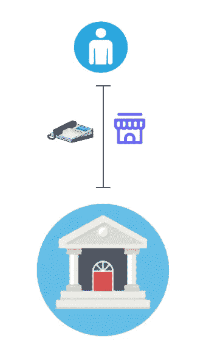
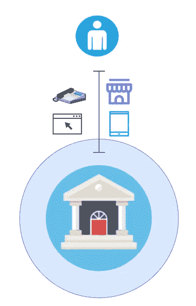
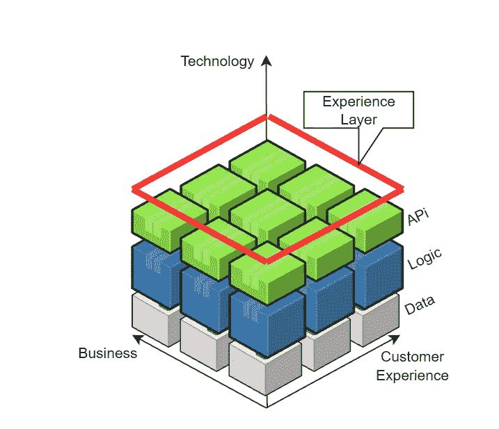
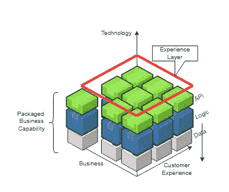
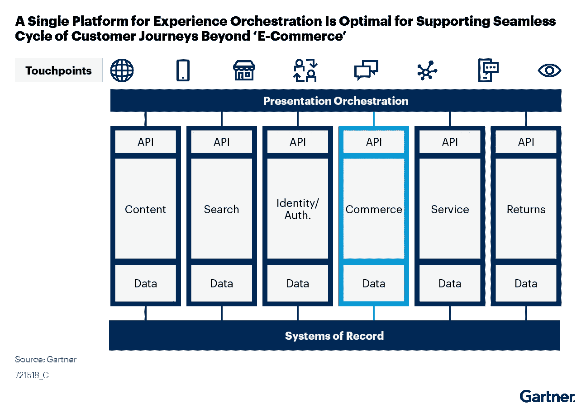

# 商业建筑的演变

> 原文：<https://medium.com/codex/evolution-of-commerce-architecture-918a70cad5e1?source=collection_archive---------11----------------------->

## 从单一渠道到组合商务。

## 什么是商业？

根据韦氏词典，商业是大规模的商品交换或买卖，包括从一个地方到另一个地方的运输。

商业是一个竞争激烈的领域。当一项新技术出现时，商业领域通常是该技术的首批采用者之一。这使得适配器相对于其竞争对手具有竞争优势。随着互联网和电话的应用，商业发生了变化。当这些新的客户互动点被引入时，传统的商业改变了，利用新技术以电子方式销售产品和服务，也称为电子商务。

然而，这并不是商业变革的终结。如今，情况发生了变化，越来越多的人可以访问数字平台，他们更喜欢数字市场，而不是光顾分店的旧时尚。他们不仅有不同的接触点，而且定期在它们之间切换。今天的挑战不是通过不同渠道提供产品和服务，而是了解客户的旅程，并能够在正确的时间和正确的地点提供相关的用户体验，而不管渠道和接触点如何。

随着我们走得更远，客户会有更多选择与我们合作。从 VR/AR 和元宇宙到音频接口、可穿戴设备，甚至汽车和冰箱。商业将再次适应这些由技术和行为变化引起的新需求。电子商务时代已经结束，现在我们正在进入数字商务领域，**数字商务**的重点是用户体验，提供无缝、流畅、个性化的用户旅程。

Gartner 对数字商务的描述:

> 数字商务使客户能够通过互动和自助服务体验购买商品和服务。它包括在客户购买过程中的所有接触点执行开发内容、分析、促销、定价、客户获取和保留以及客户体验的人员、流程和技术。

## 软件架构如何支持商业变革？

正如前面提到的，商务是一个竞争激烈的领域，它适应最新的趋势和技术，因此拥有一个敏捷灵活的 it 骨干和架构来支持它，对于商务业务来说至关重要。为了理解商业架构的当前趋势，让我们看看商业架构在过去几十年中是如何发展来支持业务的。

## 单通道架构

在电子商务时代的开端，大约在 2000-2001 年，一些产品和服务是通过单一的数字渠道提供的，而许多其他产品和服务是手工提供的。这是在推出第一代 iPhone 之前的年代。当时台式电脑和有线电话是主要的接触点。如今，我们将该架构称为单通道架构。并非所有的产品和服务都在网上提供，客户过去常常去分行。单一渠道架构的目标是支持分支渠道中的商业。

单通道架构

## 多通道/全通道架构

B 由于数字客户的增加和智能手机适配性的提高，单通道架构突然不能满足要求。为了与这种新的顾客行为保持一致，零售商采用了一种新型的架构，让顾客能够通过不同的渠道获得他们的产品和服务。不同的公司启动了许多计划来适应新的需求，并将他们的体系结构转换成一种新型的体系结构。这耗费了各组织大量的资源。这种新架构被称为多通道/全通道架构。

多通道/全通道架构

## 无缝编排

如今，数字商务不再局限于网络和手机，如今的客户有多种接触点，公司越来越需要提供高度个性化的用户体验，真正产生情感价值。过去，客户通常会直接联系分销商或产品供应商。但是今天，供应商需要用他们的产品和服务来接近客户。换句话说，我们不是把客户带到产品所在的渠道，而是把产品转移到客户已经在的地方。这需要协作和智能编排，今天是共享生态系统的时代，不同的参与者在商业体验中扮演不同的角色。汽车充当个人助理，手机成为我们的钱包，零售商可以是分销商，制造商可以充当零售商，社交媒体充当市场，等等。

无缝编排

为了克服这些新的挑战，商业架构应运而生。下面是一些支持无缝编排的架构。

## 1)无头商业架构

随着对更好、更独特的用户体验需求的增长，您不能依赖现成的 SaaS 解决方案来提供您需要的 UX/用户界面。为了提供这样一个高度可定制的前端，我们需要将商业系统的后端与前端分开。这允许前端以敏捷和独立于主后端的方式开发(大多数时候是开箱即用的商业系统)。使用上面的 API 层，我们可以实现我们需要的分离级别。采用这种架构对 IT 来说并不是一个挑战，因为大多数 IT 行业已经使用 API 来实现这种分离。此外,“无头”这个术语并不适合这样的架构；因此，这个名字没有被广泛采用，但是这种方法成为了软件行业的一种规范，特别是在遗留的整体上创建一个抽象层的时候。

## 2)马赫商务架构

*马赫*简单的代表**M**microservices， **A** PI-First， **C** loud-Native， **H** eadless。它侧重于数字商务的技术层，通过遵守 MACH 指南，它将改变核心数字商务架构，以实现最大的灵活性和敏捷性。它通过关注技术并提供关于如何构建现代商业软件的指南和标准来支持可组合架构。

## 3)可组合架构

C 可组合架构是一种开发方法，它选择最佳的业务组件，并将它们组合或“组合”成一个为特定业务需求而构建的定制应用程序。商业的未来是高度相互关联的，其核心应该是灵活和反应性的。为此，您需要一个灵活的、可插拔的架构。您需要像乐高积木一样的数字功能，这些功能可以组合在一起，以实现我们业务所需的加速和敏捷性。

1-技术堆栈
2-客户体验/客户旅程
3-业务能力

使用技术堆栈，在上图中，我们构建了支持客户旅程的能力。顶部的体验层向客户公开了这些功能。

根据 Gartner 的说法，这些数字商务的模块化构件被称为**打包业务能力(PBCs)** 。未来的行业领导者是适应这种架构的公司。他们很敏捷，能够迅速改变核心业务模式，并将其转化为新的机遇。

可组合架构是从基于平台的架构到以客户为中心的架构的转变。在单一渠道或全渠道架构的时代，平台被广泛使用。这些平台具有大量经过验证的功能，可以在一定程度上进行定制以满足业务需求。随着业务变化和新机会的发现，平台无法跟上这些变化。公司需要经历平台再造/迁移阶段。平台迁移过去是，现在仍然是成本最高的 IT 活动之一。可组合架构旨在让 IT 部门能够跟上不断发展的商务业务。

为了实现这种灵活性，表示层编排并统一了客户旅程，是表示层使其成为功能的集成点，而不是商业平台。

打包的业务功能(PBC)是可组合架构的核心元素。PBC 是可独立部署的功能，包括独立的业务数据、逻辑和流程来执行业务功能。我们可以在多个或一个特定的客户旅程中使用每个 PBC。

## 可组合商务的好处

*   核心可插拔且灵活
*   提高适应和创新的速度
*   构建独特的个性化客户体验的能力。
*   与业务相匹配的粒度
*   可组合应用程序中的每个功能都对应于一个业务功能，共享相同的目标和愿景。

## 为什么可组合建筑是未来？

数字商务整合了所有商业领域的数字技术。它改变了业务运营、客户体验和为客户提供价值的敏捷性。企业必须了解业务流程中数字商务的背景，预测集成业务功能和流程的技术影响，并提供独特的个性化用户旅程。

> Gartner:未来的应用程序必须采用可组合商务

## 你准备好了吗？

C 如今，客户不再局限于网络、手机或平板电脑。他们有许多与我们互动的选择，商业参与者现在扮演着与以前不同的角色。你的手机是你的钱包，你的汽车现在是你的助手，零售商变成了分销商，分销商可以成为我们的客户。未来商务的焦点是在正确的时间和地点提供个人的、独特的、相关的用户体验。

明天即将到来，我们不知道我们的客户将获得什么类型的新接触点。然而，如果我们想保持相关性，并更快更便宜地适应新的变化，我们需要改变我们的数字商务核心。我们必须将它转换成可插拔的灵活组件，可以根据未来的需求进行组合。

**参考文献:**

1.  Gartner: [未来的应用必须采用可组合商务](https://www.gartner.com/en/documents/3986490)
2.  https://machalliance.org/
3.  [https://www . sitecore . com/blog/commerce/what-is-composable-commerce](https://www.sitecore.com/blog/commerce/what-is-composable-commerce)
4.  Gartner: [数字商务应用成熟度模型](https://www.gartner.com/en/documents/3981821)
5.  Gartner: [将未来应用背后的原则应用于数字商务](https://www.gartner.com/en/documents/3979220)
6.  [https://composable . com/headless-commerce-vs-composable-commerce](https://composable.com/headless-commerce-vs-composable-commerce)
7.  [https://youtu.be/w84138Puj0I](https://youtu.be/w84138Puj0I)
8.  [https://youtu.be/hYF4CO3iYw0](https://youtu.be/hYF4CO3iYw0)
9.  [https://youtu.be/uWqD4htlZ24](https://youtu.be/uWqD4htlZ24)
10.  [https://youtu.be/mP6m9Yq0rS8](https://youtu.be/mP6m9Yq0rS8)
11.  西瓦拉姆，m .，波科迪，v .，和贾扬西拉德维，A. (2022)。企业中的数字商务。*国际企业网络管理杂志*， *13* (1)，37–43。