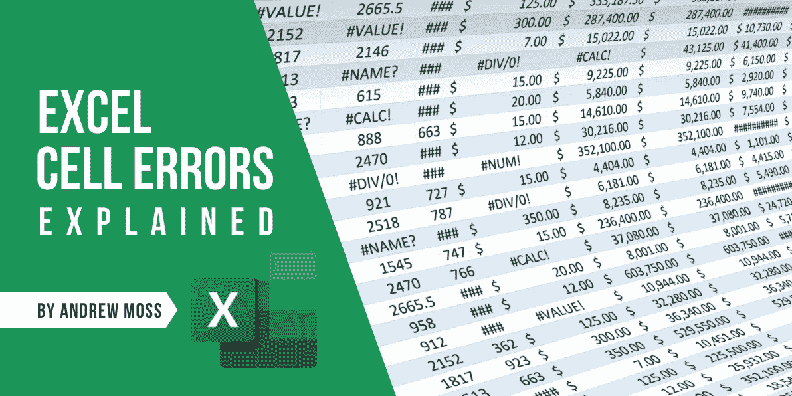

# Excel 单元格错误解释

> 原文：<https://medium.com/codex/excel-cell-errors-explained-2bc250f56fa?source=collection_archive---------5----------------------->

## 什么导致错误发生？

盯着一张错误百出的工作表看是不明智的，但这可能是你诊断公式问题的可取之处。

存在十多种错误类型，您可能在某个时候见过其中的大多数，但是您不一定能够指出它们出现的时间和原因。