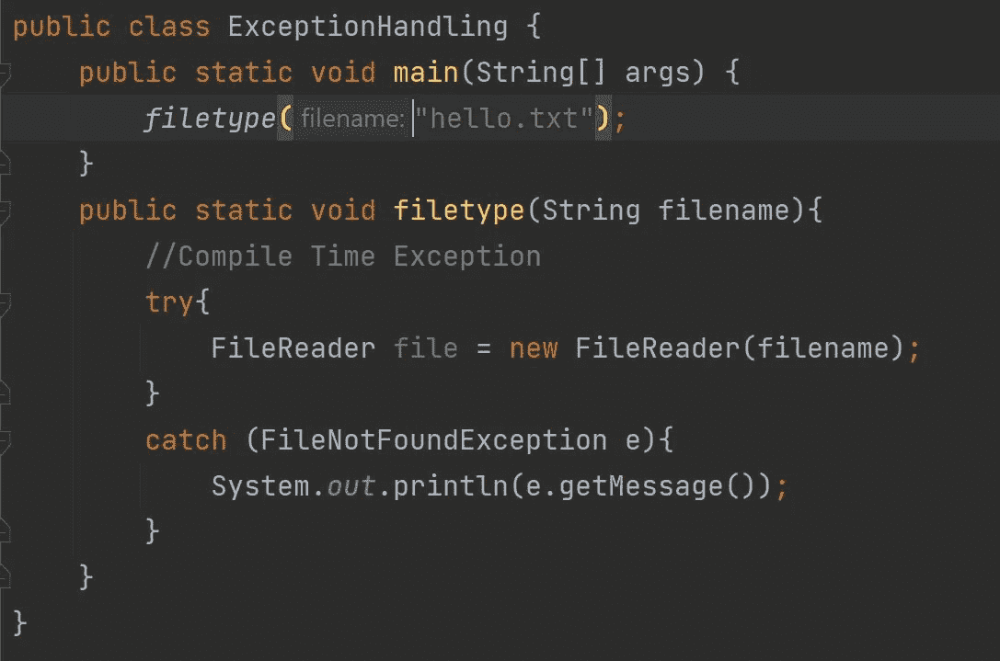
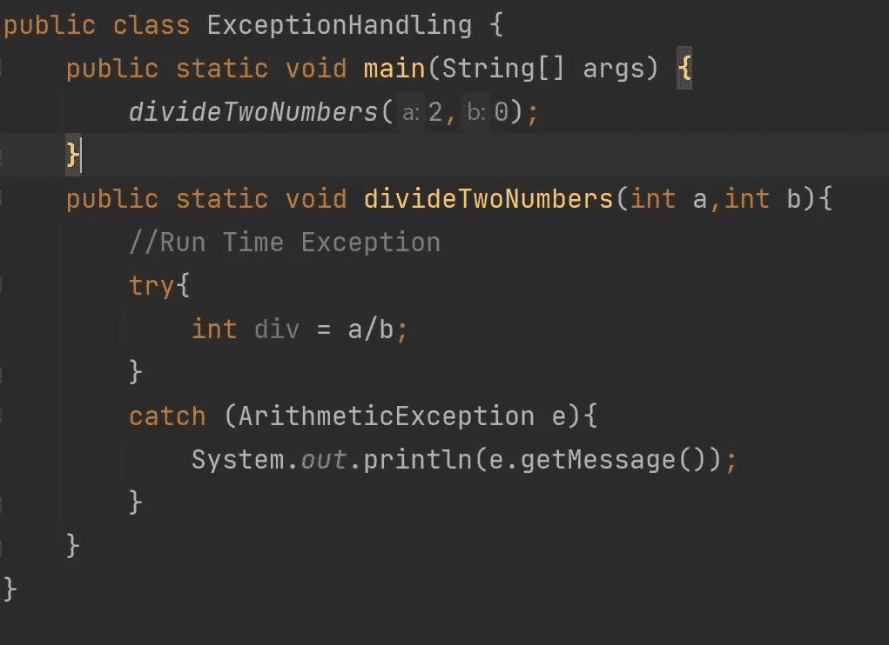
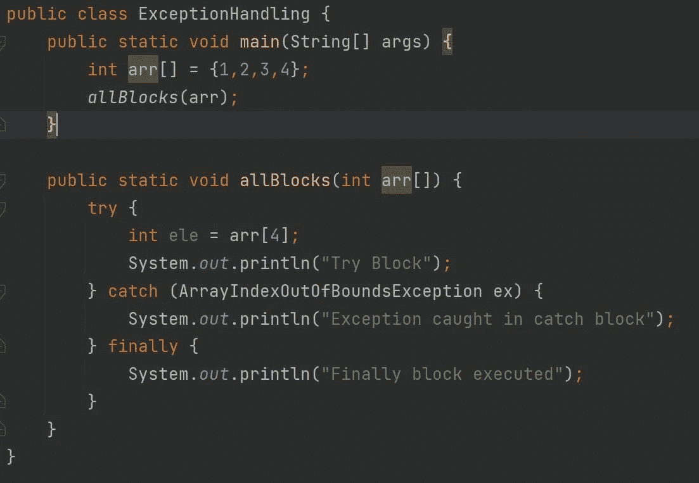
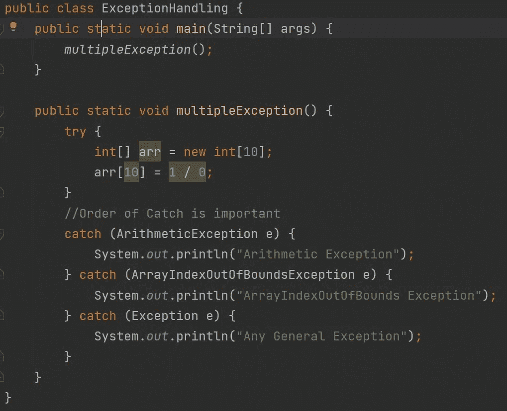

# 异常处理|初学者指南:

> 原文：<https://medium.com/codex/exception-handling-an-art-of-try-and-catch-5e85d4af2bfc?source=collection_archive---------17----------------------->

正如板球运动中的每个外场手都试图接住一个球一样，软件开发人员也应该接住一个例外。

异常处理是保持您心爱的代码正常执行的最重要和最强大的工具之一。

异常处理

本文将关注为什么需要异常处理，以及处理异常的一些更好的方法。它背后的概念在大多数编程语言中保持不变，只是语法发生了变化。

## 异常简介:

主要有两种例外情况:

*   **检查异常:**这种类型的异常发生在编译时。我知道的一个书本上的定义，让我们来看一个现实世界的例子。

**例如:**假设你正在编写一个打开文件的代码，在 Java 中，除非你在负责打开/读取文件的代码周围提供一个 try-catch 块，否则它不会编译。

这主要是因为您试图获取的文件可能不存在，所以它会抛出一个编译时异常***FileNotFoundException***，您必须处理这个异常。

*   **未检查的异常:**这种类型的异常发生在运行时。嗯，举个例子？？

**举例:**假设你正在编写一个代码，用两个数除，现在分母可能是零，这在编译时无法检查。所以我们必须亲自处理这样的异常。

如果不处理它，它仍然会运行，但是我们需要处理这个异常。将发生的运行时异常是 ***算术异常。***

## 处理机制:

*   **试块:**

如果出错，一定会引发错误的代码被放在 try 块中。简单地说，在某些情况下不工作的代码被放在一个 try 中。

*   **挡块:**

当 try 引发异常时，catch 块为代码提供了一条通向错误的备用路径。

*   **最后一块:**

无论代码是否抛出异常，该块都将执行。

## 更好地处理异常:

最好是指定一个您试图捕获的异常。这样做的主要优点是根据异常的类型发送适当的响应，而不是捕捉一般的**异常**。

**例如:**假设有一个服务从数据库中获取一个用户。如果找不到用户，则引发 *UserNotFoundException* 。
所以最好是捕捉( *UserNotFoundException* )而不是一般的(异常)。

其次，如果有多个 catch 语句，那么应该首先保留明确而具体的异常，因为 catch 语句的顺序很重要。通用的 ***异常*** 最后应该保留。

> 直到下次，继续探索，继续学习…

> **“编程不在于你知道什么；而是你能想出什么。”—克里斯·派恩**

## 与我联系:

想谈点什么让我们联系起来吗？

[*Linkedin*](https://www.linkedin.com/in/pranjal-goyal-9b911b170/)|[Twitter](https://twitter.com/pranjalgoyal13)|[Github](https://github.com/pranjalg13)