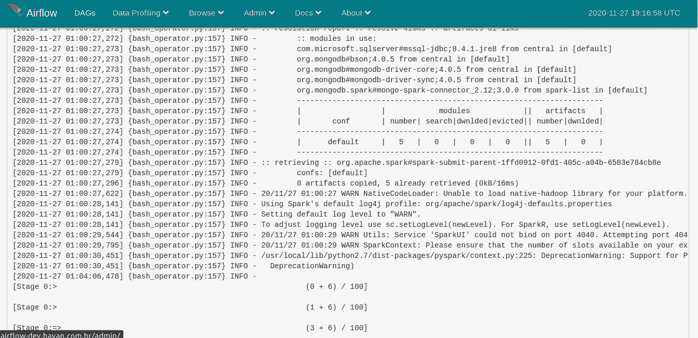
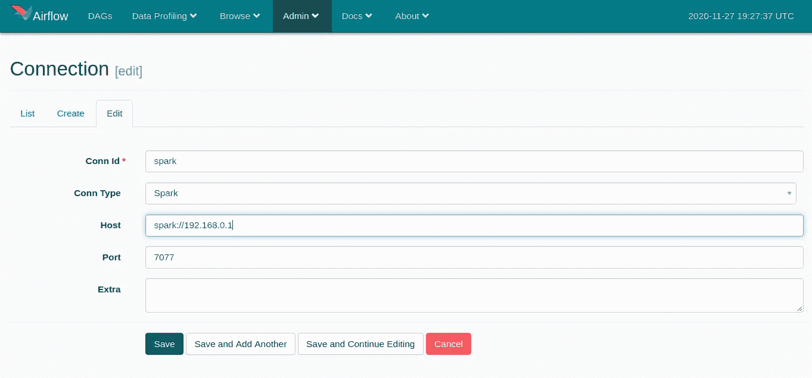

# 使用 Apache Airflow 执行 Spark 作业

> 原文：<https://medium.com/codex/executing-spark-jobs-with-apache-airflow-3596717bbbe3?source=collection_archive---------1----------------------->

Apache Spark 是一个对分布式数据处理很有帮助的解决方案。为了自动化这项任务，一个很好的解决方案是在 [Apache Airflow](https://airflow.apache.org/) 中调度这些任务。在本教程中，我将与您分享在 Apache Airflow 中创建能够运行 Apache Spark 作业的 DAG 的方法。


照片由[威尔·斯图尔特](https://unsplash.com/@wilstewart3?utm_source=unsplash&utm_medium=referral&utm_content=creditCopyText)在 [Unsplash](https://unsplash.com/@wilstewart3?utm_source=unsplash&utm_medium=referral&utm_content=creditCopyText) 拍摄

## 在气流机上准备环境

我测试本教程的机器运行的是 Debian 9。要使用 **PythonOperator** 和 **BashOperator** 运行 Spark on Airflow，必须配置 **JAVA_HOME** 环境。如果您没有安装 java，请使用以下命令安装它:

```
*sudo apt update
sudo apt install default-jdk*
```

安装 java 后，必须通过映射 JAVA 安装的位置来配置操作系统中的 JAVA_HOME。例如，在 Debian 上，在。bashrc 文件，在根目录中，您将通知下面几行:

```
export JAVA_HOME='/usr/lib/jvm/java-8-openjdk-amd64'
export PATH=$PATH:$JAVA_HOME/bin
```

如果您在 linux 上，在编辑文件后，请记住运行以下命令:

```
source ~/.bashrc
```

要使用 Airfow 操作符 **SparkSubmitOperator** 运行脚本，除了 JAVA_HOME 之外，还必须添加和映射 Spark 二进制文件。在 [Spark 页面](https://spark.apache.org/downloads.html)上，您可以下载 tgz 文件，并将其解压缩到托管 Airflow 的机器上。放入文件中。bashrc SPARK _ HOME 并将其添加到系统路径中。

```
export SPARK_HOME='/opt/spark'
export PATH=$PATH:$SPARK_HOME/bin:$SPARK_HOME/sbin
```

最后，你必须将 **pyspark** 包添加到气流流动的环境中。

```
pip install pyspark
```

在下面的例子中，我们有一个从 SQL 数据库 ETL 到 mongo 数据库的 Spark 任务的例子。使用的 Spark 版本是与 mongo 连接器包 org . MongoDB . Spark:mongo-Spark-connector _ 2.12:3 . 0 . 0 兼容的 [3.0.1](https://downloads.apache.org/spark/spark-3.0.1/spark-3.0.1-bin-hadoop2.7.tgz)

## python 运算符

使用 [PythonOperator](https://airflow.apache.org/docs/stable/_api/airflow/operators/python_operator/index.html?highlight=pythonoper#module-airflow.operators.python_operator) ，只需创建 python 方法，运行 Spark 作业，从 Airflow 发送它。这种方法的问题是您没有 Spark 作业执行的日志细节。

脚本 dag 气流 com pythonoperator

## bash 运算符

要使用该操作符，可以创建一个包含 Spark 代码的 python 文件和另一个包含 DAG 代码的 python 文件用于气流。在 [BashOperator](https://airflow.apache.org/docs/stable/_api/airflow/operators/bash_operator/index.html?highlight=bashoperator#module-airflow.operators.bash_operator) 中，bash_command 参数接收将在操作系统的 bash 中执行的命令。例如，在该参数中，可以执行命令 *python jobspark.py* 。

在这个操作符中，您将从 Spark 作业中获得更多的日志细节。这些日志记录了作业的阶段和完成百分比，就像在终端中执行一样。



BashOperator 日志详细信息

## SparkSubmitOperator

要使用该操作符，在 Airflow 机器上映射 JAVA_HOME 和 Spark 二进制文件后，必须在 Airflow 管理面板中注册主 Spark 连接。



火花主连接

在 [SparkSubmitOperator](https://airflow.apache.org/docs/stable/_api/airflow/contrib/hooks/spark_submit_hook/index.html?highlight=sparksubmit#airflow.contrib.hooks.spark_submit_hook.SparkSubmitHook) 中，conn_id 参数将由通过管理面板注册的 Conn Id 填充。我认为这个操作符的主要优点之一是能够配置和通知所有的 Spark 作业属性。从而使 Spark 脚本更加精简，实际上只有逻辑要在集群中发送和执行。在幕后，这个操作符使用 bash *spark-submit* 命令，该命令使用操作符中给出的设置。

SparkSubmitOperator 示例

在这个操作符中，任务日志要详细得多，包含关于每个任务开始和结束的 TaskSetManager 信息

# 解决纷争

在 DAG 的创建过程中，我遇到了一些问题，在这一部分，我想分享一下如何解决这些问题。

## 错误—[错误 2]没有这样的文件或目录:“bash”

这种情况发生在执行 bash 命令时的 airflow 中。出于某种原因，气流可能无法识别操作系统的 bash 路径。要解决这个问题，在 BashOperator 中添加 env 属性，通知包含 bash 的路径。在 SparkSumbitOperator 中，必须在 env_vars 属性中指定路径。这里有一个例子:

```
print_path_env_task = BashOperator(
    task_id='elt_documento_pagar_spark',
    bash_command="python ./dags/spark-jdbc-sql-test.py",
    dag=dag,
    env={'PATH': '/bin:/usr/bin:/usr/local/bin'}
)task = SparkSubmitOperator(
    task_id='elt_documento_pagar_spark',
    conn_id='spark',
    application="./dags/spark-jdbc-sql-test.py",
    env_vars={'PATH': '/bin:/usr/bin:/usr/local/bin'},
    packages="org.mongodb.spark:mongo-spark-connector_2.12:3.0.0,com.microsoft.sqlserver:mssql-jdbc:8.4.1.jre8"
)
```

## 语法错误:非 ASCII 字符

处理包含特殊字符的 Spark 代码时会发生这种情况。要解决这个问题，只需在 python 文件的顶部写下下面的注释。

```
# -*- coding: utf-8 -*-
```