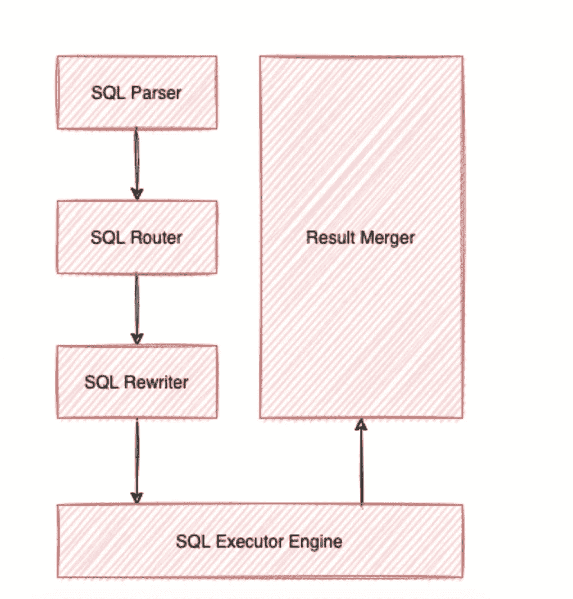
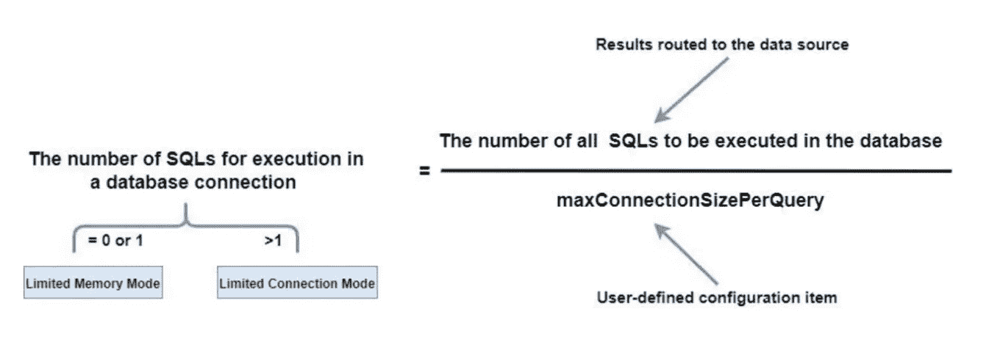
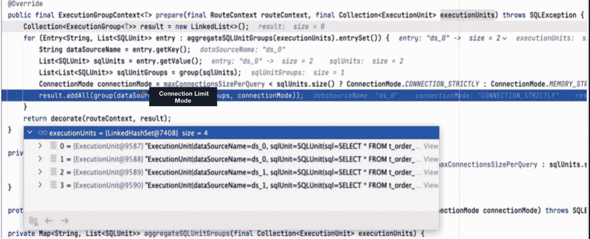
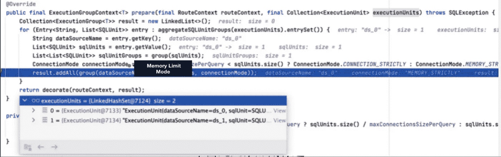
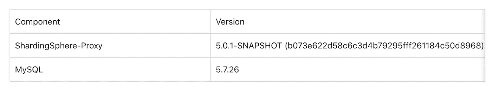
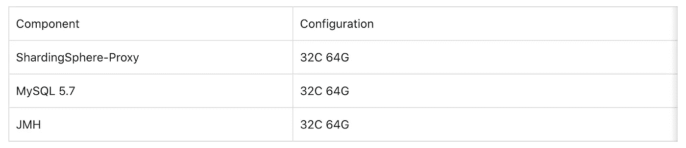
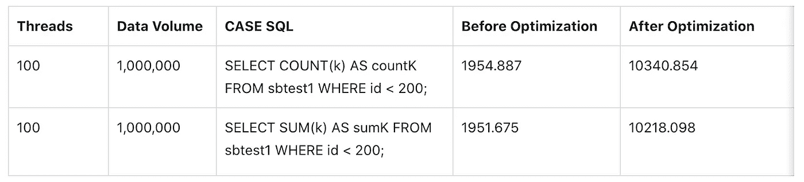
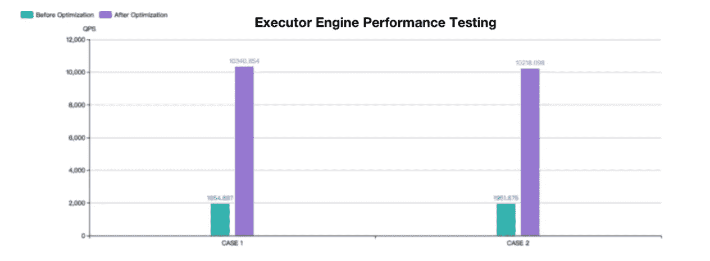

# Executor 引擎:Apache ShardingSphere 5.1.0 的性能优化展示

> 原文：<https://medium.com/codex/executor-engine-performance-optimization-apache-shardingsphere-5-1-0-970a41a5fd14?source=collection_archive---------3----------------------->

我们社区之前的两篇关于 [SQL 格式函数](/codex/sql-parse-format-function-a-technical-deep-dive-by-apache-shardingsphere-f5183e1de215)和[高可用性(HA)](https://blog.devgenius.io/create-a-distributed-database-with-high-availability-with-apache-shardingsphere-b73bf776592) 的博文全面介绍了 Apache ShardingSphere 的更新。

除了许多新的实用功能，我们还一直在优化整体性能。

在本帖中，我们的社区作者将通过具体的 SQL 示例展示 Apache ShardingSphere 的 Executor 引擎性能是如何得到极大优化的。

# 问题

以数据库中有 10 个碎片的`t_order`表为例，`max-connections-size-per-query`使用默认配置 1。

如果用户执行`SELECT * FROM t_order`语句，将导致完全路由。因为对于每个查询，只允许在同一个数据库上创建一个数据库连接，所以底层的实际 SQL 结果将被预先加载到内存中进行处理。这种情况不仅对数据库连接资源消耗施加了限制，还会占用更多的内存资源。

但是，如果用户将`max-connections-size-per-query`的值调整为 10，那么在执行实际的 SQL 时可以创建 10 个数据库连接。由于数据库连接可以保存结果集，因此在这种情况下不会占用额外的内存资源。然而，这种方法需要更多的数据库连接资源。

为了更好地解决问题，我们在刚刚发布的 5.1.0 版本中优化了 SQL Executor 引擎的性能:SQL Rewriter 引擎现在支持面向优化的重写，这意味着同一数据源上的多个真实 SQL 语句可以通过`UNION ALL`语句进行合并。

这些更新有效地减少了 Executor 引擎中消耗的数据库连接资源，并避免了发生内存合并，从而进一步提高了在在线事务处理(OLTP)场景中的 SQL 查询性能。

**Apache sharding sphere Executor 引擎的机制是什么？**

首先，最好回顾一下 Apache ShardingSphere 的微内核以及解释 Executor 引擎如何在进程中工作的原理。如下图所示，Apache ShardingSphere 微内核包括核心进程:SQL 解析器、SQL 路由器、SQL 重写器、SQL 执行器、结果合并器。



Apache ShardingSphere 微内核中的进程

SQL 解析器引擎可以解析用户输入的 SQL 语句，并生成包含上下文信息的 SQL 语句。

然后 SQL Router Engine 根据上下文提取分片条件，结合用户配置的分片规则，计算出实际 SQL 执行需要的数据源，然后生成路由结果。

SQL 重写器引擎根据 SQL 路由器引擎返回的结果重写原始 SQL。有两种重写类型，面向正确性和面向优化。

SQL Executor 引擎可以安全高效地将 SQL 路由器和重写器返回的 SQL 发送到底层数据源执行。

结果集最终将由合并引擎进行处理，合并引擎可以生成统一的结果集并返回给用户。

从执行过程来看，很明显 SQL executor 引擎可以直接与底层数据库交互，并持有执行的结果集。因为整个 Apache ShardingSphere 的性能和资源消耗都归因于 Executor 引擎，所以社区决定采用一个自动 SQL executor 引擎来平衡执行性能和资源消耗。

在执行性能方面，给每个分片的执行语句分配一个独立的数据库连接，可以充分利用多线程提高执行性能，还可以并行处理 I/O 消耗。

此外，该方法还有助于避免过早地将查询结果集加载到内存中。独立的数据库连接可以保存对查询结果集的光标位置的引用，因此当需要获取数据时，用户只需移动光标。

在资源管理方面，应该限制业务访问数据库的连接数，防止一个业务占用过多的数据库连接资源，进而影响其他业务的正常数据访问。当一个数据库实例中有许多表碎片时，一个没有碎片键的虚拟 SQL 语句可以生成大量实际的 SQL 语句，放在同一个数据库的不同表中。如果每个实际的 SQL 占用一个独立的连接，那么单个查询无疑会占用太多的资源。

为了解决执行性能和资源控制之间的冲突，Apache ShardingSphere 提出了`Connection Mode`的概念。下面是源代码中`Connection Mode`的定义。

```
/*** Connection Mode.*/public enum ConnectionMode {MEMORY_STRICTLY, CONNECTION_STRICTLY}
```

基于`Connection Mode`枚举类中的成员名称，我们可以看到 SQL Executor 引擎将数据库连接分为两种模式:`MEMORY_STRICTLY`和`CONNECTION_STRICTLY`。

*   `MEMORY_STRICTLY`是内存限制模式。当用户选择模式时，例如对于同一数据源，如果一个虚拟表对应于 10 个真实表，SQL Executor 引擎将创建 10 个并行执行的连接。由于碎片的所有结果集都由它们的连接保存，因此不需要提前将结果集加载到内存中，从而有效地减少了内存的使用；
*   `CONNECTION_STRICTLY`用于限制连接。使用连接限制模式时，SQL Executor 引擎将只在一个数据源上创建一个连接，以严格控制数据库连接资源的消耗。但是，结果集是在真正的 SQL 执行之后立即加载到内存中的，因此它会占用一些内存空间。

Apache sharding sphere SQL executor 引擎如何帮助用户选择合适的连接模式？其背后的原理如下图所示:



用户可以通过配置`maxConnectionSizePerQuery`为每条语句指定同一数据源上允许的最大连接数。根据上面的计算公式，当每个数据库连接要执行的 SQL 语句数小于或等于 1 时，每个实际的 SQL 语句被分配一个独立的数据库连接。此时，将选择内存限制模式，数据库源允许为并行执行创建多个数据库连接。否则，将选择连接限制模式，同一数据源只允许创建一个数据库连接来执行，然后将结果集加载到内存结果集中，再提供给合并引擎。

# **什么是优化？**

根据上面提到的机制，当用户选择内存限制模式时，将消耗更多的数据库连接，但由于并发执行，可以获得更好的性能。使用连接限制模式，用户可以有效地控制连接资源，尽管占用的内存太多，执行性能会不太令人满意。

> **那么，有没有可能使用尽可能少的数据库连接和内存来执行呢？**

很明显，选择执行模式的主要因素是同一数据源上路由结果的数量。所以最直接的优化就是合并同一个数据源上的路由结果。SQL 语句支持通过`UNION ALL`合并多条查询语句，所以我们使用`UNION ALL`作为优化方法:将同一数据源中的多条真实 SQL 语句重写为一条 SQL 语句，这是一种面向优化的重写。该方法可以大大减少数据库连接的获取，还可以将内存结果集转换为流结果集以减少内存使用。

考虑到不同数据库方言对`UNION ALL`语句的限制，我们需要对 MySQL、PostgreSQL、Oracle、SQL Server 的文档进行分析，然后得到以下信息:

> **MySQL:UNION ALL**

对于 MySQL，使用`UNION ALL`的技巧包括:

*   `UNION`之后的列名使用第一条`SELECT`语句的列名。
*   当一条`UNION`语句包含`ORDER BY`和`LIMIT`时，用户需要用括号将每条查询语句括起来。因为`UNION` 不能保证最终结果集的正确顺序。如果需要对`UNION`结果集进行排序，需要在`UNION`语句的末尾添加`ORDER BY LIMIT`子句。

```
# The UNION result set order is not guaranteed(SELECT a FROM t1 WHERE a=10 AND B=1 ORDER BY a LIMIT 10) UNION (SELECT a FROM t2 WHERE a=11 AND B=2 ORDER BY a LIMIT 10);# The UNION result set order is guaranteed(SELECT a FROM t1 WHERE a=10 AND B=1) UNION (SELECT a FROM t2 WHERE a=11 AND B=2) ORDER BY a LIMIT 10;
```

*   `UNION`不支持`SELECT HIGH_PRIORITY`和`SELECT INTO file`语句。

> ***PostgreSQL:UNION ALL***

*   `UNION`之后的列名应该是第一条`SELECT`语句的列名。
*   当一条`UNION`语句包含`ORDER BY` 和`LIMIT`时，用户需要用括号将每条查询语句括起来。最后一个`UNION`子句不能有括号。如果没有括号，`ORDER BY LIMIT`子句将应用于整个`UNION`结果。
*   `UNION`语句不支持 F `OR NO KEY UPDATE`、`FOR UPDATE`、`FOR SHARE`和`FOR KEY SHARE.`

> ***甲骨文:联合所有***

*   `UNION`语句不支持 `BLOB`、`CLOB`、`BFILE`、`VARRAY`、`LONG`类型或嵌套表。
*   `UNION` 语句不支持 for_update_clause。
*   `UNION`语句不支持选择子句中的`order_by_clause`。用户只能在`UNION`语句的末尾添加`order_by_clause`。

```
SELECT product_id FROM order_items UNION SELECT product_id FROM inventories ORDER BY product_id;
```

*   `UNION`语句不支持带有`TABLE` 集合表达式的`SELECT`语句；

> ***SQL Server:联合所有***

*   当在`UNION`语句中使用`ORDER BY`子句时，必须将其置于最后一个`SELECT`子句之上，以便对`UNION`结果进行排序。

基于上面提到的标准，我们可以看到不同的数据库方言可以支持简单的`SELECT * FROM table WHERE`语句，并且通过语法调整，也可以支持`ORDER BY LIMIT` 语句(但是，存在一些语法差异)。

考虑到面向优化的重写需要 SQL 兼容性，Apache ShardingSphere 5.1.0 的开发只是为了重写简单的语句`SELECT * FROM table WHERE`，以快速提高 OLTP 场景中的查询性能。

以下是 RouteSQLRewriteEngine 重写器引擎背后的最新逻辑。在 Apache ShardingSphere 5.1.0 中，增加了对`SELECT * FROM table WHERE`语句的优化重写逻辑:首先使用`NeedAggregateRewrite`判断行，只有当同一数据源中的路由结果数大于 1，且实际 SQL 语句遵循`SELECT * FROM table WHERE`结构时，才会将其重写为`UNION ALL` 语句。

```
/*** Rewrite SQL and parameters.** @param sqlRewriteContext SQL rewrite context* @param routeContext route context* @return SQL rewrite result*/public RouteSQLRewriteResult rewrite(final SQLRewriteContext sqlRewriteContext, final RouteContext routeContext) {Map<RouteUnit, SQLRewriteUnit> result = new LinkedHashMap<>(routeContext.getRouteUnits().size(), 1);for (Entry<String, Collection<RouteUnit>> entry : aggregateRouteUnitGroups(routeContext.getRouteUnits()).entrySet()) {Collection<RouteUnit> routeUnits = entry.getValue();if (isNeedAggregateRewrite(sqlRewriteContext.getSqlStatementContext(), routeUnits)) {result.put(routeUnits.iterator().next(), createSQLRewriteUnit(sqlRewriteContext, routeContext, routeUnits));} else {result.putAll(createSQLRewriteUnits(sqlRewriteContext, routeContext, routeUnits));}}return new RouteSQLRewriteResult(result);}
```

由于`UNION ALL`重写功能，合并引擎中`queryResults`的判断逻辑也需要同步调整。原本多个`queryResults`可能会被`UNION ALL`合并成一个`queryResults`。在这种情况下，仍然需要执行合并。

```
@Overridepublic MergedResult merge(final List<QueryResult> queryResults, final SQLStatementContext<?> sqlStatementContext, final ShardingSphereSchema schema) throws SQLException {if (1 == queryResults.size() && !isNeedAggregateRewrite(sqlStatementContext)) {return new IteratorStreamMergedResult(queryResults);}Map<String, Integer> columnLabelIndexMap = getColumnLabelIndexMap(queryResults.get(0));SelectStatementContext selectStatementContext = (SelectStatementContext) sqlStatementContext;selectStatementContext.setIndexes(columnLabelIndexMap);MergedResult mergedResult = build(queryResults, selectStatementContext, columnLabelIndexMap, schema);return decorate(queryResults, selectStatementContext, mergedResult);}
```

为了让你更容易理解优化，我们用下面的分片配置和`SELECT * FROM t_order`来展示优化效果。在下面的例子中，`max-connections-size-per-query`参数是默认值 1。

```
rules:- !SHARDINGtables:t_order:actualDataNodes: ds_${0..1}.t_order_${0..1}tableStrategy:standard:shardingColumn: order_idshardingAlgorithmName: t_order_inlinedatabaseStrategy:standard:shardingColumn: user_idshardingAlgorithmName: database_inlineshardingAlgorithms:database_inline:type: INLINEprops:algorithm-expression: ds_${user_id % 2}t_order_inline:type: INLINEprops:algorithm-expression: t_order_${order_id % 2}
```

在 Apache sharding sphere 5 . 0 . 0 版本中，我们执行`SELECT * FROM t_order`语句后，可以得到如下路由结果:有两个数据源，`ds_0`和`ds_1`，每个数据源包含两个路由结果。由于`max-connections-size-per -query`设置为 1，每个真正的 SQL 语句都不可能有数据库连接，所以选择连接限制模式。



由于同时使用了连接限制模式，结果集在并行执行后加载到内存中，使用`JDBCMemoryQueryResult`进行存储。因此，当用户结果集很大时，它将占用更多的内存。使用内存中的结果集也只会导致内存中的合并，而不会导致流合并。

```
private QueryResult createQueryResult(final ResultSet resultSet, final ConnectionMode connectionMode) throws SQLException {return ConnectionMode.MEMORY_STRICTLY == connectionMode ? new JDBCStreamQueryResult(resultSet) : new JDBCMemoryQueryResult(resultSet);}
```

现在，在 5.1.0 版本中，我们可以使用`UNION ALL`来优化执行的 SQL:将同一数据源中的多个路由结果合并成一个 SQL 来执行。选择内存限制模式是因为一个数据库连接可以保存一个结果集。在内存限制模式下，使用流式结果集`JDBCStreamQueryResult` 对象来保存结果集，因此可以通过流式查询方法来查询有问题的数据。



# **性能测试**

从上一节的例子中，我们已经了解了用于面向优化的重写的`UNION ALL` 如何有效地减少数据库连接的消耗，并通过将内存中的结果集转换为流结果集来避免过多的内存使用。

我们进行了压力测试，以更好地衡量性能改进。实现细节如下:



机器配置如下:



参考 sysbench 表结构，我们创建了 10 个表分片，即 sbtest1~sbtest10。每个表碎片被分成 5 个数据库，每个数据库又被分成 10 个表。

`config-sharding.yaml configuration`文件如下。

```
schemaName: sbtest_shardingdataSources:ds_0:url: jdbc:mysql://127.0.0.1:3306/sbtest?useSSL=false&useServerPrepStmts=true&cachePrepStmts=true&prepStmtCacheSize=8192&prepStmtCacheSqlLimit=1024username: rootpassword: 123456connectionTimeoutMilliseconds: 10000idleTimeoutMilliseconds: 60000maxLifetimeMilliseconds: 1800000maxPoolSize: 50minPoolSize: 1ds_1:url: jdbc:mysql://127.0.0.1:3306/sbtest?useSSL=false&useServerPrepStmts=true&cachePrepStmts=true&prepStmtCacheSize=8192&prepStmtCacheSqlLimit=1024username: rootpassword: 123456connectionTimeoutMilliseconds: 10000idleTimeoutMilliseconds: 60000maxLifetimeMilliseconds: 1800000maxPoolSize: 50minPoolSize: 1ds_2:url: jdbc:mysql://127.0.0.1:3306/sbtest?useSSL=false&useServerPrepStmts=true&cachePrepStmts=true&prepStmtCacheSize=8192&prepStmtCacheSqlLimit=1024username: rootpassword: 123456connectionTimeoutMilliseconds: 10000idleTimeoutMilliseconds: 60000maxLifetimeMilliseconds: 1800000maxPoolSize: 50minPoolSize: 1ds_3:url: jdbc:mysql://127.0.0.1:3306/sbtest?useSSL=false&useServerPrepStmts=true&cachePrepStmts=true&prepStmtCacheSize=8192&prepStmtCacheSqlLimit=1024username: rootpassword: 123456connectionTimeoutMilliseconds: 10000idleTimeoutMilliseconds: 60000maxLifetimeMilliseconds: 1800000maxPoolSize: 50minPoolSize: 1ds_4:url: jdbc:mysql://127.0.0.1:3306/sbtest?useSSL=false&useServerPrepStmts=true&cachePrepStmts=true&prepStmtCacheSize=8192&prepStmtCacheSqlLimit=1024username: rootpassword: 123456connectionTimeoutMilliseconds: 10000idleTimeoutMilliseconds: 60000maxLifetimeMilliseconds: 1800000maxPoolSize: 50minPoolSize: 1rules:- !SHARDINGtables:sbtest1:actualDataNodes: ds_${0..4}.sbtest1_${0..9}tableStrategy:standard:shardingColumn: idshardingAlgorithmName: table_inline_1keyGenerateStrategy:column: idkeyGeneratorName: snowflakesbtest2:actualDataNodes: ds_${0..4}.sbtest2_${0..9}tableStrategy:standard:shardingColumn: idshardingAlgorithmName: table_inline_2keyGenerateStrategy:column: idkeyGeneratorName: snowflakesbtest3:actualDataNodes: ds_${0..4}.sbtest3_${0..9}tableStrategy:standard:shardingColumn: idshardingAlgorithmName: table_inline_3keyGenerateStrategy:column: idkeyGeneratorName: snowflakesbtest4:actualDataNodes: ds_${0..4}.sbtest4_${0..9}tableStrategy:standard:shardingColumn: idshardingAlgorithmName: table_inline_4keyGenerateStrategy:column: idkeyGeneratorName: snowflakesbtest5:actualDataNodes: ds_${0..4}.sbtest5_${0..9}tableStrategy:standard:shardingColumn: idshardingAlgorithmName: table_inline_5keyGenerateStrategy:column: idkeyGeneratorName: snowflakesbtest6:actualDataNodes: ds_${0..4}.sbtest6_${0..9}tableStrategy:standard:shardingColumn: idshardingAlgorithmName: table_inline_6keyGenerateStrategy:column: idkeyGeneratorName: snowflakesbtest7:actualDataNodes: ds_${0..4}.sbtest7_${0..9}tableStrategy:standard:shardingColumn: idshardingAlgorithmName: table_inline_7keyGenerateStrategy:column: idkeyGeneratorName: snowflakesbtest8:actualDataNodes: ds_${0..4}.sbtest8_${0..9}tableStrategy:standard:shardingColumn: idshardingAlgorithmName: table_inline_8keyGenerateStrategy:column: idkeyGeneratorName: snowflakesbtest9:actualDataNodes: ds_${0..4}.sbtest9_${0..9}tableStrategy:standard:shardingColumn: idshardingAlgorithmName: table_inline_9keyGenerateStrategy:column: idkeyGeneratorName: snowflakesbtest10:actualDataNodes: ds_${0..4}.sbtest10_${0..9}tableStrategy:standard:shardingColumn: idshardingAlgorithmName: table_inline_10keyGenerateStrategy:column: idkeyGeneratorName: snowflakedefaultDatabaseStrategy:standard:shardingColumn: idshardingAlgorithmName: database_inlineshardingAlgorithms:database_inline:type: INLINEprops:algorithm-expression: ds_${id % 5}allow-range-query-with-inline-sharding: truetable_inline_1:type: INLINEprops:algorithm-expression: sbtest1_${id % 10}allow-range-query-with-inline-sharding: truetable_inline_2:type: INLINEprops:algorithm-expression: sbtest2_${id % 10}allow-range-query-with-inline-sharding: truetable_inline_3:type: INLINEprops:algorithm-expression: sbtest3_${id % 10}allow-range-query-with-inline-sharding: truetable_inline_4:type: INLINEprops:algorithm-expression: sbtest4_${id % 10}allow-range-query-with-inline-sharding: truetable_inline_5:type: INLINEprops:algorithm-expression: sbtest5_${id % 10}allow-range-query-with-inline-sharding: truetable_inline_6:type: INLINEprops:algorithm-expression: sbtest6_${id % 10}allow-range-query-with-inline-sharding: truetable_inline_7:type: INLINEprops:algorithm-expression: sbtest7_${id % 10}allow-range-query-with-inline-sharding: truetable_inline_8:type: INLINEprops:algorithm-expression: sbtest8_${id % 10}allow-range-query-with-inline-sharding: truetable_inline_9:type: INLINEprops:algorithm-expression: sbtest9_${id % 10}allow-range-query-with-inline-sharding: truetable_inline_10:type: INLINEprops:algorithm-expression: sbtest10_${id % 10}allow-range-query-with-inline-sharding: truekeyGenerators:snowflake:type: SNOWFLAKEprops:worker-id: 123We use the JMH test program to test different CASEs:@State(Scope.Thread)public class QueryOptimizationTest {private PreparedStatement unionAllForCaseOneStatement;private PreparedStatement unionAllForCaseTwoStatement;@Setup(Level.Trial)public void setup() throws Exception {Connection connection = DriverManager.getConnection("jdbc:mysql://127.0.0.1:3307/sharding_db?useSSL=false", "root", "123456");// CASE 1unionAllForCaseOneStatement = connection.prepareStatement("SELECT COUNT(k) AS countK FROM sbtest1 WHERE id < ?;");// CASE 2unionAllForCaseTwoStatement = connection.prepareStatement("SELECT SUM(k) AS sumK FROM sbtest1 WHERE id < ?;");}@Benchmarkpublic void testUnionAllForCaseOne() throws SQLException {unionAllForCaseOneStatement.setInt(1, 200);unionAllForCaseOneStatement.executeQuery();}@Benchmarkpublic void testUnionAllForCaseTwo() throws SQLException {unionAllForCaseTwoStatement.setInt(1, 200);unionAllForCaseTwoStatement.executeQuery();}}
```

在性能测试中，每个`CASE`需要测试 3 组，然后取平均值。

然后我们切换到旧版本，`aab226b72ba574061748d8f94c461ea469f9168f`来进行编译和打包，我们也测试了 3 组，取平均值。

最终测试结果如下所示。



案例 1 和案例 2 测试都是基于`sysbench`表结构，数据量 100 万。测试表中的碎片数量相对较大，但总体性能仍提高了约 4 倍。理论上，碎片越多，性能越好。

# **总结**

Apache ShardingSphere 5.1.0 在协议层和内核层都实现了大量的性能优化。

这篇博客只涉及 SQL Executor 引擎及其优化。未来，该社区将为性能优化提供更全面的指南。

# 参考

*   [https://sharding sphere . Apache . org/document/current/en/reference/sharding/execute/](https://shardingsphere.apache.org/document/current/en/reference/sharding/execute/)
*   [https://github.com/apache/shardingsphere/issues/13942](https://github.com/apache/shardingsphere/issues/13942)
*   **MySQL 联盟:**[https://dev.mysql.com/doc/refman/8.0/en/union.html](https://dev.mysql.com/doc/refman/8.0/en/union.html)
*   **PostgreSQL 联合:**[https://www.postgresql.org/docs/14/sql-select.html](https://www.postgresql.org/docs/14/sql-select.html)
*   **Oracle UNION:**[https://docs . Oracle . com/en/database/Oracle/Oracle-database/21/sqlrf/The-UNION-ALL-INTERSECT-MINUS-operators . html](https://docs.oracle.com/en/database/oracle/oracle-database/21/sqlrf/The-UNION-ALL-INTERSECT-MINUS-Operators.html)
*   **SQL Server UNION:**[https://docs . Microsoft . com/en-us/SQL/t-SQL/language-elements/set-operators-UNION-transact-SQL？view=sql-server-ver15](https://docs.microsoft.com/en-us/sql/t-sql/language-elements/set-operators-union-transact-sql?view=sql-server-ver15)

# **作者**

**段**

> [SphereEx](https://sphere-ex.com) 高级中间件工程师&Apache sharding sphere 提交者

段自 2018 年以来一直为 Apache ShardingSphere 做出贡献，此前曾是众多数据分片项目的工程负责人。

他喜欢开源，喜欢与其他开发者分享他的技术故事和经验。他现在致力于开发 Apache ShardingSphere 内核模块。

