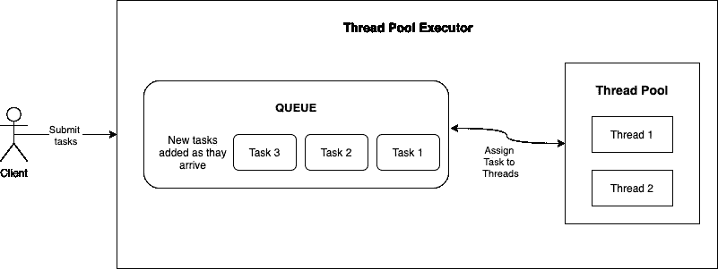
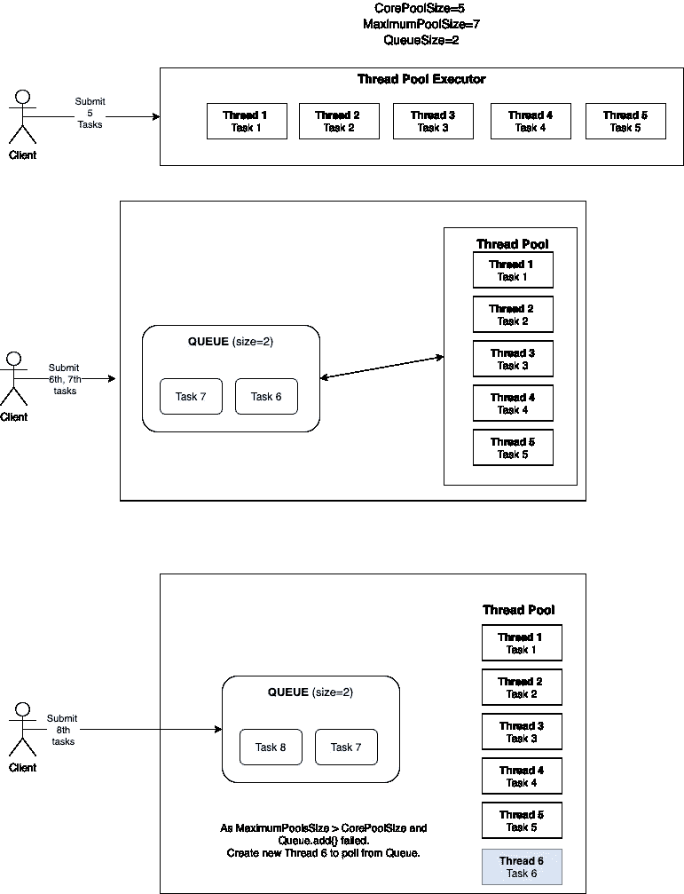
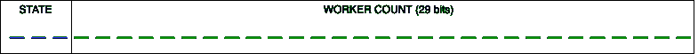

# Java 中的 ExecutorService 内部工作

> 原文：<https://medium.com/codex/executorservice-internal-working-in-java-7b286882f54e?source=collection_archive---------2----------------------->

Executor 服务框架可以说是并行执行工作的最受欢迎和易于使用的概念。它有助于并行执行，而不需要开发人员负责多线程带来的复杂性。开发人员可以生成一个 Executor 服务，并向它提交任务，让它以并行方式运行。

我一直喜欢理解它实际上是如何并行处理所有这些任务的，并理解随之而来的所有细微差别，如 CorePoolSize、队列、处理程序等。我们将更详细地了解这些概念，并理解我们可以利用的开箱即用功能的出色之处。

# 什么是遗嘱执行人服务？

在编程时，您可能遇到过这样的场景:您有一些类似的任务要执行，并且希望并行执行它们以加快速度。例如，如果您有一个服务，它接受用户输入并调用后端服务来处理它们。

您可以选择串行处理，对于每一个输入，您进行后端调用，并对收到的每一个输入都这样做。但你可以想象，这将是一个缓慢的系统。

为了实现并行性，您可以利用线程模型，假设您有 10 个线程，每个线程可以接收一个输入，并进行后端调用来处理它们。这样，您的系统可以支持 10 倍于以前的负载。因为您将有 10 个线程等待接收输入并处理它们，所以在任何给定的时间，您将能够处理 10 个输入。但是，这也是有代价的。

您需要担心线程间的通信，在高负载时产生新线程，在低负载时终止空闲线程，确保锁定、竞争条件、线程间的死锁，维护各种线程的状态，等等。因此，为了减轻这些事情，以便开发人员可以专注于他感兴趣的核心事情，例如，这里只是进行后端调用，Java JDK 中有 ExecutorService 框架。

ThreadPoolExecutor 只是 ExecutorService 接口的实现。

# 线程池执行器的基本工作方式:

线程池执行器需要一些已定义的参数，它使用这些参数来控制它将创建的线程数量，以处理提交给它的任务。我们将详细了解所有这些参数，但让我们从 1000 英尺的高度了解 ThreadPoolExecutors 实际上是如何工作的:

因此，基本原则是任务提交频率可能与任务处理速率不同步，这意味着如果每秒提交 100 个任务，而所有线程在 1 秒内只能处理 10 个任务，那么我们仍然不想丢失这 90 个任务。

所以有一个众所周知的数据结构来处理这种情况:队列。
因此，如果没有线程空闲，我们可以将所有任务推到队列中，一旦任务从当前工作中释放出来，它们最终将被线程读取执行。

然后，线程池中的线程可以读取提交的最旧的任务(位于队列的最前面)，并开始处理它。

因此，使用队列，线程可以按照自己的速度处理任务。根据给定的某些参数，线程数可以增加/减少，我们将在下面看到它是如何工作的。



# 线程池执行器中的术语:

## **1。CorePoolSize**

CorePoolSize 是新任务到达时必须并行运行的线程数。如果 CorePoolSize = 10，并且到目前为止只有 5 个任务被提交，那么我们将有 5 个线程正在运行/活动。当提交第 6 个任务时，不是将新任务放入队列，而是创建第 6 个线程，该任务将立即提交给它。即使先前创建的 5 个线程是空闲的，并且已经完成了它们的工作并等待新的任务，也是如此。因此，如果运行的线程少于 CorePoolSize 线程，将始终创建一个新线程来处理新任务。

## **2。最大尺寸**

该属性控制可以运行的最大线程数。因此，当我们创建了 CorePoolSize 数量的线程，并且新任务到达时，它们将被放入队列。现在，一旦队列也变满，如果 MaximumPoolSize > CorePoolSize，就会创建新的线程。假设 CorePoolSize 为 10，MaximumPoolSize=15，我们有一个大小为 10 的队列。如果我们有 20 个高频率的请求，那么所有 10 个线程都被创建并开始运行它们的任务，另外 10 个任务被放入队列。现在，当第 21 个任务到达时，由于 MaximumPoolSize > CorePoolSize，将创建一个新线程，它可以开始从队列中读取数据，以便为队列中的第 21 个任务腾出空位。

所以当新任务到达时**规则**是:

a.如果运行的线程少于 CorePoolSize，执行器总是倾向于创建一个新线程，而不是排队。

b.如果 CorePoolSize 或更多线程正在运行，执行器总是更喜欢将请求排队，而不是创建一个新线程。

c.如果请求无法排队，将创建一个新线程，除非它超过 maximumPoolSize，在这种情况下，任务将被拒绝。

## **4。KeepAliveTime**

这可以防止线程闲置和浪费资源，并且可以用来控制何时终止空闲线程。因此，如果 CorePoolSize=10，在上面的例子中，我们有 11 个线程在运行。一旦所有的任务都被处理，并且说这些线程正在等待新任务的到来，它们就会处于空闲状态，浪费资源。然后，如果多余的线程(大于 CorePoolSize，即这里的 1)处于空闲状态的时间超过了 KeepAliveTime，那么这些线程将被终止。因此，当池未被频繁使用时，该属性有助于减少资源消耗。

## **5。工作队列**

队列用于保存提交的任务。可以使用 3 种类型的队列:

*   **直接移交(类似同步队列)**:它不会保存任何任务，每当有请求加入队列时，它会移交给线程。如果没有可用的线程，那么排队操作将会失败。通常，如果要使用这样的队列，MaximumPoolSize 被设置为一个非常大的值，以便我们可以用新线程处理所有传入的请求，而不是将它们保留在队列中。它在需要执行更多实时操作而不需要存储它们并在以后执行它们的地方找到了它的用途。
*   **无界队列(如 LinkedBlockingQueue)** :这种队列没有任何大小设置，因此称为无界队列。因为这样的队列永远不会满，所以 en-queue 永远不会失败，并且永远不会创建比 CorePoolSize 更多的线程，因此在这样的队列中，MaximumPoolSize 属性不可用。(回想一下，如果添加到队列失败，那么如果 MaximumPoolSize>CorePoolSize，则会创建新线程)。
*   **有界队列(像 ArrayBlockingQueue)** :这种队列有固定的大小，所以当请求> CorePoolSize 时，一个新的请求会被添加到队列中。一旦这个队列也满了，新的线程(如果 MaximumPoolSize>CorePoolSize)将被创建。

## **6。线程工厂**

因为新线程是随着新请求的到来而创建的，所以我们需要一个可以创建新线程的工厂。默认情况下，所有创建的线程都具有相同的优先级、相同的线程组、非守护进程状态等。当然，这样的事情可以通过提供自己的 ThreadFactory 来改变。

## **7。RejectedExecutionHandler**

当执行器关闭时，如果队列已满且创建了 MaximumPoolSize 线程，则无法处理新的请求，因此在这些场景中，传入的请求将被拒绝。您可以提供自己的 RejectionHandler 来处理这种拒绝。默认情况下，提供了 4 个这样的处理程序:

*   **AbortPolicy:** 如果使用此处理程序，将抛出 RejectedExecutionException。
*   **caller run policy:**有了这个处理程序，一旦任务被执行器拒绝，客户机就自己运行任务。
*   **DiscardPolicy:** 使用这个处理程序，被拒绝的请求被简单地丢弃/忽略。
*   **DiscardOldestPolicy:** 使用这个处理程序，队列中最旧的任务被丢弃，然后重试这个任务。



请注意，线程池有 5 种状态:

1.  **正在运行** : ThreadPool 可以接收新任务。
2.  **关机**。不接受新任务，但可以处理已经添加到队列中的任务。
3.  **停止**:不接受新任务，不处理队列中的任务，也中断当前正在执行的任务。
4.  **整理**:所有任务已经终止，WorkerCount 为零。线程将处于整理状态，并很快运行 Terminated()钩子方法。
5.  **终止:**执行终止()方法。这是一个钩子方法，我们可以在 ThreadPool 结束时做一些处理。

# 创建 ThreadPoolExecutor:

通过指定 corePoolSize、MaximumPoolSize、keepAliveTime 等，我们可以修改我们希望 ThreadPoolExecutor 看起来是什么样子。

但是如果我们不想太担心所有这些，那么我们也可以利用一些现有的内置方法:

1.**固定线程池执行器** —创建一个线程池，它重用固定数量的线程来执行任意数量的任务。如果在所有线程都处于活动状态时提交额外的任务，它们将在队列中等待，直到有一个线程可用。

2.**缓存线程池执行器** —创建一个线程池，该线程池根据需要创建新线程，并在先前构建的线程可用时重用它们。由于这将在需要时创建线程，如果任务是长期运行的，那么必须使用**而不是**。如果线程数量超出了系统的处理能力，就会导致系统崩溃。如果你能想到这是如何工作的-这很简单，它将 maximumPoolSize 设置为无穷大。

3.**调度线程池执行器** —创建一个线程池，该线程池可以调度命令在给定延迟后运行，或者定期执行。
为此，使用了一种特殊类型的队列(DelayedWorkQueue ),当轮询请求到来时，它只在一定的延迟后返回值。

4.**单线程池执行器** —创建单线程来执行所有任务。由于所有任务都将由一个线程执行，因此所有任务都是按顺序执行的。您可能已经猜到了，它的 corePoolSize 和 maximumPoolSize = 1。

ThreadPoolExecutors 中使用了另一个非常巧妙的东西，我非常喜欢。如果您对二进制操作感兴趣，请阅读一下。是 **ctl 的用法。**

ThreadPoolExecutor 每次需要知道两种状态:

*   说明它在。有 5 种状态:运行，关机，停止，整理，终止。
*   正在运行的线程数。

我们可以用一个对象来拥有这两种状态，但是由于这两种状态都是整数，为了加快速度，我们用一个整数值来表示这两种状态。我们来看看是怎么做的。

在 java 中，整数有 32 位。因此，我们必须利用这 32 位来表示上述 2 个参数。因为我们只有 5 个状态，而 5 可以用 3 位来表示:000，001，010，011，101，所以 32 位整数中最左边的 3 位用来表示线程池执行器的状态。



剩余的 29 位用于表示线程池执行器中运行的线程数量。所以现在我们要担心两个操作:

*   如何将两个参数合并成一个整数？
*   如何从一个整数中检索 State 和 WorkerCount？

让我们试着理解这些:

```
COUNT_BITS = Integer.SIZE - 3; 
COUNT_BITS = 32 - 3 = 29CAPACITY   = (1 << COUNT_BITS) - 1;
i.e. 00000000000000000000000000000001 << 29 - 1
i.e. 00100000000000000000000000000000 - 1
i.e. 00011111111111111111111111111111
```

所有状态都存储在最左边的 3 位，并携带 0 到 5 之间的值，因此这些 0-5 值左移 29 位。例如

```
RUNNING   = -1 << COUNT_BITS i.e.  ***111***00000000000000000000000000000
SHUTDOWN   = 0 << COUNT_BITS i.e.  ***000***00000000000000000000000000000
STOP       = 1 << COUNT_BITS i.e.  ***001***00000000000000000000000000000
TIDYING    = 2 << COUNT_BITS i.e.  ***010***00000000000000000000000000000
TERMINATED = 3 << COUNT_BITS i.e. ***011***00000000000000000000000000000
```

因此，我们可以看到，这些状态仅设置了前 3 位，其余 29 位为 0，供正在运行的线程数或“WorkerThreads”使用。为了将状态和工作线程结合起来，使用了 ctlOf 方法:

```
int ctlOf(int rs, int wc) { return rs | wc; }E.g. if rs = RUNNING = ***111***00000000000000000000000000000
And wc = 2 = 00000000000000000000000000000010
Then ctl = ***111***00000000000000000000000000000 | 00000000000000000000000000000010
= 11100000000000000000000000000010
```

正如我们在`11100000000000000000000000000010`中看到的，前 3 位= 111 =运行，其余 29 位代表 2 =工作线程。为了从 ctl 中检索这些值；使用了 RunStateOf 方法；

```
runStateOf(int c)     { return c & ~CAPACITY; }
e.g. if c = 11100000000000000000000000000010
 CAPACITY = 00011111111111111111111111111111
~CAPACITY = 11100000000000000000000000000000c & ~CAPACITY = 
  11100000000000000000000000000010
& 11100000000000000000000000000000 to get
  11100000000000000000000000000000 i.e. RUNNING State
```

由于~CAPACITY 的右 29 位= 0，& with ctl 将使 29 位为 0，并将只返回最左边的 2 位。类似地，为了获得工作线程计数，使用 WorkerCountOf:

```
workerCountOf(int c)  { return c & CAPACITY; }
e.g. if c = 11100000000000000000000000000010
CAPACITY = 00011111111111111111111111111111c & CAPACITY = 
  11100000000000000000000000000010
& 00011111111111111111111111111111 to get
  00000000000000000000000000000010 i.e. WorkerCount=2
```

因为 CAPACITY 的所有 29 位都是 1，最左边的 3 位=0，所以& with ctl 将只返回最右边的 29 位值，它反映了 workerCount。因此，我们可以看到如何使用简单的位操作概念来封装 ThreadPoolExecutor 的两个重要属性。

如果上面的理论是清楚的，我们就可以进入代码在线程池执行器中的样子，以及它如何支持上面所有的用例。execute(Runnable Runnable)——在这里我们将任务提交给 ExecutorService。

它在 3 if 块中涵盖了 3 种场景——如果可以创建新线程，如果可以将任务推入队列，或者如果需要拒绝任务。

**第 8–12 行**:如果 worker Thread count<CorePoolSize，那么我们需要生成一个新线程，并直接将任务交给它。
我们将看到 addWorker 做了什么，但它基本上创建了一个新线程，并让它运行 Runnable/task。

**第 17 行:**如果 worker thread counts≥CorePoolSize，那么我们需要在线程池没有停止(处于运行状态)的情况下，将传入任务推送到队列中。

**第 22–23 行:**为了处理线程池在新任务添加到队列后停止的情况，我们重新检查线程池是否仍在运行。如果没有，我们撤销队列。提供()并拒绝任务。

**第 27–28 行:**处理 CorePoolSize 设置为 0 的场景。在这种情况下，任务将被添加到队列中，但是永远不会创建线程来执行这些任务。所以我们检查活动线程的数量。如果 WorkerThread count 为 0，我们只需创建一个新线程，它将从队列中读取数据，以处理队列中的任务。

**第 32–33 行:**如果 worker thread count<CorePoolSize 和队列已经满了，并且我们无法将该任务添加到队列中，我们将简单地拒绝该任务。

添加工作方法:

AddWorker()有三个函数:

1.  **addWorker(Runnable firstTask，corePoolSize=true)**
    用 firstTask 生成一个线程，新线程必须在 corePoolSize 边界内创建。可以看作是一种生成核心线程的方法。
2.  **addWorker(Runnable firstTask，corePoolSize=false)**
    用 firstTask 生成一个线程，在 MaximumPoolSize 边界内必须创建一个新线程。它可以被视为一种生产非核心线程的方法。
3.  **add worker(Runnable firstTask = null，corePoolSize=false)**
    生成一个空闲线程(没有 first task)，必须在 MaximumPoolSize 边界内创建一个新线程。因为它的 FirstTask 为 null，所以它将从队列中读取数据来获取需要执行的任务。

回想一下，如果 ThreadPool = RUNNING state，那么它可以执行新的任务。如果 ThreadPool = SHUTDOWN state，那么它不能接受新任务(因此对于 SHUTDOWN 情况，firstTask = null)，但是它仍然可以执行排队的任务。

让我们试着详细理解这一点:

**第 12–14 行:**检查线程池是否处于运行状态。如果是，那么我们可以继续进行。如果处于关闭状态，则检查 firstTask 是否为 null，因为在关闭状态下，它不能接受新任务，而只能执行排队的任务。在关闭状态下，它还检查队列是否为空。如果队列是空的，那么就没有任务要执行，所以创建一个新线程是没有意义的。

**第 18–22 行:**检查当前有多少工作线程处于活动状态。我们检查 WorkerThreads 是否超过了 OS 允许的线程容量，如果超过了 CorePoolSize 和 maximumPoolSize，那么我们就不能创建新的线程，所以我们不会继续。

**第 25–26 行:**如果上述条件都不成立，我们将增加工作线程数。如果增量成功完成，我们可以继续创建一个新的线程，否则这个逻辑在循环中再次执行。

现在我们知道新任务已经存在(firstTask 或者在队列中)，我们可以继续创建新线程(Worker Thread)。

**第 41 行**:创建一个新的工作线程，将第一个任务传递给它。Worker Thread 具有处理这种情况的逻辑(我们将在后面的部分看到),如果传递的 firstTask 为 null，它从队列中读取以执行任务，否则它首先执行这个 firstTask。

**Line 52–64**:我们在访问/更新工作者列表之前获取锁。但是为了处理线程池可能在锁获取期间关闭的情况，我们再次检查了条件。
检查线程池是否处于运行状态，然后我们就好了。如果它处于关闭状态，并且第一个任务是空的，那么我们也可以创建新的线程。这些是以前做过的检查，现在再次复查。
如果我们可以继续，我们会将新创建的工作线程添加到工作线程列表中。

**Line 70–72**:一旦我们创建了新的工作线程，我们就立即启动它，这样它就可以开始执行第一个任务或者队列中的任务。我们将在下面看到这个 WorkerThread 是如何工作的。

**Line 76–78**:如果工作线程由于某种原因无法启动，我们需要撤销已经完成的操作。
我们将从 workerList 中删除该工作者+减少工作者计数+终止/中断该工作者。这个逻辑在 addWorkerFailed 方法中处理。

## 工作线程

工人只是可以跑的:

正如在上面的 addWorker 处理中所看到的，当工作线程被创建时，我们启动它。因此，我们将看到它的 run 方法是如何实现的，因为一旦 Worker 启动，它就会被调用。

一旦 WorkerThread 启动，它将首先尝试执行提供给它的第一个 Task。一旦它执行了这个任务，或者如果这个任务为空，它将从队列中选择新的任务，并执行它。它将继续这样做，直到线程池停止，所以一旦我们启动了 10 个工作线程，所有这 10 个线程将从队列中轮询以选择要执行的任务。

第 12 行:如果 FirstTask = null，它将从队列中挑选一个新任务运行。

**第 25–37 行**:调用 beforeExecute 钩子方法，然后运行任务，再调用 afterExecute 钩子方法。如果客户机希望在任务执行前后做一些额外的日志记录/处理，这些就很有用。

**第 46 行**:为了处理线程池状态变化，或者执行任务时出现的外部错误，调用 processWorkerExit。

**第 2–14 行**:如果这个方法由于某种异常被调用(completedAbruptly=true ),那么我们减少工作者计数，从工作者列表中删除这个工作者，并终止这个工作者线程。

**第 17-25 行**:如果线程池仍在运行，如果 WorkerThreads 小于 CorePoolSize，并且如果 Queue 有任务要执行，那么这个方法将创建一个新的 WorkerThread，基本上替换之前失败的那个。

# 总结

1.  ThreadPool Executor 具有 CorePoolSize，它控制每个传入请求产生多少个活动线程。
2.  一旦 CorePoolSize 线程处于活动状态，新的传入任务将被添加到队列中，这些线程将主动从队列中轮询以执行它们。
3.  一旦队列变满，可能会创建新的线程(如果 maximumPoolSize > CorePoolSize)，以处理更多的负载。
4.  创建的新线程将立即启动，要么开始执行给定的任务，要么从队列中提取。
5.  如果由于执行任务时的一些外部错误，任何工作线程出错，那么将创建一个新的工作线程来替换它。