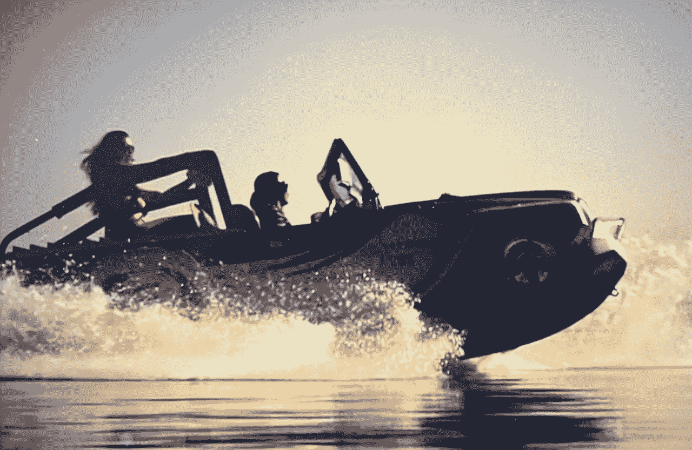

# 体验这些昂贵的船艇(第三部分)

> 原文：<https://medium.com/codex/experience-these-expensive-watertoys-part-3-2b5f68c54525?source=collection_archive---------28----------------------->

## 增强我们对水的热爱:水车

水车豹(JC 媒体)

用[水车](https://www.watercar.com/)的话说，他们是**“地球上最好玩的交通工具的建造者！”看到这种水陆两用车辆能做什么，很难反驳他们的说法。2010 年，WaterCar 用他们的 Python 模型建立了吉尼斯两栖速度记录。从那时起，他们已经完善和…**